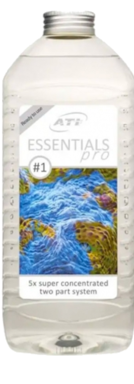
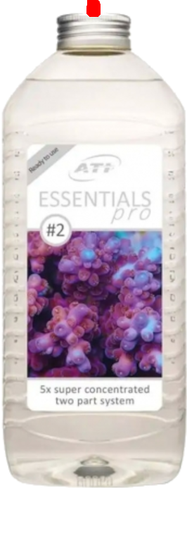

# ha-reef-card 🌊 für HomeAssistant

<!--  -->

[![BuyMeCoffee][buymecoffeebadge]][buymecoffee]

# Unterstützte Sprachen :       

<!-- Vous souhaitez aider à la traduction, suivez ce [guide](https://github.com/Elwinmage/ha-reef-card/blob/main/doc/TRANSLATION.md). -->

Ihre Sprache wird noch nicht unterstützt und Sie möchten bei der Übersetzung helfen? Folgen Sie dieser [Anleitung](https://github.com/Elwinmage/ha-reef-card/blob/main/doc/TRANSLATION.md).

# Vorstellung

Die **Reef card** für Home Assistant hilft Ihnen bei der Verwaltung Ihres Riffaquariums.

In Kombination mit [ha-reefbeat-component](https://github.com/Elwinmage/ha-reefbeat-component) werden Ihre Redsea-Geräte (ReefBeat) automatisch unterstützt.

> [!TIP]
> Die Liste der zukünftigen Funktionen ist [hier](https://github.com/Elwinmage/ha-reef-card/issues?q=is%3Aissue%20state%3Aopen%20label%3Aenhancement) verfügbar 
> Die Liste der Fehler ist [hier](https://github.com/Elwinmage/ha-reef-card/issues?q=is%3Aissue%20state%3Aopen%20label%3Abug) verfügbar

# Kompatibilität

✅ Implementiert ☑️ In Bearbeitung ❌ Geplant

<table>
  <th>
    <td ><b>Modell</b></td>
    <td colspan="2"><b>Status</b></td>
    <td><b>Issues</b>   📆(Geplant)   🐛(Bugs)</td>
  </th>
  <tr>
    <td><a href="#reefato">ReefATO+</a></td>
    <td>RSATO+</td><td>❌</td>
    <td width="200px"></td>
    <td>
      <a href="https://github.com/Elwinmage/ha-reef-card/issues?q=is:issue state:open label:rsato,all label:enhancement" style="text-decoration:none">📆</a>
      <a href="https://github.com/Elwinmage/ha-reef-card/issues?q=is:issue state:open label:rsato,all label:bug" style="text-decoration:none">🐛</a>
    </td>
  </tr>

  </tr>
    <tr>
    <td><a href="#reefcontrol">ReefControl</a></td>
    <td>RSSENSE  Wenn Sie eines besitzen, können Sie mich <a href="https://github.com/Elwinmage/ha-reefbeat-component/discussions/8">hier</a> kontaktieren und ich werde die Unterstützung hinzufügen.</td><td>❌</td>
    <td width="200px"></td>
    <td>
      <a href="https://github.com/Elwinmage/ha-reefbeat-component/issues?q=is:issue state:open label:rscontrol,all label:enhancement" style="text-decoration:none">📆</a>
      <a href="https://github.com/Elwinmage/ha-reefbeat-component/issues?q=is:issue state:open label:rscontrol,all label:bug" style="text-decoration:none">🐛</a>
    </td>
      </tr>  
  <tr>
    <td rowspan="2"><a href="#reefdose">ReefDose</a></td>
    <td>RSDOSE2</td>
    <td>✅</td>
    <td width="200px"></td>
      <td rowspan="2">
      <a href="https://github.com/Elwinmage/ha-reef-card/issues?q=is:issue state:open label:rsdose,all label:enhancement" style="text-decoration:none">📆</a>
      <a href="https://github.com/Elwinmage/ha-reef-card/issues?q=is:issue state:open label:rsdose,all label:bug" style="text-decoration:none">🐛</a>
    </td>
  </tr>
  <tr>
    <td>RSDOSE4</td><td>✅</td>
    <td width="200px"></td>
    </tr>
  <tr>
    <td rowspan="2"> <a href="#reefled">ReefLed</a></td>
    <td>G1</td>
    <td>❌</td>
    <td width="200px"></td>
<td rowspan="2">   
    <a href="https://github.com/Elwinmage/ha-reef-card/issues?q=is:issue state:open label:rsled,all label:enhancement" style="text-decoration:none">📆</a>
      <a href="https://github.com/Elwinmage/ha-reef-card/issues?q=is:issue state:open label:rsled,all label:bug" style="text-decoration:none">🐛</a>
</td>
  </tr>
   <td >G2</td>
    <td>❌</td>
    <td width="200px"></td>
  </tr>
  <tr>
    <td rowspan="3"><a href="#reefmat">ReefMat</a></td>
    <td>RSMAT250</td>
    <td>✅</td>
    <td rowspan="3" width="200px"></td>
    <td rowspan="3">
      <a href="https://github.com/Elwinmage/ha-reef-card/issues?q=is:issue state:open label:rsmat,all label:enhancement" style="text-decoration:none">📆</a>
      <a href="https://github.com/Elwinmage/ha-reef-card/issues?q=is:issue state:open label:rsmat,all label:bug" style="text-decoration:none">🐛</a>
    </td>
  </tr>
  <tr>
    <td>RSMAT500</td>
    <td>✅</td>
  </tr>
  <tr>
    <td>RSMAT1200</td>
    <td>✅</td>
  </tr>
  <tr>
    <td><a href="#reefrun">ReefRun</a></td>
    <td>RSRUN</td><td>☑</td>
    <td width="200px"></td>
    <td>
      <a href="https://github.com/Elwinmage/ha-reef-card/issues?q=is:issue state:open label:rsrun,all label:enhancement" style="text-decoration:none">📆</a>
      <a href="https://github.com/Elwinmage/ha-reef-card/issues?q=is:issue state:open label:rsrun,all label:bug" style="text-decoration:none">🐛</a>
    </td>
  </tr>
  <tr>
    <td><a href="#reefwave">ReefWave</a></td>
    <td>RSWAVE</td><td>❌</td>
    <td width="200px"></td>
    <td>
      <a href="https://github.com/Elwinmage/ha-reef-card/issues?q=is:issue state:open label:rswave,all label:enhancement" style="text-decoration:none">📆</a>
      <a href="https://github.com/Elwinmage/ha-reef-card/issues?q=is:issue state:open label:rswave,all label:bug" style="text-decoration:none">🐛</a>
    </td>
  </tr>
</table>

# Inhaltsverzeichnis

- [Installation](https://github.com/Elwinmage/ha-reef-card/#installation)
- [Konfiguration](https://github.com/Elwinmage/ha-reef-card/#configuration)
- [ReefATO+](https://github.com/Elwinmage/ha-reef-card/#reefato)
- [ReefControl](https://github.com/Elwinmage/ha-reef-card/#reefcontrol)
- [ReefDose](https://github.com/Elwinmage/ha-reef-card/#reefdose)
- [ReefLED](https://github.com/Elwinmage/ha-reef-card/#reefled)
- [ReefMat](https://github.com/Elwinmage/ha-reef-card/#reefmat)
- [ReefRun](https://github.com/Elwinmage/ha-reef-card/#reefrun)
- [ReefWave](https://github.com/Elwinmage/ha-reef-card/#reefwave)
- [FAQ](https://github.com/Elwinmage/ha-reef-card/#faq)

# Installation

## Direkte Installation

Klicken Sie hier, um direkt zum Repository in HACS zu gelangen, und klicken Sie auf „Herunterladen": 

## In HACS suchen

Oder suchen Sie in HACS nach «reef-card».

# Konfiguration

Ohne den Parameter `device` erkennt die Karte automatisch alle ReefBeat-Geräte und lässt Sie das gewünschte auswählen.

Um die Geräteauswahl zu entfernen und ein bestimmtes Gerät zu erzwingen, setzen Sie den Parameter `device` auf den Namen Ihres Geräts.

<table>
  <tr>
<td></td>
<td></td>
    </tr>
</table>

# ReefATO

Geplant.

Möchten Sie, dass es schneller unterstützt wird? Stimmen Sie [hier](https://github.com/Elwinmage/ha-reef-card/discussions/22) ab.

# ReefControl

Geplant.

Möchten Sie, dass es schneller unterstützt wird? Stimmen Sie [hier](https://github.com/Elwinmage/ha-reef-card/discussions/22) ab.

# ReefDose

ReefDose mit ha-reef-card in Aktion:

Die ReefDose-Karte ist in 6 Bereiche unterteilt:

1.  Konfiguration/WLAN-Informationen
2.  Zustände
3.  Manuelle Dosierung
4.  Konfiguration und Zeitplanung der Köpfe
5.  Verwaltung der Ergänzungsmittel
6.  Warteschlange zukünftiger Dosierungen

## Konfiguration/WLAN-Informationen

---

Klicken Sie auf das Symbol , um die allgemeine Konfiguration des ReefDose zu verwalten.

Klicken Sie auf das Symbol  um die Netzwerkeinstellungen zu verwalten.

## Zustände

 

---

Der Wartungsschalter  ermöglicht den Wechsel in den Wartungsmodus.

 

Der Ein/Aus-Schalter  ermöglicht das Umschalten zwischen den Ein- und Aus-Zuständen des ReefDose.

 

## Manuelle Dosierung

---

Die Schaltfläche  zeigt die Standard-Manualdosis für diesen Kopf an. Ein Klick öffnet das Konfigurationsfenster für diese Dosierung.

Sie können Verknüpfungen über den Karten-Editor hinzufügen:

Zum Beispiel bietet Kopf 1 die Werte 2, 5 und 10 mL als Verknüpfungen an.

Diese Werte erscheinen oben im Dialogfeld. Ein Klick auf diese Verknüpfungen sendet einen Befehl zur Dosierung des definierten Wertes.

Ein Drücken der Taste für manuelle Dosierung:  sendet einen Dosierbefehl mit dem direkt darüber sichtbaren Standardwert: , also 10 mL in diesem Beispiel.

## Konfiguration und Zeitplanung der Köpfe

 

---

Dieser Bereich ermöglicht die Anzeige der aktuellen Kopfprogrammierung und deren Änderung.

- Der farbige Kreisring zeigt den prozentualen Anteil der bereits verabreichten Tagesdosis an.
- Die gelbe Zahl oben zeigt den kumulierten täglichen Manualdosis-Gesamtwert an.
- Der mittlere Teil zeigt das verteilte Volumen im Verhältnis zum insgesamt geplanten Tagesvolumen an.
- Der blaue untere Teil zeigt die Anzahl der verabreichten Dosen im Verhältnis zur Gesamtzahl der Tagesdosen an (Beispiel: 14/24 für Blau, da es eine stündliche Programmierung ist und dieser Screenshot um 14:15 Uhr aufgenommen wurde). Die Werte für Violett und Grün zeigen 0/0, da diese Dosen um 8 Uhr verteilt werden sollten, die Integration aber nach 8 Uhr gestartet wurde, sodass heute keine Dosen erfolgen werden.
- Ein langer Klick auf einen der 4 Köpfe schaltet diesen ein oder aus.
- Ein Klick auf einen Kopf öffnet das Programmierungsfenster.
  Von diesem Fenster aus können Sie eine Befüllung starten, den Kopf kalibrieren, die Tagesdosis und deren Planung ändern. Vergessen Sie nicht, die Programmierung zu speichern, bevor Sie das Fenster schließen.

  

## Verwaltung der Ergänzungsmittel

 

---

Dieser Bereich dient der Verwaltung der Ergänzungsmittel.
Wenn bereits ein Ergänzungsmittel deklariert ist, öffnet ein Klick darauf das Konfigurationsfenster, in dem Sie:

- Das Ergänzungsmittel löschen können (Papierkorb-Symbol oben rechts)
- Das Gesamtvolumen des Behälters angeben können
- Das tatsächliche Volumen des Ergänzungsmittels angeben können
- Entscheiden können, ob Sie das verbleibende Volumen verfolgen möchten. Ein Klick auf die Verknüpfungen oben aktiviert die Steuerung und setzt die Standardwerte mit einem vollen Behälter.
- Den Anzeigenamen des Ergänzungsmittels ändern können.

 

Wenn kein Ergänzungsmittel mit einem Kopf verknüpft ist, können Sie eines hinzufügen, indem Sie auf den Behälter mit einem '+' klicken (Kopf 4 in unserem Beispiel).

Folgen Sie dann den Anweisungen:

### Ergänzungsmittel

Hier ist die Liste der unterstützten Bilder für Ergänzungsmittel, nach Marke gruppiert. Wenn Ihres ein ❌ anzeigt, können Sie dessen Hinzufügung [hier](https://github.com/Elwinmage/ha-reef-card/discussions/25) beantragen.

<b>ATI &nbsp; 2/2 🖼️</b>

<table>
<tr><td>✅</td><td>Essential Pro 1</td><td></td></tr>
<tr><td>✅</td><td>Essential Pro 2</td><td></td></tr>
</table>

<b>Aqua Forest &nbsp; 3/9 🖼️</b>

<table>
<tr><td>✅</td><td>Ca Plus</td><td></td></tr>
<tr><td>❌</td><td colspan='2'>Calcium </td></tr>
<tr><td>❌</td><td colspan='2'>Component 1+</td></tr>
<tr><td>❌</td><td colspan='2'>Component 2+</td></tr>
<tr><td>❌</td><td colspan='2'>Component 3+</td></tr>
<tr><td>❌</td><td colspan='2'>KH Buffer</td></tr>
<tr><td>✅</td><td>KH Plus</td><td></td></tr>
<tr><td>❌</td><td colspan='2'>Magnesium</td></tr>
<tr><td>✅</td><td>Mg Plus</td><td></td></tr>
</table>

<b>BRS &nbsp; 0/4 🖼️</b>

<table>
<tr><td>❌</td><td colspan='2'>Liquid Calcium</td></tr>
<tr><td>❌</td><td colspan='2'>Liquid alkalinity</td></tr>
<tr><td>❌</td><td colspan='2'>Magnesium Mix</td></tr>
<tr><td>❌</td><td colspan='2'>Part C</td></tr>
</table>

<b>Brightwell &nbsp; 0/12 🖼️</b>

<table>
<tr><td>❌</td><td colspan='2'>Calcion</td></tr>
<tr><td>❌</td><td colspan='2'>Ferrion</td></tr>
<tr><td>❌</td><td colspan='2'>Hydrate - MG</td></tr>
<tr><td>❌</td><td colspan='2'>KoralAmino</td></tr>
<tr><td>❌</td><td colspan='2'>Koralcolor</td></tr>
<tr><td>❌</td><td colspan='2'>Liquid Reef</td></tr>
<tr><td>❌</td><td colspan='2'>Potassion</td></tr>
<tr><td>❌</td><td colspan='2'>Reef Code A</td></tr>
<tr><td>❌</td><td colspan='2'>Reef Code B</td></tr>
<tr><td>❌</td><td colspan='2'>Replenish</td></tr>
<tr><td>❌</td><td colspan='2'>Restore</td></tr>
<tr><td>❌</td><td colspan='2'>Strontion</td></tr>
</table>

<b>ESV &nbsp; 0/5 🖼️</b>

<table>
<tr><td>❌</td><td colspan='2'>B-Ionic Component 1</td></tr>
<tr><td>❌</td><td colspan='2'>B-Ionic Component 2</td></tr>
<tr><td>❌</td><td colspan='2'>B-Ionic Magnesium</td></tr>
<tr><td>❌</td><td colspan='2'>Transition elements </td></tr>
<tr><td>❌</td><td colspan='2'>Transition elements plus</td></tr>
</table>

<b>Fauna Marine &nbsp; 0/11 🖼️</b>

<table>
<tr><td>❌</td><td colspan='2'>Amin</td></tr>
<tr><td>❌</td><td colspan='2'>Balling light  trace 1</td></tr>
<tr><td>❌</td><td colspan='2'>Balling light  trace 2</td></tr>
<tr><td>❌</td><td colspan='2'>Balling light  trace 3</td></tr>
<tr><td>❌</td><td colspan='2'>Balling light Ca</td></tr>
<tr><td>❌</td><td colspan='2'>Balling light KH</td></tr>
<tr><td>❌</td><td colspan='2'>Balling light Mg</td></tr>
<tr><td>❌</td><td colspan='2'>Blue trace elements</td></tr>
<tr><td>❌</td><td colspan='2'>Green trace elements</td></tr>
<tr><td>❌</td><td colspan='2'>Min S</td></tr>
<tr><td>❌</td><td colspan='2'>Red trace elements</td></tr>
</table>

<b>Quantum &nbsp; 7/7 🖼️</b>

<table>
<tr><td>✅</td><td>Aragonite A</td><td></td></tr>
<tr><td>✅</td><td>Aragonite B</td><td></td></tr>
<tr><td>✅</td><td>Aragonite C</td><td></td></tr>
<tr><td>✅</td><td>Bio Kalium</td><td></td></tr>
<tr><td>✅</td><td>Bio Metals</td><td></td></tr>
<tr><td>✅</td><td>Bio enhance</td><td></td></tr>
<tr><td>✅</td><td>Gbio Gen</td><td></td></tr>
</table>

<b>Red Sea &nbsp; 10/13 🖼️</b>

<table>
<tr><td>✅</td><td>Bio Active (Colors D)</td><td></td></tr>
<tr><td>✅</td><td>Calcium (Foundation A)</td><td></td></tr>
<tr><td>❌</td><td colspan='2'>Calcium (Powder)</td></tr>
<tr><td>✅</td><td>Iodine (Colors A)</td><td></td></tr>
<tr><td>✅</td><td>Iron (Colors C)</td><td></td></tr>
<tr><td>✅</td><td>KH/Alkalinity (Foundation B)</td><td></td></tr>
<tr><td>❌</td><td colspan='2'>KH/Alkalinity (Powder)</td></tr>
<tr><td>✅</td><td>Magnesium (Foundation C)</td><td></td></tr>
<tr><td>❌</td><td colspan='2'>Magnesium (Powder)</td></tr>
<tr><td>✅</td><td>NO3PO4-X</td><td></td></tr>
<tr><td>✅</td><td>Potassium (Colors B)</td><td></td></tr>
<tr><td>✅</td><td>Reef Energy Plus</td><td></td></tr>
<tr><td>✅</td><td>ReefCare Program</td><td></td></tr>
</table>

<b>Seachem &nbsp; 0/9 🖼️</b>

<table>
<tr><td>❌</td><td colspan='2'>Reef Calcium</td></tr>
<tr><td>❌</td><td colspan='2'>Reef Carbonate</td></tr>
<tr><td>❌</td><td colspan='2'>Reef Complete</td></tr>
<tr><td>❌</td><td colspan='2'>Reef Fusion 1</td></tr>
<tr><td>❌</td><td colspan='2'>Reef Fusion 2</td></tr>
<tr><td>❌</td><td colspan='2'>Reef Iodine</td></tr>
<tr><td>❌</td><td colspan='2'>Reef Plus</td></tr>
<tr><td>❌</td><td colspan='2'>Reef Strontium</td></tr>
<tr><td>❌</td><td colspan='2'>Reef Trace</td></tr>
</table>

<b>Triton &nbsp; 0/4 🖼️</b>

<table>
<tr><td>❌</td><td colspan='2'>Core7 elements 1</td></tr>
<tr><td>❌</td><td colspan='2'>Core7 elements 2</td></tr>
<tr><td>❌</td><td colspan='2'>Core7 elements 3A</td></tr>
<tr><td>❌</td><td colspan='2'>Core7 elements 3B</td></tr>
</table>

<b>Tropic Marin &nbsp; 5/14 🖼️</b>

<table>
<tr><td>❌</td><td colspan='2'>A Element</td></tr>
<tr><td>✅</td><td>All-For-Reef</td><td></td></tr>
<tr><td>✅</td><td>Amino Organic</td><td></td></tr>
<tr><td>❌</td><td colspan='2'>Balling A</td></tr>
<tr><td>❌</td><td colspan='2'>Balling B</td></tr>
<tr><td>❌</td><td colspan='2'>Balling C</td></tr>
<tr><td>✅</td><td>Bio-Magnesium</td><td></td></tr>
<tr><td>✅</td><td>Carbo Calcium</td><td></td></tr>
<tr><td>❌</td><td colspan='2'>Elimi-NP</td></tr>
<tr><td>❌</td><td colspan='2'>K Element</td></tr>
<tr><td>❌</td><td colspan='2'>Liquid Buffer</td></tr>
<tr><td>❌</td><td colspan='2'>NP-Bacto-Balance</td></tr>
<tr><td>❌</td><td colspan='2'>Plus-NP</td></tr>
<tr><td>✅</td><td>Potassium</td><td></td></tr>
</table>

# ReefLed

Geplant.

Möchten Sie, dass es schneller unterstützt wird? Stimmen Sie [hier](https://github.com/Elwinmage/ha-reef-card/discussions/22) ab.

# ReefMat

ReefMat mit ha-reef-card in Aktion:

Die ReefMat-Karte ist in 7 Bereiche unterteilt:

1. Konfiguration / WLAN-Informationen
2. Zustände
3. Rolleninformationen (verbrauchte Gesamtlänge, verbleibende Länge, Rollenende, Modus...)
4. Manueller/Automatischer Vorschub
5. Sensor
6. Geplanter Vorschub
7. Wochen- / Monatsverbrauchsdiagramm

Das Hintergrundbild ändert sich je nach Nutzungszustand der Rolle mit 5 verschiedenen Bildern:

<table>
  <tr>
    <td align="center"> <b>0%</b></td>
    <td align="center"> <b>25%</b></td>
    <td align="center"> <b>50%</b></td>
  </tr>
  <tr>
    <td align="center"> <b>75%</b></td>
    <td align="center"> <b>100%</b></td>
    <td></td>
  </tr>
</table>

## Konfiguration / WLAN-Informationen

---

Klicken Sie auf das Symbol  zur Verwaltung der allgemeinen Konfiguration des ReefMat.

Klicken Sie auf das Symbol  zur Verwaltung der Netzwerkeinstellungen.

## Zustände

---

Der Wartungsschalter  wechselt in den Wartungsmodus.

 

Der Ein/Aus-Schalter  schaltet den ReefMat zwischen Ein- und Aus-Zustand um.

 

## Rolleninformationen

---

Dieser Bereich zeigt den Echtzeitstatus der Filterrolle, von oben nach unten:

- Die **insgesamt verbrauchte Länge** seit Beginn der Rolle (oben, rot)
- Die **verbleibende Länge** in der Mitte in rot. Wenn die Rolle leer ist, erscheint ein  blinkendes Symbol und ein Dialogfeld schlägt vor, die Rolle zu ersetzen.

- Die **verbleibenden Tage** bis zum Rollenende, geschätzt anhand des täglichen Durchschnittsverbrauchs (schwarz)
- Der **tägliche Durchschnittsverbrauch** in cm (unten links)
- Der aktuelle **Betriebsmodus**: Auto, Wartung, Aus… (unter dem RedSea-Logo)
- Der **Rollenverbrauchsprozentsatz** (Kreisbogen unten rechts)

Wird eine Anomalie erkannt, verwandelt sich das RedSea-Logo in ein  blinkendes Symbol.
Ein Klick auf diesen Alarm öffnet den Anomalie-Dialog:

## Manueller/Automatischer Vorschub

---

Dieser Bereich steuert den Rollenvorschub.

Von links nach rechts:

- Die Schaltfläche  löst einen **manuellen Vorschub** der Rolle um die angezeigte Länge aus.
- Der angezeigte **Vorschubwert** (in cm) ist der Wert, der beim Drücken der Taste gesendet wird. Ein Klick öffnet den Bearbeitungsdialog.

- Die **automatische Vorschubschaltfläche**   aktiviert oder deaktiviert den automatischen Rollenvorschub.

## Sensor

---

Dieser Bereich zeigt den Status des Niveausensors.

Drei Zustände sind möglich:

| Zustand              | Bild                                                            |
| -------------------- | --------------------------------------------------------------- |
| Sensor angeschlossen |    |
| Sensor getrennt      |  |
| Schmutziger Sensor   |           |

## Geplanter Vorschub

---

Diese Schaltfläche  zeigt den Status des geplanten Vorschubs und ermöglicht die Bearbeitung per Klick.

## Verbrauchsdiagramm

 

---

Dieser Bereich zeigt ein Diagramm des Rollenverbrauchs über die Zeit.
Ein Klick auf die Schaltfläche wechselt zwischen den zwei verfügbaren Modi:

- Der Modus **Weekly** zeigt den Verbrauch der letzten 7 Tage.
- Der Modus **Monthly** zeigt den Verbrauch der letzten 30 Tage.

Ein Druck oben links im Diagramm öffnet die Detailansicht in Home Assistant.

## Messages

---

Dieser Bereich zeigt die letzten Systemmeldungen des ReefMat. Er hat zwei Zeilen:

- Die graue Zeile zeigt die **letzte Nachricht**.
- Die rosa Zeile zeigt die **letzte Warnung**, mit dem Symbol ⚠.

Ein Klick auf  löscht die entsprechende Nachricht.

Diese Zeilen können über die Karteneditor-Oberfläche ausgeblendet werden.

# ReefMat

ReefMat con ha-reef-card en acción:

La tarjeta ReefMat está dividida en 7 zonas:

1. Configuración / Información Wifi
2. Estados
3. Información del rollo (longitud total usada, longitud restante, fin de rollo, modo...)
4. Avance manual/automático
5. Sonda
6. Avance programado
7. Gráfico de uso semanal / mensual

La imagen de fondo cambia según el estado de uso del rollo con 5 imágenes diferentes:

<table>
  <tr>
    <td align="center"> <b>0%</b></td>
    <td align="center"> <b>25%</b></td>
    <td align="center"> <b>50%</b></td>
  </tr>
  <tr>
    <td align="center"> <b>75%</b></td>
    <td align="center"> <b>100%</b></td>
    <td></td>
  </tr>
</table>

## Configuración / Información Wifi

---

Haga clic en el icono  para gestionar la configuración general del ReefMat.

Haga clic en el icono  para gestionar los parámetros de red.

## Estados

---

El interruptor de mantenimiento  permite cambiar al modo de mantenimiento.

 

El interruptor de encendido/apagado  permite alternar entre los estados encendido y apagado del ReefMat.

 

## Información del rollo

---

Esta zona muestra el estado en tiempo real del rollo filtrante, de arriba a abajo:

- La **longitud total usada** desde el inicio del rollo (arriba, en rojo)
- La **longitud restante** en el centro en rojo. Cuando el rollo está vacío, aparece un  icono parpadeante en su lugar y un cuadro de diálogo propone reemplazar el rollo.

- El **número de días restantes** antes del fin del rollo, estimado según el consumo diario promedio (en negro)
- El **consumo diario promedio** en cm (abajo a la izquierda)
- El **modo de funcionamiento** actual: Auto, Mantenimiento, Apagado… (debajo del logo RedSea)
- El **porcentaje de rollo usado** (arco circular abajo a la derecha)

Si se detecta una anomalía, el logo RedSea se transformará en un  icono parpadeante.
Hacer clic en esta alerta abre el cuadro de diálogo de anomalías:

## Avance Manual/Automático

---

Esta zona permite controlar el avance del rollo.

De izquierda a derecha:

- El botón  lanza un **avance manual** del rollo por la longitud indicada en el centro.
- El **valor de avance** mostrado (en cm) es el valor que se enviará al pulsar el botón. Hacer clic en este número abre el cuadro de edición.

- El **botón de avance automático**   activa o desactiva el avance automático del rollo.

## Sonda

---

Esta zona muestra el estado del sensor de nivel.

Tres estados son posibles:

| Estado              | Imagen                                                          |
| ------------------- | --------------------------------------------------------------- |
| Sensor conectado    |    |
| Sensor desconectado |  |
| Sensor sucio        |           |

## Avance programado

---

Este botón  muestra el estado del avance programado y permite editarlo haciendo clic.

## Gráfico de uso

 

---

Esta zona muestra un gráfico del consumo del rollo a lo largo del tiempo.
Hacer clic en el botón alterna entre los dos modos disponibles:

- El modo **Weekly** muestra el consumo de los últimos 7 días.
- El modo **Monthly** muestra el consumo de los últimos 30 días.

Pulsar en la esquina superior izquierda del gráfico abre la vista detallada en Home Assistant.

## Messages

---

Esta zona muestra los últimos mensajes del sistema del ReefMat. Tiene dos líneas:

- La línea gris muestra el **último mensaje** recibido.
- La línea rosa muestra la **última alerta**, precedida del símbolo ⚠.

Hacer clic en  borra el mensaje correspondiente.

# ReefRun

Geplant.

Möchten Sie, dass es schneller unterstützt wird? Stimmen Sie [hier](https://github.com/Elwinmage/ha-reef-card/discussions/22) ab.

# ReefWave

Geplant.

Möchten Sie, dass es schneller unterstützt wird? Stimmen Sie [hier](https://github.com/Elwinmage/ha-reef-card/discussions/22) ab.

# FAQ

---

[buymecoffee]: https://paypal.me/Elwinmage
[buymecoffeebadge]: https://img.shields.io/badge/buy%20me%20a%20coffee-donate-yellow.svg?style=flat-square
