# ha-reef-card 🌊 für HomeAssistant

> Teil des **[ReefTech Project Ökosystems](https://elwinmage.github.io/reeftank/de.html)**

<p align="center">
  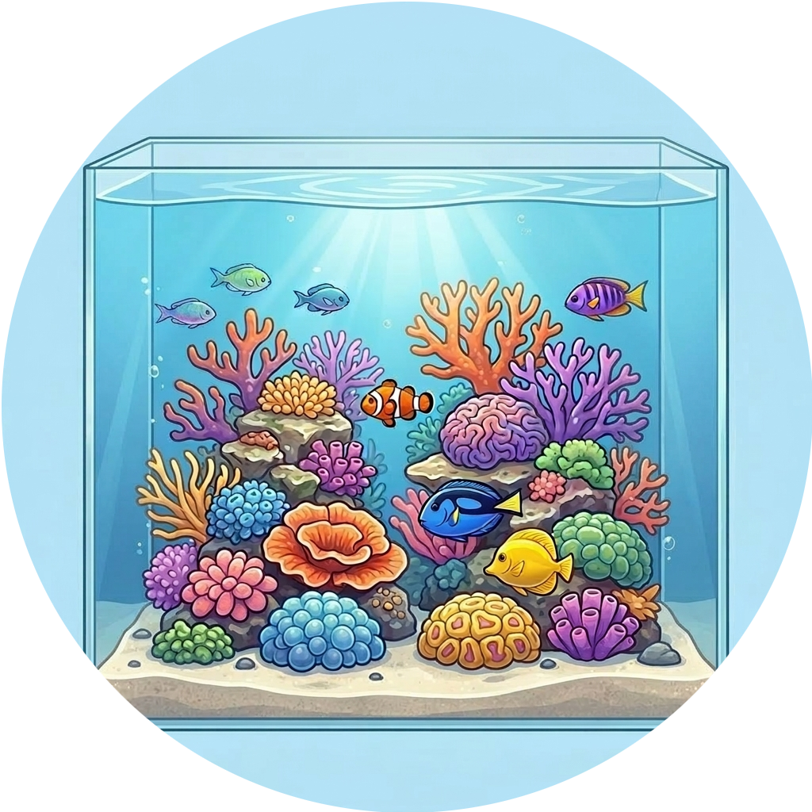
</p>

[](https://github.com/Elwinmage/ha-reef-card/releases)
[](https://github.com/Elwinmage/ha-reef-card/commits/main)
[](https://opensource.org/licenses/MIT)

<!-- [](https://github.com/hacs/integration) -->

[](https://www.typescriptlang.org/)
[](https://lit.dev/)
[](https://codecov.io/gh/Elwinmage/ha-reef-card)
[![BuyMeCoffee][buymecoffeebadge]][buymecoffee]

# Unterstützte Sprachen : [](../fr/README.fr.md) [](../../README.md) [](../es/README.es.md) [](../pt/README.pt.md) [](README.de.md) [](../it/README.it.md) [](../pl/README.pl.md)

<!-- Vous souhaitez aider à la traduction, suivez ce [guide](https://github.com/Elwinmage/ha-reef-card/blob/main/doc/TRANSLATION.md). -->

Ihre Sprache wird noch nicht unterstützt und Sie möchten bei der Übersetzung helfen? Folgen Sie dieser [Anleitung](https://github.com/Elwinmage/ha-reef-card/blob/main/doc/TRANSLATION.md).

# Vorstellung

Die **Reef card** für Home Assistant hilft Ihnen bei der Verwaltung Ihres Riffaquariums.

In Kombination mit [ha-reefbeat-component](https://github.com/Elwinmage/ha-reefbeat-component) werden Ihre Redsea-Geräte
(ReefBeat) automatisch unterstützt.

## Verwandte Projekte

Diese Karte gehört zu einer Reihe von Projekten für ein aus Home Assistant
gesteuertes Riffaquarium:

| Projekt                                                                           | Aufgabe                                                                                                                                                                |
| --------------------------------------------------------------------------------- | ---------------------------------------------------------------------------------------------------------------------------------------------------------------------- |
| [**ha-reef-card**](https://github.com/Elwinmage/ha-reef-card)                     | Diese Karte. Eine interaktive grafische Ansicht jedes Geräts auf Ihrem Dashboard und der einzige Weg, erweiterte Zeitpläne zu bearbeiten.                              |
| [**ha-reefbeat-component**](https://github.com/Elwinmage/ha-reefbeat-component)   | Integration der Red-Sea-ReefBeat-Geräte, lokal und ohne Cloud gesteuert: ReefATO+, ReefDose, ReefLed, ReefMat, ReefRun und ReefWave. Sie versorgt die Karte mit Daten. |
| [**ha-aquamedic-component**](https://github.com/Elwinmage/ha-aquamedic-component) | Integration der Aqua-Medic-Pumpen über die Gizwits-Cloud-API: Strömungspumpen EcoDrift und SmartDrift, Rückförderpumpen DC Runner.                                     |
| [**reefbeatEnergyBackup**](https://github.com/Elwinmage/reefbeatEnergyBackup)     | Batteriepuffer bei Stromausfall. 24V-LiFePO₄-Pack, gesteuert von einem Raspberry Pi, mit stufenweiser Drosselung der Pumpen je nach Ladezustand.                       |

Alle sind gemeinsam auf der [Projektseite](https://elwinmage.github.io/reeftank/) dokumentiert.

> [!TIP]
> Die Liste der zukünftigen Funktionen ist [hier](https://github.com/Elwinmage/ha-reef-card/issues?q=is%3Aissue%20state%3Aopen%20label%3Aenhancement) verfügbar<br />
> Die Liste der Fehler ist [hier](https://github.com/Elwinmage/ha-reef-card/issues?q=is%3Aissue%20state%3Aopen%20label%3Abug) verfügbar

# Kompatibilität

✅ Implementiert ☑️ In Bearbeitung ❌ Geplant

<table>
  <th>
    <td ><b>Modell</b></td>
    <td colspan="2"><b>Status</b></td>
    <td><b>Issues</b>  <br/>📆(Geplant) <br/> 🐛(Bugs)</td>
  </th>
  <tr>
    <td><a href="#reefato">ReefATO+</a></td>
    <td>RSATO+</td><td>☑️</td>
    <td width="200px"></td>
    <td>
      <a href="https://github.com/Elwinmage/ha-reef-card/issues?q=is:issue state:open label:rsato,all label:enhancement" style="text-decoration:none">📆</a>
      <a href="https://github.com/Elwinmage/ha-reef-card/issues?q=is:issue state:open label:rsato,all label:bug" style="text-decoration:none">🐛</a>
    </td>
  </tr>

  </tr>
    <tr>
    <td><a href="#reefcontrol">ReefControl</a></td>
    <td>RSSENSE<br /> Wenn Sie eines besitzen, können Sie mich <a href="https://github.com/Elwinmage/ha-reefbeat-component/discussions/8">hier</a> kontaktieren und ich werde die Unterstützung hinzufügen.</td><td>❌</td>
    <td width="200px"></td>
    <td>
      <a href="https://github.com/Elwinmage/ha-reefbeat-component/issues?q=is:issue state:open label:rscontrol,all label:enhancement" style="text-decoration:none">📆</a>
      <a href="https://github.com/Elwinmage/ha-reefbeat-component/issues?q=is:issue state:open label:rscontrol,all label:bug" style="text-decoration:none">🐛</a>
    </td>
      </tr>  
  <tr>
    <td rowspan="2"><a href="#reefdose">ReefDose</a></td>
    <td>RSDOSE2</td>
    <td>✅</td>
    <td width="200px"></td>
      <td rowspan="2">
      <a href="https://github.com/Elwinmage/ha-reef-card/issues?q=is:issue state:open label:rsdose,all label:enhancement" style="text-decoration:none">📆</a>
      <a href="https://github.com/Elwinmage/ha-reef-card/issues?q=is:issue state:open label:rsdose,all label:bug" style="text-decoration:none">🐛</a>
    </td>
  </tr>
  <tr>
    <td>RSDOSE4</td><td>✅</td>
    <td width="200px"></td>
    </tr>
  <tr>
    <td rowspan="2"> <a href="#reefled">ReefLed</a></td>
    <td>G1</td>
    <td>❌</td>
    <td width="200px"></td>
<td rowspan="2">   
    <a href="https://github.com/Elwinmage/ha-reef-card/issues?q=is:issue state:open label:rsled,all label:enhancement" style="text-decoration:none">📆</a>
      <a href="https://github.com/Elwinmage/ha-reef-card/issues?q=is:issue state:open label:rsled,all label:bug" style="text-decoration:none">🐛</a>
</td>
  </tr>
   <td >G2</td>
    <td>❌</td>
    <td width="200px"></td>
  </tr>
  <tr>
    <td rowspan="3"><a href="#reefmat">ReefMat</a></td>
    <td>RSMAT250</td>
    <td>✅</td>
    <td rowspan="3" width="200px"></td>
    <td rowspan="3">
      <a href="https://github.com/Elwinmage/ha-reef-card/issues?q=is:issue state:open label:rsmat,all label:enhancement" style="text-decoration:none">📆</a>
      <a href="https://github.com/Elwinmage/ha-reef-card/issues?q=is:issue state:open label:rsmat,all label:bug" style="text-decoration:none">🐛</a>
    </td>
  </tr>
  <tr>
    <td>RSMAT500</td>
    <td>✅</td>
  </tr>
  <tr>
    <td>RSMAT1200</td>
    <td>✅</td>
  </tr>
  <tr>
    <td><a href="#reefrun">ReefRun</a></td>
    <td>RSRUN</td><td>✅</td>
    <td width="200px"></td>
    <td>
      <a href="https://github.com/Elwinmage/ha-reef-card/issues?q=is:issue state:open label:rsrun,all label:enhancement" style="text-decoration:none">📆</a>
      <a href="https://github.com/Elwinmage/ha-reef-card/issues?q=is:issue state:open label:rsrun,all label:bug" style="text-decoration:none">🐛</a>
    </td>
  </tr>
  <tr>
    <td><a href="#reefwave">ReefWave</a></td>
    <td>RSWAVE</td><td>❌</td>
    <td width="200px"></td>
    <td>
      <a href="https://github.com/Elwinmage/ha-reef-card/issues?q=is:issue state:open label:rswave,all label:enhancement" style="text-decoration:none">📆</a>
      <a href="https://github.com/Elwinmage/ha-reef-card/issues?q=is:issue state:open label:rswave,all label:bug" style="text-decoration:none">🐛</a>
    </td>
  </tr>
</table>

# Inhaltsverzeichnis

- [Installation](https://github.com/Elwinmage/ha-reef-card/#installation)
- [Konfiguration](https://github.com/Elwinmage/ha-reef-card/#configuration)
- [ReefATO+](https://github.com/Elwinmage/ha-reef-card/#reefato)
- [ReefControl](https://github.com/Elwinmage/ha-reef-card/#reefcontrol)
- [ReefDose](https://github.com/Elwinmage/ha-reef-card/#reefdose)
- [ReefLED](https://github.com/Elwinmage/ha-reef-card/#reefled)
- [ReefMat](https://github.com/Elwinmage/ha-reef-card/#reefmat)
- [ReefRun](https://github.com/Elwinmage/ha-reef-card/#reefrun)
- [ReefWave](https://github.com/Elwinmage/ha-reef-card/#reefwave)
- [Wartung](https://github.com/Elwinmage/ha-reef-card/#maintenance)
- [FAQ](https://github.com/Elwinmage/ha-reef-card/#faq)

# Installation

## Direkte Installation

Klicken Sie hier, um direkt zum Repository in HACS zu gelangen, und klicken Sie auf „Herunterladen": [](https://my.home-assistant.io/redirect/hacs_repository/?owner=Elwinmage&repository=ha-reef-card&category=plugin)

## In HACS suchen

Oder suchen Sie in HACS nach «reef-card».

<p align="center">

</p>

# Konfiguration

Ohne den Parameter `device` erkennt die Karte automatisch alle ReefBeat-Geräte und lässt Sie das gewünschte auswählen.

Um die Geräteauswahl zu entfernen und ein bestimmtes Gerät zu erzwingen, setzen Sie den Parameter `device` auf den Namen Ihres Geräts.

<table>
  <tr>
<td></td>
<td></td>
    </tr>
</table>

# ReefATO

Geplant.

Möchten Sie, dass es schneller unterstützt wird? Stimmen Sie [hier](https://github.com/Elwinmage/ha-reef-card/discussions/22) ab.

# ReefControl

Geplant.

Möchten Sie, dass es schneller unterstützt wird? Stimmen Sie [hier](https://github.com/Elwinmage/ha-reef-card/discussions/22) ab.

# ReefDose

ReefDose mit ha-reef-card in Aktion:

[](https://www.youtube.com/watch?v=Qee5LH0T9wQ)

Die ReefDose-Karte ist in 6 Bereiche unterteilt:

1.  Konfiguration/WLAN-Informationen
2.  Zustände
3.  Manuelle Dosierung
4.  Konfiguration und Zeitplanung der Köpfe
5.  Verwaltung der Ergänzungsmittel
6.  Warteschlange zukünftiger Dosierungen


## Konfiguration/WLAN-Informationen


---

<span >Klicken Sie auf das Symbol , um die allgemeine Konfiguration des ReefDose zu verwalten.</span>


<span>Klicken Sie auf das Symbol  um die Netzwerkeinstellungen zu verwalten.</span>


## Zustände

 

---

<span>Der Wartungsschalter  ermöglicht den Wechsel in den Wartungsmodus.</span>

 

<span>Der Ein/Aus-Schalter  ermöglicht das Umschalten zwischen den Ein- und Aus-Zuständen des ReefDose.</span>

 

## Manuelle Dosierung


---

<span>Die Schaltfläche  zeigt die Standard-Manualdosis für diesen Kopf an. Ein Klick öffnet das Konfigurationsfenster für diese Dosierung.</span>


Sie können Verknüpfungen über den Karten-Editor hinzufügen:


Zum Beispiel bietet Kopf 1 die Werte 2, 5 und 10 mL als Verknüpfungen an.

Diese Werte erscheinen oben im Dialogfeld. Ein Klick auf diese Verknüpfungen sendet einen Befehl zur Dosierung des definierten Wertes.


<span>Ein Drücken der Taste für manuelle Dosierung:  sendet einen Dosierbefehl mit dem direkt darüber sichtbaren Standardwert: , also 10 mL in diesem Beispiel.
</span>

## Konfiguration und Zeitplanung der Köpfe

 

---

Dieser Bereich ermöglicht die Anzeige der aktuellen Kopfprogrammierung und deren Änderung.

- Der farbige Kreisring zeigt den prozentualen Anteil der bereits verabreichten Tagesdosis an.
- Die gelbe Zahl oben zeigt den kumulierten täglichen Manualdosis-Gesamtwert an.
- Der mittlere Teil zeigt das verteilte Volumen im Verhältnis zum insgesamt geplanten Tagesvolumen an.
- Der blaue untere Teil zeigt die Anzahl der verabreichten Dosen im Verhältnis zur Gesamtzahl der Tagesdosen an (Beispiel: 14/24 für Blau, da es eine stündliche Programmierung ist und dieser Screenshot um 14:15 Uhr aufgenommen wurde). Die Werte für Violett und Grün zeigen 0/0, da diese Dosen um 8 Uhr verteilt werden sollten, die Integration aber nach 8 Uhr gestartet wurde, sodass heute keine Dosen erfolgen werden.
- Ein langer Klick auf einen der 4 Köpfe schaltet diesen ein oder aus.
- Ein Klick auf einen Kopf öffnet das Programmierungsfenster.
  Von diesem Fenster aus können Sie eine Befüllung starten, den Kopf kalibrieren, die Tagesdosis und deren Planung ändern. Vergessen Sie nicht, die Programmierung zu speichern, bevor Sie das Fenster schließen.

  

## Verwaltung der Ergänzungsmittel

 

---

Dieser Bereich dient der Verwaltung der Ergänzungsmittel.
Wenn bereits ein Ergänzungsmittel deklariert ist, öffnet ein Klick darauf das Konfigurationsfenster, in dem Sie:

- Das Ergänzungsmittel löschen können (Papierkorb-Symbol oben rechts)
- Das Gesamtvolumen des Behälters angeben können
- Das tatsächliche Volumen des Ergänzungsmittels angeben können
- Entscheiden können, ob Sie das verbleibende Volumen verfolgen möchten. Ein Klick auf die Verknüpfungen oben aktiviert die Steuerung und setzt die Standardwerte mit einem vollen Behälter.
- Den Anzeigenamen des Ergänzungsmittels ändern können.

 

Wenn kein Ergänzungsmittel mit einem Kopf verknüpft ist, können Sie eines hinzufügen, indem Sie auf den Behälter mit einem '+' klicken (Kopf 4 in unserem Beispiel).


Folgen Sie dann den Anweisungen:


### Ergänzungsmittel

Hier ist die Liste der unterstützten Bilder für Ergänzungsmittel, nach Marke gruppiert. Wenn Ihres ein ❌ anzeigt, können Sie dessen Hinzufügung [hier](https://github.com/Elwinmage/ha-reef-card/discussions/25) beantragen.

<details>
<summary><b>ATI &nbsp; <sup>2/2 🖼️</sup></b></summary>

<table>
<tr><td>✅</td><td>Essential Pro 1</td><td>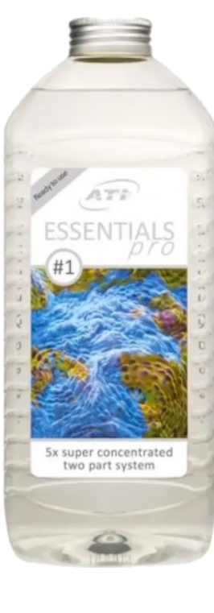</td></tr>
<tr><td>✅</td><td>Essential Pro 2</td><td>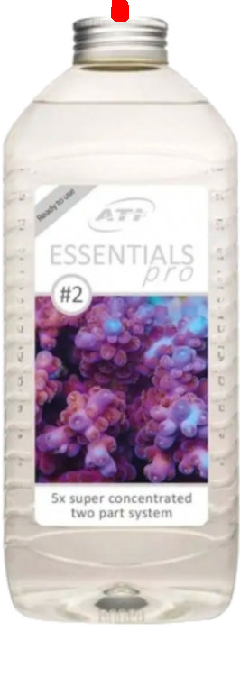</td></tr>
</table>
</details>

<details>
<summary><b>Aqua Forest &nbsp; <sup>3/9 🖼️</sup></b></summary>

<table>
<tr><td>✅</td><td>Ca Plus</td><td>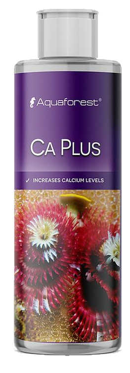</td></tr>
<tr><td>❌</td><td colspan='2'>Calcium </td></tr>
<tr><td>❌</td><td colspan='2'>Component 1+</td></tr>
<tr><td>❌</td><td colspan='2'>Component 2+</td></tr>
<tr><td>❌</td><td colspan='2'>Component 3+</td></tr>
<tr><td>❌</td><td colspan='2'>KH Buffer</td></tr>
<tr><td>✅</td><td>KH Plus</td><td>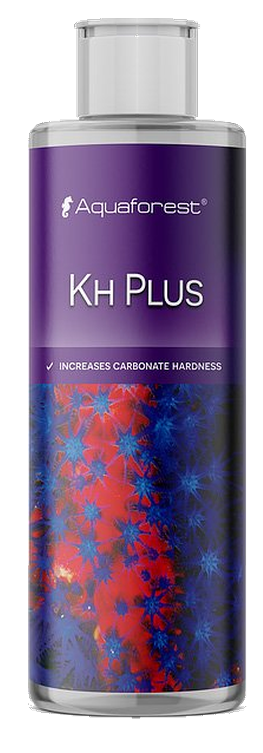</td></tr>
<tr><td>❌</td><td colspan='2'>Magnesium</td></tr>
<tr><td>✅</td><td>Mg Plus</td><td></td></tr>
</table>
</details>

<details>
<summary><b>BRS &nbsp; <sup>0/4 🖼️</sup></b></summary>

<table>
<tr><td>❌</td><td colspan='2'>Liquid Calcium</td></tr>
<tr><td>❌</td><td colspan='2'>Liquid alkalinity</td></tr>
<tr><td>❌</td><td colspan='2'>Magnesium Mix</td></tr>
<tr><td>❌</td><td colspan='2'>Part C</td></tr>
</table>
</details>

<details>
<summary><b>Brightwell &nbsp; <sup>0/12 🖼️</sup></b></summary>

<table>
<tr><td>❌</td><td colspan='2'>Calcion</td></tr>
<tr><td>❌</td><td colspan='2'>Ferrion</td></tr>
<tr><td>❌</td><td colspan='2'>Hydrate - MG</td></tr>
<tr><td>❌</td><td colspan='2'>KoralAmino</td></tr>
<tr><td>❌</td><td colspan='2'>Koralcolor</td></tr>
<tr><td>❌</td><td colspan='2'>Liquid Reef</td></tr>
<tr><td>❌</td><td colspan='2'>Potassion</td></tr>
<tr><td>❌</td><td colspan='2'>Reef Code A</td></tr>
<tr><td>❌</td><td colspan='2'>Reef Code B</td></tr>
<tr><td>❌</td><td colspan='2'>Replenish</td></tr>
<tr><td>❌</td><td colspan='2'>Restore</td></tr>
<tr><td>❌</td><td colspan='2'>Strontion</td></tr>
</table>
</details>

<details>
<summary><b>ESV &nbsp; <sup>0/5 🖼️</sup></b></summary>

<table>
<tr><td>❌</td><td colspan='2'>B-Ionic Component 1</td></tr>
<tr><td>❌</td><td colspan='2'>B-Ionic Component 2</td></tr>
<tr><td>❌</td><td colspan='2'>B-Ionic Magnesium</td></tr>
<tr><td>❌</td><td colspan='2'>Transition elements </td></tr>
<tr><td>❌</td><td colspan='2'>Transition elements plus</td></tr>
</table>
</details>

<details>
<summary><b>Fauna Marine &nbsp; <sup>0/11 🖼️</sup></b></summary>

<table>
<tr><td>❌</td><td colspan='2'>Amin</td></tr>
<tr><td>❌</td><td colspan='2'>Balling light  trace 1</td></tr>
<tr><td>❌</td><td colspan='2'>Balling light  trace 2</td></tr>
<tr><td>❌</td><td colspan='2'>Balling light  trace 3</td></tr>
<tr><td>❌</td><td colspan='2'>Balling light Ca</td></tr>
<tr><td>❌</td><td colspan='2'>Balling light KH</td></tr>
<tr><td>❌</td><td colspan='2'>Balling light Mg</td></tr>
<tr><td>❌</td><td colspan='2'>Blue trace elements</td></tr>
<tr><td>❌</td><td colspan='2'>Green trace elements</td></tr>
<tr><td>❌</td><td colspan='2'>Min S</td></tr>
<tr><td>❌</td><td colspan='2'>Red trace elements</td></tr>
</table>
</details>

<details>
<summary><b>Quantum &nbsp; <sup>7/7 🖼️</sup></b></summary>

<table>
<tr><td>✅</td><td>Aragonite A</td><td>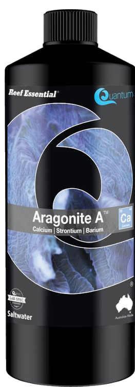</td></tr>
<tr><td>✅</td><td>Aragonite B</td><td>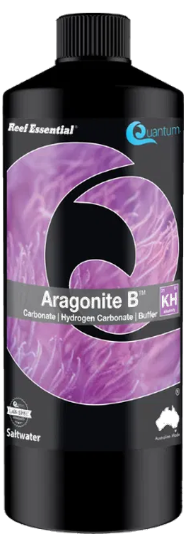</td></tr>
<tr><td>✅</td><td>Aragonite C</td><td>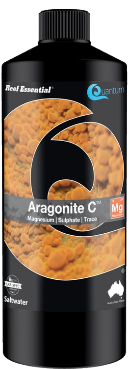</td></tr>
<tr><td>✅</td><td>Bio Kalium</td><td>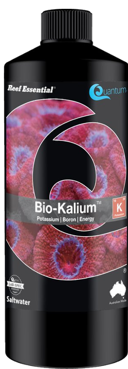</td></tr>
<tr><td>✅</td><td>Bio Metals</td><td>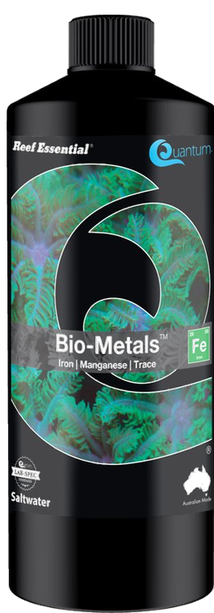</td></tr>
<tr><td>✅</td><td>Bio enhance</td><td>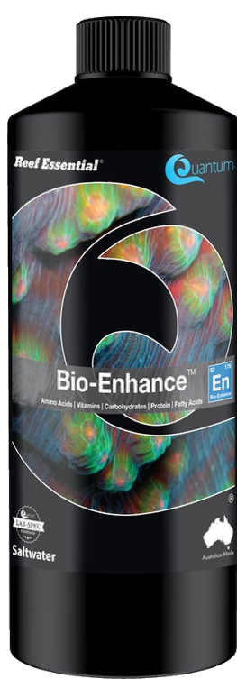</td></tr>
<tr><td>✅</td><td>Gbio Gen</td><td>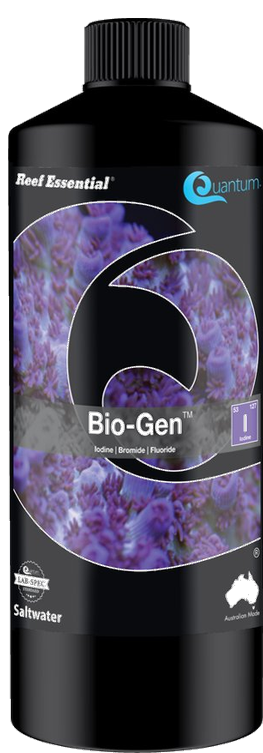</td></tr>
</table>
</details>

<details>
<summary><b>Red Sea &nbsp; <sup>10/13 🖼️</sup></b></summary>

<table>
<tr><td>✅</td><td>Bio Active (Colors D)</td><td>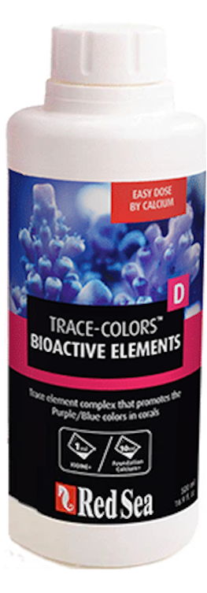</td></tr>
<tr><td>✅</td><td>Calcium (Foundation A)</td><td>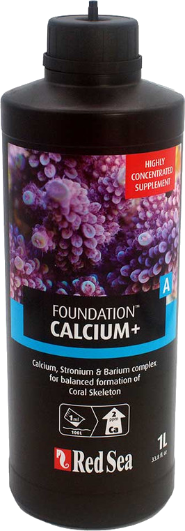</td></tr>
<tr><td>❌</td><td colspan='2'>Calcium (Powder)</td></tr>
<tr><td>✅</td><td>Iodine (Colors A)</td><td>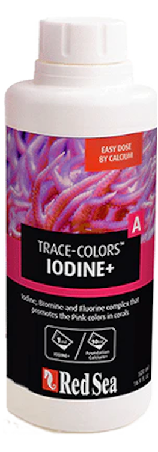</td></tr>
<tr><td>✅</td><td>Iron (Colors C)</td><td></td></tr>
<tr><td>✅</td><td>KH/Alkalinity (Foundation B)</td><td>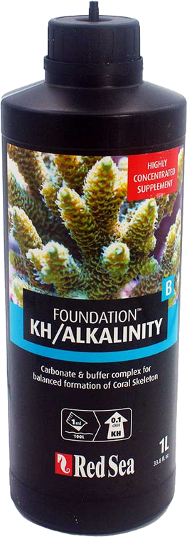</td></tr>
<tr><td>❌</td><td colspan='2'>KH/Alkalinity (Powder)</td></tr>
<tr><td>✅</td><td>Magnesium (Foundation C)</td><td>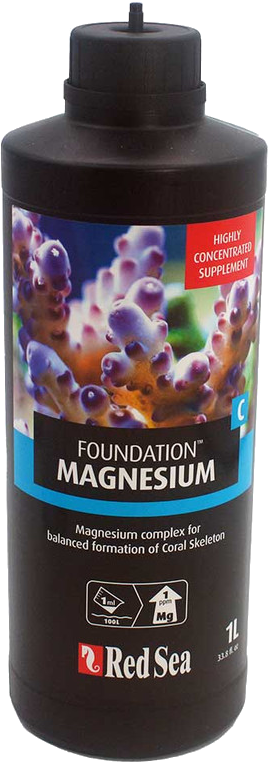</td></tr>
<tr><td>❌</td><td colspan='2'>Magnesium (Powder)</td></tr>
<tr><td>✅</td><td>NO3PO4-X</td><td>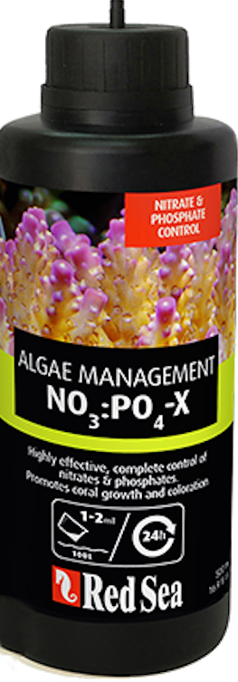</td></tr>
<tr><td>✅</td><td>Potassium (Colors B)</td><td>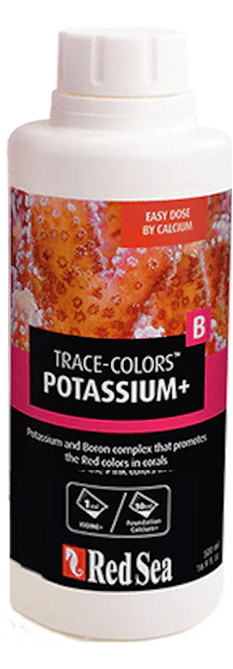</td></tr>
<tr><td>✅</td><td>Reef Energy Plus</td><td>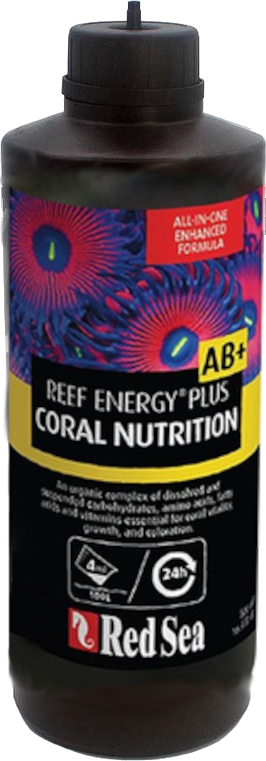</td></tr>
<tr><td>✅</td><td>ReefCare Program</td><td></td></tr>
</table>
</details>

<details>
<summary><b>Seachem &nbsp; <sup>0/9 🖼️</sup></b></summary>

<table>
<tr><td>❌</td><td colspan='2'>Reef Calcium</td></tr>
<tr><td>❌</td><td colspan='2'>Reef Carbonate</td></tr>
<tr><td>❌</td><td colspan='2'>Reef Complete</td></tr>
<tr><td>❌</td><td colspan='2'>Reef Fusion 1</td></tr>
<tr><td>❌</td><td colspan='2'>Reef Fusion 2</td></tr>
<tr><td>❌</td><td colspan='2'>Reef Iodine</td></tr>
<tr><td>❌</td><td colspan='2'>Reef Plus</td></tr>
<tr><td>❌</td><td colspan='2'>Reef Strontium</td></tr>
<tr><td>❌</td><td colspan='2'>Reef Trace</td></tr>
</table>
</details>

<details>
<summary><b>Triton &nbsp; <sup>0/4 🖼️</sup></b></summary>

<table>
<tr><td>❌</td><td colspan='2'>Core7 elements 1</td></tr>
<tr><td>❌</td><td colspan='2'>Core7 elements 2</td></tr>
<tr><td>❌</td><td colspan='2'>Core7 elements 3A</td></tr>
<tr><td>❌</td><td colspan='2'>Core7 elements 3B</td></tr>
</table>
</details>

<details>
<summary><b>Tropic Marin &nbsp; <sup>5/14 🖼️</sup></b></summary>

<table>
<tr><td>❌</td><td colspan='2'>A Element</td></tr>
<tr><td>✅</td><td>All-For-Reef</td><td>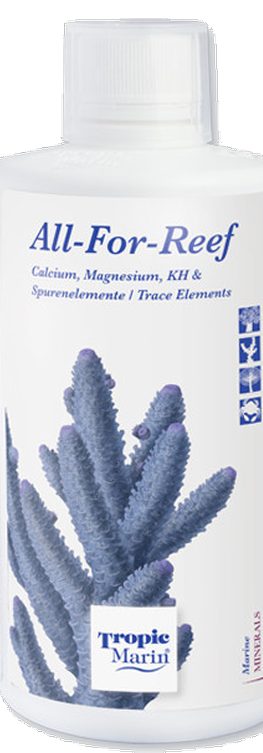</td></tr>
<tr><td>✅</td><td>Amino Organic</td><td></td></tr>
<tr><td>❌</td><td colspan='2'>Balling A</td></tr>
<tr><td>❌</td><td colspan='2'>Balling B</td></tr>
<tr><td>❌</td><td colspan='2'>Balling C</td></tr>
<tr><td>✅</td><td>Bio-Magnesium</td><td>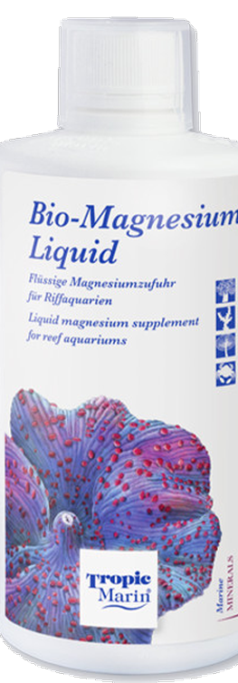</td></tr>
<tr><td>✅</td><td>Carbo Calcium</td><td></td></tr>
<tr><td>❌</td><td colspan='2'>Elimi-NP</td></tr>
<tr><td>❌</td><td colspan='2'>K Element</td></tr>
<tr><td>❌</td><td colspan='2'>Liquid Buffer</td></tr>
<tr><td>❌</td><td colspan='2'>NP-Bacto-Balance</td></tr>
<tr><td>❌</td><td colspan='2'>Plus-NP</td></tr>
<tr><td>✅</td><td>Potassium</td><td></td></tr>
</table>
</details>

# ReefLed

Geplant.

Möchten Sie, dass es schneller unterstützt wird? Stimmen Sie [hier](https://github.com/Elwinmage/ha-reef-card/discussions/22) ab.

# ReefMat

ReefMat mit ha-reef-card in Aktion:

[](https://www.youtube.com/watch?v=yyNyUSitb1E)

Die ReefMat-Karte ist in 7 Bereiche unterteilt:

1. Konfiguration / WLAN-Informationen
2. Zustände
3. Rolleninformationen (verbrauchte Gesamtlänge, verbleibende Länge, Rollenende, Modus...)
4. Manueller/Automatischer Vorschub
5. Sensor
6. Geplanter Vorschub
7. Wochen- / Monatsverbrauchsdiagramm

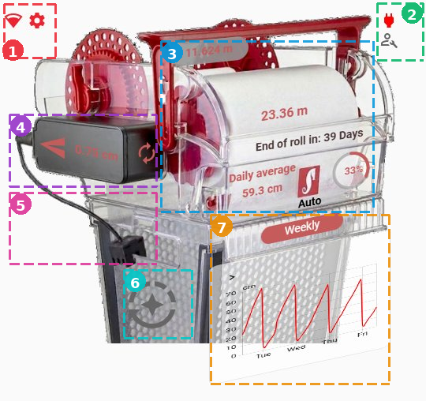

Das Hintergrundbild ändert sich je nach Nutzungszustand der Rolle mit 5 verschiedenen Bildern:

<table>
  <tr>
    <td align="center">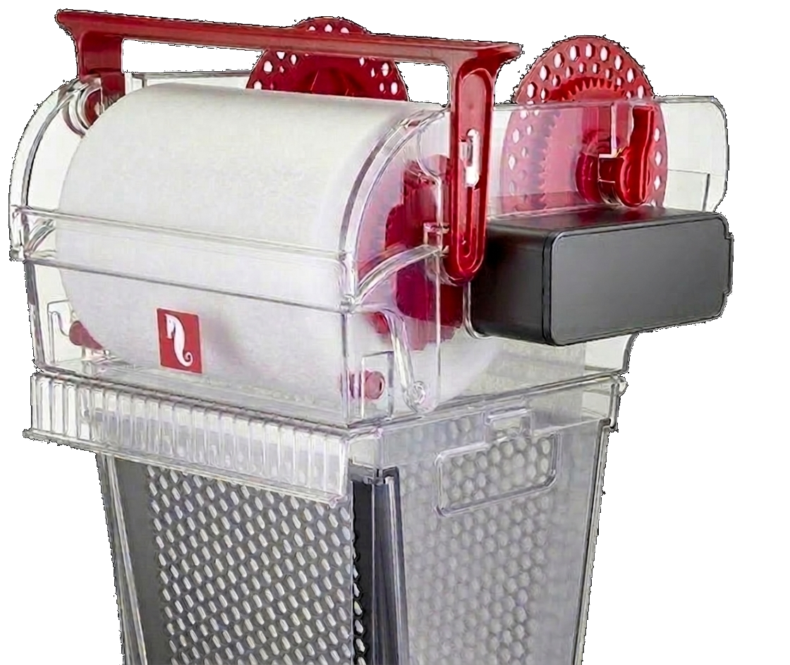<br/><b>0%</b></td>
    <td align="center">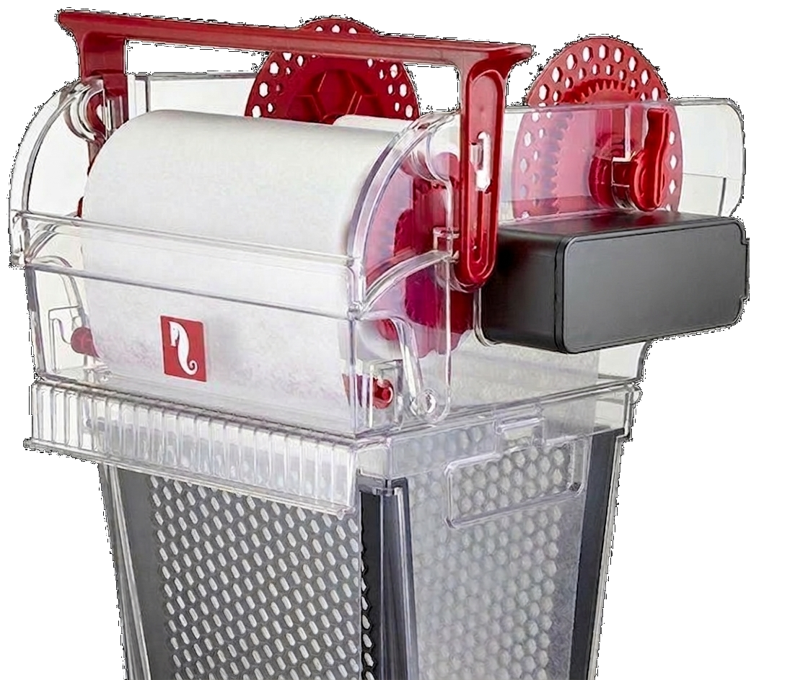<br/><b>25%</b></td>
    <td align="center">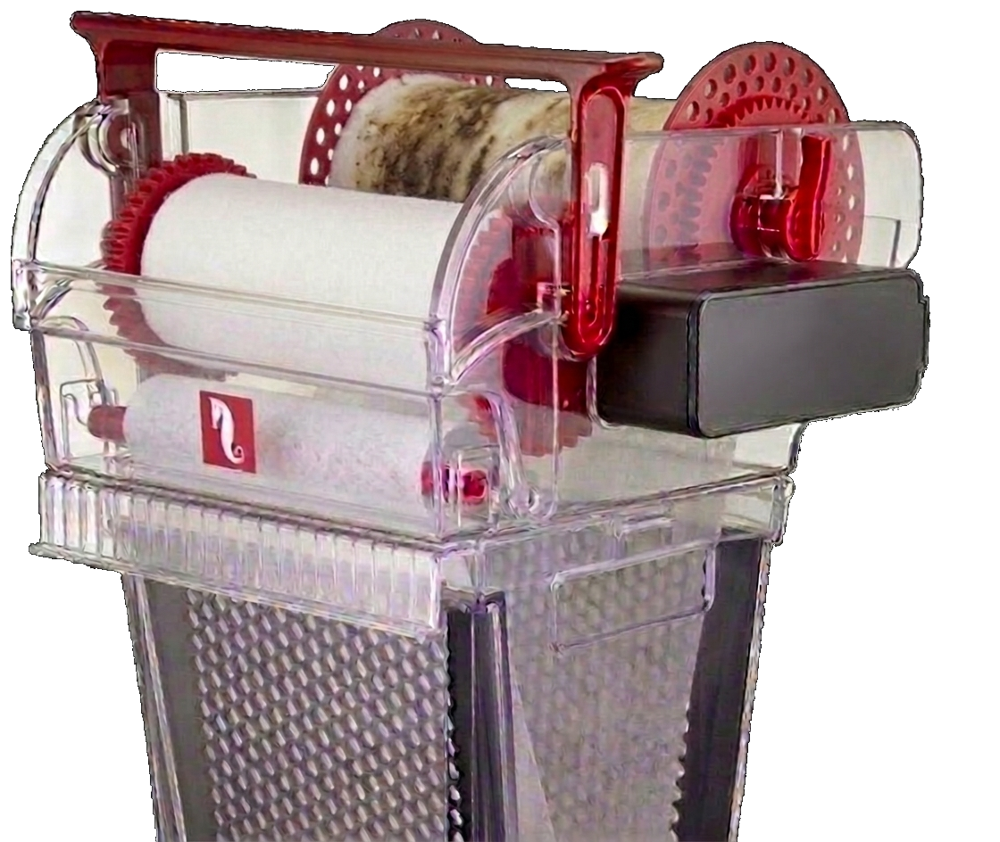<br/><b>50%</b></td>
  </tr>
  <tr>
    <td align="center">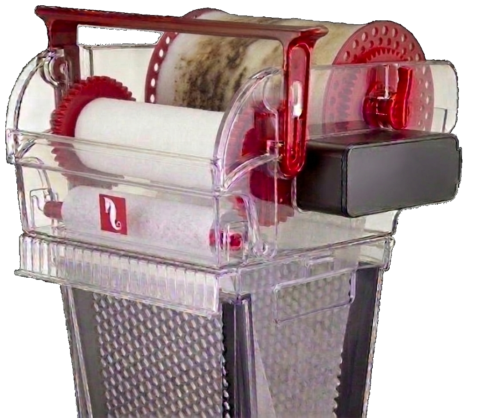<br/><b>75%</b></td>
    <td align="center">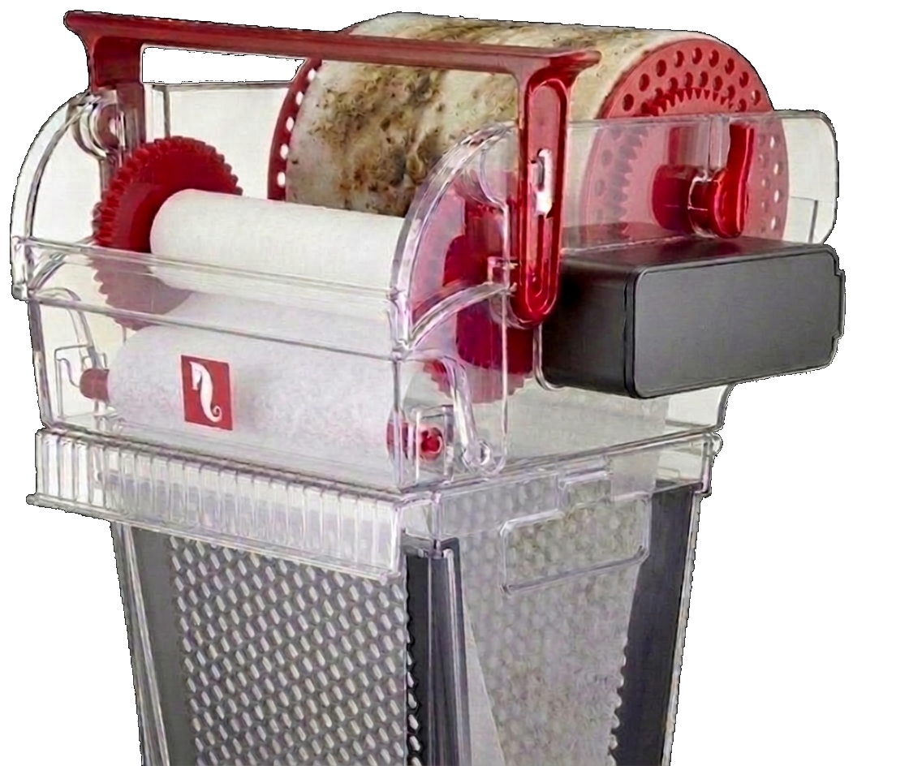<br/><b>100%</b></td>
    <td></td>
  </tr>
</table>

## Konfiguration / WLAN-Informationen

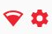

---

<span>Klicken Sie auf das Symbol  zur Verwaltung der allgemeinen Konfiguration des ReefMat.</span>

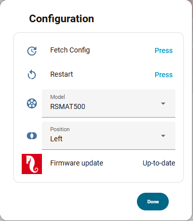

<span>Klicken Sie auf das Symbol  zur Verwaltung der Netzwerkeinstellungen.</span>

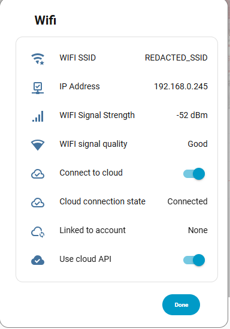

## Zustände

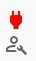

---

<span>Der Wartungsschalter  wechselt in den Wartungsmodus.</span>

 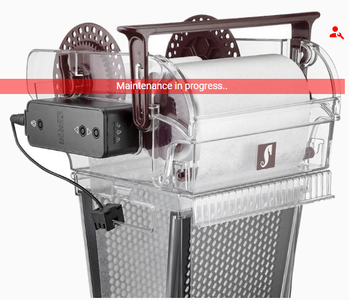

<span>Der Ein/Aus-Schalter  schaltet den ReefMat zwischen Ein- und Aus-Zustand um.</span>

 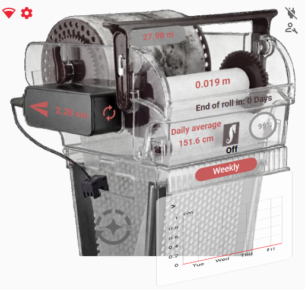

## Rolleninformationen

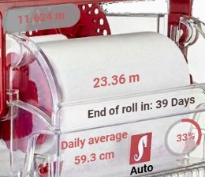

---

Dieser Bereich zeigt den Echtzeitstatus der Filterrolle, von oben nach unten:

- Die **insgesamt verbrauchte Länge** seit Beginn der Rolle (oben, rot)
- Die **verbleibende Länge** in der Mitte in rot. Wenn die Rolle leer ist, erscheint ein  blinkendes Symbol und ein Dialogfeld schlägt vor, die Rolle zu ersetzen.

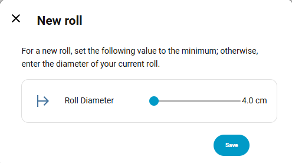

- Die **verbleibenden Tage** bis zum Rollenende, geschätzt anhand des täglichen Durchschnittsverbrauchs (schwarz)
- Der **tägliche Durchschnittsverbrauch** in cm (unten links)
- Der aktuelle **Betriebsmodus**: Auto, Wartung, Aus… (unter dem RedSea-Logo)
- Der **Rollenverbrauchsprozentsatz** (Kreisbogen unten rechts)

Wird eine Anomalie erkannt, verwandelt sich das RedSea-Logo in ein  blinkendes Symbol.
Ein Klick auf diesen Alarm öffnet den Anomalie-Dialog:

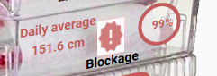
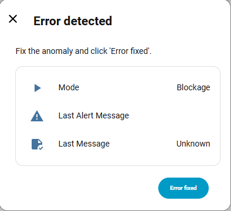

## Manueller/Automatischer Vorschub

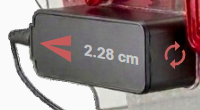
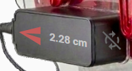
---

Dieser Bereich steuert den Rollenvorschub.

Von links nach rechts:

- Die Schaltfläche  löst einen **manuellen Vorschub** der Rolle um die angezeigte Länge aus.
- Der angezeigte **Vorschubwert** (in cm) ist der Wert, der beim Drücken der Taste gesendet wird. Ein Klick öffnet den Bearbeitungsdialog.

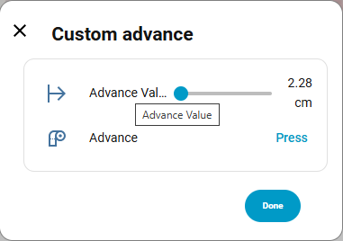

- Die **automatische Vorschubschaltfläche**   aktiviert oder deaktiviert den automatischen Rollenvorschub.

## Sensor


---

Dieser Bereich zeigt den Status des Niveausensors.

Drei Zustände sind möglich:

| Zustand              | Bild                                                            |
| -------------------- | --------------------------------------------------------------- |
| Sensor angeschlossen | 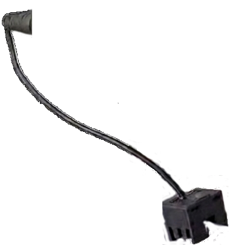   |
| Sensor getrennt      | 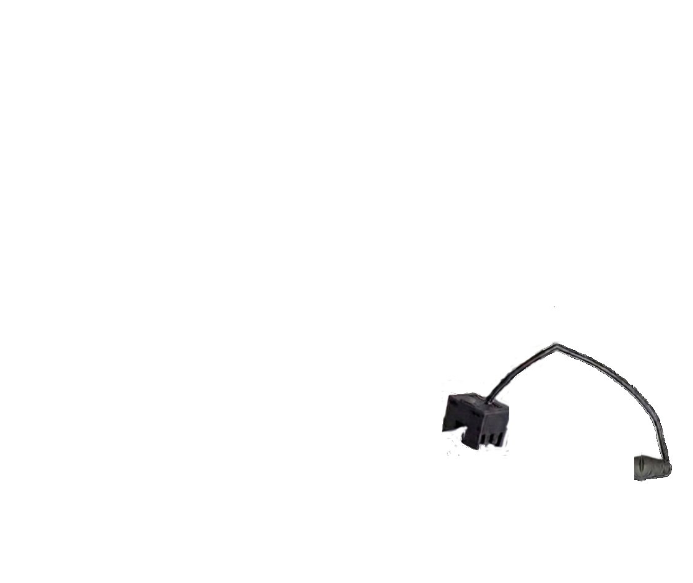 |
| Schmutziger Sensor   |           |

## Geplanter Vorschub


---

Diese Schaltfläche  zeigt den Status des geplanten Vorschubs und ermöglicht die Bearbeitung per Klick.

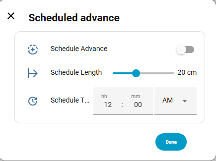

## Verbrauchsdiagramm

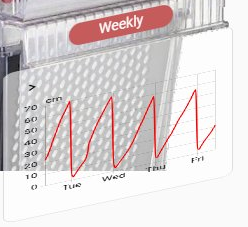 
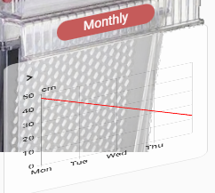

---

Dieser Bereich zeigt ein Diagramm des Rollenverbrauchs über die Zeit.
Ein Klick auf die Schaltfläche wechselt zwischen den zwei verfügbaren Modi:

- Der Modus **Weekly** zeigt den Verbrauch der letzten 7 Tage.
- Der Modus **Monthly** zeigt den Verbrauch der letzten 30 Tage.

Ein Druck oben links im Diagramm öffnet die Detailansicht in Home Assistant.

## Messages

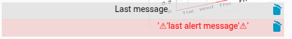

---

Dieser Bereich zeigt die letzten Systemmeldungen des ReefMat. Er hat zwei Zeilen:

- Die graue Zeile zeigt die **letzte Nachricht**.
- Die rosa Zeile zeigt die **letzte Warnung**, mit dem Symbol ⚠.

Ein Klick auf  löscht die entsprechende Nachricht.

Diese Zeilen können über die Karteneditor-Oberfläche ausgeblendet werden.

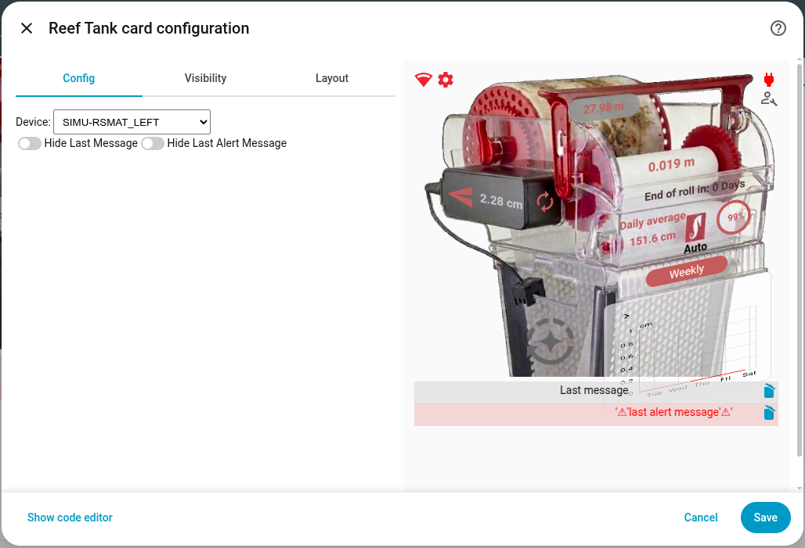

# ReefMat

ReefMat con ha-reef-card en acción:

[](https://www.youtube.com/watch?v=XXXX)

La tarjeta ReefMat está dividida en 7 zonas:

1. Configuración / Información Wifi
2. Estados
3. Información del rollo (longitud total usada, longitud restante, fin de rollo, modo...)
4. Avance manual/automático
5. Sonda
6. Avance programado
7. Gráfico de uso semanal / mensual


La imagen de fondo cambia según el estado de uso del rollo con 5 imágenes diferentes:

<table>
  <tr>
    <td align="center"><br/><b>0%</b></td>
    <td align="center"><br/><b>25%</b></td>
    <td align="center"><br/><b>50%</b></td>
  </tr>
  <tr>
    <td align="center"><br/><b>75%</b></td>
    <td align="center"><br/><b>100%</b></td>
    <td></td>
  </tr>
</table>

## Configuración / Información Wifi


---

<span>Haga clic en el icono  para gestionar la configuración general del ReefMat.</span>


<span>Haga clic en el icono  para gestionar los parámetros de red.</span>


## Estados


---

<span>El interruptor de mantenimiento  permite cambiar al modo de mantenimiento.</span>

 

<span>El interruptor de encendido/apagado  permite alternar entre los estados encendido y apagado del ReefMat.</span>

 

## Información del rollo


---

Esta zona muestra el estado en tiempo real del rollo filtrante, de arriba a abajo:

- La **longitud total usada** desde el inicio del rollo (arriba, en rojo)
- La **longitud restante** en el centro en rojo. Cuando el rollo está vacío, aparece un  icono parpadeante en su lugar y un cuadro de diálogo propone reemplazar el rollo.


- El **número de días restantes** antes del fin del rollo, estimado según el consumo diario promedio (en negro)
- El **consumo diario promedio** en cm (abajo a la izquierda)
- El **modo de funcionamiento** actual: Auto, Mantenimiento, Apagado… (debajo del logo RedSea)
- El **porcentaje de rollo usado** (arco circular abajo a la derecha)

Si se detecta una anomalía, el logo RedSea se transformará en un  icono parpadeante.
Hacer clic en esta alerta abre el cuadro de diálogo de anomalías:


## Avance Manual/Automático


---

Esta zona permite controlar el avance del rollo.

De izquierda a derecha:

- El botón  lanza un **avance manual** del rollo por la longitud indicada en el centro.
- El **valor de avance** mostrado (en cm) es el valor que se enviará al pulsar el botón. Hacer clic en este número abre el cuadro de edición.


- El **botón de avance automático**   activa o desactiva el avance automático del rollo.

## Sonda


---

Esta zona muestra el estado del sensor de nivel.

Tres estados son posibles:

| Estado              | Imagen                                                          |
| ------------------- | --------------------------------------------------------------- |
| Sensor conectado    |    |
| Sensor desconectado |  |
| Sensor sucio        |           |

## Avance programado


---

Este botón  muestra el estado del avance programado y permite editarlo haciendo clic.


## Gráfico de uso

 


---

Esta zona muestra un gráfico del consumo del rollo a lo largo del tiempo.
Hacer clic en el botón alterna entre los dos modos disponibles:

- El modo **Weekly** muestra el consumo de los últimos 7 días.
- El modo **Monthly** muestra el consumo de los últimos 30 días.

Pulsar en la esquina superior izquierda del gráfico abre la vista detallada en Home Assistant.

## Messages


---

Esta zona muestra los últimos mensajes del sistema del ReefMat. Tiene dos líneas:

- La línea gris muestra el **último mensaje** recibido.
- La línea rosa muestra la **última alerta**, precedida del símbolo ⚠.

Hacer clic en  borra el mensaje correspondiente.

# ReefRun

[](https://www.youtube.com/watch?v=yyNyUSitb1E)

Die ReefRun-Karte zeigt den Controller und seine beiden Pumpen so, wie sie
physisch angeschlossen sind, jede mit eigenem Kabel und eigener Verrohrung.
Pumpe 1 ist die linke, Pumpe 2 die rechte — typischerweise die Rückförderpumpe
und der DC Skimmer, aber jeder Anschluss nimmt beide Modelle auf.

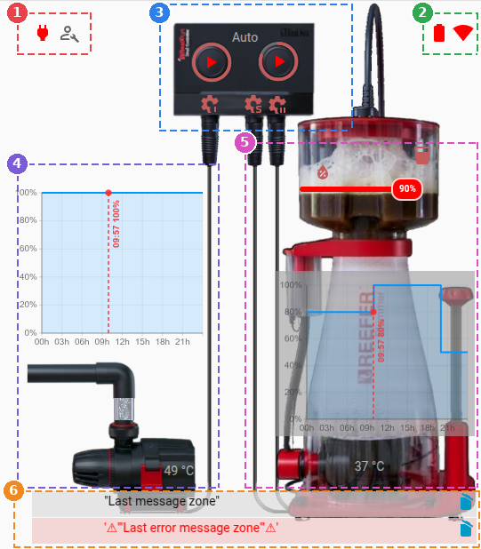

Die Karte ist in 6 Zonen gegliedert:

1. Versorgungszustand und Wartungsmodus
2. Batterie- und WLAN-Informationen
3. Controller: Betriebsart, Pumpentasten und Kalibrierungen
4. Pumpe 1: Tagesprogramm, Körper mit Wasserfluss in Echtzeit, Temperatur
5. Pumpe 2: Tagesprogramm, Körper mit Wasserfluss in Echtzeit, Temperatur
6. Letzte Meldung und letzte Warnung

## Versorgungszustand und Wartungsmodus

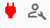

<span>Der Wartungsschalter  wechselt in den Wartungsmodus.</span>

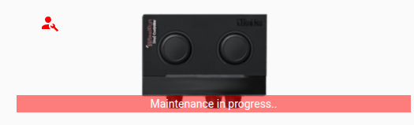

<span>Der Ein/Aus-Schalter  schaltet den Reef Dual Controller ein und aus.</span>

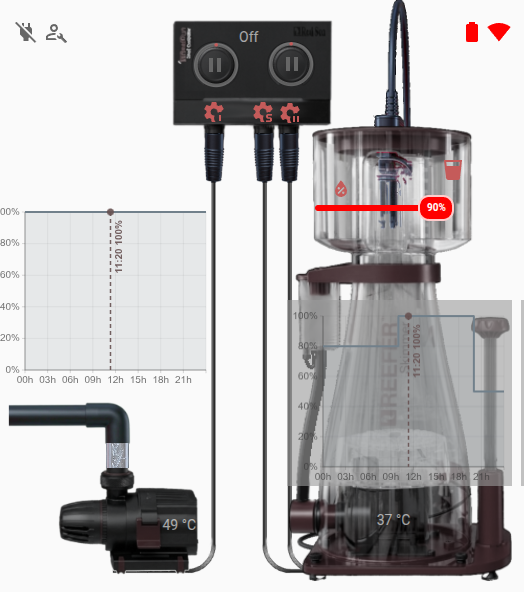

## Batterie- und WLAN-Informationen

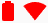

---

<span>Dieses Symbol 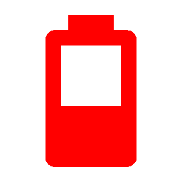 zeigt den Batteriestand des Dual Controllers an.</span>

<span>Klicke auf das Symbol , um die Netzwerkeinstellungen zu verwalten.</span>

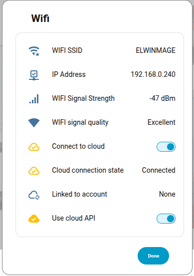

## Controller: Betriebsart, Pumpentasten und Kalibrierungen

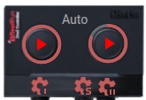

### Pumpeneinstellungen

Ein Klick auf 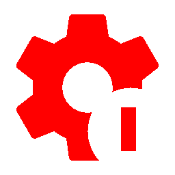 oder 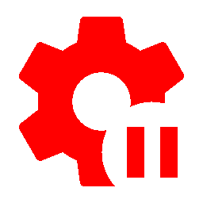 öffnet den Konfigurationsdialog von Pumpe 1 bzw. 2.

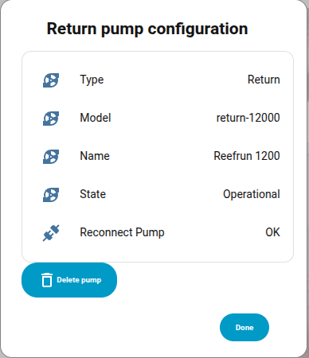
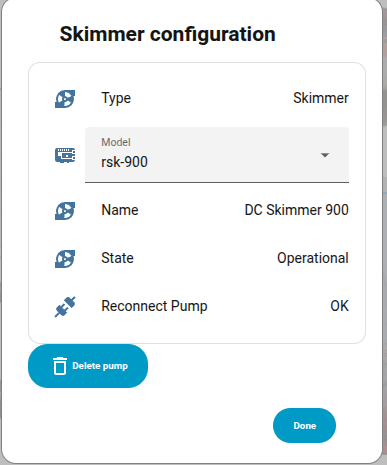

> [!CAUTION]
> **Pumpe löschen** setzt ihre Einstellungen auf die Werkswerte zurück: das
> Tagesprogramm und die Sensorsteuerung gehen verloren. Es wird immer eine
> Bestätigung verlangt.

### Sensoreinstellungen

Ein Klick auf  öffnet den Konfigurationsdialog des Sensors.
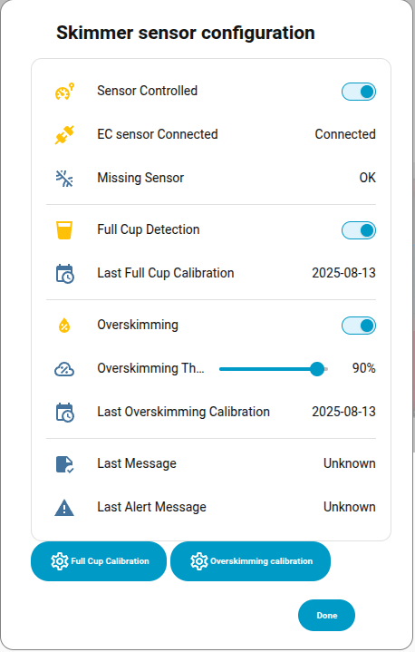

### Pumpe Play/Pause 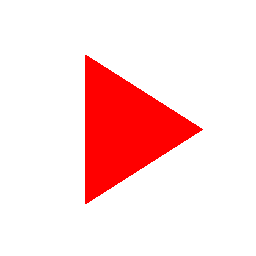 / 

Ein Klick schaltet die einzelne Pumpe ein oder aus.

Der rote Ring zeigt die aktuelle Drehzahl.
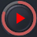

Um die aktuelle Drehzahl zu ändern, halte  /  gedrückt oder klicke auf das Tagesprogramm:

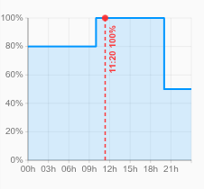

## Zustände einer Pumpe

Der Pumpenkörper spiegelt wider, was das Gerät tatsächlich tut — ein Blick
genügt. Die beiden Pumpentypen haben nicht dieselben Zustände, deshalb werden
sie getrennt beschrieben.

## Pumpen 1 & 2

### Rückförderpumpe

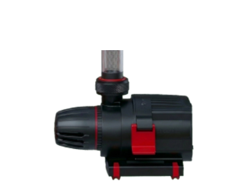

Eine einzige Darstellung deckt alle Zustände ab, die Karte ändert nur, wie sie
gezeichnet wird:

- **In Betrieb** — volle Farben, Wasser mit der aktuellen Drehzahl animiert.
- **Gestoppt** — dieselbe Darstellung ausgegraut, kein Fluss.
- **Getrennt** — dieselbe Ausgrauung, dazu ein blinkendes Stromkabel.

### Abschäumer

Drei eigene Darstellungen, eine je Becherzustand:

<table>
  <tr>
    <td align="center">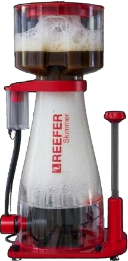<br/><b>In Betrieb</b><br/>Schaum im Becher, aufsteigende Blasen, Wasser animiert</td>
    <td align="center">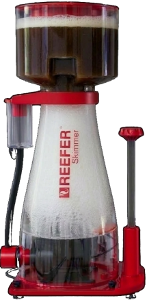<br/><b>Voller Becher</b><br/>Schaum auf ein Band unter dem Deckel reduziert</td>
    <td align="center">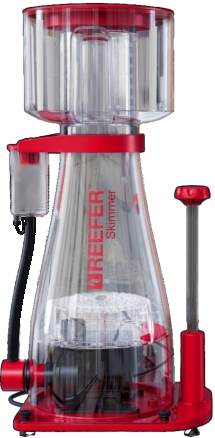<br/><b>Gestoppt</b><br/>Leerer Becher, ausgegraut, keine Blasen</td>
  </tr>
</table>

Ein getrennter Abschäumer sieht genauso aus wie ein gestoppter: nur das
blinkende Kabel unterscheidet sie. Dieses Blinken bedeutet, dass der ReefRun
`missing_pump` meldet, die Pumpe ist also konfiguriert, aber der Controller
sieht sie nicht mehr. Prüfe den Stecker, bevor du weiter suchst.

Der Zustand „voller Becher" wird vom Skim-Sensor in der Sammelkammer gemeldet.
Der Körper wechselt auf seine eigene Darstellung und die Schaumanimation
schrumpft auf ein schmales Band unter dem Deckel — unabhängig davon, ob die
Selbstnivellierung aktiv ist. Das blinkende Warnsymbol neben dem Schalter für
den vollen Becher erscheint nur, wenn `sensor_controlled` eingeschaltet ist,
denn bei deaktiviertem Sensor unternimmt der Controller nichts.

### Eine Pumpe hinzufügen

Ein Anschluss ohne konfigurierte Pumpe zeigt statt eines Pumpenkörpers einen
**Hinzufügen**-Platzhalter:

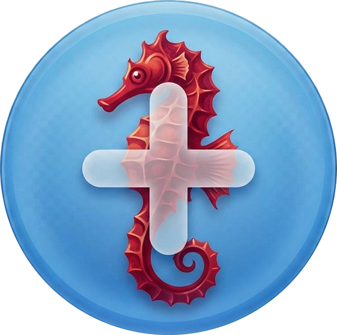

Ein Klick öffnet den Konfigurationsdialog, in dem **Erkennen und hinzufügen** den
Controller fragt, was angeschlossen ist, und es in einem Schritt registriert. Das
erkannte Modell ist nur ein Vorschlag und liegt gelegentlich daneben, deshalb
bleibt die Modellliste danach änderbar: für einen DC Skimmer wählst du rsk-300,
rsk-600 oder rsk-900. Der Pumpenname lässt sich im selben Dialog bearbeiten.

Der Platzhalter steht auf jedem nicht konfigurierten Anschluss, er erscheint also
auch dort, wo du nie eine Pumpe anschließen willst. Wer nur eine Pumpe betreibt,
kann ihn im Karteneditor vollständig ausblenden.


### Tagesprogramm


Die blaue Kurve ist die programmierte Drehzahl über 24 Stunden. Die senkrechte
rote Linie markiert die aktuelle Uhrzeit, der Punkt darauf die vom Programm
geforderte Drehzahl.

Folgt die Pumpe ihrem Programm nicht — Fütterungsmodus, Erkennung eines vollen
Bechers, Überschäumschutz — wandert der Punkt auf die **tatsächliche** Drehzahl
und ein rotes Segment stellt die Abweichung dar, mit dem Zahlenwert daneben:

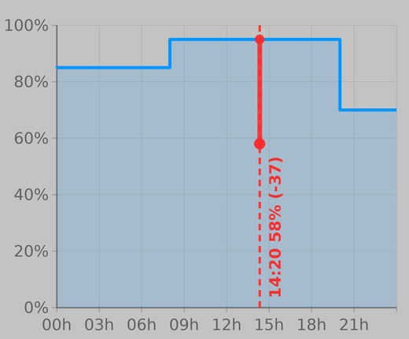

Ein Klick auf das Diagramm öffnet den Programmeditor: Punkte hinzufügen oder entfernen, Zeiten und Drehzahlen ändern, einen Punkt am Gerät vorab testen und speichern.

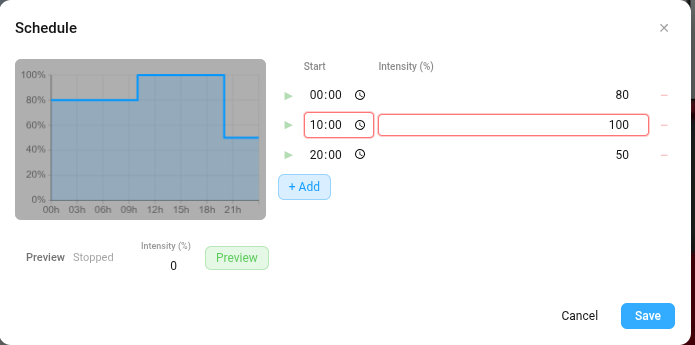

## Meldungen

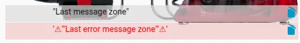

---

Dieser Bereich zeigt die letzten Systemmeldungen des ReefRun. Er hat zwei Zeilen:

- Die graue Zeile zeigt die **letzte empfangene Meldung**.
- Die rosa Zeile zeigt die **letzte Warnung**, eingeleitet vom Symbol ⚠.

Ein Klick auf das Symbol  löscht die jeweilige Meldung.

Diese Zeilen lassen sich über den Karteneditor ausblenden.

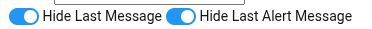

# ReefWave

Geplant.

Möchten Sie, dass es schneller unterstützt wird? Stimmen Sie [hier](https://github.com/Elwinmage/ha-reef-card/discussions/22) ab.

# Wartung

Die Wartungsansicht von ha-reef-card in Aktion:

[](https://www.youtube.com/watch?v=VIDEO_ID)

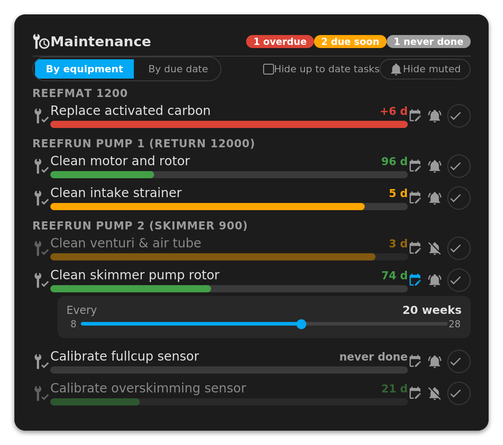

Über die gerätebezogenen Ansichten hinaus bietet die Karte eine
**Wartungsansicht**, die alle von `ha-reefbeat-component` bereitgestellten
Wartungsaufgaben zusammenfasst, als wäre das gesamte Wartungssystem ein einziges
Gerät.

Jede Aufgabe erscheint als Fortschrittsbalken, der zeigt, welcher Teil ihres
Intervalls verstrichen ist, mit einer Farbe je nach Restzeit:

| Farbe  | Bedeutung                                                    |
| ------ | ------------------------------------------------------------ |
| Grün   | Aktuell                                                      |
| Orange | Bald fällig (letzte 20 % des Intervalls, mindestens ein Tag) |
| Rot    | Überfällig, die Beschriftung wechselt zu `+X d`              |
| Grau   | Nie ausgeführt (kein Zurücksetzen erfasst)                   |

Aufgaben lassen sich **nach Gerät** (gruppiert, mit einer Überschrift je Gerät)
oder **nach Fälligkeit** (flache Liste, die dringendste zuerst) sortieren. Nie
ausgeführte Aufgaben stehen immer am Ende. In der Werkzeugleiste gibt es zwei
Filter: ein Kontrollkästchen, das noch aktuelle Aufgaben ausblendet, und eine
Schaltfläche **Stumme ausblenden / Stumme anzeigen**, die Aufgaben mit
ausgeschaltetem Benachrichtigungsschalter ausblendet. Die Schaltfläche startet in
der Stellung „anzeigen“, sodass das Stummschalten einer Meldung nie von selbst
eine Frist verschwinden lässt. Dieser Standardwert ist im Karteneditor (oder über
`hide_muted` weiter unten) einstellbar, und die Schaltfläche hat jederzeit
Vorrang.

Ein Klick auf eine Zeile öffnet den more-info-Dialog von Home Assistant für die
Aufgabe; die runde Schaltfläche rechts hakt sie ab (sie drückt die
zugrundeliegende Button-Entität, genau wie es der more-info-Dialog täte).

Die Ansicht erscheint nur dann in der Geräteauswahl, wenn in deiner Installation
mindestens eine Wartungsaufgabe existiert. Neue Aufgaben im Katalog der
Integration tauchen automatisch auf, ohne Aktualisierung der Karte.

### Benachrichtigungen

Jede Aufgabe erhält zusätzlich einen **Benachrichtigungsschalter** in der
Integration (`switch.*_notify`, angezeigt als „<Aufgabenname>
(Benachrichtigungen)“). Ihn auszuschalten macht die Überfälligkeitsmeldung genau
dieser Aufgabe stumm, ohne ihren Zeitplan zu ändern: der Fortschrittsbalken läuft
weiter, die Zeile wird nur blasser und die Glocke erlischt.

Die Glocke rechts in jeder Zeile schaltet diesen Schalter direkt um. Sie wird nur
angezeigt, wenn die Integration den Schalter bereitstellt. Mit
`show_notify: false` blendest du die Glocken aus.

Das Alarm-Blueprint liest exakt dieselbe Einstellung: eine in der Karte
stummgeschaltete Aufgabe schweigt also auch in der Automatisierung.

### Intervall ändern

Die Kalenderschaltfläche jeder Zeile klappt einen Schieberegler aus, der in die
Zahlen-Entität des Aufgabenintervalls schreibt. Der Regler arbeitet in der
Einheit, die die Integration für diese Aufgabe angibt (Tage, Wochen oder Monate,
aus der Rolle der Entität gelesen), und die Integration rechnet vor dem Speichern
wieder in Tage um. Die Grenzen stammen aus der Entität selbst, sodass die Karte
nie einen Wert außerhalb des Bereichs schreiben kann. Es bleibt immer nur ein
Editor geöffnet. Mit `show_interval: false` blendest du die Schaltflächen aus.

### ReefRun-Pumpen

ReefRun-Untergeräte heißen „… Pumpe 1“ / „… Pumpe 2“, was nichts darüber aussagt,
was die jeweilige Pumpe wirklich ist. Stellt das Gerät sowohl einen `type`- als
auch einen `model`-Sensor bereit, ergänzt die Karte beides in Klammern:
**ReefRun Pumpe 1 (Rückförderung 12000)**, **ReefRun Pumpe 2 (Abschäumer 900)**.

Der Typ wird übersetzt, vom Modell bleibt nur die abschließende Zahl
(`return-12000` -> `12000`, `rsk-900` -> `900`), da das Präfix entweder den Typ
wiederholt oder kryptisch ist. Geräte, die keine Pumpen sind, behalten einen
schlichten Namen.

## Symbole

| Symbol                                                                                                   | Rolle                                                                             |
| -------------------------------------------------------------------------------------------------------- | --------------------------------------------------------------------------------- |
|                                                          | **Aufgabe erledigt.** Hakt die Aufgabe ab und startet ihren Countdown neu.        |
|   | **Stumm / laut.** Schaltet den Benachrichtigungsschalter genau dieser Aufgabe um. |
|                                                  | **Intervall ändern.** Klappt einen Schieberegler für das Aufgabenintervall aus.   |

## Editor

Der Standardzustand der Filter und die Sichtbarkeit der drei Schaltflächen werden im Karteneditor festgelegt.

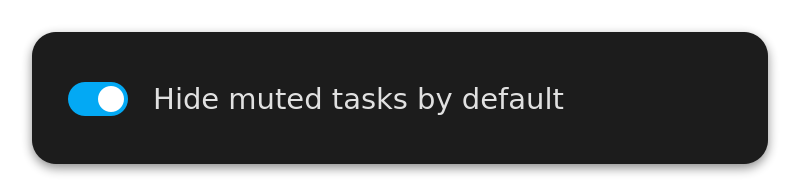

## Konfiguration

```yaml
type: custom:reef-card
device: __maintenance__
maintenance:
  sort: due # "device" (Standard) oder "due"
  hide_ok: false # Aufgaben ausblenden, die weder überfällig noch bald fällig sind
  hide_muted: false # Aufgaben mit ausgeschalteten Benachrichtigungen ausblenden
  warning_ratio: 0.2 # Anteil des Intervalls, der orange dargestellt wird
  show_reset: true # Schaltfläche "als erledigt markieren" in jeder Zeile anzeigen
  show_notify: true # Glocke zum Stummschalten/Aktivieren in jeder Zeile anzeigen
  show_interval: true # Schaltfläche zur Intervallbearbeitung in jeder Zeile anzeigen
```

Alle `maintenance`-Schlüssel sind optional. `sort` und `hide_ok` legen nur den
Anfangszustand fest: der Nutzer kann sie in der Ansicht selbst ändern.

# FAQ

---

[buymecoffee]: https://paypal.me/Elwinmage
[buymecoffeebadge]: https://img.shields.io/badge/buy%20me%20a%20coffee-donate-yellow.svg?style=flat-square
