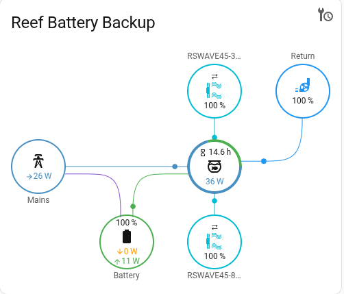
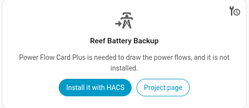
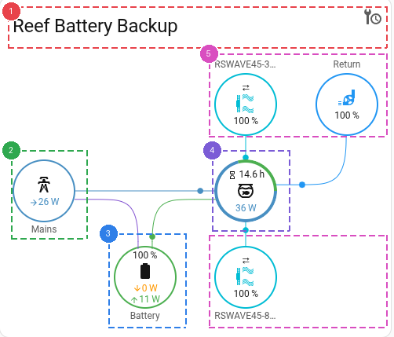
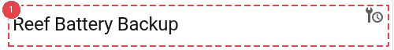
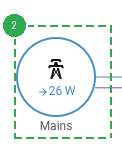
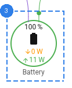
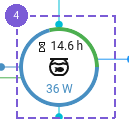
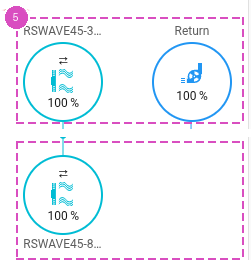
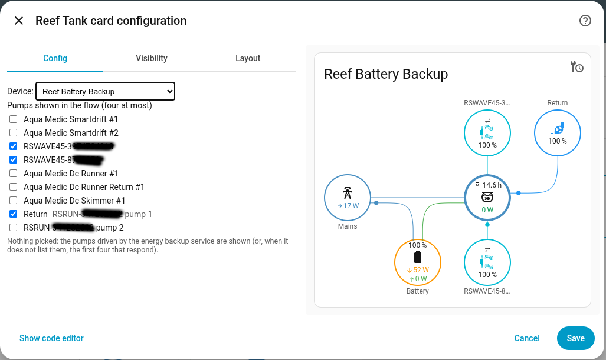

[← Back to the main page](../../README.md)

# Energy backup

The card draws the power flows of [reefbeatEnergyBackup](https://github.com/Elwinmage/reefbeatEnergyBackup): the mains, the battery, the aquarium and up to four pumps with their speed.



The service publishes its sensors over MQTT, so its device (`Reef Battery Backup` by default) appears in the device selector of the card as soon as Home Assistant has discovered it. Nothing else has to be configured: the card finds the sensors and the pumps by itself.

## Power Flow Card Plus

The flows are drawn by [Power Flow Card Plus](https://github.com/flixlix/power-flow-card-plus), a separate card that has to be installed (HACS → Frontend). While it is missing, the view shows a link opening it in HACS:



The flows replace that panel as soon as the card is loaded. Its configuration is written by the reef card: no `power-flow-card-plus` YAML, no template sensor and no `config-template-card` are needed.

## The view

The card is divided into 5 zones:

1. Title and maintenance
2. Mains
3. Battery
4. Aquarium
5. Pumps



A click on a node opens the entity behind it.

## Title and maintenance



The name of the device. The `mdi:wrench-clock` icon opens the maintenance tasks of the device (the battery discharge test), as on every other view.

## Mains



Power delivered by the charger. During an outage: **Outage** and how long it has lasted.

The charger power only exists with a Victron charger. Without it the mains node only tells whether the mains is there, and the aquarium node shows what the battery gives: nothing while on mains, since the battery monitor only sees the battery current.

## Battery



Charge or discharge power, state of charge.

## Aquarium



What the equipment draws (mains and battery together), with the runtime left under it.

## Pumps



Speed in %, direction of a wave pump, icon following the speed. Each pump carries its name in Home Assistant; for a ReefRun pump, the name given to the pump itself. The channel of a ReefRun nothing is plugged on is left out.

The pumps are found among the ReefWave, the ReefRun pumps and the Aqua Medic pumps of the installation. By default the flow shows the ones the energy backup service drives (it publishes their list, so a pump added or removed with `configure.py` follows after a restart of the service). When the service does not publish the list, the first pumps that still respond are shown, wave pumps first. The flow card draws four pumps at most: with more, tick the ones to show in the card editor.



The selection is stored with the options of the device, as Home Assistant device ids:

```yaml
type: custom:reef-card
device: reef_battery
conf:
  ENERGYBACKUP:
    devices:
      reef_battery:
        pumps:
          - 0a1b2c3d4e5f60718293a4b5c6d7e8f9
          - 9f8e7d6c5b4a39281706f5e4d3c2b1a0
```
