[← Back to the main page](../../README.md)

# ReefRun

ReefRun with ha-reef-card in action:

The ReefRun card shows the controller and its two pumps as they are physically
wired, each with its own cable and plumbing. Pump 1 is the one on the left of
the card, pump 2 the one on the right — typically the return pump and the DC
Skimmer, but either socket accepts either model.

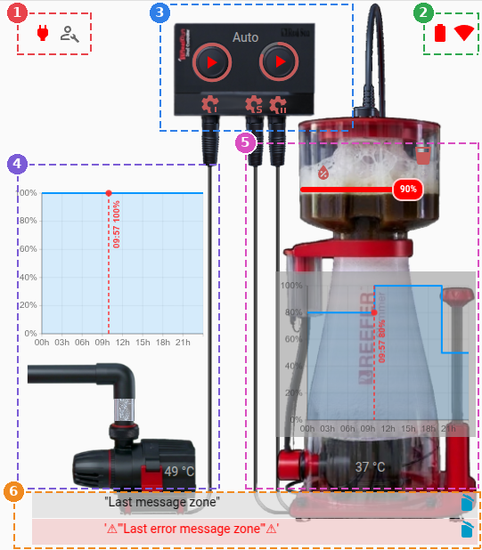

The card is divided into 6 zones:

1. Power state and maintenance mode
2. Battery and Wifi information
3. Controller: operating mode, pump buttons and calibrations
4. Pump 1: daily schedule, body with live water flow, temperature
5. Pump 2: daily schedule, body with live water flow, temperature
6. Last message and last alert

## Power state and maintenance mode

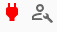

The maintenance switch  switches to maintenance mode.

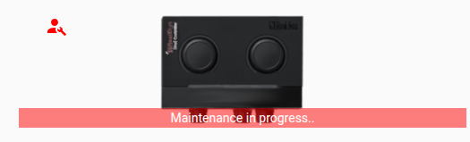

The on/off switch  switches the reef dual controler between on and off states.

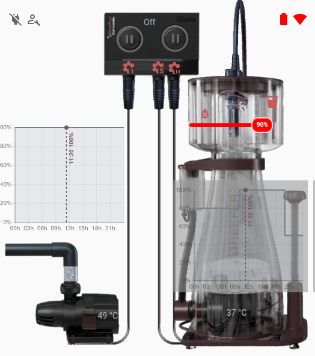

## Configuration / Wifi Information

---

This icon  indicate the battery elevel of the Dual Controler.

Click the icon  to manage the network settings.

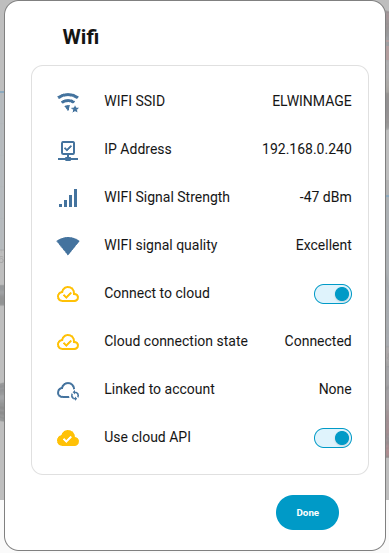

## Controller: operating mode, pump buttons and calibrations

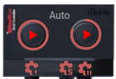

### Pump settings

A click on  or  will open the pump configuration dialog box for pump 1 or 2.

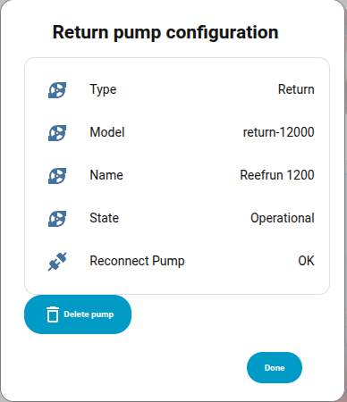
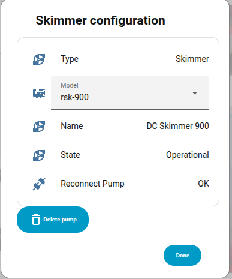

> [!CAUTION]
> **Delete pump** restores the pump settings to their factory defaults: the
> schedule and the sensor control are lost. A confirmation is always asked.

### Sensor settings

A click on  will open the sensor configuration dialog box.
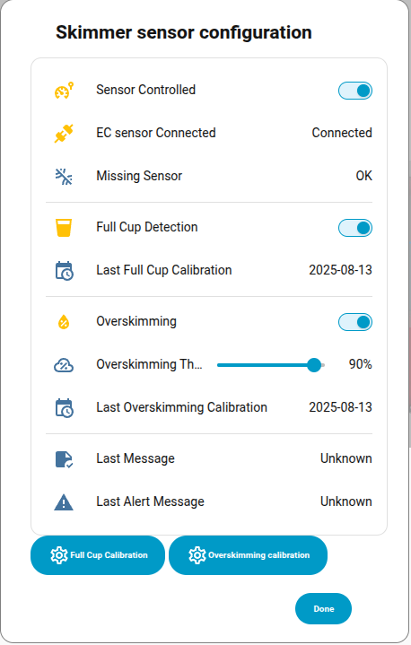

### Pump Play/Pause  / 

A click toggle the individual pump on or off.

The red ring indicates the current speed.

To change the current speed hold  /  or click on the schedule:

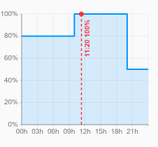

## Pump states

The pump body reflects what the device is actually doing, so a glance is enough.
The two pump types do not have the same states, so they are described
separately.

## Pump 1 & 2

### Return pump

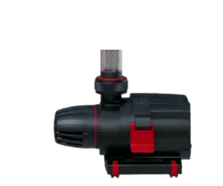

A single artwork covers every state, the card only changes how it is drawn:

- **Running** — full colors, water animated at the current speed.
- **Stopped** — the same artwork greyed out, no flow.
- **Disconnected** — the same greying, plus a blinking power cable.

### Skimmer

Three distinct artworks, one per state of the cup:

<table>
  <tr>
    <td align="center">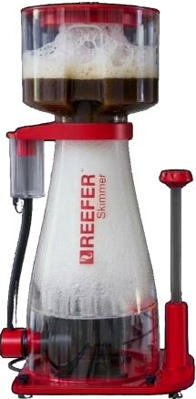 <b>Running</b> Foam in the cup, rising bubbles, water animated</td>
    <td align="center">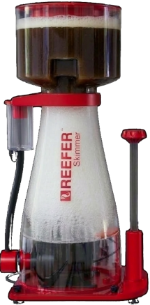 <b>Full cup</b> Foam reduced to a band under the lid</td>
    <td align="center">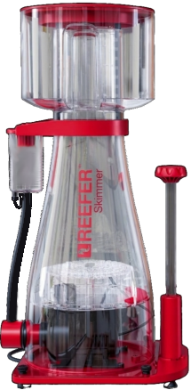 <b>Stopped</b> Empty cup, greyed out, no bubbles</td>
  </tr>
</table>

A disconnected skimmer looks exactly like a stopped one: only the blinking cable
tells them apart. That blink means the ReefRun reports `missing_pump`, so the
pump is configured but the controller no longer sees it. Check the plug before
looking any further.

The full-cup state is reported by the skim sensor in the collection chamber. The
body switches to its own artwork and the foam animation collapses to a thin band
under the lid, whether or not self-leveling is enabled. The blinking warning icon
next to the full-cup switch only appears when `sensor_controlled` is on, since
with the sensor disabled the controller takes no action on a full cup.

### Adding a pump

A port with no pump configured shows an **add** placeholder instead of a pump
body:

Clicking it opens the configuration dialog, where **Detect and add** asks the
controller what is connected and registers it in one step. The detected model is
only a suggestion and is occasionally wrong, so the model list stays editable
afterwards: for a DC Skimmer, pick rsk-300, rsk-600 or rsk-900. The pump name can
be edited in the same dialog.

The placeholder sits on every unconfigured port, so it also shows up on a port
you never intend to use. Users running a single pump can hide it entirely from
the card editor.

### Schedule

The blue curve is the programmed speed over 24 hours. The vertical red line
marks the current time, and the dot on it the speed the schedule is asking for.

When the pump does not follow its schedule — feed mode, full-cup detection,
overskimming protection — the dot moves down to the **real** speed and a red
segment materializes the gap, labelled with the difference:

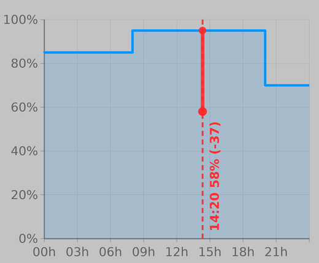

Clicking the chart opens the schedule editor: add or remove points, edit times and speeds, preview a point on the device, then save.

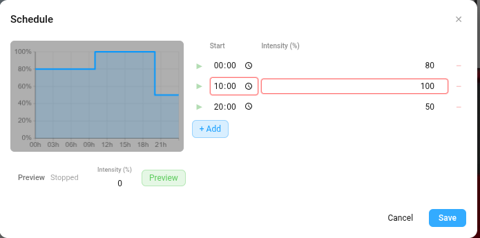

## Messages

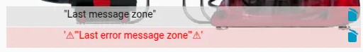

---

This zone displays the latest system messages from the ReefMat. It has two lines:

- The grey line shows the **last message** received.
- The pink line shows the **last alert**, preceded by the ⚠ symbol.

Clicking the  icon clears the corresponding message.

These lines can be hidden via the card editor interface.

---

[← Back to the main page](../../README.md)
