<!--  -->

[![BuyMeCoffee][buymecoffeebadge]][buymecoffee]

> [!NOTE]
> Toda ayuda es bienvenida, no dude en [contactarme](https://github.com/Elwinmage/ha-reef-card/discussions/1).

# Idiomas compatibles :       

<!-- Vous souhaitez aider à la traduction, suivez ce [guide](https://github.com/Elwinmage/ha-reef-card/blob/main/doc/TRANSLATION.md). -->

¿Su idioma aún no está disponible y desea ayudar con la traducción? Siga esta [guía](https://github.com/Elwinmage/ha-reef-card/blob/main/doc/TRANSLATION.md).

# Presentación

La **Reef card** para Home Assistant le ayuda a gestionar su acuario de arrecife.

Combinada con [ha-reefbeat-component](https://github.com/Elwinmage/ha-reefbeat-component), soporta automáticamente sus dispositivos Redsea (ReefBeat).

> [!NOTE]
> Si tiene dispositivos que no son de Redsea y desea que sean compatibles, puede solicitarlo [aquí](https://github.com/Elwinmage/ha-reef-card/discussions/2).

> [!TIP]
> La lista de funcionalidades futuras está disponible [aquí](https://github.com/Elwinmage/ha-reef-card/issues?q=is%3Aissue%20state%3Aopen%20label%3Aenhancement) 
> La lista de errores está disponible [aquí](https://github.com/Elwinmage/ha-reef-card/issues?q=is%3Aissue%20state%3Aopen%20label%3Abug)

# Compatibilidad

✅ Implementado ☑️ En curso ❌ Planificado

<table>
  <th>
    <td ><b>Modelo</b></td>
    <td colspan="2"><b>Estado</b></td>
    <td><b>Issues</b>   📆(Planificado)   🐛(Bugs)</td>
  </th>
  <tr>
    <td><a href="#reefato">ReefATO+</a></td>
    <td>RSATO+</td><td>❌</td>
    <td width="200px"></td>
    <td>
      <a href="https://github.com/Elwinmage/ha-reef-card/issues?q=is:issue state:open label:rsato,all label:enhancement" style="text-decoration:none">📆</a>
      <a href="https://github.com/Elwinmage/ha-reef-card/issues?q=is:issue state:open label:rsato,all label:bug" style="text-decoration:none">🐛</a>
    </td>
  </tr>

  </tr>
    <tr>
    <td><a href="#reefcontrol">ReefControl</a></td>
    <td>RSSENSE  Si tiene uno, puede contactarme <a href="https://github.com/Elwinmage/ha-reefbeat-component/discussions/8">aquí</a> y añadiré su soporte.</td><td>❌</td>
    <td width="200px"></td>
    <td>
      <a href="https://github.com/Elwinmage/ha-reefbeat-component/issues?q=is:issue state:open label:rscontrol,all label:enhancement" style="text-decoration:none">📆</a>
      <a href="https://github.com/Elwinmage/ha-reefbeat-component/issues?q=is:issue state:open label:rscontrol,all label:bug" style="text-decoration:none">🐛</a>
    </td>
      </tr>  
  <tr>
    <td rowspan="2"><a href="#reefdose">ReefDose</a></td>
    <td>RSDOSE2</td>
    <td>✅</td>
    <td width="200px"></td>
      <td rowspan="2">
      <a href="https://github.com/Elwinmage/ha-reef-card/issues?q=is:issue state:open label:rsdose,all label:enhancement" style="text-decoration:none">📆</a>
      <a href="https://github.com/Elwinmage/ha-reef-card/issues?q=is:issue state:open label:rsdose,all label:bug" style="text-decoration:none">🐛</a>
    </td>
  </tr>
  <tr>
    <td>RSDOSE4</td><td>✅</td>
    <td width="200px"></td>
    </tr>
  <tr>
    <td rowspan="2"> <a href="#reefled">ReefLed</a></td>
    <td>G1</td>
    <td>❌</td>
    <td width="200px"></td>
<td rowspan="2">   
    <a href="https://github.com/Elwinmage/ha-reef-card/issues?q=is:issue state:open label:rsled,all label:enhancement" style="text-decoration:none">📆</a>
      <a href="https://github.com/Elwinmage/ha-reef-card/issues?q=is:issue state:open label:rsled,all label:bug" style="text-decoration:none">🐛</a>
</td>
  </tr>
   <td >G2</td>
    <td>❌</td>
    <td width="200px"></td>
  </tr>
  <tr>
    <td rowspan="3"><a href="#reefmat">ReefMat</a></td>
    <td>RSMAT250</td>
    <td>✅</td>
    <td rowspan="3" width="200px"></td>
    <td rowspan="3">
      <a href="https://github.com/Elwinmage/ha-reef-card/issues?q=is:issue state:open label:rsmat,all label:enhancement" style="text-decoration:none">📆</a>
      <a href="https://github.com/Elwinmage/ha-reef-card/issues?q=is:issue state:open label:rsmat,all label:bug" style="text-decoration:none">🐛</a>
    </td>
  </tr>
  <tr>
    <td>RSMAT500</td>
    <td>✅</td>
  </tr>
  <tr>
    <td>RSMAT1200</td>
    <td>✅</td>
  </tr>
  <tr>
    <td><a href="#reefrun">ReefRun</a></td>
    <td>RSRUN</td><td>❌</td>
    <td width="200px"></td>
    <td>
      <a href="https://github.com/Elwinmage/ha-reef-card/issues?q=is:issue state:open label:rsrun,all label:enhancement" style="text-decoration:none">📆</a>
      <a href="https://github.com/Elwinmage/ha-reef-card/issues?q=is:issue state:open label:rsrun,all label:bug" style="text-decoration:none">🐛</a>
    </td>
  </tr>
  <tr>
    <td><a href="#reefwave">ReefWave</a></td>
    <td>RSWAVE</td><td>❌</td>
    <td width="200px"></td>
    <td>
      <a href="https://github.com/Elwinmage/ha-reef-card/issues?q=is:issue state:open label:rswave,all label:enhancement" style="text-decoration:none">📆</a>
      <a href="https://github.com/Elwinmage/ha-reef-card/issues?q=is:issue state:open label:rswave,all label:bug" style="text-decoration:none">🐛</a>
    </td>
  </tr>
</table>

# Índice

- [Instalación](https://github.com/Elwinmage/ha-reef-card/#installation)
- [Configuración](https://github.com/Elwinmage/ha-reef-card/#configuration)
- [ReefATO+](https://github.com/Elwinmage/ha-reef-card/#reefato)
- [ReefControl](https://github.com/Elwinmage/ha-reef-card/#reefcontrol)
- [ReefDose](https://github.com/Elwinmage/ha-reef-card/#reefdose)
- [ReefLED](https://github.com/Elwinmage/ha-reef-card/#reefled)
- [ReefMat](https://github.com/Elwinmage/ha-reef-card/#reefmat)
- [ReefRun](https://github.com/Elwinmage/ha-reef-card/#reefrun)
- [ReefWave](https://github.com/Elwinmage/ha-reef-card/#reefwave)
- [FAQ](https://github.com/Elwinmage/ha-reef-card/#faq)

# Instalación

## Instalación directa

Haga clic aquí para acceder directamente al repositorio en HACS y haga clic en "Descargar": 

## Buscar en HACS

O busque «reef-card» en HACS.

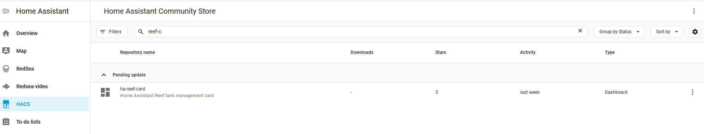

# Configuración

Sin el parámetro `device`, la tarjeta detecta automáticamente todos los dispositivos ReefBeat y le permite elegir el que desea.

Para eliminar la selección de dispositivo y forzar uno específico, defina el parámetro `device` con el nombre de su dispositivo.

<table>
  <tr>
<td>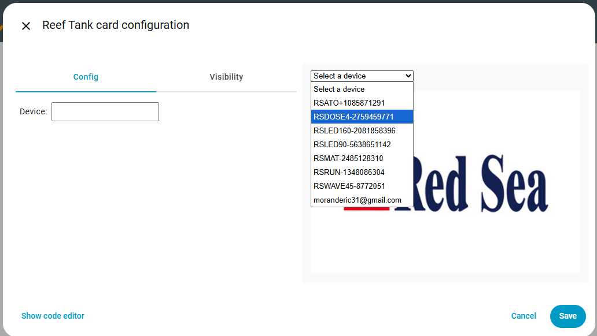</td>
<td>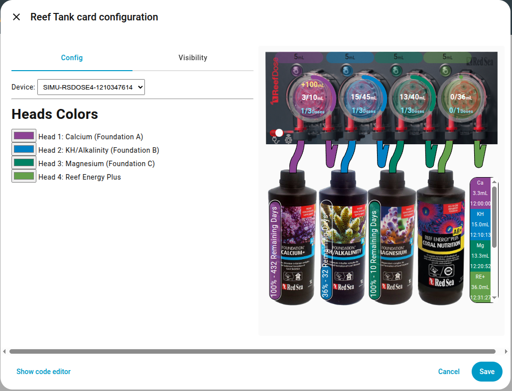</td>
    </tr>
</table>

# ReefATO

Planificado.

¿Desea que sea compatible más rápido? Vote [aquí](https://github.com/Elwinmage/ha-reef-card/discussions/22).

# ReefControl

Planificado.

¿Desea que sea compatible más rápido? Vote [aquí](https://github.com/Elwinmage/ha-reef-card/discussions/22).

# ReefDose

ReefDose con ha-reef-card en acción:

La tarjeta ReefDose está dividida en 6 zonas:

1.  Configuración/Información Wifi
2.  Estados
3.  Dosificación Manual
4.  Configuración y programación de las cabezas
5.  Gestión de suplementos
6.  Cola de dosis futuras

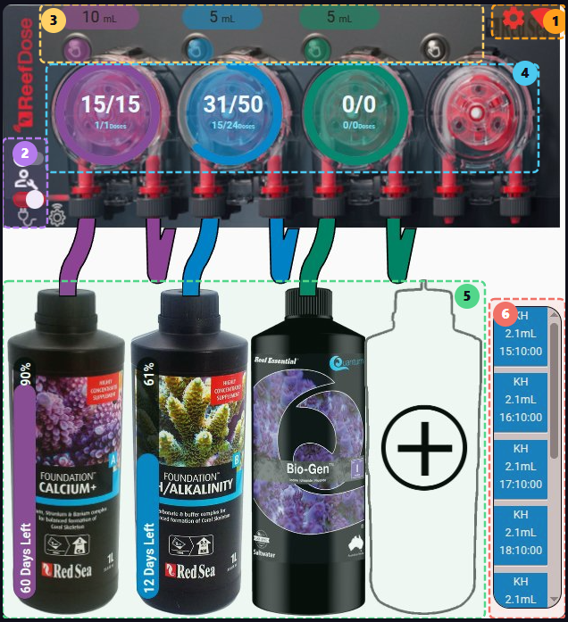

## Configuración/Información Wifi

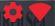

---

Haga clic en el icono  para gestionar la configuración general del ReefDose.

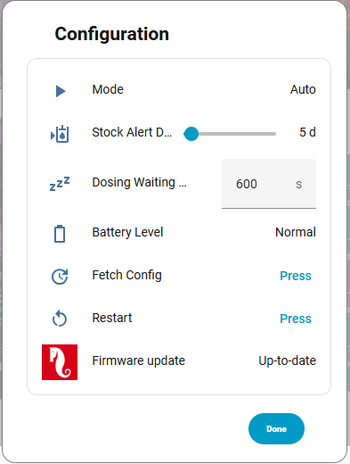

Haga clic en el icono 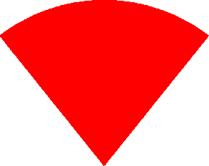 para gestionar los parámetros de red.

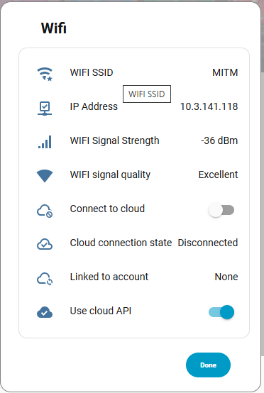

## Estados

 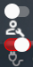

---

El interruptor de mantenimiento 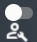 permite cambiar al modo mantenimiento.

 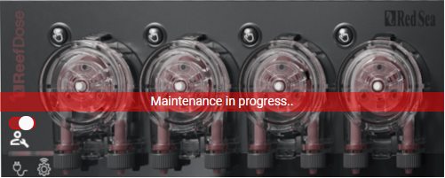

El interruptor on/off 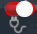 permite alternar entre los estados encendido y apagado del ReefDose.

 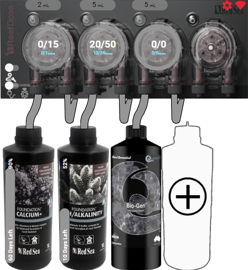

## Dosificación Manual

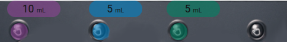

---

El botón  muestra la dosis manual predeterminada para esta cabeza. Un clic abre el cuadro de configuración de esta dosificación.

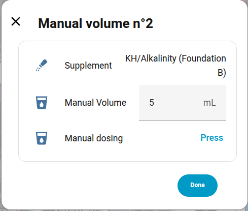

Puede añadir atajos usando el editor de la tarjeta:

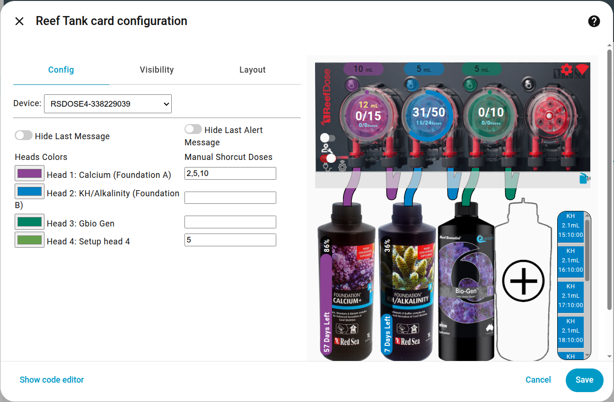

Por ejemplo, la cabeza 1 propone como atajos los valores 2, 5 y 10 mL.

Estos valores aparecerán en la parte superior del cuadro de diálogo. Un clic en estos atajos enviará un comando para dosificar el valor definido.

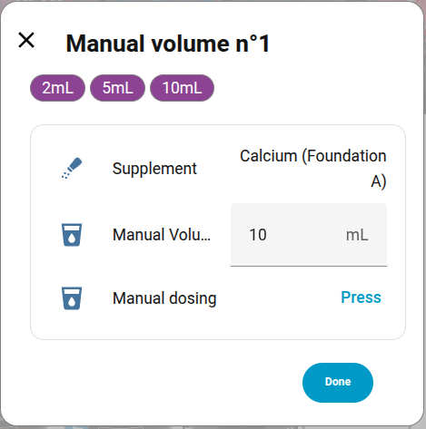

Presionar el botón de dosis manual:  enviará un comando de dosis con el valor predeterminado visible justo encima: 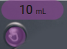, es decir 10 mL en este ejemplo.

## Configuración y programación de las cabezas

 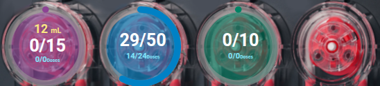

---

Esta zona permite visualizar la programación actual de las cabezas y modificarla.

- El anillo circular coloreado indica el porcentaje de dosis diaria ya distribuida.
- El número amarillo en la parte superior indica el acumulado de dosis manual diaria.
- La parte central indica el volumen distribuido respecto al volumen diario programado total.
- La parte azul inferior indica el número de dosis distribuidas respecto al total de dosis del día (ejemplo: 14/24 para el azul porque es una programación horaria tomada a las 14:15). Los valores para el violeta y el verde indican 0/0 porque esas dosis deben distribuirse a las 8h pero la integración se inició después de las 8h, por lo que no habrá ninguna dosis hoy.
- Un clic largo en una de las 4 cabezas la activará o desactivará.
- Un clic en una cabeza abrirá el cuadro de programación.
  Desde este cuadro puede iniciar un cebado, recalibrar la cabeza, cambiar la dosis diaria y su programación. No olvide guardar la programación antes de salir.

  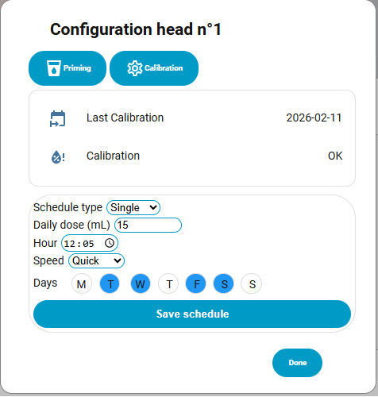

## Gestión de suplementos

 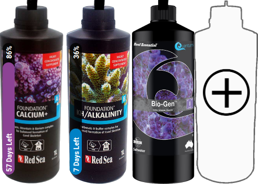

---

Esta zona permite gestionar los suplementos.
Si ya hay un suplemento declarado, un clic sobre él abrirá el cuadro de configuración donde podrá:

- Eliminar el suplemento (icono papelera en la parte superior derecha)
- Indicar el volumen total del contenedor
- Indicar el volumen real del suplemento
- Decidir si desea hacer seguimiento del volumen restante. Un clic en los atajos de la parte superior activará el control y establecerá los valores predeterminados con un contenedor lleno.
- Modificar el nombre de visualización del suplemento.

 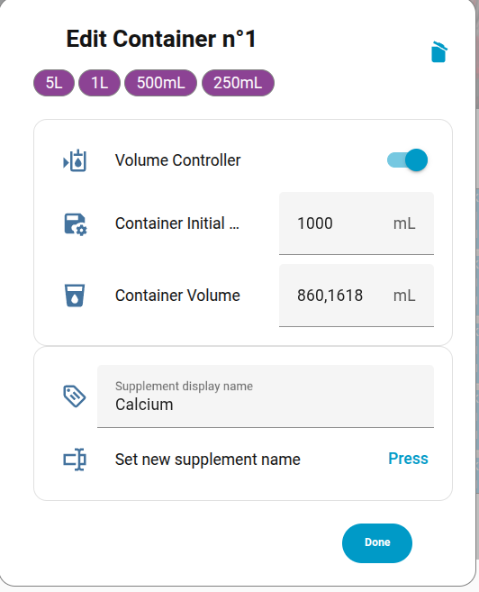

Si no hay ningún suplemento vinculado a una cabeza, puede añadir uno haciendo clic en el contenedor con un '+' (cabeza 4 en nuestro ejemplo).

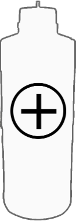

A continuación, siga las instrucciones:

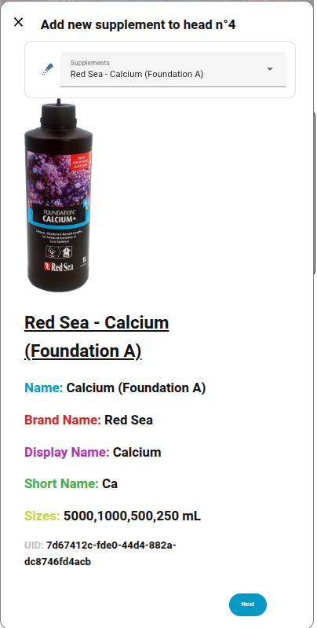

### Suplementos

Aquí está la lista de imágenes de suplementos compatibles, agrupadas por marca. Si el tuyo tiene un ❌, puedes solicitar su incorporación [aquí](https://github.com/Elwinmage/ha-reef-card/discussions/25).

<b>ATI &nbsp; 0/2 🖼️</b>

<table>
<tr><td>❌</td><td colspan='2'>Essential Pro 1</td></tr>
<tr><td>❌</td><td colspan='2'>Essential Pro 2</td></tr>
</table>

<b>Aqua Forest &nbsp; 3/9 🖼️</b>

<table>
<tr><td>✅</td><td>Ca Plus</td><td>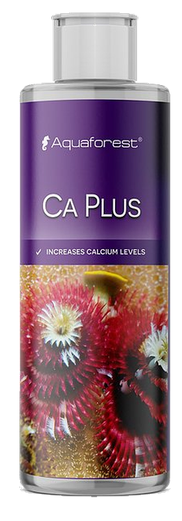</td></tr>
<tr><td>❌</td><td colspan='2'>Calcium </td></tr>
<tr><td>❌</td><td colspan='2'>Component 1+</td></tr>
<tr><td>❌</td><td colspan='2'>Component 2+</td></tr>
<tr><td>❌</td><td colspan='2'>Component 3+</td></tr>
<tr><td>❌</td><td colspan='2'>KH Buffer</td></tr>
<tr><td>✅</td><td>KH Plus</td><td>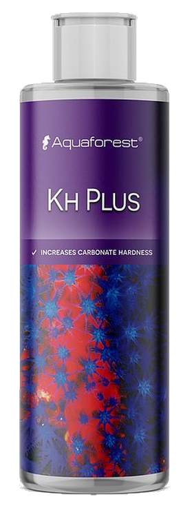</td></tr>
<tr><td>❌</td><td colspan='2'>Magnesium</td></tr>
<tr><td>✅</td><td>Mg Plus</td><td>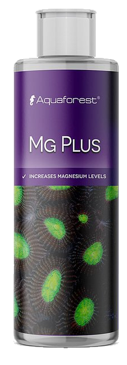</td></tr>
</table>

<b>BRS &nbsp; 0/4 🖼️</b>

<table>
<tr><td>❌</td><td colspan='2'>Liquid Calcium</td></tr>
<tr><td>❌</td><td colspan='2'>Liquid alkalinity</td></tr>
<tr><td>❌</td><td colspan='2'>Magnesium Mix</td></tr>
<tr><td>❌</td><td colspan='2'>Part C</td></tr>
</table>

<b>Brightwell &nbsp; 0/12 🖼️</b>

<table>
<tr><td>❌</td><td colspan='2'>Calcion</td></tr>
<tr><td>❌</td><td colspan='2'>Ferrion</td></tr>
<tr><td>❌</td><td colspan='2'>Hydrate - MG</td></tr>
<tr><td>❌</td><td colspan='2'>KoralAmino</td></tr>
<tr><td>❌</td><td colspan='2'>Koralcolor</td></tr>
<tr><td>❌</td><td colspan='2'>Liquid Reef</td></tr>
<tr><td>❌</td><td colspan='2'>Potassion</td></tr>
<tr><td>❌</td><td colspan='2'>Reef Code A</td></tr>
<tr><td>❌</td><td colspan='2'>Reef Code B</td></tr>
<tr><td>❌</td><td colspan='2'>Replenish</td></tr>
<tr><td>❌</td><td colspan='2'>Restore</td></tr>
<tr><td>❌</td><td colspan='2'>Strontion</td></tr>
</table>

<b>ESV &nbsp; 0/5 🖼️</b>

<table>
<tr><td>❌</td><td colspan='2'>B-Ionic Component 1</td></tr>
<tr><td>❌</td><td colspan='2'>B-Ionic Component 2</td></tr>
<tr><td>❌</td><td colspan='2'>B-Ionic Magnesium</td></tr>
<tr><td>❌</td><td colspan='2'>Transition elements </td></tr>
<tr><td>❌</td><td colspan='2'>Transition elements plus</td></tr>
</table>

<b>Fauna Marine &nbsp; 0/11 🖼️</b>

<table>
<tr><td>❌</td><td colspan='2'>Amin</td></tr>
<tr><td>❌</td><td colspan='2'>Balling light  trace 1</td></tr>
<tr><td>❌</td><td colspan='2'>Balling light  trace 2</td></tr>
<tr><td>❌</td><td colspan='2'>Balling light  trace 3</td></tr>
<tr><td>❌</td><td colspan='2'>Balling light Ca</td></tr>
<tr><td>❌</td><td colspan='2'>Balling light KH</td></tr>
<tr><td>❌</td><td colspan='2'>Balling light Mg</td></tr>
<tr><td>❌</td><td colspan='2'>Blue trace elements</td></tr>
<tr><td>❌</td><td colspan='2'>Green trace elements</td></tr>
<tr><td>❌</td><td colspan='2'>Min S</td></tr>
<tr><td>❌</td><td colspan='2'>Red trace elements</td></tr>
</table>

<b>Quantum &nbsp; 7/7 🖼️</b>

<table>
<tr><td>✅</td><td>Aragonite A</td><td>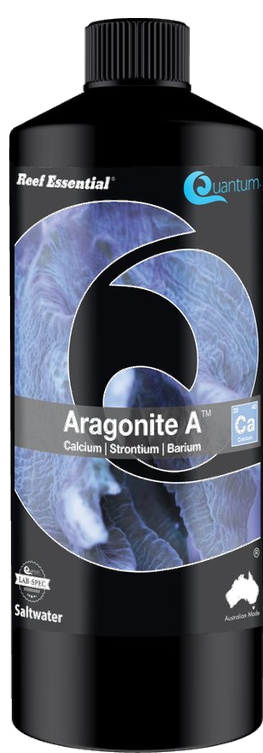</td></tr>
<tr><td>✅</td><td>Aragonite B</td><td>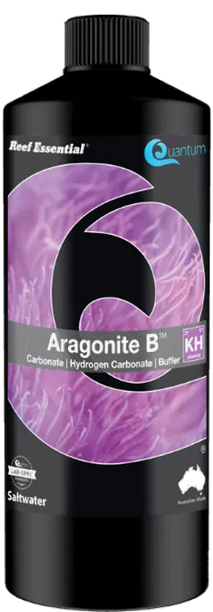</td></tr>
<tr><td>✅</td><td>Aragonite C</td><td>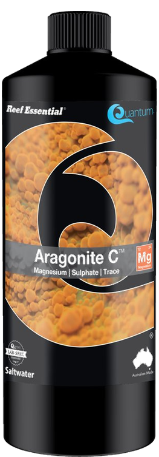</td></tr>
<tr><td>✅</td><td>Bio Kalium</td><td>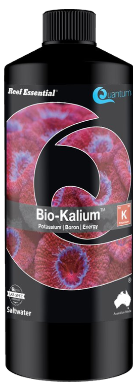</td></tr>
<tr><td>✅</td><td>Bio Metals</td><td>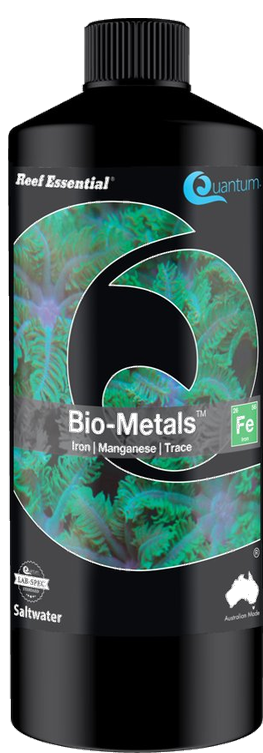</td></tr>
<tr><td>✅</td><td>Bio enhance</td><td>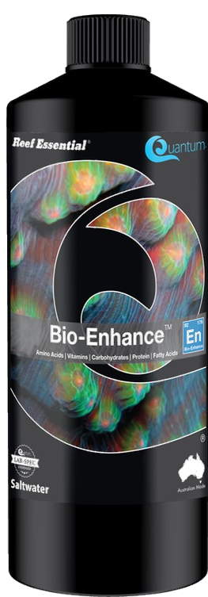</td></tr>
<tr><td>✅</td><td>Gbio Gen</td><td>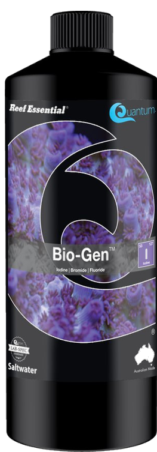</td></tr>
</table>

<b>Red Sea &nbsp; 10/13 🖼️</b>

<table>
<tr><td>✅</td><td>Bio Active (Colors D)</td><td>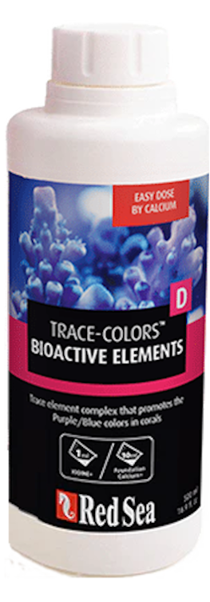</td></tr>
<tr><td>✅</td><td>Calcium (Foundation A)</td><td>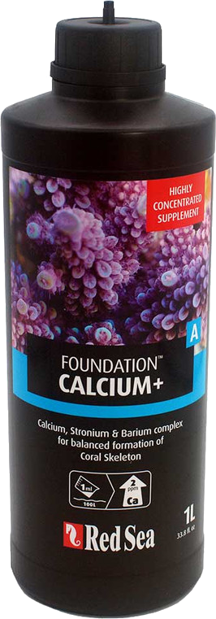</td></tr>
<tr><td>❌</td><td colspan='2'>Calcium (Powder)</td></tr>
<tr><td>✅</td><td>Iodine (Colors A)</td><td>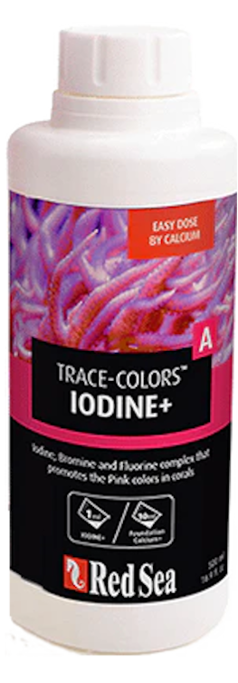</td></tr>
<tr><td>✅</td><td>Iron (Colors C)</td><td>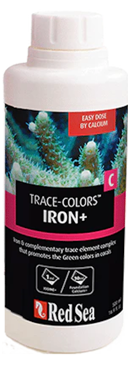</td></tr>
<tr><td>✅</td><td>KH/Alkalinity (Foundation B)</td><td>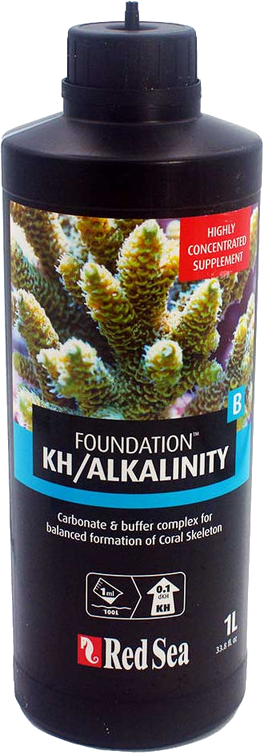</td></tr>
<tr><td>❌</td><td colspan='2'>KH/Alkalinity (Powder)</td></tr>
<tr><td>✅</td><td>Magnesium (Foundation C)</td><td>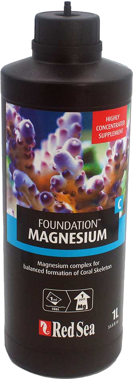</td></tr>
<tr><td>❌</td><td colspan='2'>Magnesium (Powder)</td></tr>
<tr><td>✅</td><td>NO3PO4-X</td><td>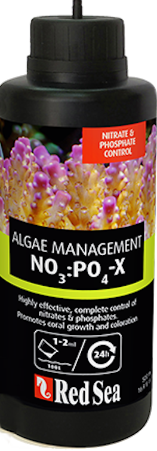</td></tr>
<tr><td>✅</td><td>Potassium (Colors B)</td><td>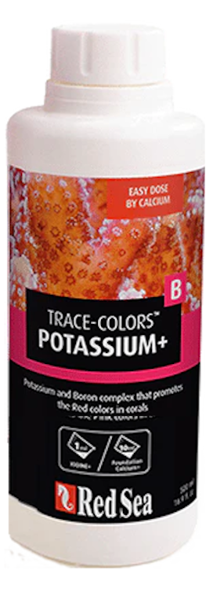</td></tr>
<tr><td>✅</td><td>Reef Energy Plus</td><td>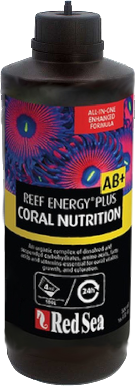</td></tr>
<tr><td>✅</td><td>ReefCare Program</td><td>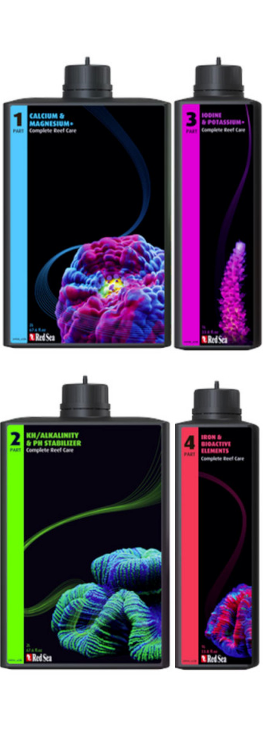</td></tr>
</table>

<b>Seachem &nbsp; 0/9 🖼️</b>

<table>
<tr><td>❌</td><td colspan='2'>Reef Calcium</td></tr>
<tr><td>❌</td><td colspan='2'>Reef Carbonate</td></tr>
<tr><td>❌</td><td colspan='2'>Reef Complete</td></tr>
<tr><td>❌</td><td colspan='2'>Reef Fusion 1</td></tr>
<tr><td>❌</td><td colspan='2'>Reef Fusion 2</td></tr>
<tr><td>❌</td><td colspan='2'>Reef Iodine</td></tr>
<tr><td>❌</td><td colspan='2'>Reef Plus</td></tr>
<tr><td>❌</td><td colspan='2'>Reef Strontium</td></tr>
<tr><td>❌</td><td colspan='2'>Reef Trace</td></tr>
</table>

<b>Triton &nbsp; 0/4 🖼️</b>

<table>
<tr><td>❌</td><td colspan='2'>Core7 elements 1</td></tr>
<tr><td>❌</td><td colspan='2'>Core7 elements 2</td></tr>
<tr><td>❌</td><td colspan='2'>Core7 elements 3A</td></tr>
<tr><td>❌</td><td colspan='2'>Core7 elements 3B</td></tr>
</table>

<b>Tropic Marin &nbsp; 5/14 🖼️</b>

<table>
<tr><td>❌</td><td colspan='2'>A Element</td></tr>
<tr><td>✅</td><td>All-For-Reef</td><td>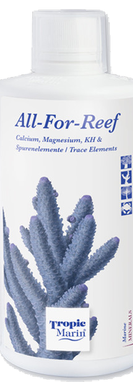</td></tr>
<tr><td>✅</td><td>Amino Organic</td><td>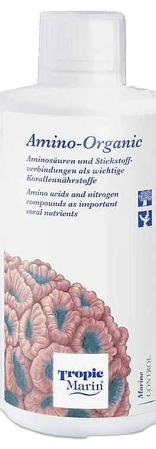</td></tr>
<tr><td>❌</td><td colspan='2'>Balling A</td></tr>
<tr><td>❌</td><td colspan='2'>Balling B</td></tr>
<tr><td>❌</td><td colspan='2'>Balling C</td></tr>
<tr><td>✅</td><td>Bio-Magnesium</td><td>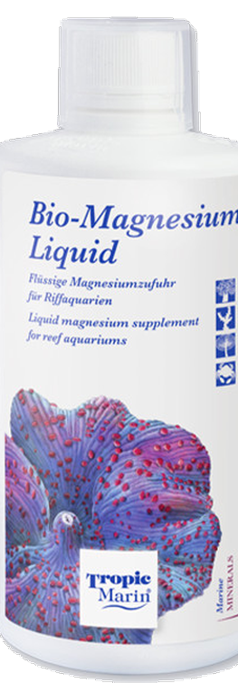</td></tr>
<tr><td>✅</td><td>Carbo Calcium</td><td></td></tr>
<tr><td>❌</td><td colspan='2'>Elimi-NP</td></tr>
<tr><td>❌</td><td colspan='2'>K Element</td></tr>
<tr><td>❌</td><td colspan='2'>Liquid Buffer</td></tr>
<tr><td>❌</td><td colspan='2'>NP-Bacto-Balance</td></tr>
<tr><td>❌</td><td colspan='2'>Plus-NP</td></tr>
<tr><td>✅</td><td>Potassium</td><td>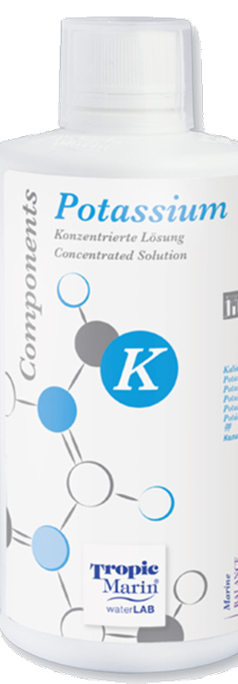</td></tr>
</table>

# ReefLed

Planificado.

¿Desea que sea compatible más rápido? Vote [aquí](https://github.com/Elwinmage/ha-reef-card/discussions/22).

# ReefMat

ReefMat con ha-reef-card en acción:

 

La tarjeta ReefMat está dividida en 7 zonas:

1. Configuración / Información Wifi
2. Estados
3. Información del rollo (longitud total usada, longitud restante, fin de rollo, modo...)
4. Avance manual/automático
5. Sonda
6. Avance programado
7. Gráfico de uso semanal / mensual

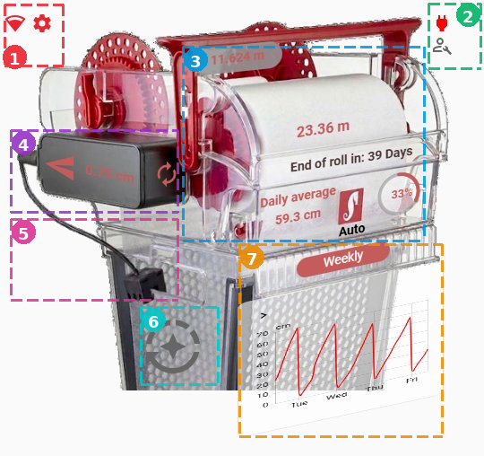

La imagen de fondo cambia según el estado de uso del rollo con 5 imágenes diferentes:

<table>
  <tr>
    <td align="center">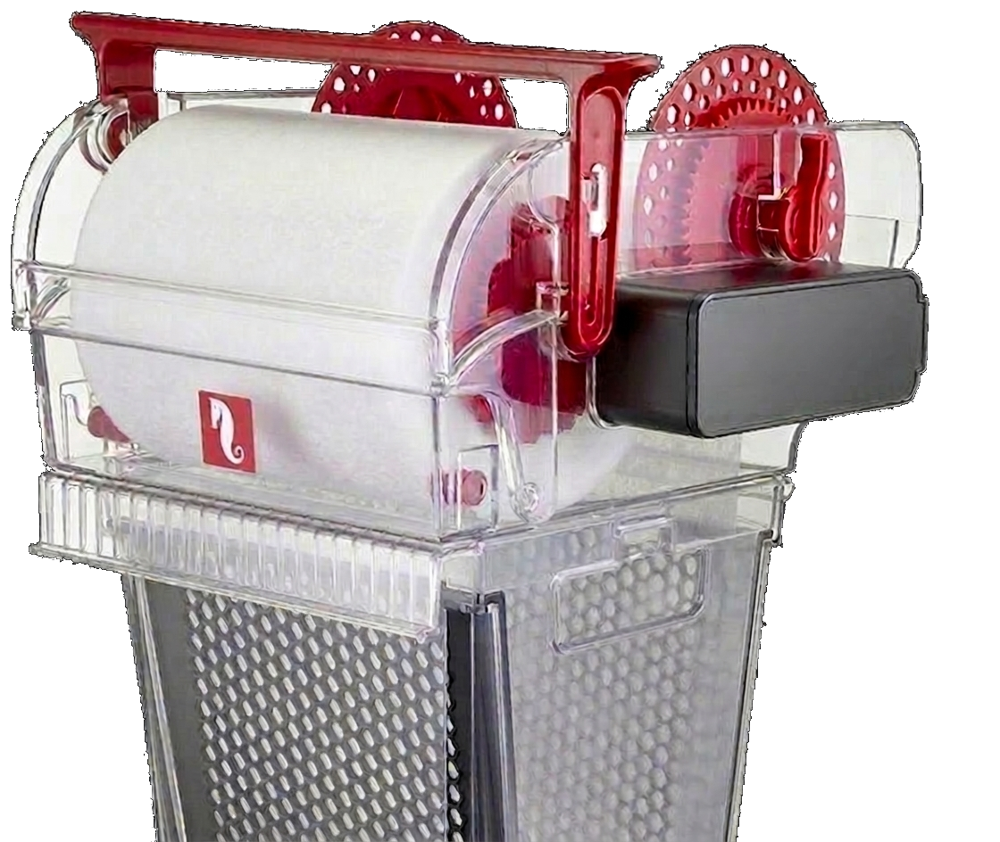 <b>0%</b></td>
    <td align="center">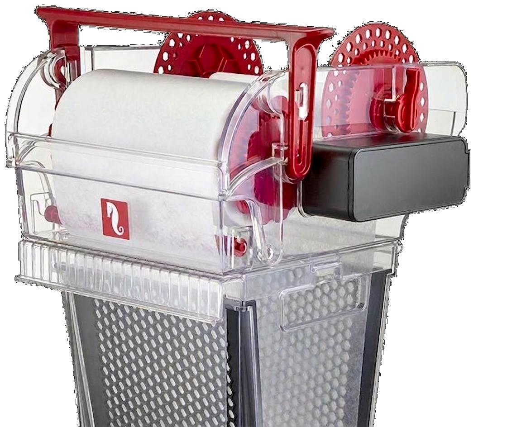 <b>25%</b></td>
    <td align="center">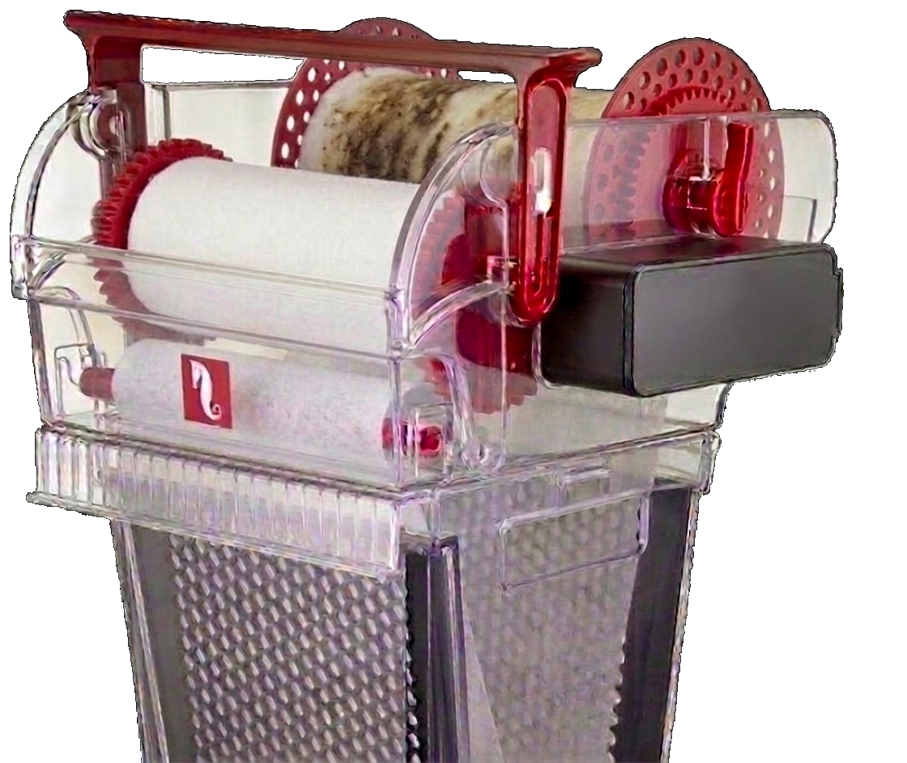 <b>50%</b></td>
  </tr>
  <tr>
    <td align="center">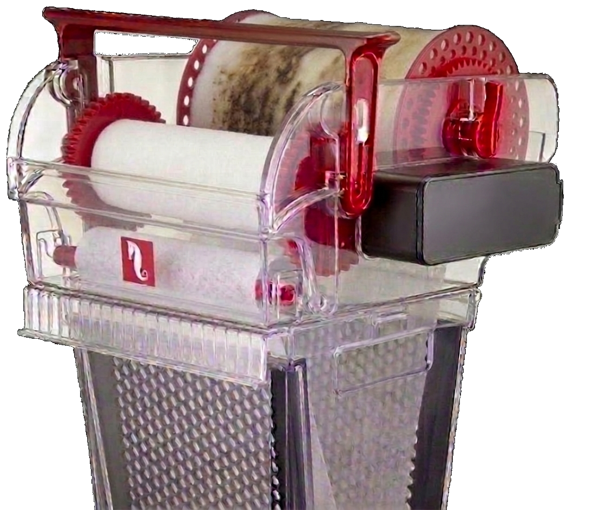 <b>75%</b></td>
    <td align="center">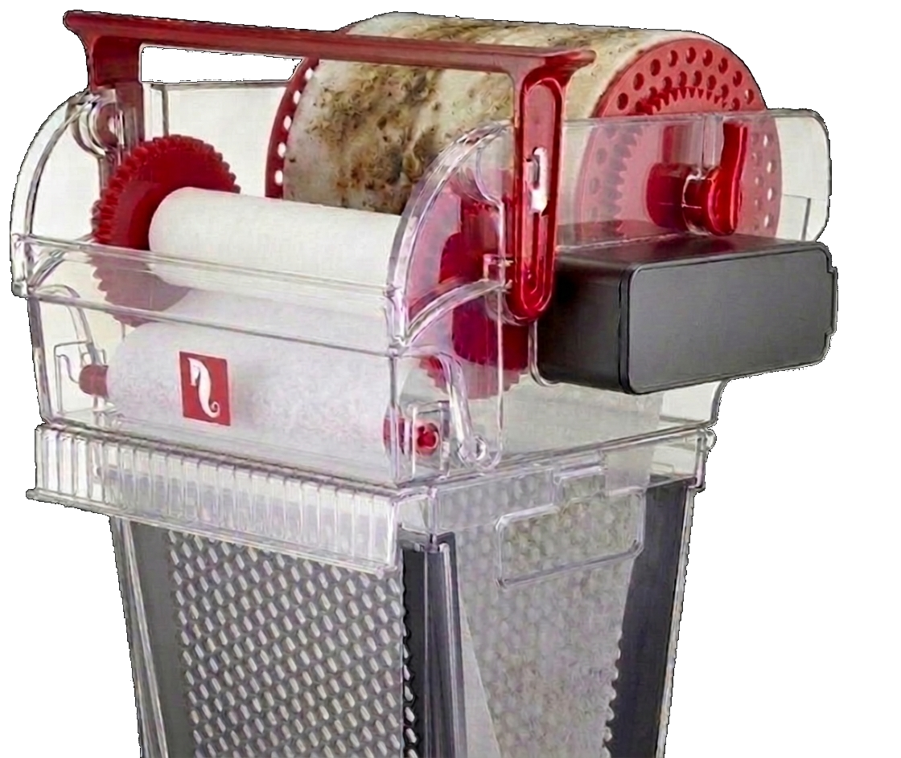 <b>100%</b></td>
    <td></td>
  </tr>
</table>

## Configuración / Información Wifi

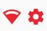

---

Haga clic en el icono  para gestionar la configuración general del ReefMat.

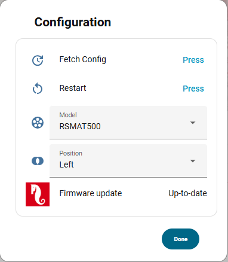

Haga clic en el icono  para gestionar los parámetros de red.

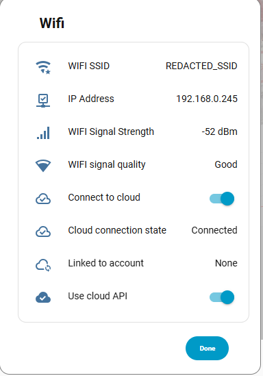

## Estados

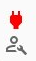

---

El interruptor de mantenimiento  permite cambiar al modo de mantenimiento.

 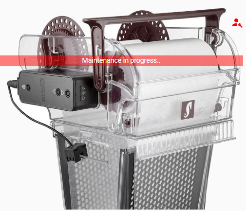

El interruptor de encendido/apagado  permite alternar entre los estados encendido y apagado del ReefMat.

 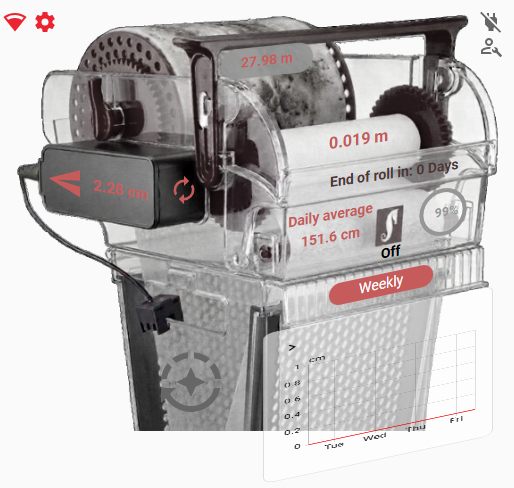

## Información del rollo

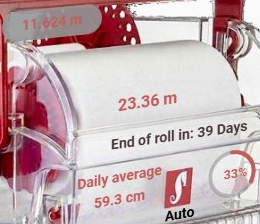

---

Esta zona muestra el estado en tiempo real del rollo filtrante, de arriba a abajo:

- La **longitud total usada** desde el inicio del rollo (arriba, en rojo)
- La **longitud restante** en el centro en rojo. Cuando el rollo está vacío, aparece un  icono parpadeante en su lugar y un cuadro de diálogo propone reemplazar el rollo.

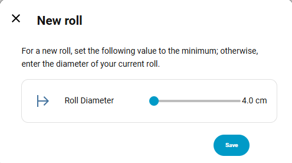

- El **número de días restantes** antes del fin del rollo, estimado según el consumo diario promedio (en negro)
- El **consumo diario promedio** en cm (abajo a la izquierda)
- El **modo de funcionamiento** actual: Auto, Mantenimiento, Apagado… (debajo del logo RedSea)
- El **porcentaje de rollo usado** (arco circular abajo a la derecha)

Si se detecta una anomalía, el logo RedSea se transformará en un  icono parpadeante.
Hacer clic en esta alerta abre el cuadro de diálogo de anomalías:

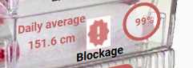
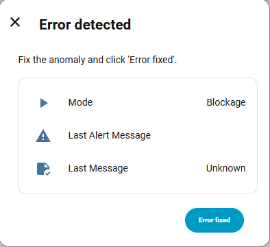

## Avance Manual/Automático

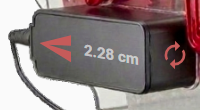
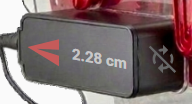
---

Esta zona permite controlar el avance del rollo.

De izquierda a derecha:
- El botón  lanza un **avance manual** del rollo por la longitud indicada en el centro.
- El **valor de avance** mostrado (en cm) es el valor que se enviará al pulsar el botón. Hacer clic en este número abre el cuadro de edición.

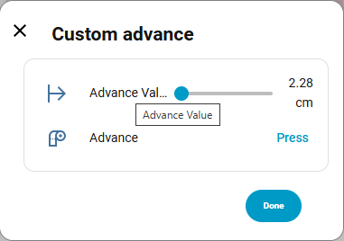

- El **botón de avance automático**   activa o desactiva el avance automático del rollo.

## Sonda

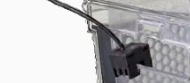

---

Esta zona muestra el estado del sensor de nivel.

Tres estados son posibles:

| Estado | Imagen |
|------|-------|
| Sensor conectado | 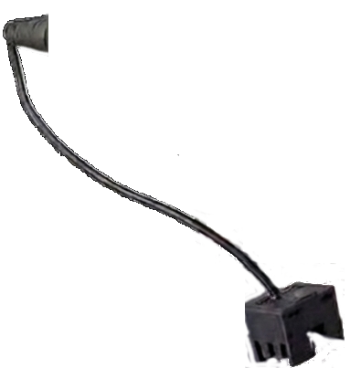 |
| Sensor desconectado | 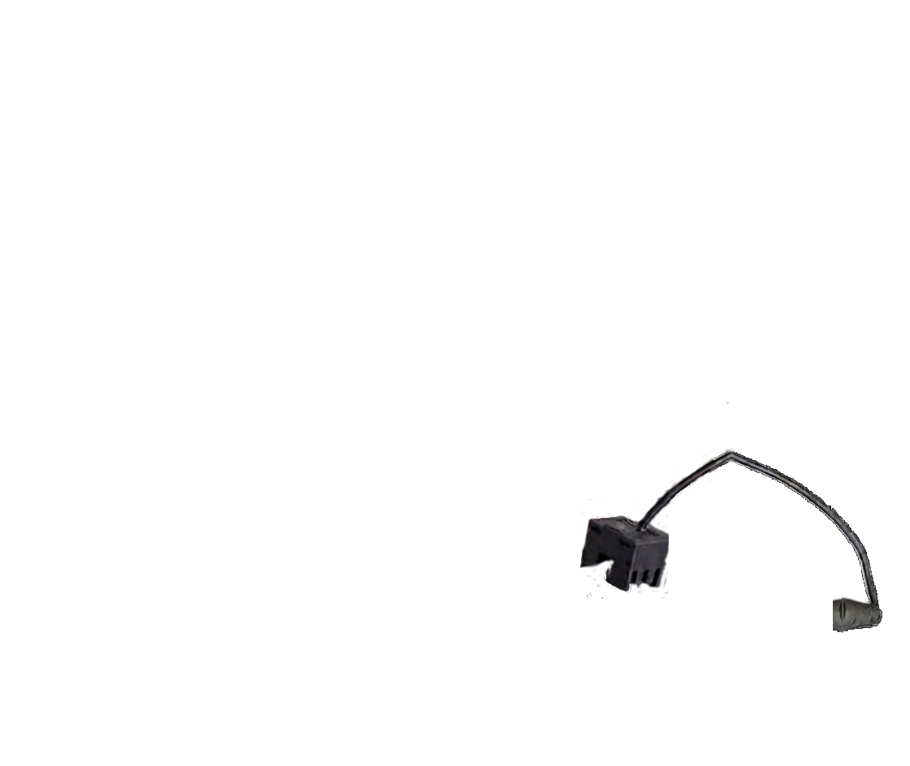 |
| Sensor sucio |  |

## Avance programado

---
Este botón  muestra el estado del avance programado y permite editarlo haciendo clic.

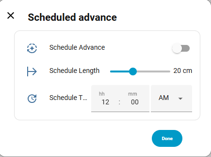

## Gráfico de uso

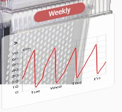 
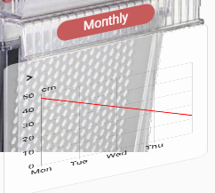

---

Esta zona muestra un gráfico del consumo del rollo a lo largo del tiempo.
Hacer clic en el botón alterna entre los dos modos disponibles:
- El modo **Weekly** muestra el consumo de los últimos 7 días.
- El modo **Monthly** muestra el consumo de los últimos 30 días.

Pulsar en la esquina superior izquierda del gráfico abre la vista detallada en Home Assistant.

## Messages

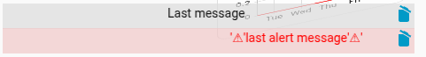 

---

Esta zona muestra los últimos mensajes del sistema del ReefMat. Tiene dos líneas:

- La línea gris muestra el **último mensaje** recibido.
- La línea rosa muestra la **última alerta**, precedida del símbolo ⚠.

Hacer clic en  borra el mensaje correspondiente.

Estas líneas pueden ocultarse mediante la interfaz del editor de la tarjeta.

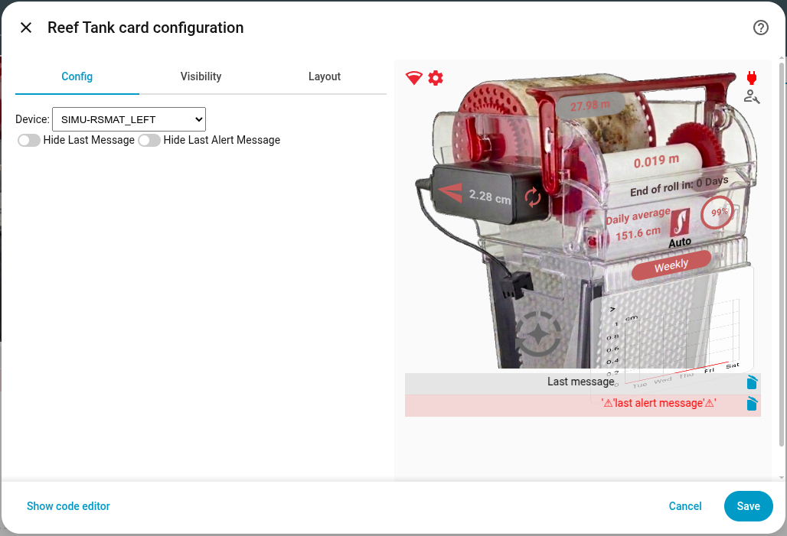

# ReefRun

Planificado.

¿Desea que sea compatible más rápido? Vote [aquí](https://github.com/Elwinmage/ha-reef-card/discussions/22).

# ReefWave

Planificado.

¿Desea que sea compatible más rápido? Vote [aquí](https://github.com/Elwinmage/ha-reef-card/discussions/22).

# FAQ

---

[buymecoffee]: https://paypal.me/Elwinmage
[buymecoffeebadge]: https://img.shields.io/badge/buy%20me%20a%20coffee-donate-yellow.svg?style=flat-square
