[← Volver a la página principal](README.es.md)

# ReefControl

ReefControl y ReefControl-Power con ha-reef-card en acción:

La tarjeta ReefControl dibuja el hub tal como está cableado: las sondas
ReefSense colgando de sus cajas de extensión, los puertos de 12V, la bomba ATO
cuando un puerto controla una, y el [ReefControl-Power](reefcontrol-power.es.md#reefcontrol-power)
emparejado encima.

Se admiten los dos modelos. El Pro acepta hasta 7 sondas (se dibuja una segunda
caja de extensión en cuanto se conecta una quinta sonda) y tiene dos puertos de
12V; el Lite acepta 2 sondas y tiene un solo puerto de 12V.

<table>
  <tr>
    <th align="center">RSCONTROLPRO</th>
    <th align="center">RSCONTROLLITE</th>
  </tr>
  <tr>
    <td align="center">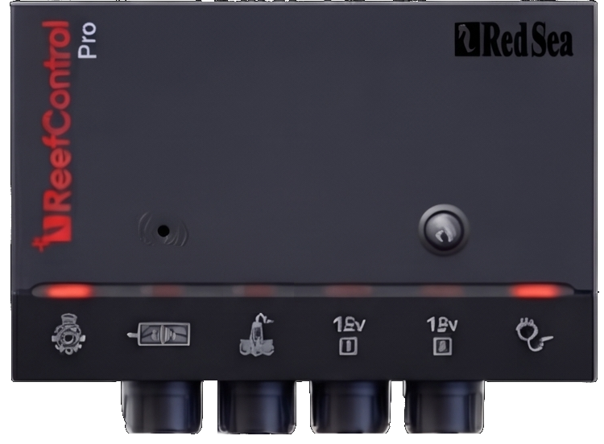</td>
    <td align="center">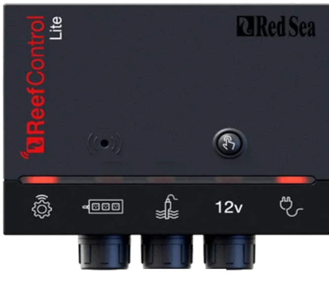</td>
  </tr>
</table>

El resto de esta sección se ilustra con el Pro: todo funciona igual en el Lite.

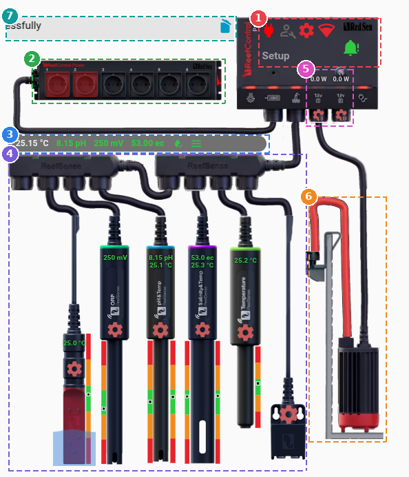

La tarjeta está dividida en 7 zonas:

1. Controlador: alimentación, modo mantenimiento, configuración, Wifi y zumbador
2. Power Center emparejado (ReefControl-Power)
3. Resumen de las lecturas
4. Sondas
5. Puertos de 12V
6. ATO
7. Último mensaje y última alerta

## Controlador

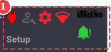

---

El texto de la cara del hub es el **modo de funcionamiento** que informa el
dispositivo (Auto, Setup, Mantenimiento…), traducido al idioma de Home
Assistant.

El interruptor  enciende o apaga el ReefControl.

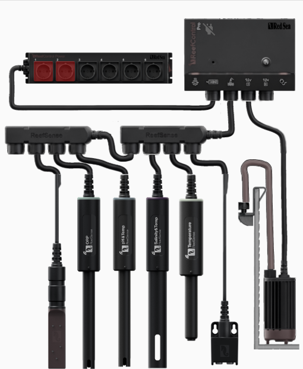

Apagado, el hub no mide ni controla nada: la tarjeta solo conserva su
interruptor y las imágenes del hardware. Las sondas pierden sus valores, barras
y ajustes, y el zumbador, el resumen, los puertos de 12V y los iconos de
configuración se ocultan.

El interruptor  cambia al modo mantenimiento.

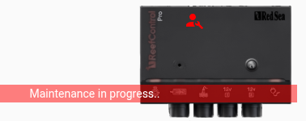

Pulse el icono  para gestionar la configuración general del ReefControl: actualizar los ajustes o los datos consultados, reiniciar el dispositivo, actualizar su firmware, ajustar la [fusión de temperaturas](https://github.com/Elwinmage/ha-reefbeat-component/blob/main/doc/es/reefcontrol.es.md#fusión-de-temperatura-multi-sonda), ver el estado de la red y del cable, y gestionar el emparejamiento con un ReefControl-Power.

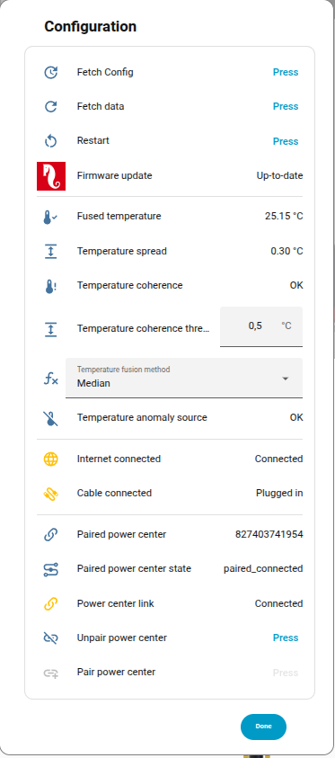

Pulse el icono  para gestionar los ajustes de red.

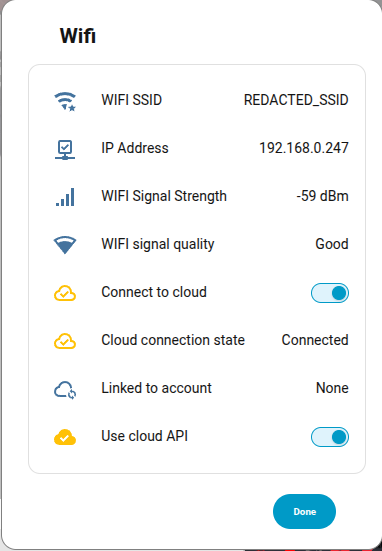

### Zumbador

La campana  está sobre el LED de estado del hub. Es verde mientras el zumbador está en silencio, roja y parpadeante mientras suena, y sigue roja una vez silenciada la alarma.

Un clic abre el diálogo del zumbador: lo que hace ahora y por qué, y luego sus
dos alarmas — la alarma de **peligro** (una lectura fuera de su rango) y la
alarma de **fuga** —, cada una con su interruptor, su frecuencia y su ciclo de
trabajo, el antirrebote del peligro y el detector de fugas.

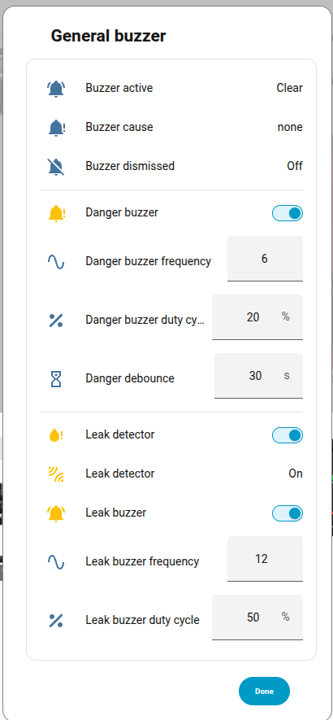

## Power Center emparejado

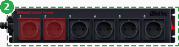

---

Cuando un ReefControl-Power está emparejado con el hub, se dibuja encima, con 6
u 8 tomas según su modelo, unido al hub por su cable. Una toma alimentada se
ilumina con una ligera máscara roja.

Un clic en el Power Center abre su propia tarjeta (ver
[ReefControl-Power](reefcontrol-power.es.md#reefcontrol-power)).

Cuando el Power Center está emparejado pero no responde, parpadea bajo un ligero
tono rojo. El emparejamiento y el desemparejamiento se hacen desde el diálogo de
configuración del controlador.

## Resumen

---

La barra entre el Power Center y las sondas resume todas las lecturas del hub,
de izquierda a derecha:

- Una alerta , solo cuando algo va mal: naranja cuando la peor lectura es aceptable, roja cuando una está en peligro. Las temperaturas integradas también cuentan.
- La **temperatura**: el valor fusionado cuando el hub tiene varias fuentes de temperatura, si no la de la sonda de temperatura, si no la primera temperatura integrada.
- Un termómetro , solo cuando el hub sospecha de una de sus fuentes de temperatura; su información emergente nombra la sonda en cuestión.
- El pH, el ORP y la salinidad, una entrada por sonda.
- Una gota  por sonda de fugas, roja cuando está mojada.
- Olas  por sonda ATO, verdes en un nivel deseado, naranjas por debajo o por encima.

Cada lectura toma el color de su nivel: verde para deseado, naranja para
aceptable, rojo para peligro, blanco cuando la sonda no da una lectura válida.
Un clic en una lectura abre su diálogo de información.

## Sondas

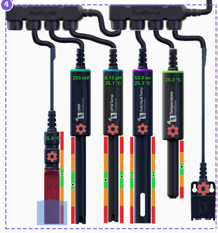

---

Cada sonda del hub cuelga de una caja de extensión, en el orden en que el hub las
lista. Cada una muestra:

- Su **lectura**, y la **temperatura integrada** justo debajo para las sondas de
  pH, salinidad y ATO, coloreadas según su nivel. Un clic en un valor abre su
  diálogo de información.
- Una **barra de situación** por lectura: las bandas roja, naranja y verde son
  los rangos de peligro, aceptable y deseado ajustados en la sonda, y la marca
  negra indica dónde está la lectura. La lectura principal va en la barra
  izquierda, la temperatura en la derecha. Un clic en una barra abre las últimas
  24 horas de la lectura sobre sus bandas.

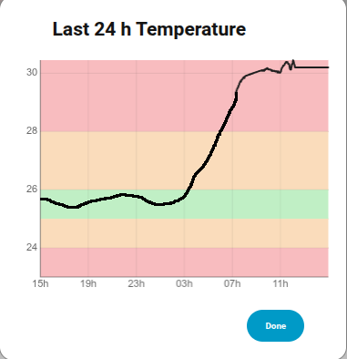

- Una rueda dentada  que abre los ajustes de la sonda.

Una sonda desconectada parpadea bajo un ligero tono rojo y no da ninguna lectura.

### Ajustes de la sonda

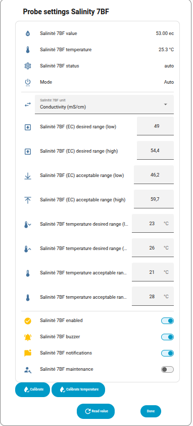

El diálogo reúne todo lo de una sonda: sus lecturas, su estado, sus rangos
deseado y aceptable (y los de su temperatura integrada), la unidad de
visualización de una sonda de salinidad, y sus interruptores — activada,
zumbador, notificaciones y mantenimiento, que mantiene la sonda fuera de la
fusión de temperaturas mientras se limpia o se calibra.

En una sonda de salinidad, los límites mostrados son los de la unidad de visualización elegida: cambie la unidad y el diálogo pasa de inmediato a sus límites.

El botón **Leer valor** pide al hub una lectura nueva en lugar de esperar a la
siguiente consulta; los valores del diálogo se actualizan en su sitio.

Los botones de calibración de abajo solo muestran las calibraciones del tipo de
la sonda, y ninguna mientras está desconectada. Cada calibración abre su propio
diálogo, descrito a continuación por tipo de sonda.

### Tipos de sondas

#### pH

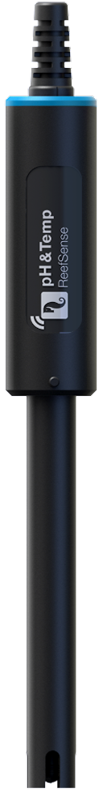 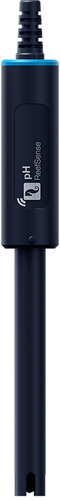

La lectura de pH, y la temperatura cuando la sonda tiene una — una sonda de pH
sin temperatura tiene su propia imagen, con una sola barra.

La calibración se hace en dos puntos, como en la aplicación ReefBeat: primero
pH 7, luego pH 10 para agua salada o pH 4 para agua dulce, cada solución indicada
con la temperatura a la que está referida. Tras cada punto, el hub espera a que
la lectura se estabilice: el diálogo muestra la estabilidad y el tiempo restante,
y el siguiente paso solo se desbloquea cuando el hub ha terminado. Cerrar el
diálogo cancela la calibración.

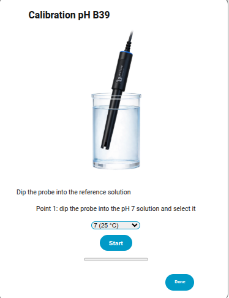

#### Salinidad

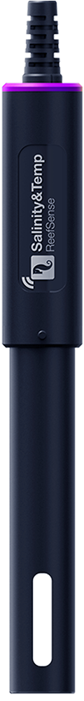

La salinidad, en la unidad elegida en los ajustes de la sonda, y la temperatura.

La calibración se hace en un solo punto: sumerja la sonda en la solución e
introduzca su valor en mS/cm (entre 20 y 99).

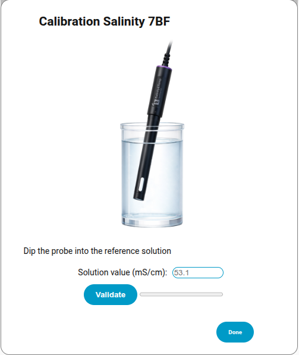

#### ORP

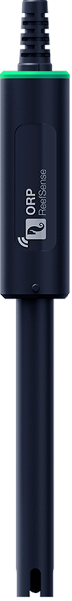

El ORP en mV. Para calibrarlo, sumerja la sonda en la solución de referencia e
introduzca el valor de la solución: la sonda pasa a leer ese valor.

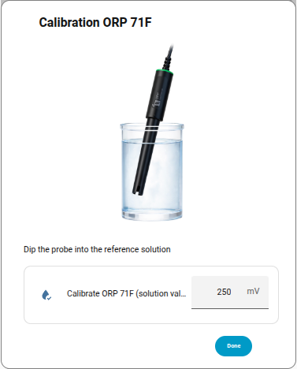

#### Temperatura

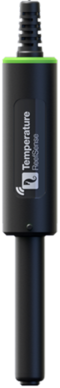

La temperatura, en una sola barra. Para calibrarla, coloque la sonda en agua
cuya temperatura haya medido con un termómetro de referencia, espere a que la
lectura se estabilice e introduzca la temperatura real.

La temperatura integrada de las sondas de pH, salinidad y ATO se calibra del
mismo modo, desde su propio botón **Calibrar la temperatura**.

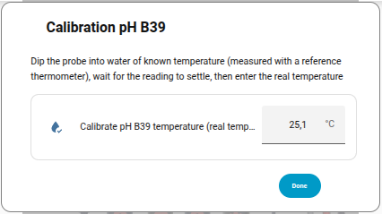

#### ATO

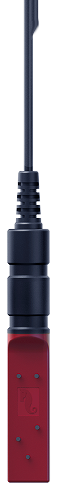

La sonda de nivel se dibuja en el agua del sump, en la marca que indica la
sonda, como en el [ReefATO+](reefato.es.md#acuario). Su temperatura se muestra en el cuerpo
negro, justo debajo del conector.

| Estado          | Significado                                                      |
| --------------- | ---------------------------------------------------------------- |
| Por debajo      | La superficie está por debajo de la sonda: el ATO no da abasto   |
| Nivel deseado 1 | Primera marca de reposición                                      |
| Nivel deseado 2 | Segunda marca de reposición                                      |
| Por encima      | La superficie está por encima de la sonda: el acuario está lleno |

**Por debajo** y **Por encima** hacen parpadear el agua. Una sonda en error no
tiene línea de agua.

#### Fuga

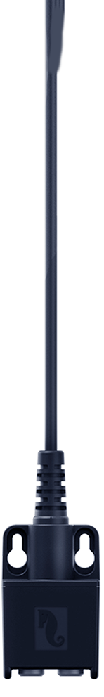

Cuando se detecta agua, un charco se extiende al pie de la sonda, y un icono
parpadeante indica de dónde viene el agua, tal como la sonda lo informa:

<table>
  <tr>
    <th align="center">Fuga de agua del acuario </th>
    <th align="center">Fuga de agua osmotizada </th>
  </tr>
  <tr>
    <td align="center">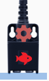</td>
    <td align="center">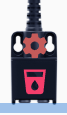</td>
  </tr>
</table>

Una sonda de fugas cuya detección está desactivada aparece en gris: está ahí,
no detecta nada.

> [!NOTE]
> Las sondas se añaden, se reemplazan y se eliminan desde el menú de opciones de
> la integración (ver [ha-reefbeat-component](https://github.com/Elwinmage/ha-reefbeat-component/blob/main/doc/es/reefcontrol.es.md#gestión-de-sondas-añadir--reemplazar--eliminar)):
> la tarjeta se adapta sola.

## Puertos de 12V

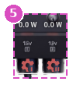

---

Cada puerto de 12V del hub tiene su rueda dentada sobre su conector, y su consumo
encima (un clic abre su diálogo de información). Un puerto alimentado ilumina su
conector. El Pro tiene dos puertos, con la rueda dentada del segundo dibujada de
otra forma; el Lite tiene uno.

Un clic en la rueda dentada  abre los ajustes del puerto: su nombre, interruptor, estado, tipo y consumo, y luego el editor de modo.

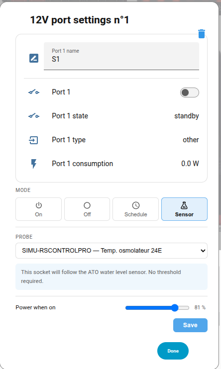

Un puerto se controla como una [toma del Power Center](reefcontrol-power.es.md#toma), con los mismos
cuatro modos — **Encendido**, **Apagado**, **Programar** y **Sensor** — más la
**potencia** que entrega cuando está encendido, en %. No se envía nada al hub
hasta pulsar **Guardar**. Un puerto nunca instalado se instala al guardar, como
hace la aplicación ReefBeat.

El icono de papelera  arriba a la derecha desinstala el puerto, tras una confirmación: vuelve a su estado de fábrica y pierde su nombre, su programa y su regla de sonda.

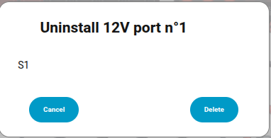

## ATO

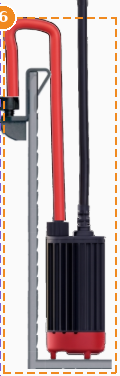

---

Cuando un puerto de 12V controla una bomba ATO — el kit ATO de Red Sea, o
cualquier bomba que siga una sonda ATO —, la bomba se dibuja en su depósito,
unida a su puerto. Mientras el puerto está alimentado, el agua sale por la salida
sobre el sump.

El propio kit ATO de Red Sea (un puerto de tipo `ato`, instalado desde las opciones de
la integración, _Instalar el módulo ATO_) sustituye el engranaje del puerto por un
icono de bomba, que abre los ajustes del módulo: su estado y el volumen de hoy, el
llenado automático, el seguimiento del depósito y el volumen restante, la longitud y
la altura del tubo, el caudal de la bomba, las notificaciones y el registro de
temperatura. **Llenar ahora** inicia un llenado manual, **Detener** lo para y
**Reanudar** borra un fallo. Mientras el módulo indica un fallo (falta la bomba o está
bloqueada, depósito vacío, tiempo de llenado excedido, fuga, fallo del puerto), su
icono se vuelve rojo, la bomba y su cable parpadean y el fallo se añade al resumen
como alarma.

## Mensajes

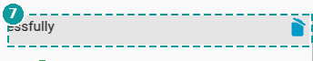

---

Esta zona muestra los últimos mensajes de sistema del ReefControl. Tiene dos líneas:

- La línea gris muestra el **último mensaje** recibido.
- La línea rosa muestra la **última alerta**, precedida del símbolo ⚠.

Al pulsar el icono  se borra el mensaje correspondiente.

Estas líneas se pueden ocultar desde la interfaz del editor de la tarjeta.

## Editor de la tarjeta

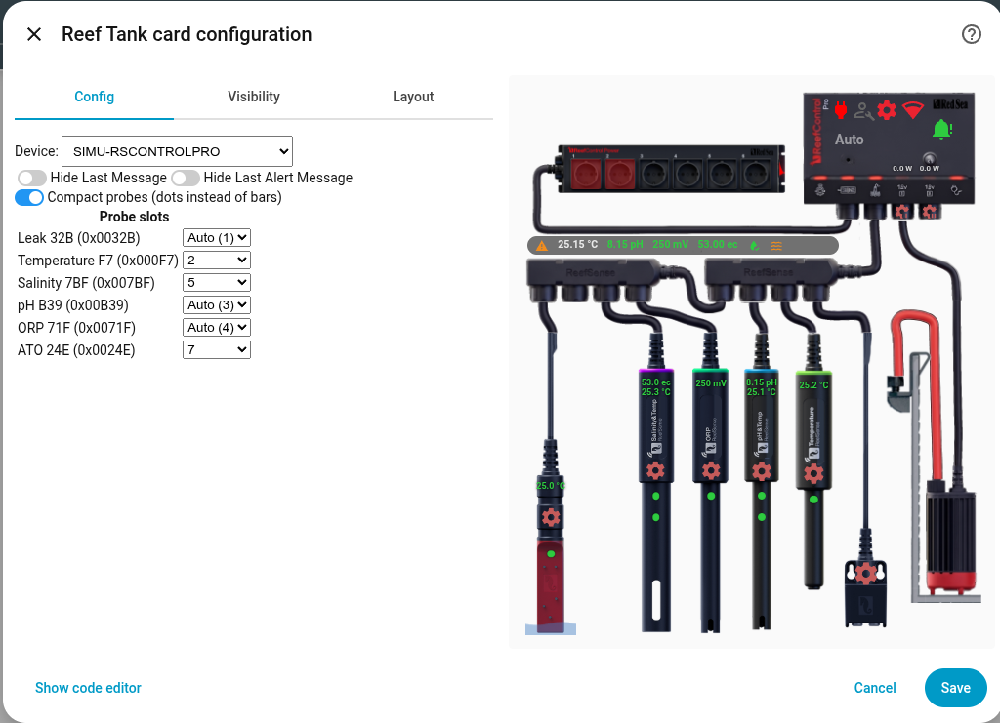

---

Además de las dos líneas de mensajes, el ReefControl tiene dos opciones:

- **Sondas compactas**: cada lectura se muestra como un punto del color de su
  nivel en lugar de una barra de situación. Un signo en el punto indica a qué
  lado del rango deseado está la lectura. Un clic en el punto abre sus últimas
  24 horas, como la barra.
- **Posición de las sondas**: las sondas se colocan en el orden en que el hub las
  lista. Una sonda puede fijarse en una posición de las cajas de extensión, para
  que la tarjeta coincida con la conexión real de las sondas. **Auto** la devuelve
  al orden del hub.

---

[← Volver a la página principal](README.es.md)
