[← Volver a la página principal](README.es.md)

# ReefDose

ReefDose con ha-reef-card en acción:

La tarjeta ReefDose está dividida en 6 zonas:

1.  Configuración/Información Wifi
2.  Estados
3.  Dosificación Manual
4.  Configuración y programación de las cabezas
5.  Gestión de suplementos
6.  Cola de dosis futuras

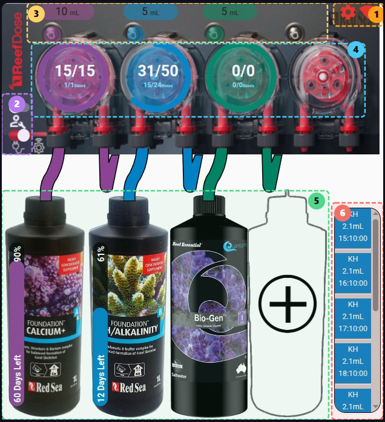

## Configuración/Información Wifi

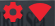

---

Haga clic en el icono  para gestionar la configuración general del ReefDose.

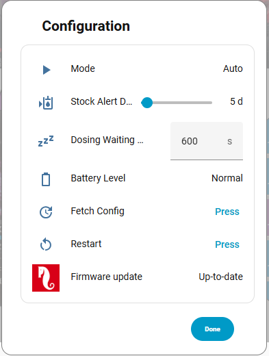

Haga clic en el icono  para gestionar los parámetros de red.

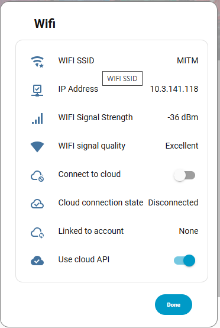

## Estados

 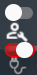

---

El interruptor de mantenimiento 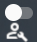 permite cambiar al modo mantenimiento.

 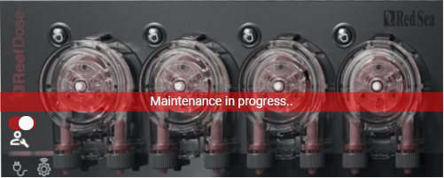

El interruptor on/off 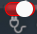 permite alternar entre los estados encendido y apagado del ReefDose.

 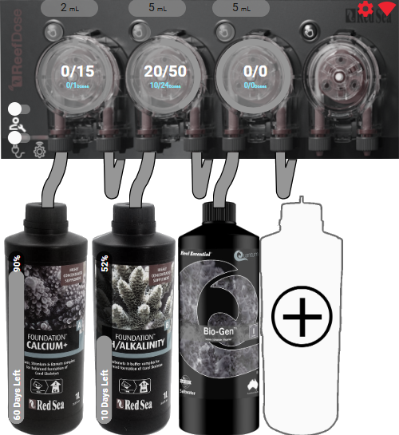

## Dosificación Manual

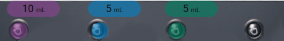

---

El botón  muestra la dosis manual predeterminada para esta cabeza. Un clic abre el cuadro de configuración de esta dosificación.

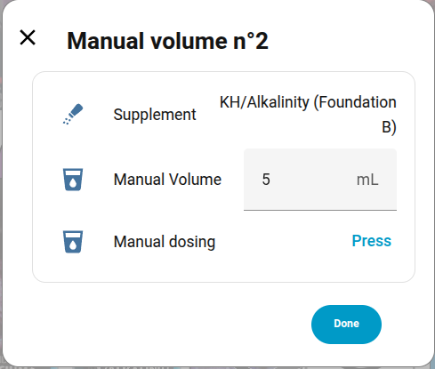

Puede añadir atajos usando el editor de la tarjeta:

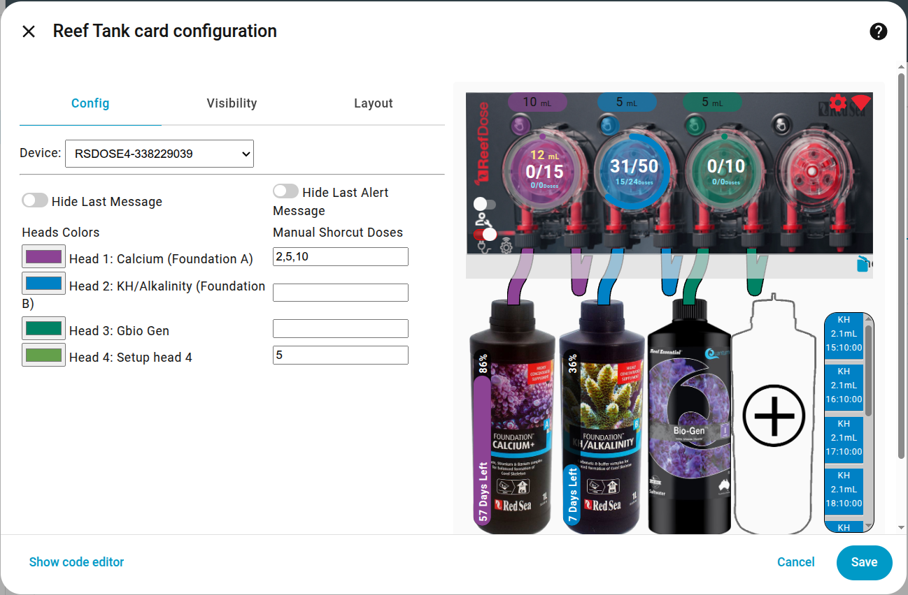

Por ejemplo, la cabeza 1 propone como atajos los valores 2, 5 y 10 mL.

Estos valores aparecerán en la parte superior del cuadro de diálogo. Un clic en estos atajos enviará un comando para dosificar el valor definido.

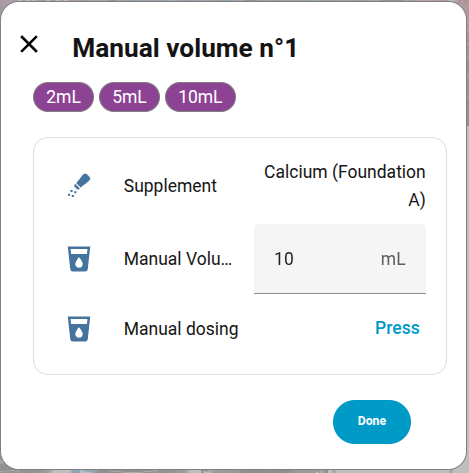

Presionar el botón de dosis manual:  enviará un comando de dosis con el valor predeterminado visible justo encima: 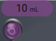, es decir 10 mL en este ejemplo.

## Configuración y programación de las cabezas

 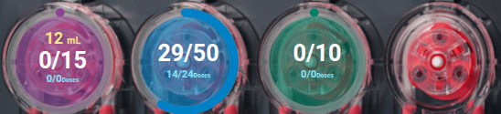

---

Esta zona permite visualizar la programación actual de las cabezas y modificarla.

- El anillo circular coloreado indica el porcentaje de dosis diaria ya distribuida.
- El número amarillo en la parte superior indica el acumulado de dosis manual diaria.
- La parte central indica el volumen distribuido respecto al volumen diario programado total.
- La parte azul inferior indica el número de dosis distribuidas respecto al total de dosis del día (ejemplo: 14/24 para el azul porque es una programación horaria tomada a las 14:15). Los valores para el violeta y el verde indican 0/0 porque esas dosis deben distribuirse a las 8h pero la integración se inició después de las 8h, por lo que no habrá ninguna dosis hoy.
- Un clic largo en una de las 4 cabezas la activará o desactivará.
- Un clic en una cabeza abrirá el cuadro de programación.
  Desde este cuadro puede iniciar un cebado, recalibrar la cabeza, cambiar la dosis diaria y su programación. No olvide guardar la programación antes de salir.

  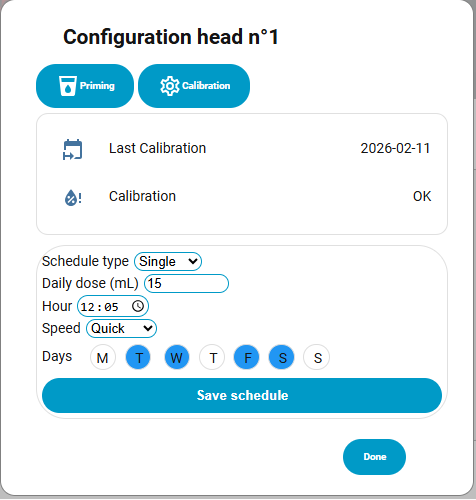

## Gestión de suplementos

 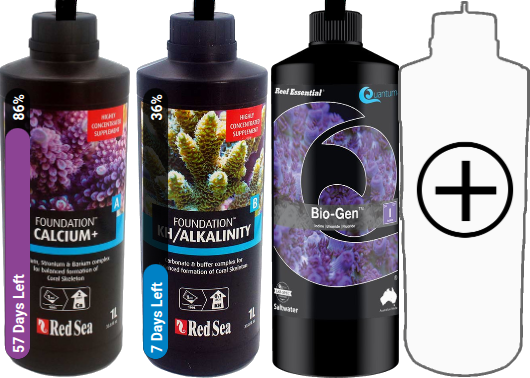

---

Esta zona permite gestionar los suplementos.
Si ya hay un suplemento declarado, un clic sobre él abrirá el cuadro de configuración donde podrá:

- Eliminar el suplemento (icono papelera en la parte superior derecha)
- Indicar el volumen total del contenedor
- Indicar el volumen real del suplemento
- Decidir si desea hacer seguimiento del volumen restante. Un clic en los atajos de la parte superior activará el control y establecerá los valores predeterminados con un contenedor lleno.
- Modificar el nombre de visualización del suplemento.

 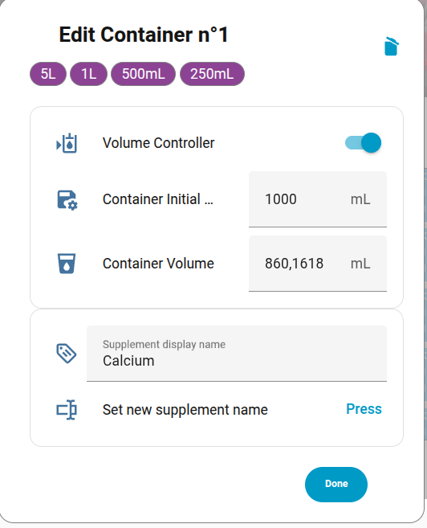

Si no hay ningún suplemento vinculado a una cabeza, puede añadir uno haciendo clic en el contenedor con un '+' (cabeza 4 en nuestro ejemplo).

A continuación, siga las instrucciones:

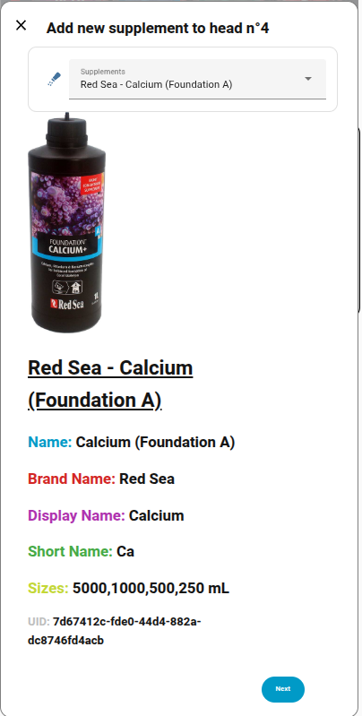

### Suplementos

Aquí está la lista de imágenes de suplementos compatibles, agrupadas por marca. Si el tuyo tiene un ❌, puedes solicitar su incorporación [aquí](https://github.com/Elwinmage/ha-reef-card/discussions/25).

<b>ATI &nbsp; 2/2 🖼️</b>

<table>
<tr><td>✅</td><td>Essential Pro 1</td><td>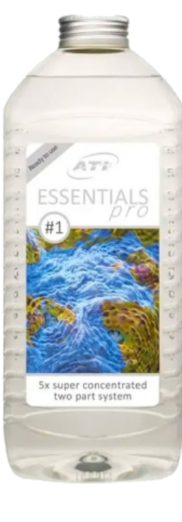</td></tr>
<tr><td>✅</td><td>Essential Pro 2</td><td>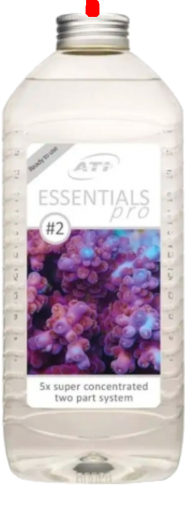</td></tr>
</table>

<b>Aqua Forest &nbsp; 3/9 🖼️</b>

<table>
<tr><td>✅</td><td>Ca Plus</td><td>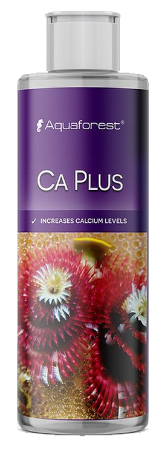</td></tr>
<tr><td>❌</td><td colspan='2'>Calcium </td></tr>
<tr><td>❌</td><td colspan='2'>Component 1+</td></tr>
<tr><td>❌</td><td colspan='2'>Component 2+</td></tr>
<tr><td>❌</td><td colspan='2'>Component 3+</td></tr>
<tr><td>❌</td><td colspan='2'>KH Buffer</td></tr>
<tr><td>✅</td><td>KH Plus</td><td>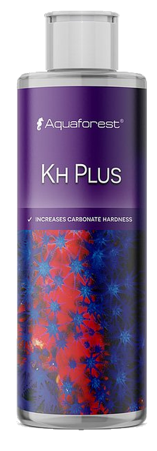</td></tr>
<tr><td>❌</td><td colspan='2'>Magnesium</td></tr>
<tr><td>✅</td><td>Mg Plus</td><td>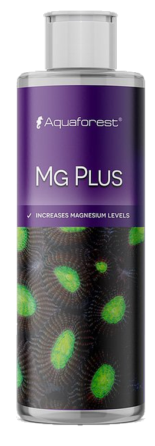</td></tr>
</table>

<b>BRS &nbsp; 0/4 🖼️</b>

<table>
<tr><td>❌</td><td colspan='2'>Liquid Calcium</td></tr>
<tr><td>❌</td><td colspan='2'>Liquid alkalinity</td></tr>
<tr><td>❌</td><td colspan='2'>Magnesium Mix</td></tr>
<tr><td>❌</td><td colspan='2'>Part C</td></tr>
</table>

<b>Brightwell &nbsp; 0/12 🖼️</b>

<table>
<tr><td>❌</td><td colspan='2'>Calcion</td></tr>
<tr><td>❌</td><td colspan='2'>Ferrion</td></tr>
<tr><td>❌</td><td colspan='2'>Hydrate - MG</td></tr>
<tr><td>❌</td><td colspan='2'>KoralAmino</td></tr>
<tr><td>❌</td><td colspan='2'>Koralcolor</td></tr>
<tr><td>❌</td><td colspan='2'>Liquid Reef</td></tr>
<tr><td>❌</td><td colspan='2'>Potassion</td></tr>
<tr><td>❌</td><td colspan='2'>Reef Code A</td></tr>
<tr><td>❌</td><td colspan='2'>Reef Code B</td></tr>
<tr><td>❌</td><td colspan='2'>Replenish</td></tr>
<tr><td>❌</td><td colspan='2'>Restore</td></tr>
<tr><td>❌</td><td colspan='2'>Strontion</td></tr>
</table>

<b>ESV &nbsp; 0/5 🖼️</b>

<table>
<tr><td>❌</td><td colspan='2'>B-Ionic Component 1</td></tr>
<tr><td>❌</td><td colspan='2'>B-Ionic Component 2</td></tr>
<tr><td>❌</td><td colspan='2'>B-Ionic Magnesium</td></tr>
<tr><td>❌</td><td colspan='2'>Transition elements </td></tr>
<tr><td>❌</td><td colspan='2'>Transition elements plus</td></tr>
</table>

<b>Fauna Marine &nbsp; 0/11 🖼️</b>

<table>
<tr><td>❌</td><td colspan='2'>Amin</td></tr>
<tr><td>❌</td><td colspan='2'>Balling light  trace 1</td></tr>
<tr><td>❌</td><td colspan='2'>Balling light  trace 2</td></tr>
<tr><td>❌</td><td colspan='2'>Balling light  trace 3</td></tr>
<tr><td>❌</td><td colspan='2'>Balling light Ca</td></tr>
<tr><td>❌</td><td colspan='2'>Balling light KH</td></tr>
<tr><td>❌</td><td colspan='2'>Balling light Mg</td></tr>
<tr><td>❌</td><td colspan='2'>Blue trace elements</td></tr>
<tr><td>❌</td><td colspan='2'>Green trace elements</td></tr>
<tr><td>❌</td><td colspan='2'>Min S</td></tr>
<tr><td>❌</td><td colspan='2'>Red trace elements</td></tr>
</table>

<b>Quantum &nbsp; 7/7 🖼️</b>

<table>
<tr><td>✅</td><td>Aragonite A</td><td>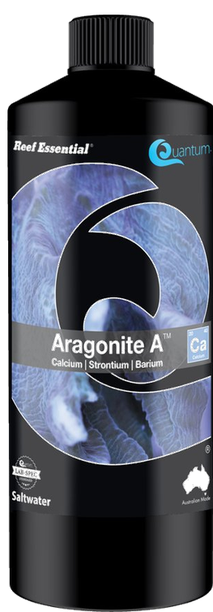</td></tr>
<tr><td>✅</td><td>Aragonite B</td><td>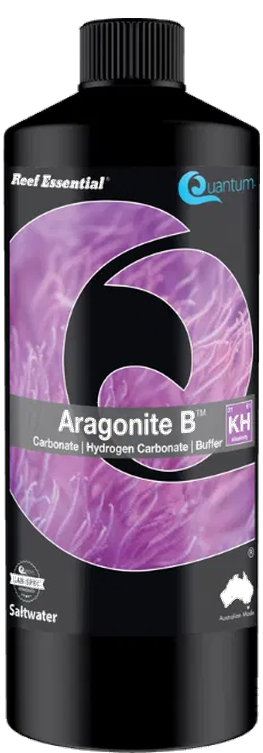</td></tr>
<tr><td>✅</td><td>Aragonite C</td><td>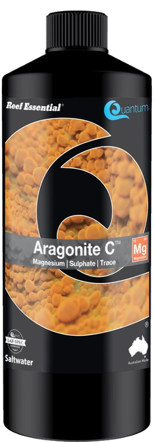</td></tr>
<tr><td>✅</td><td>Bio Kalium</td><td>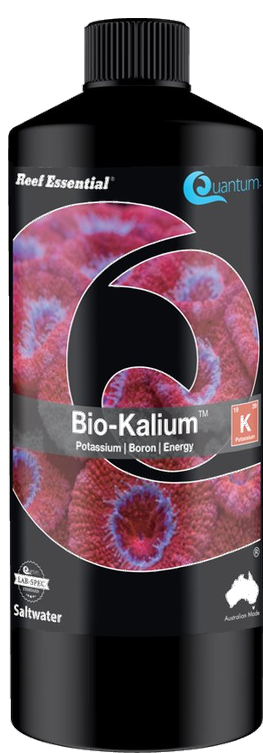</td></tr>
<tr><td>✅</td><td>Bio Metals</td><td>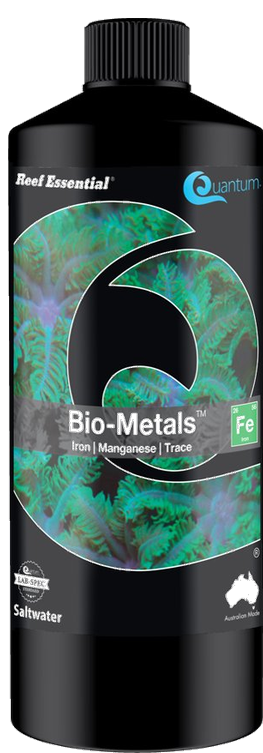</td></tr>
<tr><td>✅</td><td>Bio enhance</td><td>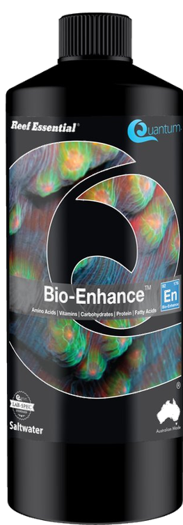</td></tr>
<tr><td>✅</td><td>Gbio Gen</td><td>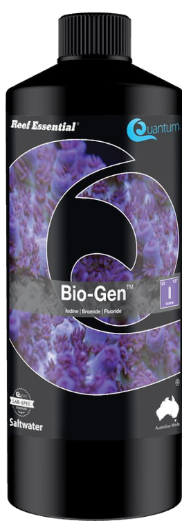</td></tr>
</table>

<b>Red Sea &nbsp; 10/13 🖼️</b>

<table>
<tr><td>✅</td><td>Bio Active (Colors D)</td><td>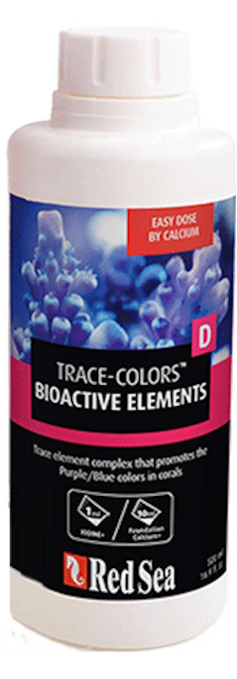</td></tr>
<tr><td>✅</td><td>Calcium (Foundation A)</td><td>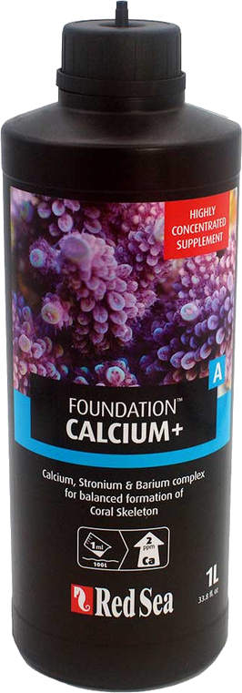</td></tr>
<tr><td>❌</td><td colspan='2'>Calcium (Powder)</td></tr>
<tr><td>✅</td><td>Iodine (Colors A)</td><td>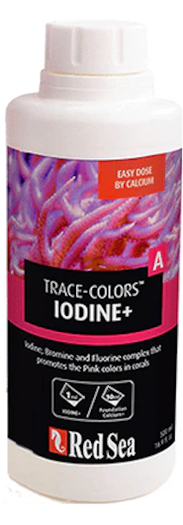</td></tr>
<tr><td>✅</td><td>Iron (Colors C)</td><td>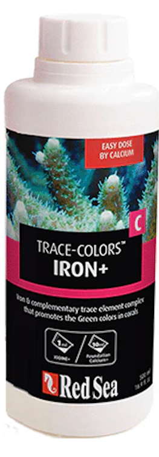</td></tr>
<tr><td>✅</td><td>KH/Alkalinity (Foundation B)</td><td>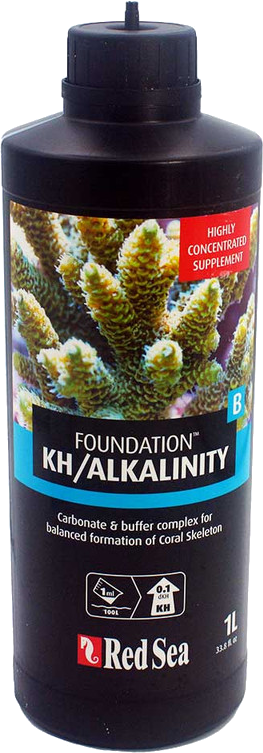</td></tr>
<tr><td>❌</td><td colspan='2'>KH/Alkalinity (Powder)</td></tr>
<tr><td>✅</td><td>Magnesium (Foundation C)</td><td>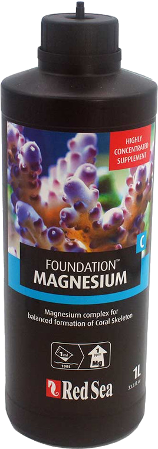</td></tr>
<tr><td>❌</td><td colspan='2'>Magnesium (Powder)</td></tr>
<tr><td>✅</td><td>NO3PO4-X</td><td>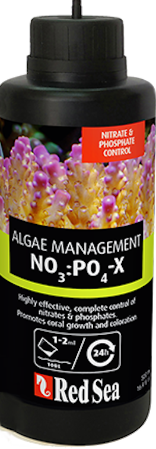</td></tr>
<tr><td>✅</td><td>Potassium (Colors B)</td><td>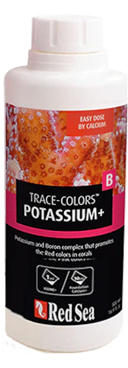</td></tr>
<tr><td>✅</td><td>Reef Energy Plus</td><td>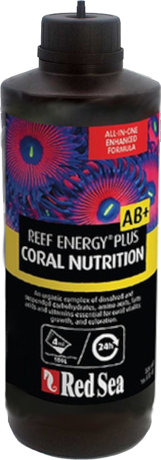</td></tr>
<tr><td>✅</td><td>ReefCare Program</td><td>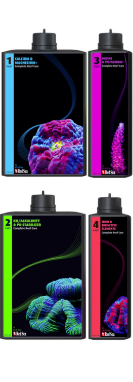</td></tr>
</table>

<b>Seachem &nbsp; 0/9 🖼️</b>

<table>
<tr><td>❌</td><td colspan='2'>Reef Calcium</td></tr>
<tr><td>❌</td><td colspan='2'>Reef Carbonate</td></tr>
<tr><td>❌</td><td colspan='2'>Reef Complete</td></tr>
<tr><td>❌</td><td colspan='2'>Reef Fusion 1</td></tr>
<tr><td>❌</td><td colspan='2'>Reef Fusion 2</td></tr>
<tr><td>❌</td><td colspan='2'>Reef Iodine</td></tr>
<tr><td>❌</td><td colspan='2'>Reef Plus</td></tr>
<tr><td>❌</td><td colspan='2'>Reef Strontium</td></tr>
<tr><td>❌</td><td colspan='2'>Reef Trace</td></tr>
</table>

<b>Triton &nbsp; 0/4 🖼️</b>

<table>
<tr><td>❌</td><td colspan='2'>Core7 elements 1</td></tr>
<tr><td>❌</td><td colspan='2'>Core7 elements 2</td></tr>
<tr><td>❌</td><td colspan='2'>Core7 elements 3A</td></tr>
<tr><td>❌</td><td colspan='2'>Core7 elements 3B</td></tr>
</table>

<b>Tropic Marin &nbsp; 6/14 🖼️</b>

<table>
<tr><td>❌</td><td colspan='2'>A Element</td></tr>
<tr><td>✅</td><td>All-For-Reef</td><td>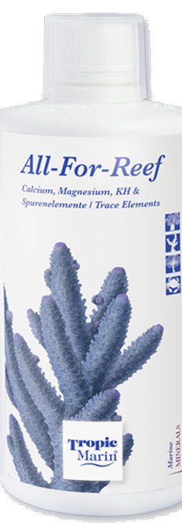</td></tr>
<tr><td>✅</td><td>Amino Organic</td><td>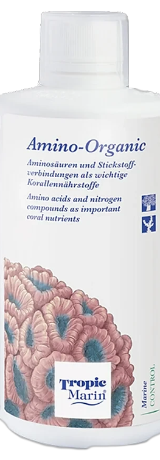</td></tr>
<tr><td>❌</td><td colspan='2'>Balling A</td></tr>
<tr><td>❌</td><td colspan='2'>Balling B</td></tr>
<tr><td>❌</td><td colspan='2'>Balling C</td></tr>
<tr><td>✅</td><td>Bio-Magnesium</td><td>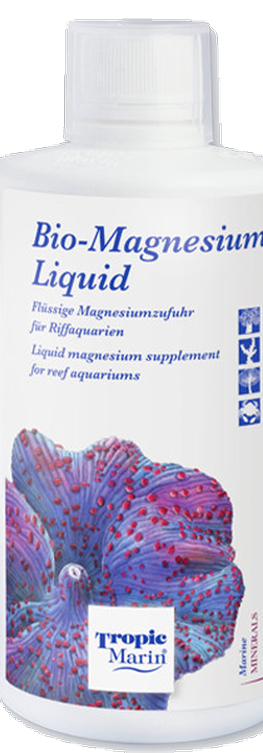</td></tr>
<tr><td>✅</td><td>Carbo Calcium</td><td>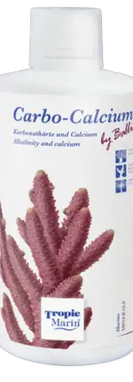</td></tr>
<tr><td>❌</td><td colspan='2'>Elimi-NP</td></tr>
<tr><td>❌</td><td colspan='2'>K Element</td></tr>
<tr><td>❌</td><td colspan='2'>Liquid Buffer</td></tr>
<tr><td>✅</td><td>NP-Bacto-Balance</td><td>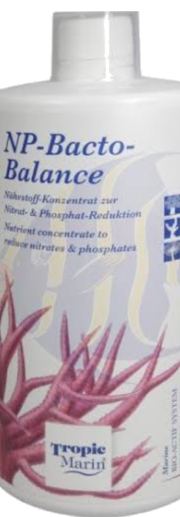</td></tr>
<tr><td>❌</td><td colspan='2'>Plus-NP</td></tr>
<tr><td>✅</td><td>Potassium</td><td>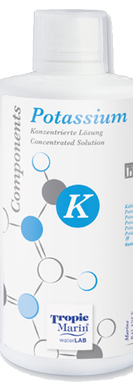</td></tr>
</table>

<!-- supplements:end -->

---

[← Volver a la página principal](README.es.md)
