[← Retour à la page principale](README.fr.md)

# ReefWave

ReefWave avec ha-reef-card en action :

Les ReefWave **RSWAVE25** et **RSWAVE45** sont prises en charge.

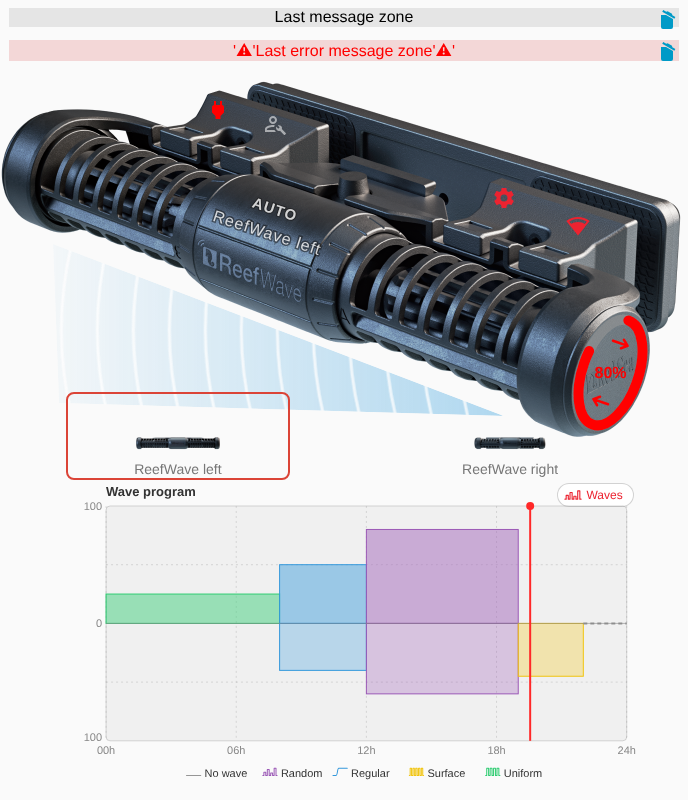

> [!IMPORTANT]
> Les pompes ReefWave dépendent du cloud ReefBeat plus que les autres
> appareils : lisez d'abord [ceci](https://github.com/Elwinmage/ha-reefbeat-component/blob/main/doc/fr/reefwave.fr.md#reefwave). Avec un compte cloud lié
> dans ha-reefbeat-component, la carte travaille sur la bibliothèque de
> vagues et les groupes de l'application ReefBeat, et les deux restent
> synchronisés. Sans compte, voir [Sans compte cloud](#sans-compte-cloud).

## La vue

La carte est divisée en 7 zones :

1. Messages
2. Clips de fixation
3. Bandeau LED
4. Embout
5. Flux
6. Groupe
7. Programme de la journée

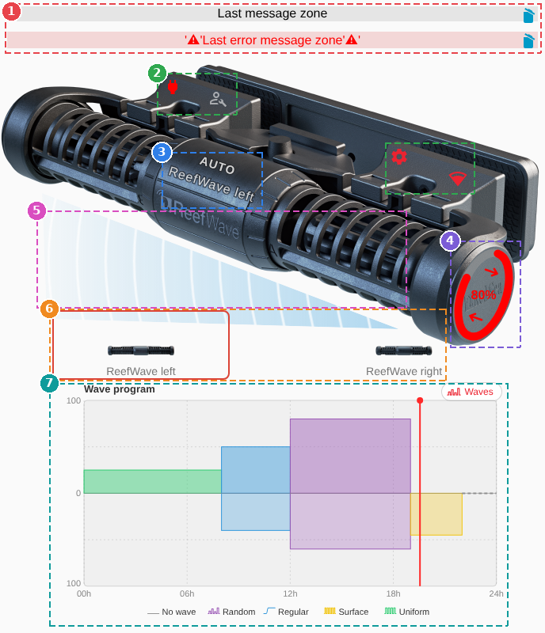

## Messages

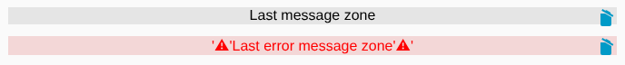

Dernier message et dernière alerte, en haut.

## Clips de fixation

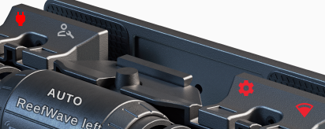

Marche/arrêt, maintenance, réglages et Wi-Fi.

## Bandeau LED

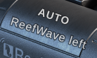

Le mode de la pompe, en blanc clair (un appui ouvre
ses informations), et le nom de la pompe dessous.

## Embout

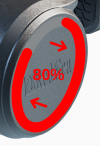

La vitesse, en anneau rouge ajusté sur l'embout : l'intensité
avant de la vague en cours, de la prévisualisation pendant une
prévisualisation, et 0 quand la pompe ne tourne pas (arrêt, nourrissage,
maintenance, pas de vague). Des flèches à l'intérieur donnent la
direction : → avant, ← arrière, les deux pour une vague alternée. Touchez
l'embout pour régler [cette pompe dans la vague en cours](#cette-pompe-dans-la-vague-en-cours).

## Flux

Sous la pompe, de l'eau animée à cette vitesse : vers la gauche
pour une vague avant, vers la droite pour une vague arrière, en
va-et-vient pour une vague alternée. Rien n'est dessiné quand la pompe est
arrêtée.

## Groupe

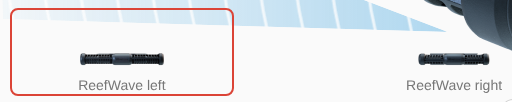

Les pompes du groupe sur une ligne, chacune avec sa vignette
et son nom, dans l'ordre du groupe. La pompe de la carte est entourée ;
touchez-en une autre pour afficher sa propre carte. Une pompe que Home
Assistant ne peut pas joindre est grisée. Rien n'est affiché pour une
pompe seule.

## Programme de la journée

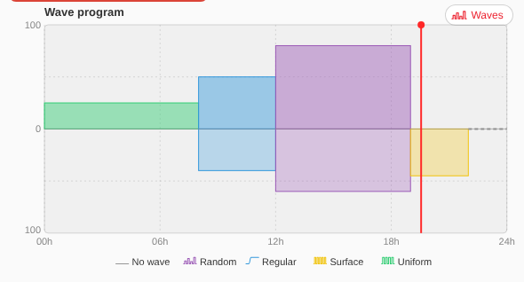

La journée de 00:00 à 24:00, un bloc par
créneau dans la couleur de son type de vague : l'intensité avant monte
au-dessus de la ligne médiane, l'intensité arrière descend dessous. Un
créneau « sans vague » est une ligne pointillée. La légende des types
(pictogramme et nom) est sous le graphe, et un curseur rouge marque
l'heure courante. Touchez le graphe pour modifier le programme ; le bouton
**Vagues** au-dessus ouvre la bibliothèque.

Types de vague : Uniforme, Aléatoire, Régulière,
Paliers, Surface et Pas de vague, avec les
pictogrammes de l'application ReefBeat.

## Éditeur de programme

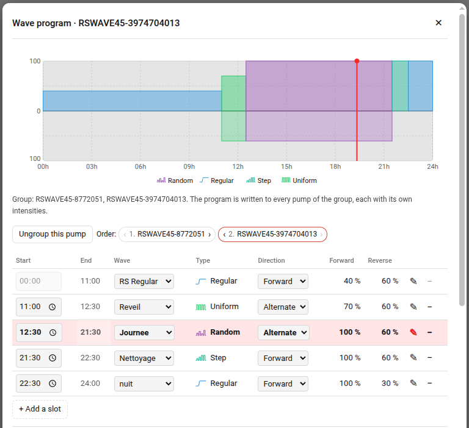

Touchez le programme de la journée : le graphe du brouillon en haut, puis
une ligne par créneau avec son début, sa fin, la vague choisie dans la
bibliothèque, son type, sa direction et les intensités de cette pompe. Les
créneaux peuvent être ajoutés et supprimés ; **Enregistrer** écrit le
programme, **Annuler** ne change rien.

- Le programme est écrit sur **toutes les pompes du groupe**, chacune avec
  ses propres intensités. Quand une pompe du groupe n'est pas disponible,
  l'enregistrement est verrouillé, comme dans l'application ReefBeat : le
  groupe reste synchronisé.
- Le programme commence à 00:00, deux créneaux ne peuvent pas commencer à la
  même heure, et chaque créneau a besoin d'une vague.
- Sous la note du groupe, un bouton groupe la pompe avec les ReefWave de son
  aquarium (**Grouper avec les ReefWave de l'aquarium**) ou la dégroupe (**Dégrouper cette pompe**).
  Pour un groupe, l'ordre de ses pompes se change par glisser-déposer, ou
  avec les flèches ‹ ›.
- Sous le tableau, la zone des vagues montre la bibliothèque sur la vague du
  créneau courant ; le crayon d'une ligne, ou le choix d'une vague, affiche
  cette vague.

## Bibliothèque de vagues

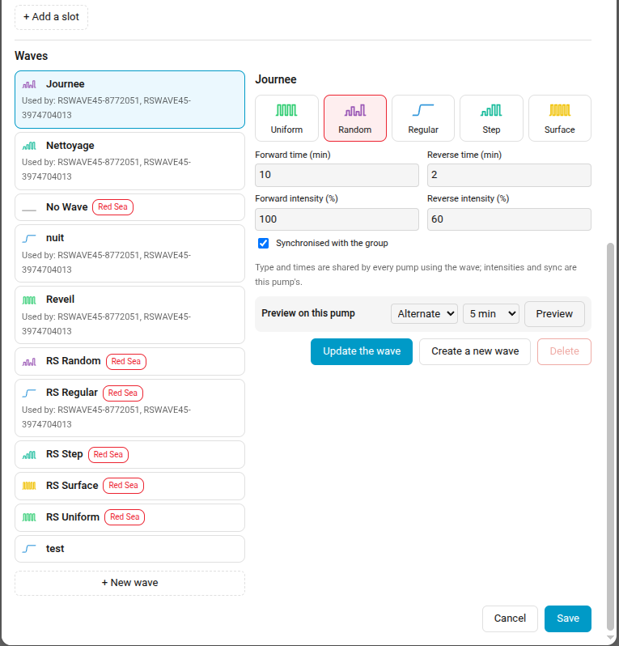

Le bouton **Vagues** liste les vagues de l'aquarium,
telles que l'application ReefBeat les conserve : celles de Red Sea et les
vôtres, chacune avec les pompes qui l'utilisent. Choisir une vague affiche
ses réglages :

- son **type**, choisi parmi les pictogrammes ;
- sa **forme** : temps avant et arrière (min), durée d'impulsion (s) et
  paliers, selon ce que son type utilise. La forme est partagée par toutes
  les pompes utilisant la vague ;
- les intensités avant et arrière de **cette pompe**, et sa synchronisation
  avec le groupe.

Ensuite, **Mettre à jour la vague** écrit la vague (les programmes qui
l'utilisent sont réécrits), **Créer une nouvelle vague** demande un nom et ajoute
une copie avec ces réglages, et **Supprimer** retire une vague
qu'aucun programme n'utilise. Une vague Red Sea ne peut qu'être copiée.

**Aperçu sur cette pompe** : choisissez la direction et la durée (de 1 à
10 min), puis **Prévisualiser** ; la pompe joue la vague, puis
revient à son programme. **Arrêter l'aperçu** l'arrête tout de suite.

## Cette pompe dans la vague en cours

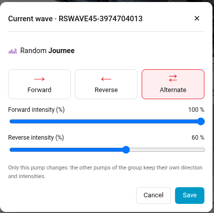

Touchez l'embout pour changer la direction et les intensités avant / arrière
de cette pompe dans la vague en cours. Seule cette pompe change : les autres
pompes du groupe gardent leur direction et leurs intensités, l'application
ReefBeat laissant chaque pompe d'un groupe jouer une vague à sa façon.

## Réglages

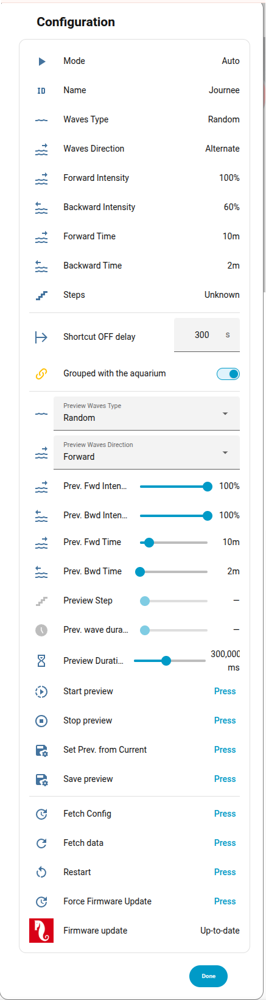

La roue dentée ouvre les réglages de la pompe : la vague en cours (type,
direction, intensités, temps, paliers), `Temporisation de reprise d'actions`,
`Groupée avec l'aquarium`, les réglages et boutons de prévisualisation de
l'intégration, et les actions de l'appareil (rafraîchissement,
réinitialisation, mise à jour du firmware).

## Sans compte cloud

La bibliothèque de vagues et les groupes vivent dans le cloud ReefBeat. Sans
compte cloud lié à la pompe, seules les vagues du programme en cours sont
proposées, le programme est écrit sur la pompe elle-même, et la bibliothèque
ne peut pas être modifiée.

> [!NOTE]
> La vue nécessite ha-reefbeat-component avec l'attribut `schedule` du
> capteur `wave_type`, le capteur `linked_waves` et les services
> `redsea.wave_*`.

---

[← Retour à la page principale](README.fr.md)
