<!--  -->

[![BuyMeCoffee][buymecoffeebadge]][buymecoffee]

> [!NOTE]
> Ogni aiuto è benvenuto, non esitate a [contattarmi](https://github.com/Elwinmage/ha-reef-card/discussions/1).

# Lingue supportate :       

<!-- Vous souhaitez aider à la traduction, suivez ce [guide](https://github.com/Elwinmage/ha-reef-card/blob/main/doc/TRANSLATION.md). -->

La vostra lingua non è ancora supportata e volete contribuire alla traduzione? Seguite questa [guida](https://github.com/Elwinmage/ha-reef-card/blob/main/doc/TRANSLATION.md).

# Presentazione

La **Reef card** per Home Assistant vi aiuta a gestire il vostro acquario di barriera corallina.

Abbinata a [ha-reefbeat-component](https://github.com/Elwinmage/ha-reefbeat-component), supporta automaticamente i vostri dispositivi Redsea (ReefBeat).

> [!NOTE]
> Se avete dispositivi non Redsea e desiderate che siano supportati, potete farne richiesta [qui](https://github.com/Elwinmage/ha-reef-card/discussions/2).

> [!TIP]
> La lista delle funzionalità future è disponibile [qui](https://github.com/Elwinmage/ha-reef-card/issues?q=is%3Aissue%20state%3Aopen%20label%3Aenhancement) 
> La lista dei bug è disponibile [qui](https://github.com/Elwinmage/ha-reef-card/issues?q=is%3Aissue%20state%3Aopen%20label%3Abug)

# Compatibilità

✅ Implementato ☑️ In corso ❌ Pianificato

<table>
  <th>
    <td ><b>Modello</b></td>
    <td colspan="2"><b>Stato</b></td>
    <td><b>Issues</b>   📆(Pianificato)   🐛(Bug)</td>
  </th>
  <tr>
    <td><a href="#reefato">ReefATO+</a></td>
    <td>RSATO+</td><td>❌</td>
    <td width="200px"></td>
    <td>
      <a href="https://github.com/Elwinmage/ha-reef-card/issues?q=is:issue state:open label:rsato,all label:enhancement" style="text-decoration:none">📆</a>
      <a href="https://github.com/Elwinmage/ha-reef-card/issues?q=is:issue state:open label:rsato,all label:bug" style="text-decoration:none">🐛</a>
    </td>
  </tr>

  </tr>
    <tr>
    <td><a href="#reefcontrol">ReefControl</a></td>
    <td>RSSENSE  Se ne possedete uno, potete contattarmi <a href="https://github.com/Elwinmage/ha-reefbeat-component/discussions/8">qui</a> e aggiungerò il suo supporto.</td><td>❌</td>
    <td width="200px"></td>
    <td>
      <a href="https://github.com/Elwinmage/ha-reefbeat-component/issues?q=is:issue state:open label:rscontrol,all label:enhancement" style="text-decoration:none">📆</a>
      <a href="https://github.com/Elwinmage/ha-reefbeat-component/issues?q=is:issue state:open label:rscontrol,all label:bug" style="text-decoration:none">🐛</a>
    </td>
      </tr>  
  <tr>
    <td rowspan="2"><a href="#reefdose">ReefDose</a></td>
    <td>RSDOSE2</td>
    <td>✅</td>
    <td width="200px"></td>
      <td rowspan="2">
      <a href="https://github.com/Elwinmage/ha-reef-card/issues?q=is:issue state:open label:rsdose,all label:enhancement" style="text-decoration:none">📆</a>
      <a href="https://github.com/Elwinmage/ha-reef-card/issues?q=is:issue state:open label:rsdose,all label:bug" style="text-decoration:none">🐛</a>
    </td>
  </tr>
  <tr>
    <td>RSDOSE4</td><td>✅</td>
    <td width="200px"></td>
    </tr>
  <tr>
    <td rowspan="2"> <a href="#reefled">ReefLed</a></td>
    <td>G1</td>
    <td>❌</td>
    <td width="200px"></td>
<td rowspan="2">   
    <a href="https://github.com/Elwinmage/ha-reef-card/issues?q=is:issue state:open label:rsled,all label:enhancement" style="text-decoration:none">📆</a>
      <a href="https://github.com/Elwinmage/ha-reef-card/issues?q=is:issue state:open label:rsled,all label:bug" style="text-decoration:none">🐛</a>
</td>
  </tr>
   <td >G2</td>
    <td>❌</td>
    <td width="200px"></td>
  </tr>
  <tr>
    <td rowspan="3"><a href="#reefmat">ReefMat</a></td>
    <td>RSMAT250</td>
    <td>☑️</td>
    <td rowspan="3" width="200px"></td>
    <td rowspan="3">
      <a href="https://github.com/Elwinmage/ha-reef-card/issues?q=is:issue state:open label:rsmat,all label:enhancement" style="text-decoration:none">📆</a>
      <a href="https://github.com/Elwinmage/ha-reef-card/issues?q=is:issue state:open label:rsmat,all label:bug" style="text-decoration:none">🐛</a>
    </td>
  </tr>
  <tr>
    <td>RSMAT500</td>
    <td>☑️</td>
  </tr>
  <tr>
    <td>RSMAT1200</td>
    <td>☑️</td>
  </tr>
  <tr>
    <td><a href="#reefrun">ReefRun</a></td>
    <td>RSRUN</td><td>❌</td>
    <td width="200px"></td>
    <td>
      <a href="https://github.com/Elwinmage/ha-reef-card/issues?q=is:issue state:open label:rsrun,all label:enhancement" style="text-decoration:none">📆</a>
      <a href="https://github.com/Elwinmage/ha-reef-card/issues?q=is:issue state:open label:rsrun,all label:bug" style="text-decoration:none">🐛</a>
    </td>
  </tr>
  <tr>
    <td><a href="#reefwave">ReefWave</a></td>
    <td>RSWAVE</td><td>❌</td>
    <td width="200px"></td>
    <td>
      <a href="https://github.com/Elwinmage/ha-reef-card/issues?q=is:issue state:open label:rswave,all label:enhancement" style="text-decoration:none">📆</a>
      <a href="https://github.com/Elwinmage/ha-reef-card/issues?q=is:issue state:open label:rswave,all label:bug" style="text-decoration:none">🐛</a>
    </td>
  </tr>
</table>

# Sommario

- [Installazione](https://github.com/Elwinmage/ha-reef-card/#installation)
- [Configurazione](https://github.com/Elwinmage/ha-reef-card/#configuration)
- [ReefATO+](https://github.com/Elwinmage/ha-reef-card/#reefato)
- [ReefControl](https://github.com/Elwinmage/ha-reef-card/#reefcontrol)
- [ReefDose](https://github.com/Elwinmage/ha-reef-card/#reefdose)
- [ReefLED](https://github.com/Elwinmage/ha-reef-card/#reefled)
- [ReefMat](https://github.com/Elwinmage/ha-reef-card/#reefmat)
- [ReefRun](https://github.com/Elwinmage/ha-reef-card/#reefrun)
- [ReefWave](https://github.com/Elwinmage/ha-reef-card/#reefwave)
- [FAQ](https://github.com/Elwinmage/ha-reef-card/#faq)

# Installazione

## Installazione diretta

Clicca qui per accedere direttamente al repository in HACS e clicca su "Scarica": 

## Cercare in HACS

Oppure cerca «reef-card» in HACS.

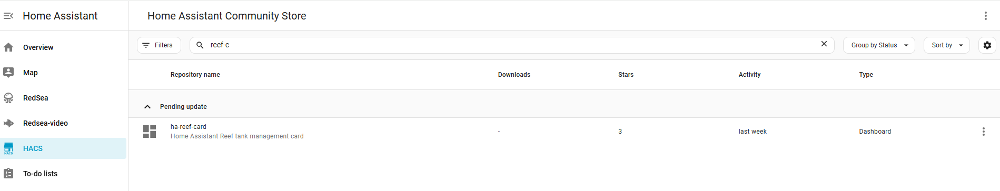

# Configurazione

Senza il parametro `device`, la card rileva automaticamente tutti i dispositivi ReefBeat e vi permette di scegliere quello desiderato.

Per rimuovere la selezione del dispositivo e forzarne uno specifico, impostate il parametro `device` con il nome del vostro dispositivo.

<table>
  <tr>
<td>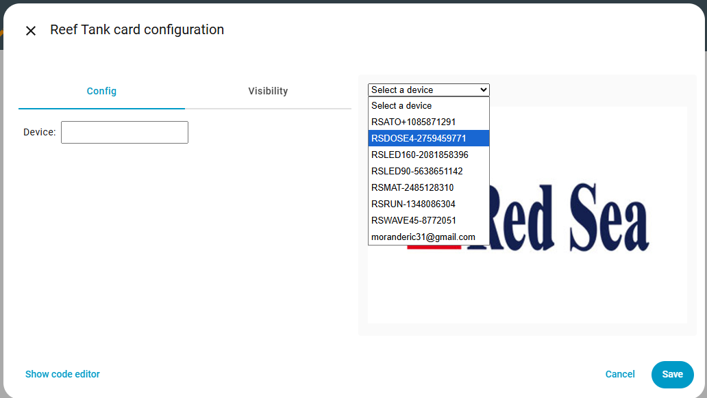</td>
<td>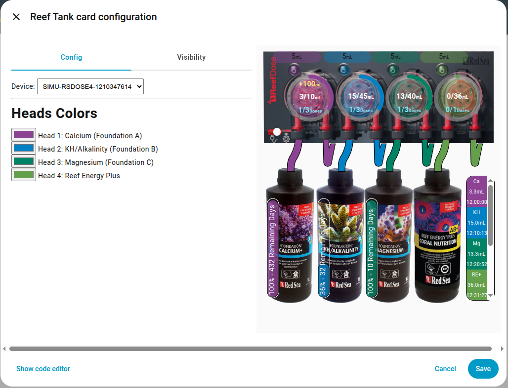</td>
    </tr>
</table>

# ReefATO

Pianificato.

Volete che sia supportato più rapidamente? Votate [qui](https://github.com/Elwinmage/ha-reef-card/discussions/22).

# ReefControl

Pianificato.

Volete che sia supportato più rapidamente? Votate [qui](https://github.com/Elwinmage/ha-reef-card/discussions/22).

# ReefDose

ReefDose con ha-reef-card in azione:

La card ReefDose è suddivisa in 6 zone:

1.  Configurazione/Informazioni Wifi
2.  Stati
3.  Dosaggio Manuale
4.  Configurazione e programmazione delle teste
5.  Gestione degli integratori
6.  Coda delle dosi future

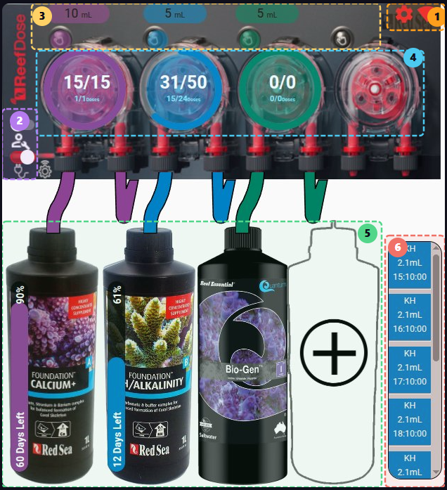

## Configurazione/Informazioni Wifi

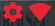

---

Cliccate sull'icona  per gestire la configurazione generale del ReefDose.

Cliccate sull'icona  per gestire i parametri di rete.

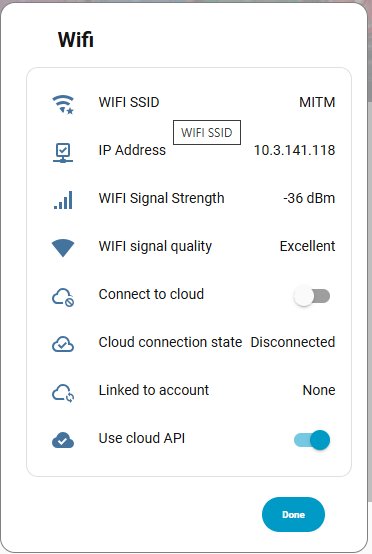

## Stati

 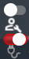

---

L'interruttore di manutenzione 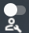 permette di passare alla modalità manutenzione.

 

L'interruttore on/off 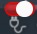 permette di alternare tra gli stati acceso e spento del ReefDose.

 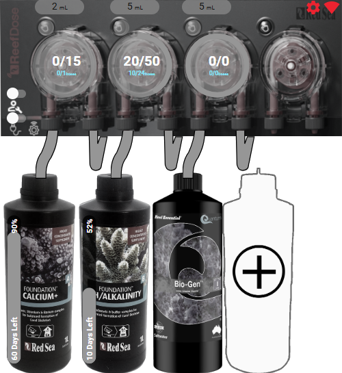

## Dosaggio Manuale

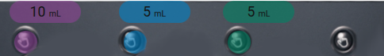

---

Il pulsante  mostra la dose manuale predefinita per questa testa. Un clic apre la finestra di configurazione di questo dosaggio.

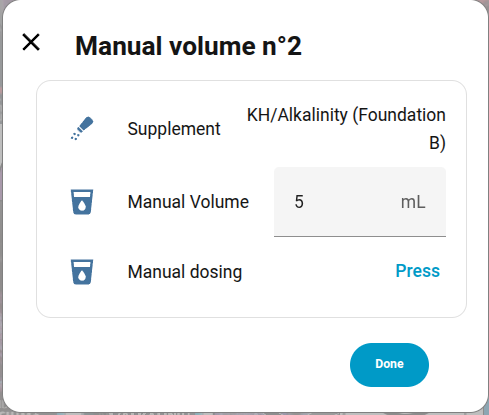

È possibile aggiungere scorciatoie utilizzando l'editor della card:

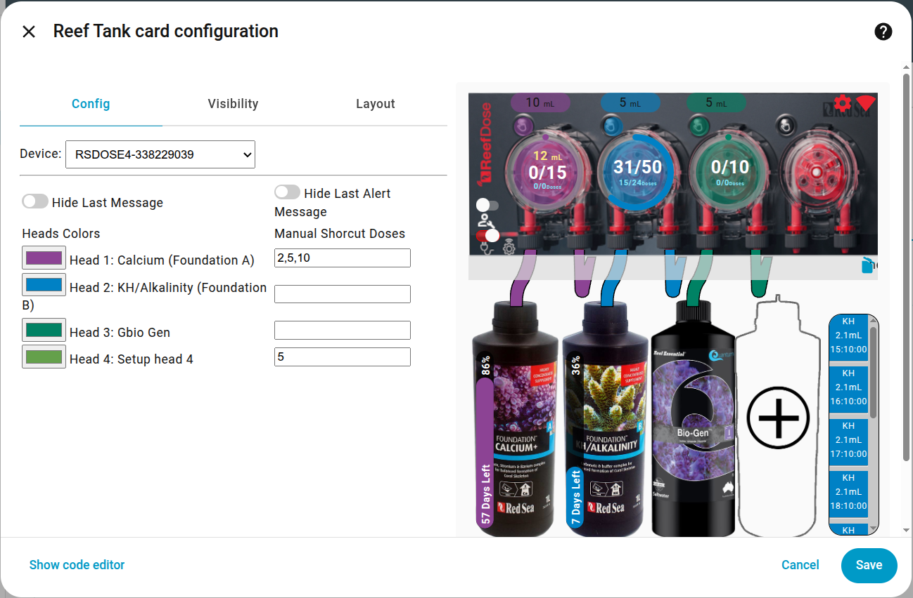

Ad esempio, la testa 1 propone come scorciatoie i valori 2, 5 e 10 mL.

Questi valori appariranno nella parte superiore della finestra di dialogo. Un clic su queste scorciatoie invierà un comando per dosare il valore definito.

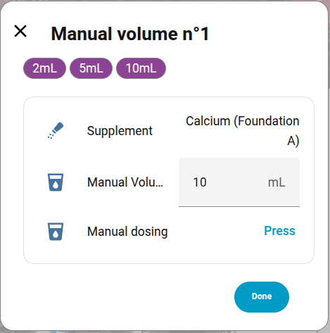

Premendo il pulsante di dose manuale:  verrà inviato un comando di dose con il valore predefinito visibile appena sopra: 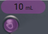, ovvero 10 mL in questo esempio.

## Configurazione e programmazione delle teste

 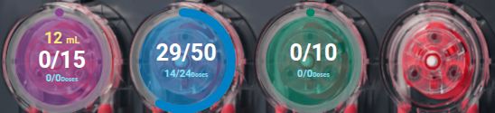

---

Questa zona permette di visualizzare la programmazione corrente delle teste e di modificarla.

- L'anello circolare colorato indica la percentuale di dose giornaliera già distribuita.
- Il numero giallo in alto indica il cumulato di dose manuale giornaliera.
- La parte centrale indica il volume distribuito rispetto al volume giornaliero programmato totale.
- La parte blu in basso indica il numero di dosi distribuite rispetto al numero totale di dosi della giornata (esempio: 14/24 per il blu perché è una programmazione oraria effettuata alle 14:15). I valori per il viola e il verde indicano 0/0 perché queste dosi devono essere distribuite alle 8h ma l'integrazione è stata avviata dopo le 8h, quindi non ci sarà nessuna dose oggi.
- Un clic lungo su una delle 4 teste la attiverà o disattiverà.
- Un clic su una testa aprirà la finestra di programmazione.
  Da questa finestra è possibile avviare un'innestura, ricalibrare la testa, modificare la dose giornaliera e la sua programmazione. Non dimenticate di salvare la programmazione prima di uscire.

  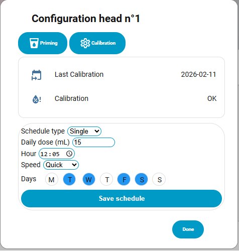

## Gestione degli integratori

 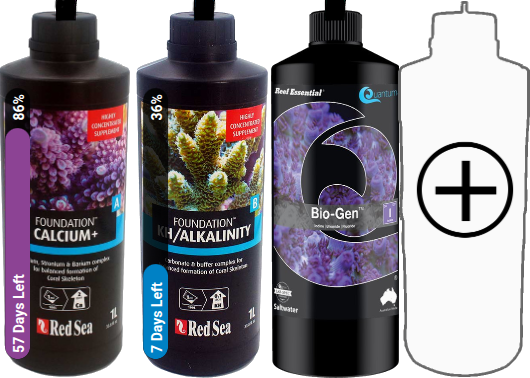

---

Questa zona permette di gestire gli integratori.
Se un integratore è già dichiarato, un clic su di esso aprirà la finestra di configurazione dove potrete:

- Eliminare l'integratore (icona cestino in alto a destra)
- Indicare il volume totale del contenitore
- Indicare il volume reale dell'integratore
- Decidere se volete monitorare il volume rimanente. Un clic sulle scorciatoie in alto attiverà il controllo e imposterà i valori predefiniti con un contenitore pieno.
- Modificare il nome di visualizzazione dell'integratore.

 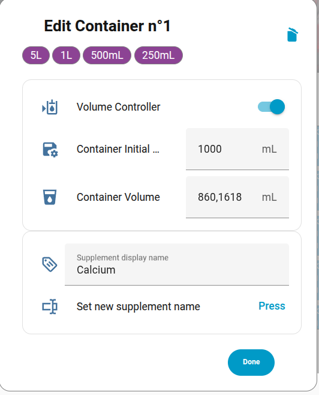

Se nessun integratore è collegato a una testa, è possibile aggiungerne uno cliccando sul contenitore con un '+' (testa 4 nel nostro esempio).

Seguite quindi le istruzioni:

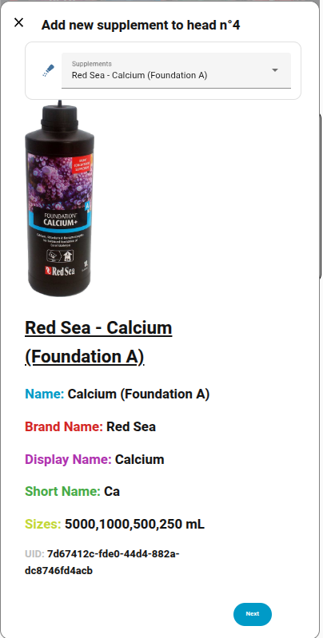

### Integratori

Ecco l'elenco delle immagini supportate per gli integratori, raggruppate per marca. Se il tuo mostra un ❌, puoi richiederne l'aggiunta [qui](https://github.com/Elwinmage/ha-reef-card/discussions/25).

<b>ATI &nbsp; 0/2 🖼️</b>

<table>
<tr><td>❌</td><td colspan='2'>Essential Pro 1</td></tr>
<tr><td>❌</td><td colspan='2'>Essential Pro 2</td></tr>
</table>

<b>Aqua Forest &nbsp; 3/9 🖼️</b>

<table>
<tr><td>✅</td><td>Ca Plus</td><td></td></tr>
<tr><td>❌</td><td colspan='2'>Calcium </td></tr>
<tr><td>❌</td><td colspan='2'>Component 1+</td></tr>
<tr><td>❌</td><td colspan='2'>Component 2+</td></tr>
<tr><td>❌</td><td colspan='2'>Component 3+</td></tr>
<tr><td>❌</td><td colspan='2'>KH Buffer</td></tr>
<tr><td>✅</td><td>KH Plus</td><td>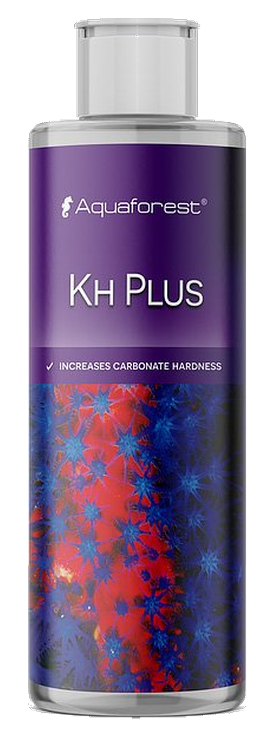</td></tr>
<tr><td>❌</td><td colspan='2'>Magnesium</td></tr>
<tr><td>✅</td><td>Mg Plus</td><td></td></tr>
</table>

<b>BRS &nbsp; 0/4 🖼️</b>

<table>
<tr><td>❌</td><td colspan='2'>Liquid Calcium</td></tr>
<tr><td>❌</td><td colspan='2'>Liquid alkalinity</td></tr>
<tr><td>❌</td><td colspan='2'>Magnesium Mix</td></tr>
<tr><td>❌</td><td colspan='2'>Part C</td></tr>
</table>

<b>Brightwell &nbsp; 0/12 🖼️</b>

<table>
<tr><td>❌</td><td colspan='2'>Calcion</td></tr>
<tr><td>❌</td><td colspan='2'>Ferrion</td></tr>
<tr><td>❌</td><td colspan='2'>Hydrate - MG</td></tr>
<tr><td>❌</td><td colspan='2'>KoralAmino</td></tr>
<tr><td>❌</td><td colspan='2'>Koralcolor</td></tr>
<tr><td>❌</td><td colspan='2'>Liquid Reef</td></tr>
<tr><td>❌</td><td colspan='2'>Potassion</td></tr>
<tr><td>❌</td><td colspan='2'>Reef Code A</td></tr>
<tr><td>❌</td><td colspan='2'>Reef Code B</td></tr>
<tr><td>❌</td><td colspan='2'>Replenish</td></tr>
<tr><td>❌</td><td colspan='2'>Restore</td></tr>
<tr><td>❌</td><td colspan='2'>Strontion</td></tr>
</table>

<b>ESV &nbsp; 0/5 🖼️</b>

<table>
<tr><td>❌</td><td colspan='2'>B-Ionic Component 1</td></tr>
<tr><td>❌</td><td colspan='2'>B-Ionic Component 2</td></tr>
<tr><td>❌</td><td colspan='2'>B-Ionic Magnesium</td></tr>
<tr><td>❌</td><td colspan='2'>Transition elements </td></tr>
<tr><td>❌</td><td colspan='2'>Transition elements plus</td></tr>
</table>

<b>Fauna Marine &nbsp; 0/11 🖼️</b>

<table>
<tr><td>❌</td><td colspan='2'>Amin</td></tr>
<tr><td>❌</td><td colspan='2'>Balling light  trace 1</td></tr>
<tr><td>❌</td><td colspan='2'>Balling light  trace 2</td></tr>
<tr><td>❌</td><td colspan='2'>Balling light  trace 3</td></tr>
<tr><td>❌</td><td colspan='2'>Balling light Ca</td></tr>
<tr><td>❌</td><td colspan='2'>Balling light KH</td></tr>
<tr><td>❌</td><td colspan='2'>Balling light Mg</td></tr>
<tr><td>❌</td><td colspan='2'>Blue trace elements</td></tr>
<tr><td>❌</td><td colspan='2'>Green trace elements</td></tr>
<tr><td>❌</td><td colspan='2'>Min S</td></tr>
<tr><td>❌</td><td colspan='2'>Red trace elements</td></tr>
</table>

<b>Quantum &nbsp; 7/7 🖼️</b>

<table>
<tr><td>✅</td><td>Aragonite A</td><td></td></tr>
<tr><td>✅</td><td>Aragonite B</td><td>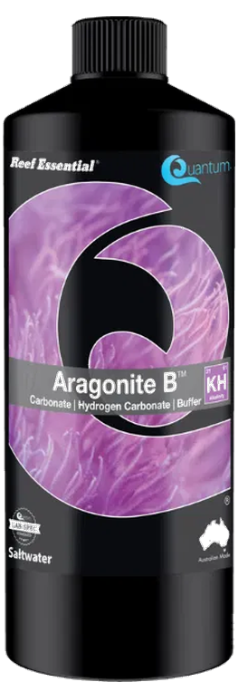</td></tr>
<tr><td>✅</td><td>Aragonite C</td><td>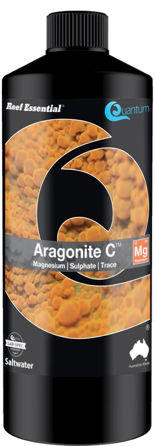</td></tr>
<tr><td>✅</td><td>Bio Kalium</td><td></td></tr>
<tr><td>✅</td><td>Bio Metals</td><td>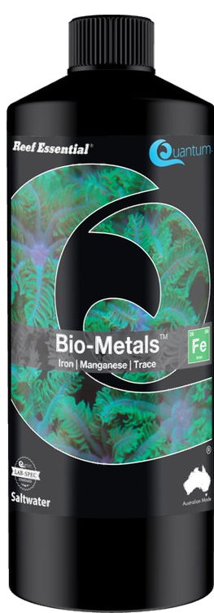</td></tr>
<tr><td>✅</td><td>Bio enhance</td><td>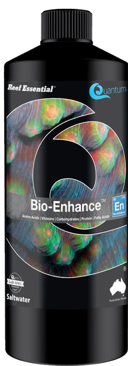</td></tr>
<tr><td>✅</td><td>Gbio Gen</td><td></td></tr>
</table>

<b>Red Sea &nbsp; 10/13 🖼️</b>

<table>
<tr><td>✅</td><td>Bio Active (Colors D)</td><td></td></tr>
<tr><td>✅</td><td>Calcium (Foundation A)</td><td></td></tr>
<tr><td>❌</td><td colspan='2'>Calcium (Powder)</td></tr>
<tr><td>✅</td><td>Iodine (Colors A)</td><td></td></tr>
<tr><td>✅</td><td>Iron (Colors C)</td><td></td></tr>
<tr><td>✅</td><td>KH/Alkalinity (Foundation B)</td><td></td></tr>
<tr><td>❌</td><td colspan='2'>KH/Alkalinity (Powder)</td></tr>
<tr><td>✅</td><td>Magnesium (Foundation C)</td><td></td></tr>
<tr><td>❌</td><td colspan='2'>Magnesium (Powder)</td></tr>
<tr><td>✅</td><td>NO3PO4-X</td><td></td></tr>
<tr><td>✅</td><td>Potassium (Colors B)</td><td></td></tr>
<tr><td>✅</td><td>Reef Energy Plus</td><td>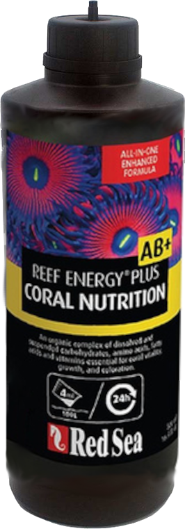</td></tr>
<tr><td>✅</td><td>ReefCare Program</td><td>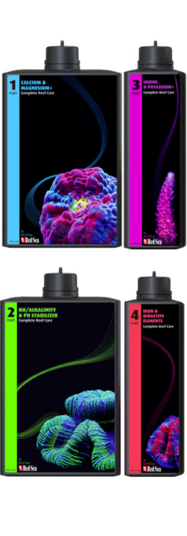</td></tr>
</table>

<b>Seachem &nbsp; 0/9 🖼️</b>

<table>
<tr><td>❌</td><td colspan='2'>Reef Calcium</td></tr>
<tr><td>❌</td><td colspan='2'>Reef Carbonate</td></tr>
<tr><td>❌</td><td colspan='2'>Reef Complete</td></tr>
<tr><td>❌</td><td colspan='2'>Reef Fusion 1</td></tr>
<tr><td>❌</td><td colspan='2'>Reef Fusion 2</td></tr>
<tr><td>❌</td><td colspan='2'>Reef Iodine</td></tr>
<tr><td>❌</td><td colspan='2'>Reef Plus</td></tr>
<tr><td>❌</td><td colspan='2'>Reef Strontium</td></tr>
<tr><td>❌</td><td colspan='2'>Reef Trace</td></tr>
</table>

<b>Triton &nbsp; 0/4 🖼️</b>

<table>
<tr><td>❌</td><td colspan='2'>Core7 elements 1</td></tr>
<tr><td>❌</td><td colspan='2'>Core7 elements 2</td></tr>
<tr><td>❌</td><td colspan='2'>Core7 elements 3A</td></tr>
<tr><td>❌</td><td colspan='2'>Core7 elements 3B</td></tr>
</table>

<b>Tropic Marin &nbsp; 5/14 🖼️</b>

<table>
<tr><td>❌</td><td colspan='2'>A Element</td></tr>
<tr><td>✅</td><td>All-For-Reef</td><td>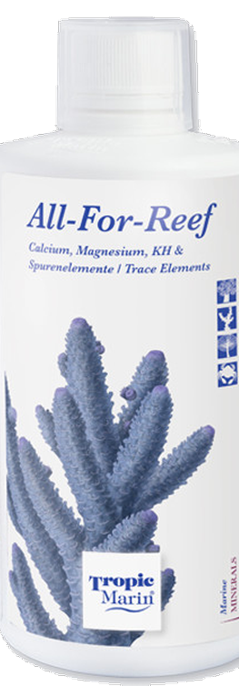</td></tr>
<tr><td>✅</td><td>Amino Organic</td><td>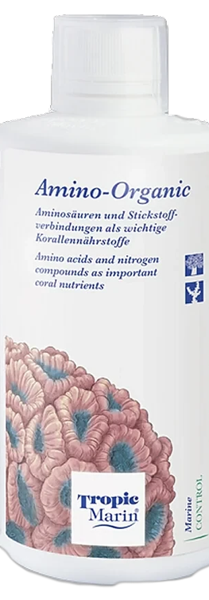</td></tr>
<tr><td>❌</td><td colspan='2'>Balling A</td></tr>
<tr><td>❌</td><td colspan='2'>Balling B</td></tr>
<tr><td>❌</td><td colspan='2'>Balling C</td></tr>
<tr><td>✅</td><td>Bio-Magnesium</td><td>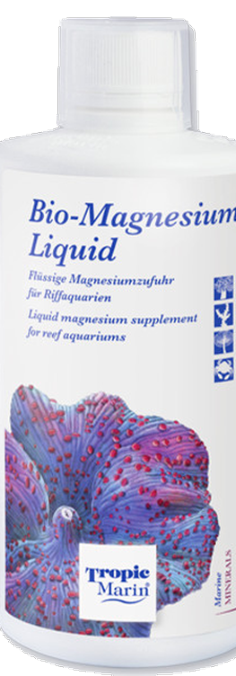</td></tr>
<tr><td>✅</td><td>Carbo Calcium</td><td></td></tr>
<tr><td>❌</td><td colspan='2'>Elimi-NP</td></tr>
<tr><td>❌</td><td colspan='2'>K Element</td></tr>
<tr><td>❌</td><td colspan='2'>Liquid Buffer</td></tr>
<tr><td>❌</td><td colspan='2'>NP-Bacto-Balance</td></tr>
<tr><td>❌</td><td colspan='2'>Plus-NP</td></tr>
<tr><td>✅</td><td>Potassium</td><td>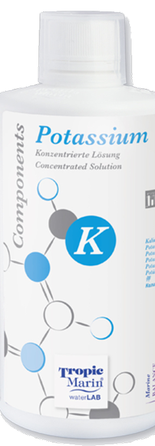</td></tr>
</table>

# ReefLed

Pianificato.

Volete che sia supportato più rapidamente? Votate [qui](https://github.com/Elwinmage/ha-reef-card/discussions/22).

# ReefMat

Pianificato.

Volete che sia supportato più rapidamente? Votate [qui](https://github.com/Elwinmage/ha-reef-card/discussions/22).

# ReefRun

Pianificato.

Volete che sia supportato più rapidamente? Votate [qui](https://github.com/Elwinmage/ha-reef-card/discussions/22).

# ReefWave

Pianificato.

Volete che sia supportato più rapidamente? Votate [qui](https://github.com/Elwinmage/ha-reef-card/discussions/22).

# FAQ

---

[buymecoffee]: https://paypal.me/Elwinmage
[buymecoffeebadge]: https://img.shields.io/badge/buy%20me%20a%20coffee-donate-yellow.svg?style=flat-square
