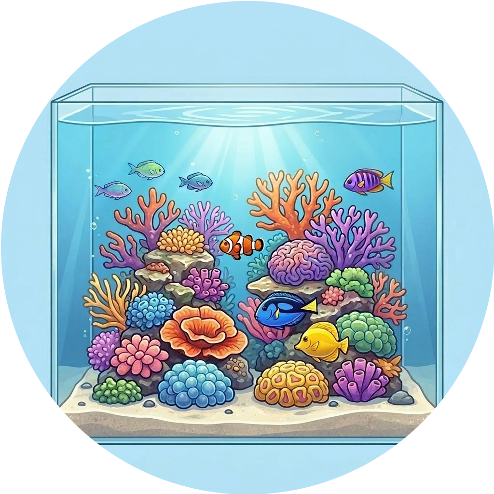
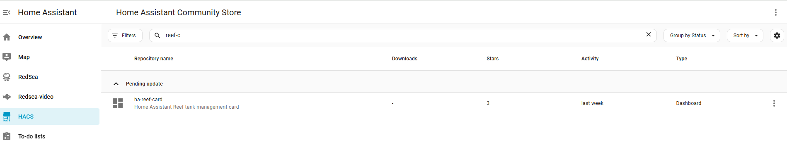
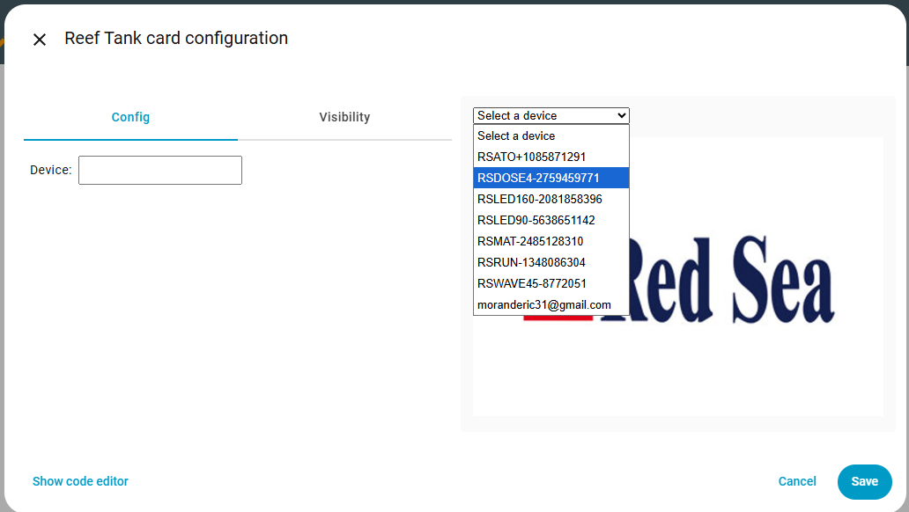
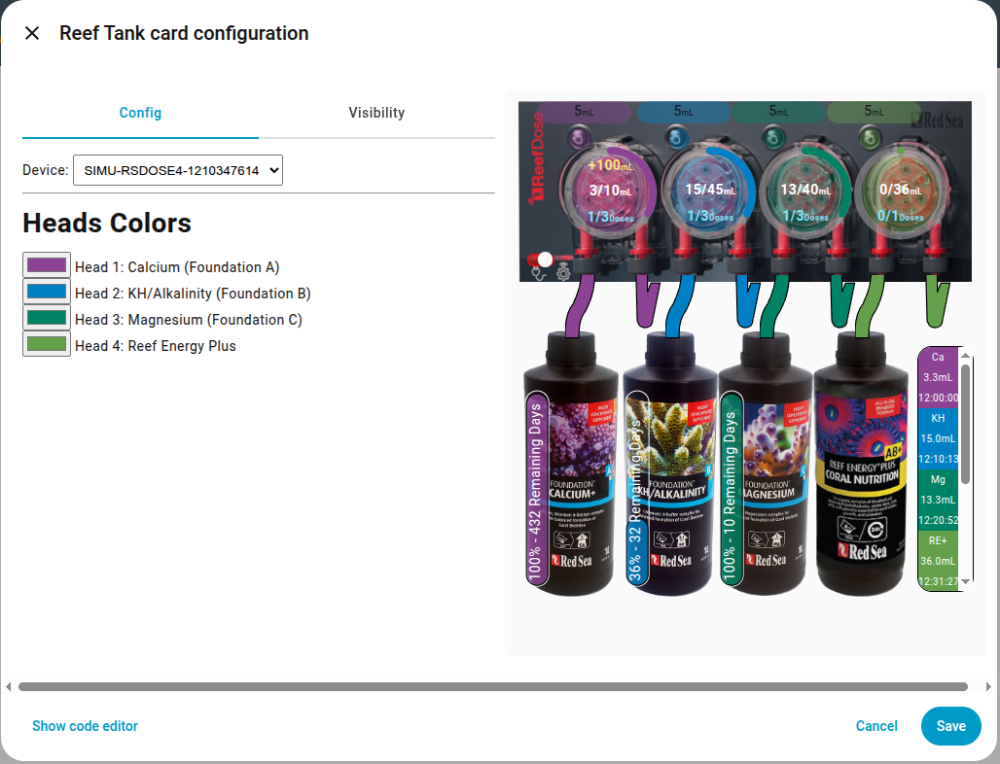

# ha-reef-card 🪸 per HomeAssistant

> Fa parte dell'**[Ecosistema ReefTech Project](https://elwinmage.github.io/reeftank/it.html)**

  

<!--  -->

[![BuyMeCoffee][buymecoffeebadge]][buymecoffee]

# Lingue supportate :       

<!-- Vous souhaitez aider à la traduction, suivez ce [guide](https://github.com/Elwinmage/ha-reef-card/blob/main/doc/TRANSLATION.md). -->

La vostra lingua non è ancora supportata e volete contribuire alla traduzione? Seguite questa [guida](https://github.com/Elwinmage/ha-reef-card/blob/main/doc/TRANSLATION.md).

# Presentazione

La **Reef card** per Home Assistant vi aiuta a gestire il vostro acquario di barriera corallina.

Abbinata a [ha-reefbeat-component](https://github.com/Elwinmage/ha-reefbeat-component), supporta automaticamente i vostri
dispositivi Redsea (ReefBeat), e [ha-reef-maintenance-component](https://github.com/Elwinmage/ha-reef-maintenance-component)
aggiunge alla vista manutenzione le attrezzature con cui Home Assistant non può dialogare.

Supporta anche le pompe Aqua Medic di [ha-aquamedic-component](https://github.com/Elwinmage/ha-aquamedic-component);
le loro attività di manutenzione compaiono nella stessa vista.

Anche i flussi di energia di [reefbeatEnergyBackup](https://github.com/Elwinmage/reefbeatEnergyBackup) (rete, batteria, pompe) hanno la loro vista, disegnata con [Power Flow Card Plus](https://github.com/flixlix/power-flow-card-plus).

<!-- generated:demo-videos:start -->

## 🎬 Video dimostrativi

<table>
<tr>
<td> <em>Demo ReefDose</em></td>
<td> <em>Demo ReefMat</em></td>
</tr>
<tr>
<td> <em>Demo ReefRun</em></td>
<td> <em>Demo Manutenzione</em></td>
</tr>
<tr>
<td> <em>Demo ReefATO+</em></td>
<td> <em>Demo ReefControl & ReefControl-Power</em></td>
</tr>
<tr>
<td> <em>Demo ReefLed</em></td>
<td> <em>Demo ReefWave</em></td>
</tr>
<tr>
<td> <em>Demo Aqua Medic</em></td>
</tr>
</table>

<!-- generated:demo-videos:end -->

<!-- ecosystem:start -->

## Progetti correlati

I progetti ReefTech si incastrano tra loro: le integrazioni portano la tua attrezzatura in Home Assistant, la scheda la mostra e la pilota, e il backup la mantiene in funzione durante un blackout. Ognuno funziona anche da solo.

<table>
  <tr>
    <th width="100px"></th>
    <th>Progetto</th>
    <th>Ruolo</th>
    <th>Funziona con</th>
  </tr>
  <tr>
    <td></td>
    <td>🐠 <a href="https://github.com/Elwinmage/ha-reefbeat-component"><b>ha-reefbeat-component</b></a></td>
    <td>Dispositivi Red Sea ReefBeat, pilotati in locale senza cloud: ReefATO+, ReefControl, ReefControl-Power, ReefDose, ReefLed, ReefMat, ReefRun e ReefWave. blueprint di allerta per modalità anomale, calibrazioni e batteria scarica. </td>
    <td>ha-reef-card</td>
  </tr>
  <tr>
    <td></td>
    <td>🌊 <a href="https://github.com/Elwinmage/ha-aquamedic-component"><b>ha-aquamedic-component</b></a></td>
    <td>Pompe Aqua Medic tramite l'API cloud Gizwits: pompe di movimento EcoDrift e SmartDrift, pompe DC Runner di risalita e dello schiumatoio.</td>
    <td>ha-reef-card</td>
  </tr>
  <tr>
    <td></td>
    <td>🐙 <a href="https://github.com/Elwinmage/ha-reef-maintenance-component"><b>ha-reef-maintenance-component</b></a></td>
    <td>Tracciamento di pulizia e usura per l'attrezzatura che Home Assistant non può interrogare: pompe di movimento, pompe di risalita, schiumatoi, reattori, tutto ciò che curi a mano.</td>
    <td>ha-reef-card</td>
  </tr>
  <tr>
    <td></td>
    <td>🪸 <b>ha-reef-card</b> <i>(questo repository)</i></td>
    <td>Vista grafica interattiva di ogni dispositivo sulla tua dashboard, e unico modo per modificare le programmazioni avanzate. Legge le tre integrazioni tramite il contratto <code>reef_role</code> comune, senza configurazione lato scheda. Disegna anche i flussi di energia di reefbeatEnergyBackup.</td>
    <td>tutte e tre le integrazioni</td>
  </tr>
  <tr>
    <td></td>
    <td>🐬 <a href="https://github.com/Elwinmage/ha-reef-blueprints"><b>ha-reef-blueprints</b></a></td>
    <td>Blueprint di notifica comuni a tutto l'ecosistema: manutenzioni scadute trovate tramite il contratto <code>reef_role</code>, e dispositivi diventati irraggiungibili. Otto lingue.</td>
    <td>tutte e tre le integrazioni</td>
  </tr>
  <tr>
    <td></td>
    <td>⚡ <a href="https://github.com/Elwinmage/reefbeatEnergyBackup"><b>reefbeatEnergyBackup</b></a></td>
    <td>Backup a batteria in caso di blackout. Un pacco 24V LiFePO₄ gestito da un Raspberry Pi, con degrado progressivo della velocità delle pompe in base allo stato di carica.</td>
    <td>da solo, o insieme a ha-reefbeat-component e ha-reef-card</td>
  </tr>
</table>

Sono tutti documentati insieme sulla [pagina del progetto ReefTech](https://elwinmage.github.io/reeftank/).

<!-- ecosystem:end -->

# Compatibilità

> ✅ Supportato &nbsp;|&nbsp; 🚧 In corso &nbsp;|&nbsp; 🧪 Non testato (potrebbe funzionare) &nbsp;|&nbsp; ❌ Non ancora supportato

<table>
  <th>
    <td ><b>Modello</b></td>
    <td colspan="2"><b>Stato</b></td>
    <td><b>Issues</b>   📆(Pianificato)   🐛(Bug)</td>
  </th>
  <tr>
    <td><a href="https://github.com/Elwinmage/ha-reef-card/blob/main/doc/it/reefato.it.md#reefato">ReefATO+</a></td>
    <td>RSATO+</td><td>✅</td>
    <td width="200px"></td>
    <td>
      <a href="https://github.com/Elwinmage/ha-reef-card/issues?q=is:issue state:open label:rsato,all label:enhancement" style="text-decoration:none">📆</a>
      <a href="https://github.com/Elwinmage/ha-reef-card/issues?q=is:issue state:open label:rsato,all label:bug" style="text-decoration:none">🐛</a>
    </td>
  </tr>
  <tr>
    <td rowspan="2"><a href="https://github.com/Elwinmage/ha-reef-card/blob/main/doc/it/reefcontrol.it.md#reefcontrol">ReefControl</a></td>
    <td>RSCONTROLPRO</td><td>✅</td>
    <td width="200px"></td>
    <td rowspan="2">
      <a href="https://github.com/Elwinmage/ha-reef-card/issues?q=is:issue state:open label:rscontrol,all label:enhancement" style="text-decoration:none">📆</a>
      <a href="https://github.com/Elwinmage/ha-reef-card/issues?q=is:issue state:open label:rscontrol,all label:bug" style="text-decoration:none">🐛</a>
    </td>
  </tr>
  <tr>
    <td>RSCONTROLLITE</td><td>🧪</td>
    <td width="200px"></td>
  </tr>
  <tr>
    <td rowspan="2"><a href="https://github.com/Elwinmage/ha-reef-card/blob/main/doc/it/reefcontrol-power.it.md#reefcontrol-power">ReefControl-Power</a></td>
    <td>RSPOWER6</td><td>✅</td>
    <td width="200px"></td>
    <td rowspan="2">
      <a href="https://github.com/Elwinmage/ha-reef-card/issues?q=is:issue state:open label:rspower,all label:enhancement" style="text-decoration:none">📆</a>
      <a href="https://github.com/Elwinmage/ha-reef-card/issues?q=is:issue state:open label:rspower,all label:bug" style="text-decoration:none">🐛</a>
    </td>
  </tr>
  <tr>
    <td>RSPOWER8</td><td>🧪</td>
    <td width="200px"></td>
  </tr>
  <tr>
    <td rowspan="2"><a href="https://github.com/Elwinmage/ha-reef-card/blob/main/doc/it/reefdose.it.md#reefdose">ReefDose</a></td>
    <td>RSDOSE2</td>
    <td>✅</td>
    <td width="200px"></td>
      <td rowspan="2">
      <a href="https://github.com/Elwinmage/ha-reef-card/issues?q=is:issue state:open label:rsdose,all label:enhancement" style="text-decoration:none">📆</a>
      <a href="https://github.com/Elwinmage/ha-reef-card/issues?q=is:issue state:open label:rsdose,all label:bug" style="text-decoration:none">🐛</a>
    </td>
  </tr>
  <tr>
    <td>RSDOSE4</td><td>✅</td>
    <td width="200px"></td>
    </tr>
  <tr>
    <td rowspan="2"> <a href="https://github.com/Elwinmage/ha-reef-card/blob/main/doc/it/reefled.it.md#reefled">ReefLed</a></td>
    <td>G1</td>
    <td>✅</td>
    <td width="200px"></td>
<td rowspan="2">   
    <a href="https://github.com/Elwinmage/ha-reef-card/issues?q=is:issue state:open label:rsled,all label:enhancement" style="text-decoration:none">📆</a>
      <a href="https://github.com/Elwinmage/ha-reef-card/issues?q=is:issue state:open label:rsled,all label:bug" style="text-decoration:none">🐛</a>
</td>
  </tr>
  <tr>
    <td>G2</td>
    <td>🧪</td>
    <td width="200px"></td>
  </tr>
  <tr>
    <td rowspan="3"><a href="https://github.com/Elwinmage/ha-reef-card/blob/main/doc/it/reefmat.it.md#reefmat">ReefMat</a></td>
    <td>RSMAT250</td>
    <td>✅</td>
    <td rowspan="3" width="200px"></td>
    <td rowspan="3">
      <a href="https://github.com/Elwinmage/ha-reef-card/issues?q=is:issue state:open label:rsmat,all label:enhancement" style="text-decoration:none">📆</a>
      <a href="https://github.com/Elwinmage/ha-reef-card/issues?q=is:issue state:open label:rsmat,all label:bug" style="text-decoration:none">🐛</a>
    </td>
  </tr>
  <tr>
    <td>RSMAT500</td>
    <td>✅</td>
  </tr>
  <tr>
    <td>RSMAT1200</td>
    <td>✅</td>
  </tr>
  <tr>
    <td><a href="https://github.com/Elwinmage/ha-reef-card/blob/main/doc/it/reefrun.it.md#reefrun">ReefRun</a></td>
    <td>RSRUN</td><td>✅</td>
    <td width="200px"></td>
    <td>
      <a href="https://github.com/Elwinmage/ha-reef-card/issues?q=is:issue state:open label:rsrun,all label:enhancement" style="text-decoration:none">📆</a>
      <a href="https://github.com/Elwinmage/ha-reef-card/issues?q=is:issue state:open label:rsrun,all label:bug" style="text-decoration:none">🐛</a>
    </td>
  </tr>
  <tr>
    <td><a href="https://github.com/Elwinmage/ha-reef-card/blob/main/doc/it/reefwave.it.md#reefwave">ReefWave</a></td>
    <td>RSWAVE25 RSWAVE45</td><td>✅</td>
    <td width="200px"></td>
    <td>
      <a href="https://github.com/Elwinmage/ha-reef-card/issues?q=is:issue state:open label:rswave,all label:enhancement" style="text-decoration:none">📆</a>
      <a href="https://github.com/Elwinmage/ha-reef-card/issues?q=is:issue state:open label:rswave,all label:bug" style="text-decoration:none">🐛</a>
    </td>
  </tr>
  <tr>
    <td colspan="5"><b>Aqua Medic</b> — tramite <a href="https://github.com/Elwinmage/ha-aquamedic-component">ha-aquamedic-component</a></td>
  </tr>
  <tr>
    <td rowspan="3"><a href="https://github.com/Elwinmage/ha-reef-card/blob/main/doc/it/aquamedic.it.md#aqua-medic">Aqua Medic</a></td>
    <td>EcoDrift / SmartDrift x.1 / x.3 (pompa di movimento)</td><td>✅</td>
    <td width="200px"></td>
    <td rowspan="3">
      <a href="https://github.com/Elwinmage/ha-reef-card/issues?q=is:issue state:open label:aquamedic,all label:enhancement" style="text-decoration:none">📆</a>
      <a href="https://github.com/Elwinmage/ha-reef-card/issues?q=is:issue state:open label:aquamedic,all label:bug" style="text-decoration:none">🐛</a>
    </td>
  </tr>
  <tr>
    <td>DC Runner (pompa di risalita)</td><td>✅</td>
    <td width="200px"></td>
  </tr>
  <tr>
    <td>DC Runner (pompa dello schiumatoio)</td><td>✅</td>
    <td width="200px"></td>
  </tr>
  <tr>
    <td colspan="5"><b>reefbeatEnergyBackup</b> — tramite <a href="https://github.com/Elwinmage/reefbeatEnergyBackup">reefbeatEnergyBackup</a></td>
  </tr>
  <tr>
    <td><a href="https://github.com/Elwinmage/ha-reef-card/blob/main/doc/it/energybackup.it.md#backup-energetico">Backup energetico</a></td>
    <td>Energy Backup System (batteria di backup)</td><td>✅</td>
    <td width="200px"></td>
    <td>
      <a href="https://github.com/Elwinmage/ha-reef-card/issues?q=is:issue state:open label:energybackup,all label:enhancement" style="text-decoration:none">📆</a>
      <a href="https://github.com/Elwinmage/ha-reef-card/issues?q=is:issue state:open label:energybackup,all label:bug" style="text-decoration:none">🐛</a>
    </td>
  </tr>
</table>

> [!NOTE]
> La pompa di risalita DC Runner e la pompa dello schiumatoio sono lo stesso hardware con teste diverse: stesso firmware, stessa chiave prodotto Gizwits, entità identiche. L'integrazione le distingue tramite il selettore **Ruolo della pompa**, e la card segue quel ruolo.

# Sommario

- [Installazione](#installazione)
- [Configurazione](#configurazione)
- [ReefATO+](https://github.com/Elwinmage/ha-reef-card/blob/main/doc/it/reefato.it.md#reefato)
- [ReefControl](https://github.com/Elwinmage/ha-reef-card/blob/main/doc/it/reefcontrol.it.md#reefcontrol)
- [ReefControl-Power](https://github.com/Elwinmage/ha-reef-card/blob/main/doc/it/reefcontrol-power.it.md#reefcontrol-power)
- [ReefDose](https://github.com/Elwinmage/ha-reef-card/blob/main/doc/it/reefdose.it.md#reefdose)
- [ReefLED](https://github.com/Elwinmage/ha-reef-card/blob/main/doc/it/reefled.it.md#reefled)
- [ReefMat](https://github.com/Elwinmage/ha-reef-card/blob/main/doc/it/reefmat.it.md#reefmat)
- [ReefRun](https://github.com/Elwinmage/ha-reef-card/blob/main/doc/it/reefrun.it.md#reefrun)
- [ReefWave](https://github.com/Elwinmage/ha-reef-card/blob/main/doc/it/reefwave.it.md#reefwave)
- [Aqua Medic](https://github.com/Elwinmage/ha-reef-card/blob/main/doc/it/aquamedic.it.md#aqua-medic)
- [Manutenzione](https://github.com/Elwinmage/ha-reef-card/blob/main/doc/it/maintenance.it.md#manutenzione)
- [Backup energetico](https://github.com/Elwinmage/ha-reef-card/blob/main/doc/it/energybackup.it.md#backup-energetico)
- [FAQ](#faq)

# Installazione

## Installazione diretta

Clicca qui per accedere direttamente al repository in HACS e clicca su "Scarica": 

## Cercare in HACS

Oppure cerca «reef-card» in HACS.

# Configurazione

Senza il parametro `device`, la card rileva automaticamente tutti i dispositivi ReefBeat e vi permette di scegliere quello desiderato.

Per rimuovere la selezione del dispositivo e forzarne uno specifico, impostate il parametro `device` con il nome del vostro dispositivo.

L'editor della card vi salva l'identificativo stabile del dispositivo (il suo identificativo hardware) e conserva le opzioni di ogni dispositivo sotto lo stesso identificativo: rinominare un dispositivo in Home Assistant non fa perdere nulla. Una configurazione scritta con il nome del dispositivo continua a funzionare, e passa all'identificativo alla prossima modifica dall'editor.

<table>
  <tr>
<td></td>
<td></td>
    </tr>
</table>

# FAQ

---

[buymecoffee]: https://paypal.me/Elwinmage
[buymecoffeebadge]: https://img.shields.io/badge/buy%20me%20a%20coffee-donate-yellow.svg?style=flat-square
