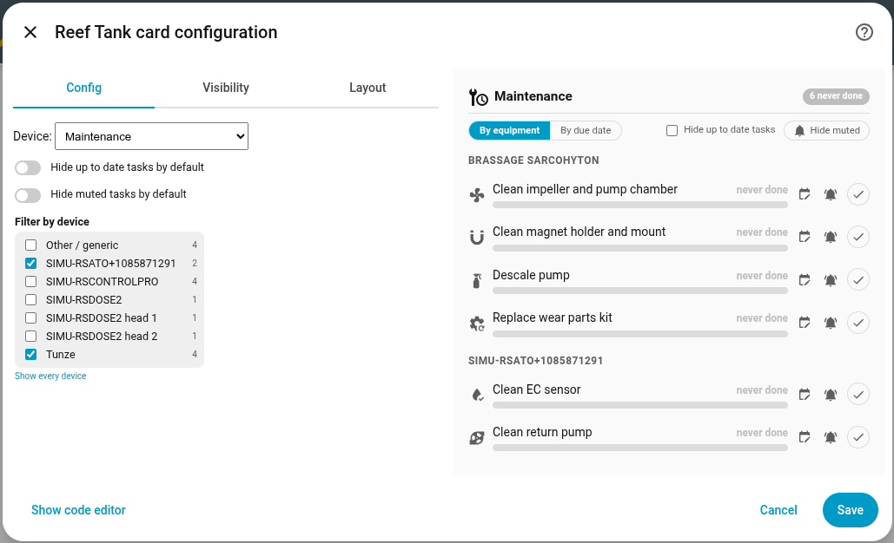
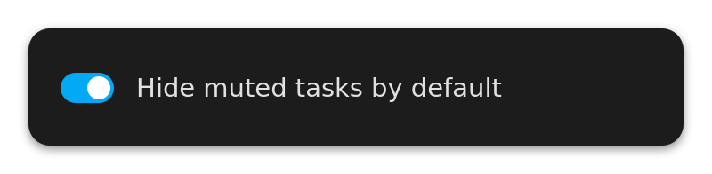

[← Torna alla pagina principale](README.it.md)

# Manutenzione

La vista manutenzione di ha-reef-card in azione:

[](https://www.youtube.com/watch?v=Ko46fHonOP4)


Oltre alle viste per apparecchio, la card offre una vista **Manutenzione** che
raccoglie tutte le attività di manutenzione esposte da `ha-reefbeat-component`,
`ha-reef-maintenance-component` e `ha-aquamedic-component`, come se l'intero
sottosistema di manutenzione fosse un unico dispositivo. La vista cerca il
marcatore che ognuna di esse mette sulle proprie entità, non una particolare
integrazione.

Ogni attività è mostrata come una barra di avanzamento che indica quanta parte
del suo intervallo è trascorsa, con un colore legato al tempo rimanente:

| Colore    | Significato                                                 |
| --------- | ----------------------------------------------------------- |
| Verde     | In regola                                                   |
| Arancione | In scadenza (ultimo 20 % dell'intervallo, almeno un giorno) |
| Rosso     | Scaduta, l'etichetta diventa `+X g`                         |
| Grigio    | Mai eseguita (nessun azzeramento registrato)                |

Le attività si possono ordinare **per apparecchio** (raggruppate, con
un'intestazione per dispositivo) o **per scadenza** (un elenco piatto, la più
urgente per prima). Le attività mai eseguite restano sempre in fondo. Nella
barra degli strumenti ci sono due filtri: una casella che nasconde le attività
ancora in regola e un pulsante **Nascondi silenziate / Mostra silenziate** che
nasconde le attività il cui interruttore di notifica è spento. Il pulsante parte
in posizione «mostra», così silenziare un avviso non fa mai sparire da solo una
scadenza. Questo valore predefinito è configurabile dall'editor della card (o con
`hide_muted` più avanti), e il pulsante ha comunque la precedenza in qualsiasi
momento.

Cliccando una riga si apre la finestra more-info di Home Assistant
dell'attività, e il pulsante rotondo a destra la segna come eseguita (preme
l'entità pulsante sottostante, esattamente come farebbe la finestra more-info).

La vista compare nel selettore dei dispositivi solo quando esiste almeno
un'attività di manutenzione nel tuo impianto. Le nuove attività aggiunte al
catalogo dell'integrazione compaiono automaticamente, senza aggiornare la card.

### Notifiche

Ogni attività riceve anche un **interruttore di notifica** nell'integrazione
(`switch.*_notify`, mostrato come «<nome dell'attività> (notifiche)»).
Spegnerlo silenzia l'avviso di scadenza di quella sola attività senza toccarne
la programmazione: la barra di avanzamento continua a scorrere, la riga si
attenua e la campanella si spegne.

La campanella a destra di ogni riga commuta direttamente quell'interruttore.
Compare solo quando l'integrazione espone l'interruttore. Usa
`show_notify: false` per nascondere le campanelle.

Il blueprint degli avvisi legge esattamente la stessa impostazione, quindi
silenziare un'attività nella card silenzia anche l'automazione.

### Cambiare l'intervallo

Il pulsante calendario di ogni riga apre un cursore in linea che scrive
sull'entità numerica dell'intervallo dell'attività. Il cursore lavora nell'unità
che l'integrazione dichiara per quell'attività (giorni, settimane o mesi, letta
dal ruolo dell'entità), e l'integrazione riconverte in giorni prima di salvare.
I limiti provengono dall'entità stessa, quindi la card non può mai scrivere un
valore fuori intervallo. Resta aperto un solo editor per volta. Usa
`show_interval: false` per nascondere i pulsanti.

### Filtra per dispositivo

Per impostazione predefinita la vista elenca le attività di tutti i dispositivi.
Il blocco **Filtra per dispositivo** dell'editor della card la restringe: spunta
uno o più dispositivi e vengono mantenute solo le loro attività, contatori
compresi.



L'elenco contiene una voce per ogni controller, con il numero di attività che gli
appartengono. I sottodispositivi (teste ReefDose, pompe ReefRun) vengono
raggruppati sotto il loro controller grazie al collegamento `via_device` del
registro di Home Assistant: spuntare **RSDose4** conserva quindi le attività di
tutte e quattro le teste. Nessuna casella spuntata significa «nessun filtro»:
vengono mostrati tutti i dispositivi, che è anche ciò che ripristina la
scorciatoia **Mostra tutti i dispositivi**.

La selezione è salvata come nomi di dispositivo (vedi `devices` più sotto), così
lo YAML resta leggibile. Un nome scritto a mano corrisponde anche ai suoi
sottodispositivi per prefisso, il che copre le installazioni in cui `via_device`
non è dichiarato. I dispositivi senza nome sono identificati dal loro id di
dispositivo di Home Assistant.

### Pompe ReefRun

I sottodispositivi ReefRun si chiamano «… pompa 1» / «… pompa 2», il che non
dice nulla su cosa sia davvero ciascuna pompa. Quando il dispositivo espone sia
un sensore `type` sia un sensore `model`, la card li aggiunge tra parentesi:
**ReefRun pompa 1 (risalita 12000)**, **ReefRun pompa 2 (schiumatoio 900)**.

Il tipo viene tradotto e del modello si conserva solo la cifra finale
(`return-12000` -> `12000`, `rsk-900` -> `900`), dato che il prefisso è
ridondante con il tipo oppure criptico. I dispositivi che non sono pompe
mantengono un nome semplice.

## Icone

| Icona                                                                                                    | Ruolo                                                                                     |
| -------------------------------------------------------------------------------------------------------- | ----------------------------------------------------------------------------------------- |
|                                                          | **Attività eseguita.** Segna l'attività come svolta e riavvia il suo conto alla rovescia. |
|   | **Silenzia / riattiva.** Commuta l'interruttore di notifica di quella sola attività.      |
|                                                  | **Cambia l'intervallo.** Apre un cursore collegato all'intervallo dell'attività.          |

## Editor

Lo stato predefinito dei filtri, il filtro per dispositivo e la visibilità dei
tre pulsanti si impostano dall'editor della card.



## Configurazione

```yaml
type: custom:reef-card
device: __maintenance__
maintenance:
  sort: due # "device" (predefinito) o "due"
  devices: # mostra solo le attività di questi dispositivi (vuoto: tutti)
    - SIMU-RSDOSE4
    - SIMU-RSATO
  hide_ok: false # nascondi le attività né scadute né in scadenza
  hide_muted: false # nascondi le attività con le notifiche spente
  warning_ratio: 0.2 # quota dell'intervallo mostrata in arancione
  show_reset: true # mostra il pulsante "segna come eseguita" su ogni riga
  show_notify: true # mostra la campanella silenzia/riattiva su ogni riga
  show_interval: true # mostra il pulsante di modifica dell'intervallo su ogni riga
```

Tutte le chiavi di `maintenance` sono opzionali. `sort` e `hide_ok` impostano
solo lo stato iniziale: l'utente può cambiarli dalla vista stessa. `devices`
accetta sia nomi di dispositivo sia id di dispositivo di Home Assistant; una
lista vuota (il valore predefinito) disattiva il filtro.

---

[← Torna alla pagina principale](README.it.md)
