[← Torna alla pagina principale](README.it.md)

# ReefLed

ReefLed con ha-reef-card in azione:

Le ReefLed **G1** (RSLED50, RSLED90, RSLED160) e **G2** (RSLED60, RSLED115,
RSLED170) sono supportate, così come i [LED virtuali](#led-virtuale).

> [!NOTE]
> Solo la G1 è stata validata su lampade reali. La G2 è implementata e
> dovrebbe funzionare, ma non è ancora stata testata: i riscontri sono
> benvenuti.

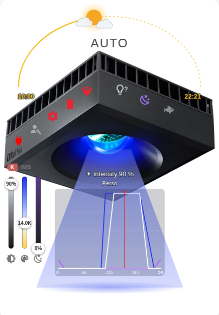
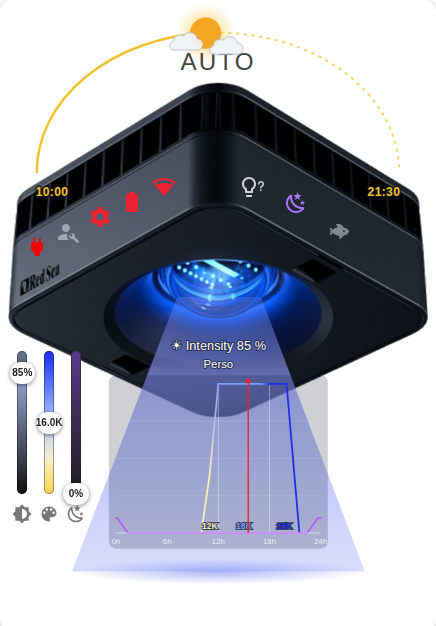

## La vista

La card è divisa in 7 zone:

1. Cielo
2. Faccia sinistra
3. Faccia destra
4. Fascio
5. Cursori
6. Gruppo e meteo
7. Messaggi

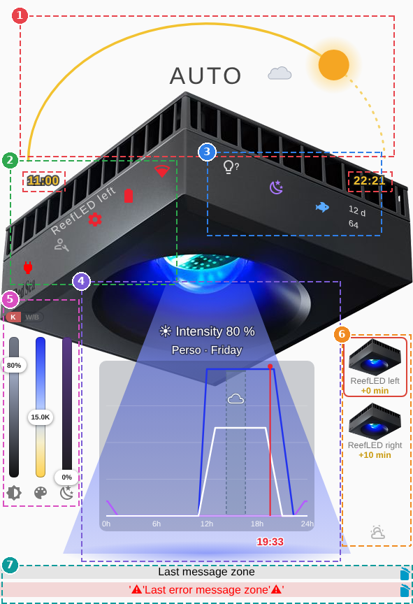

## Cielo

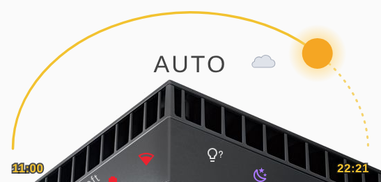

Il percorso del sole tra la prima alba e l'ultimo tramonto del
programma di oggi (canali bianco e blu), con i due orari alle estremità
dell'arco. Di notte il cielo diventa viola, come il LED luna della
lampada: la luna va dal tramonto all'alba successiva e mostra la fase
corrente (`todays_moon_day`). Tocca la modalità al centro per cambiarla
(auto, manuale, timer). Se sono programmate delle nuvole, una piccola
nuvola appare accanto alla modalità; mentre passano, scorrono davanti al
sole.

## Faccia sinistra

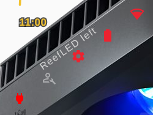

Acceso/spento, manutenzione, configurazione,
batteria e wifi.

Il nome della lampada (quello dato in Home Assistant) è scritto
sulla faccia superiore sinistra della lampada, tra le prese d'aria e le
icone. Un nome lungo viene scritto più piccolo, poi tagliato (il nome
intero appare al passaggio del mouse).

## Faccia destra

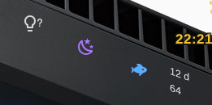

Identificazione (la lampada lampeggia, e anche il
fascio sulla card per 10 s), fase lunare e acclimatazione. Luna e
acclimatazione aprono le loro impostazioni. Durante un'acclimatazione, i
giorni rimanenti e l'intensità corrente sono scritti accanto.

## Fascio

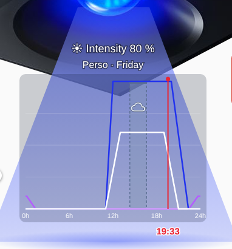

Il suo colore e la sua opacità seguono la luce prodotta in
quel momento (canali bianco, blu e luna). Allo 0 % di intensità, o a
lampada spenta, non c'è fascio e la lente è in grigio. Mostra l'intensità
corrente, il nome del programma di oggi e il suo grafico (bianco, blu e
luna), con un segno rosso all'ora corrente, scritta sotto il grafico. In
modalità meteo GPS segue tra parentesi l'ora del luogo del meteo: il
momento della giornata del luogo che il programma sta eseguendo (le 09:04
in Francia possono essere le 04:04 alle Maldive quando l'alba è ancorata
all'acquario). Fuori dalla modalità automatica il grafico è attenuato. Su
una G2 il grafico mostra l'intensità, con la linea colorata secondo la
temperatura colore (gialla se calda, blu se fredda), con il valore di ogni
zona di colore. Tocca il fascio per modificare il programma. Le nuvole del
giorno appaiono come una banda verticale sulla loro finestra, più scura
quanto più sono forti (Low, Medium, High); lo stesso sul grafico
dell'editor e sulla settimana meteo.

## Cursori

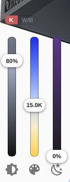

Raggruppati a sinistra: intensità, temperatura colore e
luna. Intensità e colore comandano la luce `kelvin_intensity`, il cursore
della luna la luce `moon`; al rilascio viene inviata una sola chiamata. Su
una G1, il piccolo interruttore **K | W/B** sopra di essi scambia
intensità e colore con i canali bianco e blu; il browser ricorda la scelta
per ogni lampada. Una G2 comanda il suo colore solo tramite kelvin e
intensità, quindi non ha questo interruttore.

## Gruppo e meteo

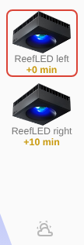

Su una lampada di un gruppo, le lampade del suo gruppo (vedi
[LED virtuale](#led-virtuale)): toccane una per mostrare la sua card. Sotto,
l'icona meteo, accesa mentre la lampada segue il meteo.

## Messaggi

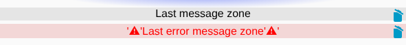

Ultimo messaggio e ultimo avviso sotto il fascio.

## Alba sfalsata

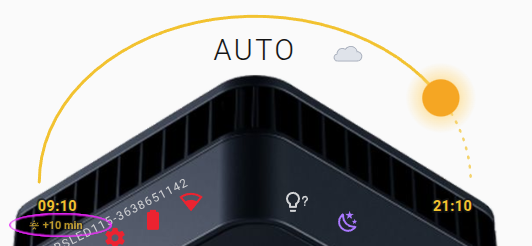

Quando la lampada inizia la giornata in ritardo (il
suo `Sfasamento dell'alba`, impostato da un gruppo o a mano), il
cielo esegue il programma con quel ritardo: posizione del sole, orari di
alba e tramonto, nuvole. Un'etichetta sotto l'ora dell'alba («+15 min»)
apre l'impostazione dello sfasamento, che si trova anche nella finestra di
configurazione (solo lampade che rispondono a `/offset`).

## Programma meteo

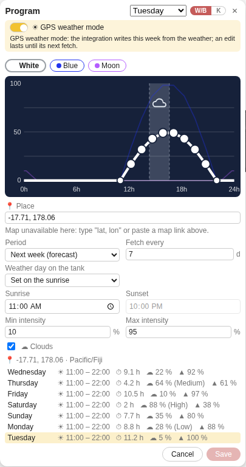

Con il programma meteo di ha-reefbeat-component, l'editor dei programmi ha
un interruttore **Modalità meteo GPS**, e in basso a destra appare
un'icona meteo (`mdi:weather-partly-cloudy`), accesa mentre la lampada
segue il meteo, e blu mentre una settimana meteo viene
scritta nella lampada. È solo informativa: la modalità si sceglie
nell'editor dei programmi.

A modalità attiva, la tabella dei punti lascia il posto alle impostazioni:
il luogo (digitato come `lat, lon`, incollato come link di mappa, cercato
per nome — «Maldive», «Fakarava»… —, con la mappa che vi si sposta, oppure
scelto sulla mappa di Home Assistant quando è disponibile), il periodo
(previsioni della settimana prossima o meteo misurato della settimana
scorsa), ogni quanto viene letto il meteo (da 3 a 15 giorni), come la
giornata del luogo viene posta sull'acquario (l'ora del luogo, ancorata a un
orario di alba o di tramonto, oppure distesa tra i due), le intensità minima
e massima e le nuvole. Ogni modifica è subito in anteprima: il grafico
mostra la giornata che darebbe il meteo, e la settimana è elencata giorno
per giorno (il sole sull'acquario, gli orari del luogo al passaggio del
mouse, il soleggiamento, la copertura nuvolosa con le nuvole della lampada e
l'intensità massima); un giorno dell'elenco viene mostrato nel grafico. Non
viene scritto nulla prima di **Salva**: l'editor mostra
«Salvataggio delle impostazioni…», poi «Impostazioni salvate» quando
l'integrazione ha salvato le impostazioni e la modalità e ha generato la
settimana, e si chiude; la settimana viene scritta nella lampada subito
dopo, in background. **Annulla** non cambia nulla.

I colori delle giornate meteo li scegli tu: a modalità attiva, il grafico
mostra le fasce della giornata e se ne può cambiare solo il colore. I colori
impostati diventano quelli della giornata meteo mostrata, o di tutti i
giorni con _Tutti i giorni_, al posto dei colori del programma
proprio della lampada; vengono mostrati in anteprima e salvati con le altre
impostazioni.

Disattivata su una lampada in modalità meteo, l'editor mostra il programma
proprio della lampada messo da parte, da modificare: **Salva** lo
ripristina (con la giornata modificata, se c'è). Un'impostazione cambiata
fuori dalla card (entità di Home Assistant, automazioni) appare entro un
secondo, e la lampada viene scritta 30 s dopo l'ultima modifica.

## LED virtuale

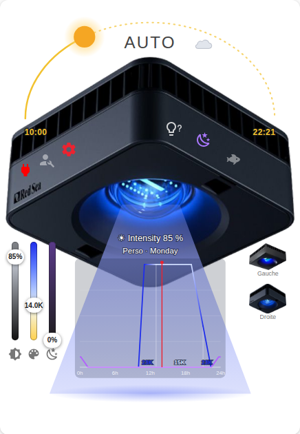

Un LED virtuale comanda più lampade come una sola. Mostra la stessa vista di
una lampada reale: quella G2 non appena una delle sue lampade è una G2 (il
gruppo si comanda allora solo tramite kelvin e intensità), quella G1 quando
tutte le sue lampade sono G1 (con l'interruttore **K | W/B**). Un LED
virtuale non ha batteria, wifi né messaggi; al loro posto, le sue lampade
sono elencate in basso a destra, ciascuna con una miniatura della sua
generazione. Toccane una per mostrare la sua card (il pulsante indietro
riporta al LED virtuale).

Un LED virtuale è un gruppo, come i LED «raggruppati» dell'app ReefBeat: ciò
che viene impostato su di esso, o su una delle sue lampade (modalità, colore
manuale, timer, programmi, acclimatazione, fase lunare, modalità meteo),
viene applicato a tutte le lampade del gruppo. Anche una lampada di un
gruppo elenca le lampade del suo gruppo, essa stessa cerchiata in rosso. Con
un'alba sfalsata, lo sfasamento di ogni lampada è scritto sotto il suo nome
(+0 min, +10 min…). Quando una lampada del gruppo non è disponibile,
l'integrazione rifiuta la modifica e nomina la lampada: non viene inviato
nulla, così il gruppo resta sincronizzato.

Il programma mostrato viene letto dalla prima lampada del gruppo (un
programma G1 viene mostrato in kelvin nella vista G2). **Salva** scrive
il programma modificato su ogni lampada, nel suo formato: bianco/blu per una
G1 (convertito con la tabella del suo modello), punti `color` per una G2. Le
scritture sono distanziate, perché una lampada risponde in ritardo a un
comando inviato troppo presto: nel frattempo l'editor mostra l'avanzamento
(«Invio del programma alle lampade… 3/14»).

> [!NOTE]
> L'elenco delle lampade richiede ha-reefbeat-component con il sensore
> `linked_leds`. Senza di esso, la card sceglie la vista G2 quando il LED
> virtuale non ha luci bianco/blu, e scrive i programmi sulla voce del LED
> virtuale stesso.

## Editor dei programmi

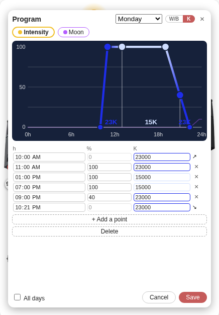

Tocca il fascio per modificare un programma giornaliero: in alto il grafico,
sotto i punti del canale selezionato (ora, intensità e, su una G2,
temperatura colore). I punti si possono anche trascinare sul grafico. Su una
G1, l'interruttore **W/B | K** dell'editor modifica il programma canale per
canale oppure come intensità + temperatura colore; viene sempre salvato come
bianco/blu. La conversione è fatta dall'integrazione (`redsea.led_convert`:
la tabella del modello e l'opzione di compensazione dell'intensità), con
un'alternativa locale per le versioni precedenti dell'integrazione. La prima
e l'ultima riga sono l'alba e il tramonto del canale: la loro intensità
resta allo 0 %. **Salva** invia il programma del giorno mostrato, o di
tutti i giorni con _Tutti i giorni_.

### Libreria cloud

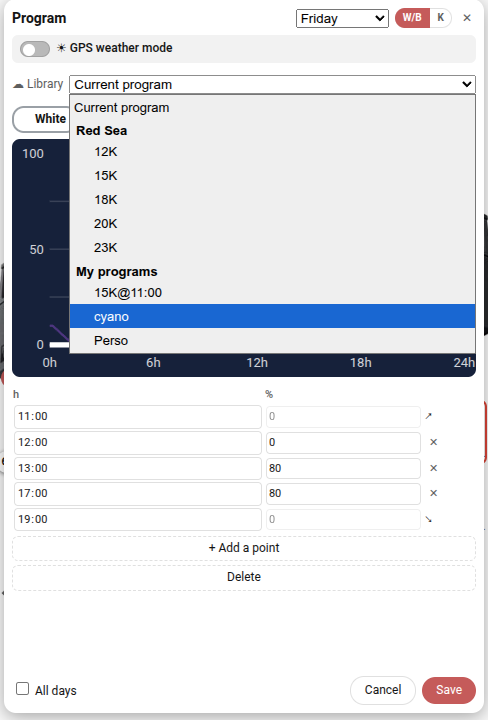

Quando la lampada è collegata a un account cloud ReefBeat (la voce cloud
dell'integrazione), l'editor propone i programmi della sua libreria, come li
conserva l'app ReefBeat (G1: per acquario; G2: per account, in una libreria
propria): sceglierne uno lo carica (un programma G1 viene mostrato in kelvin
su una G2, uno G2 viene modificato in kelvin su una G1 e salvato come
bianco/blu). Salvato così com'è, la lampada riceve il suo nome e le sue
nuvole, come con l'app ReefBeat.

I programmi sono elencati in due gruppi: quelli di Red Sea (12K, 15K, 18K,
20K, 23K e RS Accelerated Growth su una G1; 15K, 23K, Shallow Reef e Deep
Reef, integrati nell'app, su una G2) e i tuoi. Come nell'app, un programma
Red Sea può essere caricato ma né aggiornato né eliminato; uno dei tuoi può
essere eliminato (🗑, dopo una conferma).

Un programma modificato viene salvato nella libreria prima di essere inviato
alla lampada: la card ne chiede il nome, `prog-YYYYMMDDHHMM` per
impostazione predefinita. Quando proviene da uno dei tuoi programmi, il nome
è quello di quel programma e scegli tra **Aggiorna** (il
programma della libreria viene sostituito) e **Salva come nuovo**. Un
LED virtuale usa la libreria della sua prima lampada collegata.

> [!NOTE]
> La libreria richiede ha-reefbeat-component con i servizi
> `redsea.led_library`, `redsea.led_library_save` e
> `redsea.led_library_delete`.

> [!NOTE]
> La lampada conserva i suoi programmi su una linea temporale settimanale
> (il giorno N inizia a (N - 1) × 1440 min); la card mostra e modifica
> ogni giorno sulle sue 24 h. Una G2 conserva il suo programma come punti
> `color` `{t, i1, k1, i2, k2}` (un valore in ingresso e uno in uscita per
> punto) più la luna, e le sue nuvole su `/clouds/<day>` come una G1. La
> card legge e scrive questo formato; legge anche il programma come lo
> vede il parser G1 dell'app (bianco = intensità, blu = temperature colore).

> [!NOTE]
> L'avanzamento dell'acclimatazione richiede ha-reefbeat-component con i
> sensori `acclimation_remaining_days` e
> `acclimation_current_intensity_factor`. Con il suo sensore
> `current_program`, il fascio mostra il nome del programma che la lampada
> dichiara di eseguire.

---

[← Torna alla pagina principale](README.it.md)
