# ha-reef-card 🌊 dla HomeAssistant

> Część **[Ekosystemu ReefTech Project](https://elwinmage.github.io/reeftank/pl.html)**

<p align="center">
  
</p>

[](https://github.com/Elwinmage/ha-reef-card/releases)
[](https://github.com/Elwinmage/ha-reef-card/commits/main)
[](https://opensource.org/licenses/MIT)

<!-- [](https://github.com/hacs/integration) -->

[](https://www.typescriptlang.org/)
[](https://lit.dev/)
[](https://codecov.io/gh/Elwinmage/ha-reef-card)
[![BuyMeCoffee][buymecoffeebadge]][buymecoffee]

# Obsługiwane języki : [](../fr/README.fr.md) [](../../README.md) [](../es/README.es.md) [](../pt/README.pt.md) [](../de/README.de.md) [](../it/README.it.md) [](README.pl.md)

<!-- Vous souhaitez aider à la traduction, suivez ce [guide](https://github.com/Elwinmage/ha-reef-card/blob/main/doc/TRANSLATION.md). -->

Twój język nie jest jeszcze obsługiwany i chcesz pomóc w tłumaczeniu? Postępuj zgodnie z tym [przewodnikiem](https://github.com/Elwinmage/ha-reef-card/blob/main/doc/TRANSLATION.md).

# Prezentacja

**Reef card** dla Home Assistant pomaga zarządzać akwarium rafowym.

W połączeniu z [ha-reefbeat-component](https://github.com/Elwinmage/ha-reefbeat-component) automatycznie obsługuje urządzenia
Redsea (ReefBeat), a [ha-reef-maintenance-component](https://github.com/Elwinmage/ha-reef-maintenance-component) dodaje do
widoku konserwacji sprzęt, z którym Home Assistant nie potrafi się porozumieć.

Obsługa urządzeń Aqua Medic z [ha-aquamedic-component](https://github.com/Elwinmage/ha-aquamedic-component) jest w drodze;
ich zadania konserwacyjne pojawiają się już w tym samym widoku.

<!-- ecosystem:start -->

## Powiązane projekty

Projekty ReefTech uzupełniają się: integracje wprowadzają sprzęt do Home Assistant, karta go wyświetla i steruje nim, a zasilanie awaryjne utrzymuje go w ruchu podczas przerwy w zasilaniu. Każdy działa również samodzielnie.

<table>
  <tr>
    <th width="100px"></th>
    <th>Projekt</th>
    <th>Rola</th>
    <th>Współpracuje z</th>
  </tr>
  <tr>
    <td></td>
    <td><a href="https://github.com/Elwinmage/ha-reefbeat-component"><b>ha-reefbeat-component</b></a></td>
    <td>Urządzenia Red Sea ReefBeat, sterowane lokalnie bez chmury: ReefATO+, ReefControl, ReefControl-Power, ReefDose, ReefLed, ReefMat, ReefRun i ReefWave.<br />blueprint alertów dla nietypowych trybów, kalibracji i niskiego poziomu baterii. <a href="https://my.home-assistant.io/redirect/blueprint_import/?blueprint_url=https://raw.githubusercontent.com/Elwinmage/ha-reefbeat-component/refs/heads/main/blueprints/automation/redsea_alerts.en.yaml"></a></td>
    <td>ha-reef-card</td>
  </tr>
  <tr>
    <td></td>
    <td><a href="https://github.com/Elwinmage/ha-aquamedic-component"><b>ha-aquamedic-component</b></a></td>
    <td>Pompy Aqua Medic przez chmurowe API Gizwits: pompy cyrkulacyjne EcoDrift i SmartDrift, pompy DC Runner obiegowe i do odpieniacza.</td>
    <td>ha-reef-card</td>
  </tr>
  <tr>
    <td></td>
    <td><a href="https://github.com/Elwinmage/ha-reef-maintenance-component"><b>ha-reef-maintenance-component</b></a></td>
    <td>Śledzenie czyszczenia i zużycia sprzętu, do którego Home Assistant nie ma dostępu: pompy cyrkulacyjne, pompy obiegowe, odpieniacze, reaktory, wszystko co obsługujesz ręcznie.</td>
    <td>ha-reef-card</td>
  </tr>
  <tr>
    <td></td>
    <td><b>ha-reef-card</b><br /><i>(to repozytorium)</i></td>
    <td>Interaktywny widok graficzny każdego urządzenia na pulpicie i jedyny sposób edycji zaawansowanych harmonogramów. Odczytuje trzy integracje przez wspólny kontrakt <code>reef_role</code>, bez konfiguracji po stronie karty.</td>
    <td>wszystkie trzy integracje</td>
  </tr>
  <tr>
    <td></td>
    <td><a href="https://github.com/Elwinmage/ha-reef-blueprints"><b>ha-reef-blueprints</b></a></td>
    <td>Blueprinty powiadomień wspólne dla całego ekosystemu: zaległe konserwacje znajdowane przez kontrakt <code>reef_role</code> oraz urządzenia, które przestały odpowiadać. Osiem języków.</td>
    <td>wszystkie trzy integracje</td>
  </tr>
  <tr>
    <td></td>
    <td><a href="https://github.com/Elwinmage/reefbeatEnergyBackup"><b>reefbeatEnergyBackup</b></a></td>
    <td>Zasilanie awaryjne na wypadek przerw w zasilaniu. Pakiet 24V LiFePO₄ sterowany przez Raspberry Pi, ze stopniowym obniżaniem prędkości pomp zależnie od stanu naładowania.</td>
    <td>samodzielnie lub razem z ha-reefbeat-component</td>
  </tr>
</table>

Wszystkie są udokumentowane razem na [stronie projektu ReefTech](https://elwinmage.github.io/reeftank/).

<!-- ecosystem:end -->

# Zgodność

✅ Zaimplementowano ☑️ W trakcie ❌ Zaplanowano

<table>
  <th>
    <td ><b>Model</b></td>
    <td colspan="2"><b>Status</b></td>
    <td><b>Issues</b>  <br/>📆(Zaplanowano) <br/> 🐛(Błędy)</td>
  </th>
  <tr>
    <td><a href="#reefato">ReefATO+</a></td>
    <td>RSATO+</td><td>☑️</td>
    <td width="200px"></td>
    <td>
      <a href="https://github.com/Elwinmage/ha-reef-card/issues?q=is:issue state:open label:rsato,all label:enhancement" style="text-decoration:none">📆</a>
      <a href="https://github.com/Elwinmage/ha-reef-card/issues?q=is:issue state:open label:rsato,all label:bug" style="text-decoration:none">🐛</a>
    </td>
  </tr>

  </tr>
    <tr>
    <td><a href="#reefcontrol">ReefControl</a></td>
    <td>RSSENSE<br /> Jeśli go posiadasz, możesz skontaktować się ze mną <a href="https://github.com/Elwinmage/ha-reefbeat-component/discussions/8">tutaj</a>, a dodam jego obsługę.</td><td>❌</td>
    <td width="200px"></td>
    <td>
      <a href="https://github.com/Elwinmage/ha-reefbeat-component/issues?q=is:issue state:open label:rscontrol,all label:enhancement" style="text-decoration:none">📆</a>
      <a href="https://github.com/Elwinmage/ha-reefbeat-component/issues?q=is:issue state:open label:rscontrol,all label:bug" style="text-decoration:none">🐛</a>
    </td>
      </tr>  
  <tr>
    <td rowspan="2"><a href="#reefdose">ReefDose</a></td>
    <td>RSDOSE2</td>
    <td>✅</td>
    <td width="200px"></td>
      <td rowspan="2">
      <a href="https://github.com/Elwinmage/ha-reef-card/issues?q=is:issue state:open label:rsdose,all label:enhancement" style="text-decoration:none">📆</a>
      <a href="https://github.com/Elwinmage/ha-reef-card/issues?q=is:issue state:open label:rsdose,all label:bug" style="text-decoration:none">🐛</a>
    </td>
  </tr>
  <tr>
    <td>RSDOSE4</td><td>✅</td>
    <td width="200px"></td>
    </tr>
  <tr>
    <td rowspan="2"> <a href="#reefled">ReefLed</a></td>
    <td>G1</td>
    <td>❌</td>
    <td width="200px"></td>
<td rowspan="2">   
    <a href="https://github.com/Elwinmage/ha-reef-card/issues?q=is:issue state:open label:rsled,all label:enhancement" style="text-decoration:none">📆</a>
      <a href="https://github.com/Elwinmage/ha-reef-card/issues?q=is:issue state:open label:rsled,all label:bug" style="text-decoration:none">🐛</a>
</td>
  </tr>
   <td >G2</td>
    <td>❌</td>
    <td width="200px"></td>
  </tr>
  <tr>
    <td rowspan="3"><a href="#reefmat">ReefMat</a></td>
    <td>RSMAT250</td>
    <td>✅</td>
    <td rowspan="3" width="200px"></td>
    <td rowspan="3">
      <a href="https://github.com/Elwinmage/ha-reef-card/issues?q=is:issue state:open label:rsmat,all label:enhancement" style="text-decoration:none">📆</a>
      <a href="https://github.com/Elwinmage/ha-reef-card/issues?q=is:issue state:open label:rsmat,all label:bug" style="text-decoration:none">🐛</a>
    </td>
  </tr>
  <tr>
    <td>RSMAT500</td>
    <td>✅</td>
  </tr>
  <tr>
    <td>RSMAT1200</td>
    <td>✅</td>
  </tr>
  <tr>
    <td><a href="#reefrun">ReefRun</a></td>
    <td>RSRUN</td><td>✅</td>
    <td width="200px"></td>
    <td>
      <a href="https://github.com/Elwinmage/ha-reef-card/issues?q=is:issue state:open label:rsrun,all label:enhancement" style="text-decoration:none">📆</a>
      <a href="https://github.com/Elwinmage/ha-reef-card/issues?q=is:issue state:open label:rsrun,all label:bug" style="text-decoration:none">🐛</a>
    </td>
  </tr>
  <tr>
    <td><a href="#reefwave">ReefWave</a></td>
    <td>RSWAVE</td><td>❌</td>
    <td width="200px"></td>
    <td>
      <a href="https://github.com/Elwinmage/ha-reef-card/issues?q=is:issue state:open label:rswave,all label:enhancement" style="text-decoration:none">📆</a>
      <a href="https://github.com/Elwinmage/ha-reef-card/issues?q=is:issue state:open label:rswave,all label:bug" style="text-decoration:none">🐛</a>
    </td>
  </tr>
</table>

# Spis treści

- [Instalacja](https://github.com/Elwinmage/ha-reef-card/#installation)
- [Konfiguracja](https://github.com/Elwinmage/ha-reef-card/#configuration)
- [ReefATO+](https://github.com/Elwinmage/ha-reef-card/#reefato)
- [ReefControl](https://github.com/Elwinmage/ha-reef-card/#reefcontrol)
- [ReefDose](https://github.com/Elwinmage/ha-reef-card/#reefdose)
- [ReefLED](https://github.com/Elwinmage/ha-reef-card/#reefled)
- [ReefMat](https://github.com/Elwinmage/ha-reef-card/#reefmat)
- [ReefRun](https://github.com/Elwinmage/ha-reef-card/#reefrun)
- [ReefWave](https://github.com/Elwinmage/ha-reef-card/#reefwave)
- [Konserwacja](https://github.com/Elwinmage/ha-reef-card/#maintenance)
- [FAQ](https://github.com/Elwinmage/ha-reef-card/#faq)

# Instalacja

## Bezpośrednia instalacja

Kliknij tutaj, aby przejść bezpośrednio do repozytorium w HACS i kliknij „Pobierz": [](https://my.home-assistant.io/redirect/hacs_repository/?owner=Elwinmage&repository=ha-reef-card&category=plugin)

## Wyszukaj w HACS

Lub wyszukaj «reef-card» w HACS.

<p align="center">

</p>

# Konfiguracja

Bez parametru `device` karta automatycznie wykrywa wszystkie urządzenia ReefBeat i pozwala wybrać żądane.

Aby usunąć wybór urządzenia i wymusić konkretne, ustaw parametr `device` na nazwę swojego urządzenia.

<table>
  <tr>
<td></td>
<td></td>
    </tr>
</table>

# ReefATO

ReefATO+ z ha-reef-card w akcji:

<!-- TODO: replace RSATO_VIDEO_ID by the youtube id of the ReefATO+ video -->

[](https://www.youtube.com/watch?v=RSATO_VIDEO_ID)

Karta ReefATO+ pozwala wizualnie sterować sterownikiem RSATO+, zbiornikiem wody
osmotycznej z pompą, sondą poziomu przypiętą do szyby i sondą zalania leżącą na
podłodze.

Sonda poziomu ReefATO+ jest rysowana zawsze. **Pompa** i **sonda zalania** są
opcjonalne. To, czego urządzenie nie zgłasza, nie jest w ogóle rysowane, a
zależne od tego przyciski znikają razem z nim: ReefATO+ bez sondy zalania
pokazuje kartę bez sondy zalania, a nie sondę wyszarzoną.

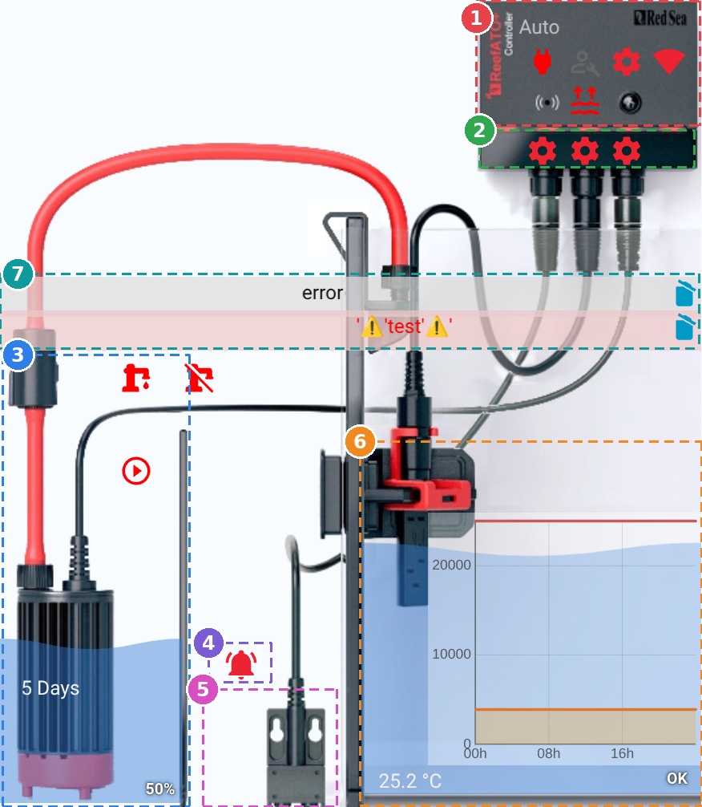

Karta jest podzielona na 7 stref:

1. Sterownik: tryb pracy, zasilanie, tryb serwisowy, konfiguracja, Wifi i automatyczne uzupełnianie
2. Ustawienia akcesoriów: pompa uzupełniająca, sonda zalania, sonda poziomu
3. Zbiornik wody osmotycznej: przyciski napełniania, pozostała objętość i zapas
4. Brzęczyk
5. Sonda zalania
6. Akwarium: poziom wody, temperatura i dzienne zużycie
7. Ostatni komunikat i ostatni alarm

## Sterownik

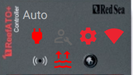

---

Tekst na froncie sterownika to **tryb pracy** zgłaszany przez urządzenie (Auto,
Ręczny, Zalanie…), przetłumaczony na język Home Assistant.

<span>Przełącznik  włącza i wyłącza ReefATO+.</span>

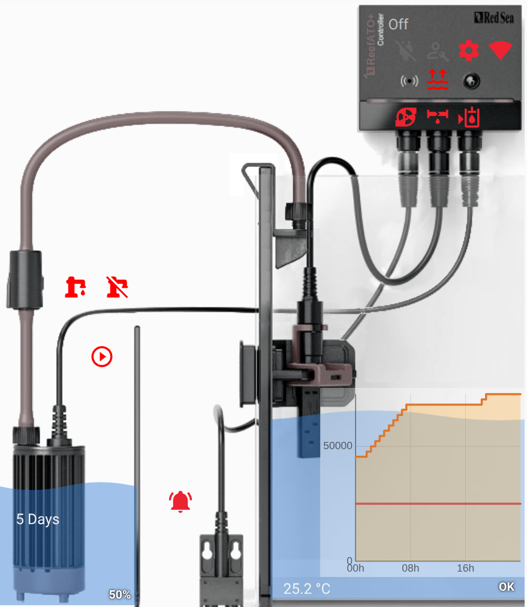

<span>Przełącznik  przełącza w tryb serwisowy.</span>

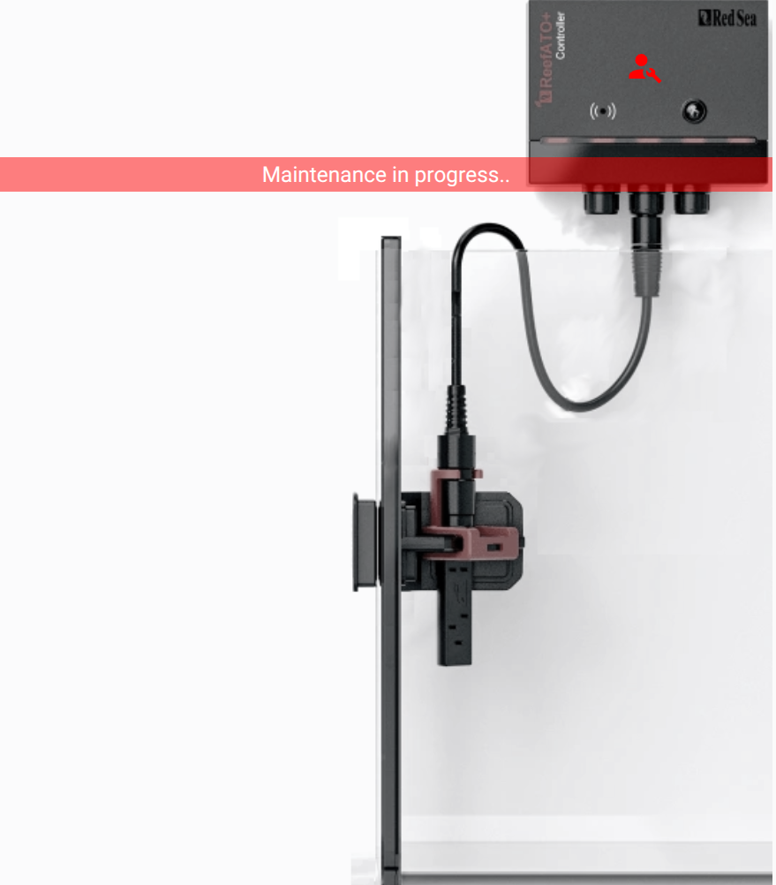

<span>Kliknij ikonę , aby zarządzać ogólną konfiguracją ReefATO+: odświeżyć ustawienia lub pobierane dane, zresetować urządzenie, zaktualizować jego firmware.</span>

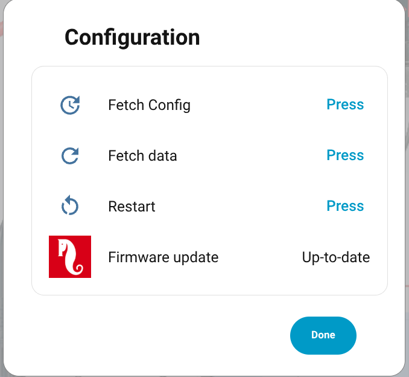

<span>Kliknij ikonę , aby zarządzać ustawieniami sieci.</span>

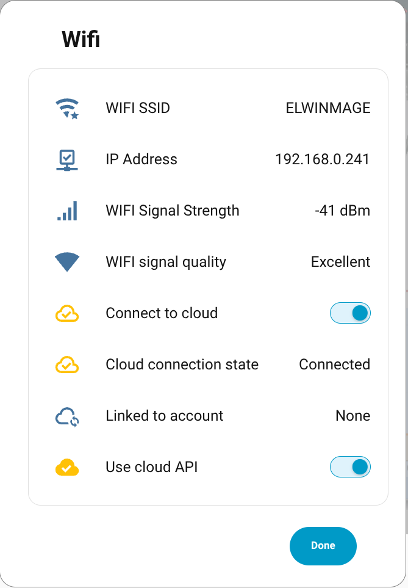

<span>Przełącznik 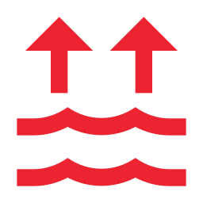 w drugim rzędzie włącza lub wyłącza **automatyczne uzupełnianie**. Wyłączone, urządzenie nigdy nie napełnia samo z siebie i na pompę działają już tylko przyciski ze strefy 3. Jest ukryty, gdy nie sparowano żadnej pompy.</span>

## Ustawienia akcesoriów

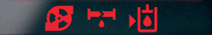

---

Trzy ikony odpowiadają trzem gniazdom na panelu przednim, w tej samej kolejności:
od lewej do prawej **pompa uzupełniająca**, **sonda zalania** i **sonda
poziomu**. Każda otwiera okno dialogowe poświęcone temu akcesorium. Ikony pompy i
sondy zalania znikają razem z akcesorium, gdy ich gniazdo nie jest używane.

<span>Ikona pompy  pokazuje stan pracy, zmierzone zużycie i wydajność, trzy progi prądowe, według których firmware rozpoznaje pracę na sucho lub zablokowanie, oraz to, co wywołało ostatnie napełnianie.</span>

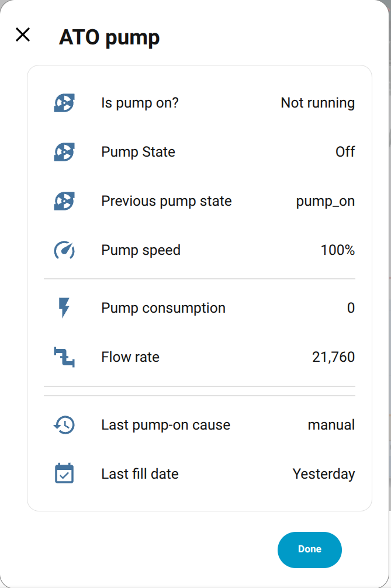

<span>Ikona sondy zalania 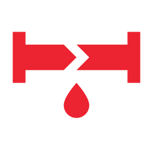 pokazuje, czy sonda jest podłączona, czy jest uzbrojona, werdykt sucho/mokro wraz z surowym odczytem, który za nim stoi, oraz brzęczyk sterowany przez tę sondę.</span>

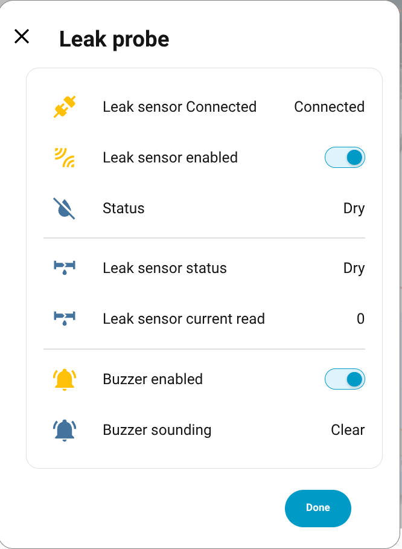

<span>Ikona sondy poziomu 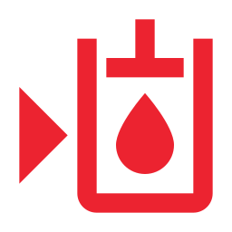 pokazuje najpierw kondycję sondy — podłączona, skalibrowana, do sprawdzenia, błąd — bo nieskalibrowana lub zabrudzona sonda odbiera wartość wszystkim kolejnym odczytom. Potem sam poziom, dwie elektrody, które go wyznaczają, czujnik temperatury w tej samej obudowie oraz oznaczenie i daty serwisu wkładu.</span>

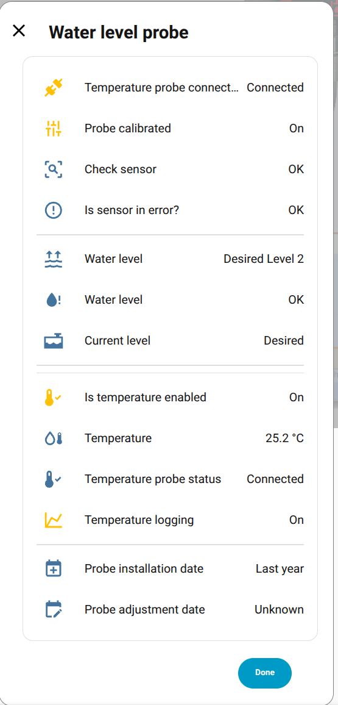

## Zbiornik wody osmotycznej

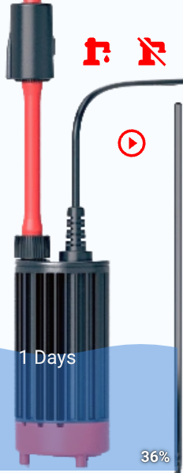

---

Ta strefa to zbiornik, z którego czerpie uzupełnianie, oraz trzy przyciski
sterujące jego pompą ręcznie:

<table>
  <tr>
    <td align="center">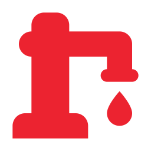<br/><b>Napełnij</b><br/>Uruchamia ręczne napełnianie</td>
    <td align="center">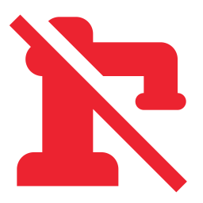<br/><b>Zatrzymaj</b><br/>Przerywa trwające napełnianie</td>
    <td align="center"><br/><b>Wznów</b><br/>Ponownie włącza pompę</td>
  </tr>
</table>

Ta część pokazuje poziom zapasu wody, wyliczony z zadeklarowanej pojemności
zbiornika i rzeczywistej wartości. Pusty zbiornik wciąż pokazuje linię wody — tę,
której pompa nie jest w stanie zassać. Poniżej 10 % woda miga, sygnalizując, że
zbiornik wkrótce się opróżni.

Kliknięcie wody otwiera okno zbiornika, w którym można edytować pojemność:

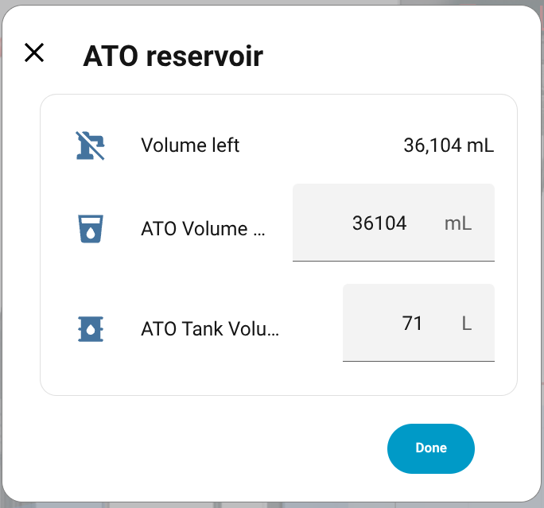

Liczba w lewym dolnym rogu zbiornika to **zapas**: liczba dni pozostałych do jego
opróżnienia, wyliczona przez integrację ze średniego zużycia dziennego.
Kliknięcie jej otwiera kartę informacyjną.

W trakcie napełniania woda wypływa z wylotu nad sumpem.

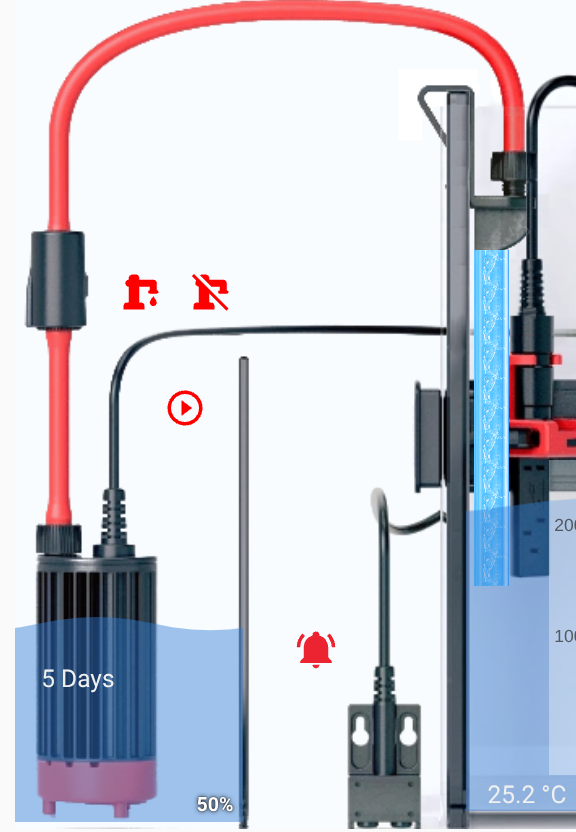

## Brzęczyk


---

<span>Dzwonek   odzwierciedla ustawienie brzęczyka w urządzeniu i szarzeje, gdy jest on wyłączony.</span>

Kliknięcie otwiera okno brzęczyka: samo ustawienie, informację, czy brzęczyk
właśnie dzwoni, oraz stan sondy zalania jako kontekst.

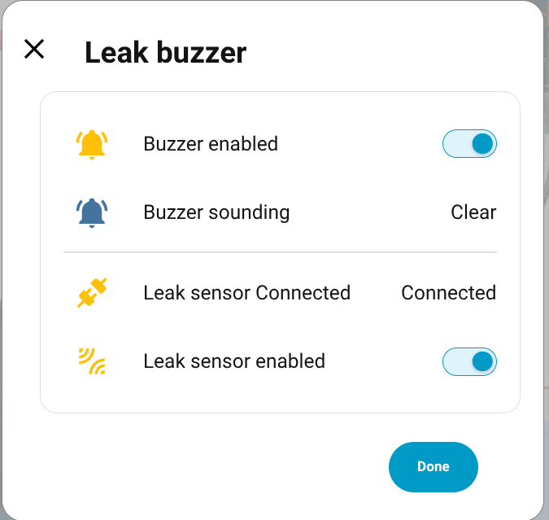

**Długie przytrzymanie** przełącza brzęczyk bezpośrednio. Oba gesty są celowo
rozdzielone: wyciszenie alarmu to ustawienie bezpieczeństwa, a nie coś, co robi
się przypadkiem, sięgając po szczegóły.

> [!NOTE]
> Brzęczyk to nie tylko alarm zalania: urządzenie uruchamia go także przy awariach
> pompy, więc pozostaje dostępny w ReefATO+ bez sondy zalania. Ikona jest ukryta
> tylko w tych wersjach integracji, które nie udostępniają jeszcze tego
> ustawienia.

## Sonda zalania

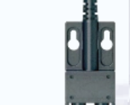

---

Sonda jest rysowana tylko wtedy, gdy jest fizycznie podłączona. Podłączona, ale
wyłączona w aplikacji, jest wyszarzona: jest na miejscu, ale niczego nie wykrywa.

Gdy woda zostanie wykryta, sonda miga, a u dołu obrazu rozlewa się kałuża.

<table>
  <tr>
    <th align="center">Zalanie od akwarium</th>
    <th align="center">Zalanie od zbiornika osmotycznego</th>
    <th align="center">Zalanie o nieznanym źródle</th>
  </tr>
  <tr>
    <td align="center">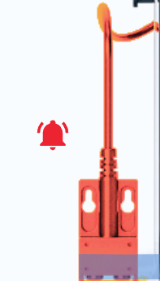</td>
    <td align="center">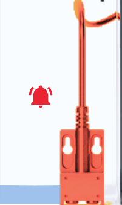</td>
    <td align="center">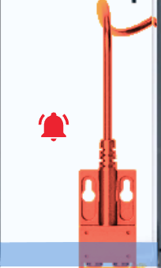</td>
  </tr>
</table>

## Akwarium

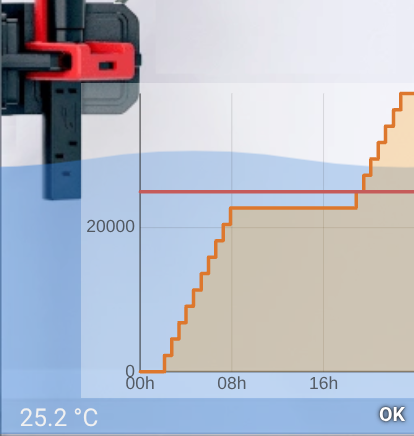

---

Poziom wody w tej części pokazuje stan wykrywania sondy ATO.

| Stan            | Znaczenie                                               |
| --------------- | ------------------------------------------------------- |
| Poniżej         | Powierzchnia jest pod sondą: uzupełnianie nie nadąża    |
| Poziom żądany 1 | Pierwsza kreska uzupełniania                            |
| Poziom żądany 2 | Druga kreska uzupełniania                               |
| Powyżej         | Powierzchnia jest nad sondą: akwarium jest przepełnione |

Oba skrajne stany są nieprawidłowe, więc **Poniżej** i **Powyżej** powodują
miganie wody. Sonda w stanie błędu albo encja, która jeszcze nic nie zgłosiła,
nie ma żadnej wysokości: karta rysuje wtedy znak braku odczytu zamiast pustego
akwarium.

<table>
  <tr>
    <th align="center">Poniżej</th>
    <th align="center">Poziom żądany 1</th>
    <th align="center">Poziom żądany 2</th>
    <th align="center">Powyżej</th>
    <th align="center">Brak odczytu</th>
  </tr>
  <tr>
    <td align="center">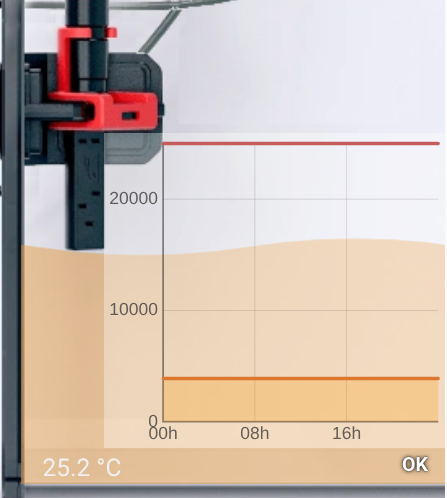</td>
    <td align="center">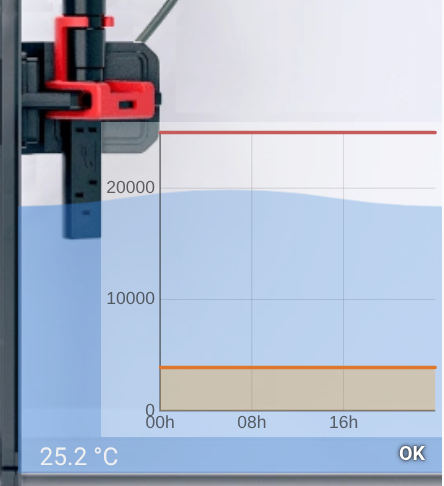</td>
    <td align="center">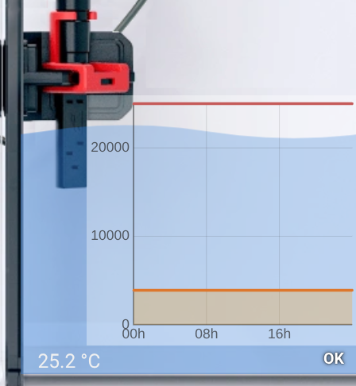</td>
    <td align="center">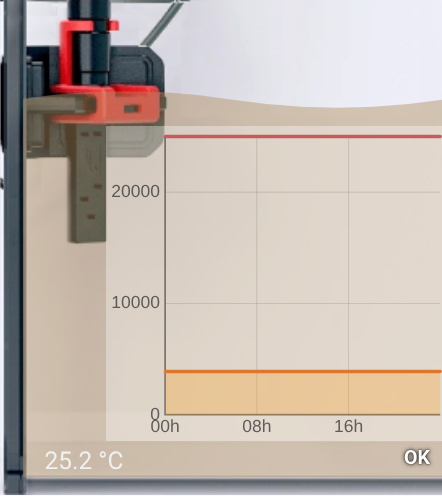</td>
    <td align="center">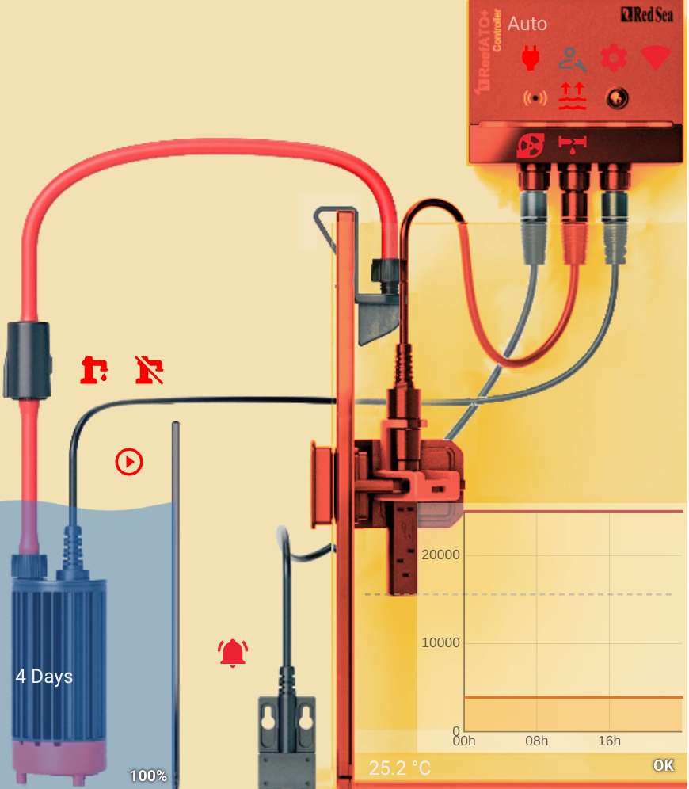</td>
  </tr>
</table>

Temperatura na dole akwarium pochodzi z czujnika wbudowanego w sondę poziomu i
jest zgłaszana tylko wtedy, gdy jest on włączony w urządzeniu.

Wykres w rogu to **zużycie dnia**: objętość uzupełniona od północy, wypełniona na
pomarańczowo, na tle kroczącej średniej dziennej na czerwono. Okno jest przypięte
do doby kalendarzowej, a nie do kroczących 24 godzin, ponieważ licznik zeruje się
o północy.

Kliknięcie wykresu otwiera okno zużycia, tę samą historię z wypisanymi liczbami:
napełnienia i objętość, zmierzone dziś, jako średnia dzienna i jako suma od
początku, plus to, co zostało w zbiorniku, żeby je zasilić.

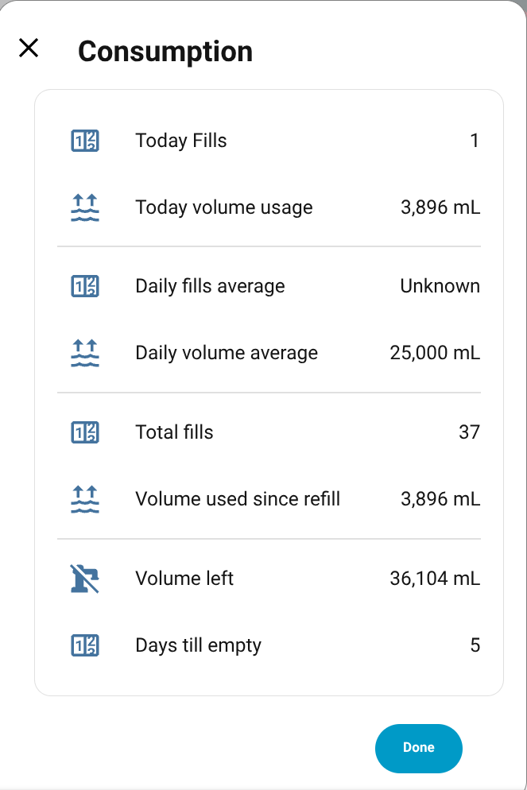

## Usterki

Karta nie ma osobnej kontrolki ostrzegawczej: miga to, co jest uszkodzone, pod
jasnoczerwonym odcieniem.

| Migający element | Co zgłasza urządzenie                                                                                    |
| ---------------- | -------------------------------------------------------------------------------------------------------- |
| Pompa            | Awaria, zablokowana pompa, zbyt długie napełnianie, pusty zbiornik lub brak sondy poziomu                |
| Sonda zalania    | Wykryto wodę, po stronie osmozy albo po stronie akwarium                                                 |
| Poziom wody      | Powierzchnia jest poniżej lub powyżej sondy                                                              |
| Cały obraz       | Sonda poziomu prosi o sprawdzenie albo przestała mierzyć — każdy pokazany poziom staje się niewiarygodny |

Pompa zgłoszona jako nieobecna nie jest usterką: pompa, przyciski napełniania,
zbiornik i wykres zużycia po prostu nie są rysowane.

## Komunikaty

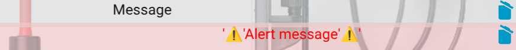

---

Ta strefa pokazuje ostatnie komunikaty systemowe ReefATO+. Ma dwie linie:

- Szara linia pokazuje **ostatni komunikat**.
- Różowa linia pokazuje **ostatni alarm**, poprzedzony symbolem ⚠.

Kliknięcie ikony  kasuje odpowiedni komunikat.

Te linie można ukryć z poziomu edytora karty.

## Edytor karty

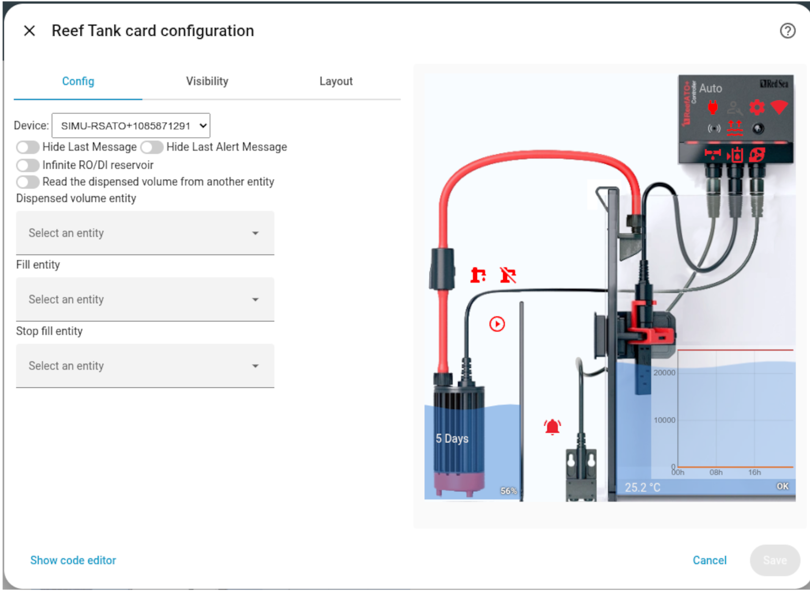

---

Poza dwiema liniami komunikatów ReefATO+ ma trzy opcje. Istnieją z myślą o
obiegu uzupełniania, do którego urządzenie nie zostało zaprojektowane: o osmozie
podłączonej wprost do sumpa, z zaworem sterowanym przez Home Assistant zamiast
przez pompę Red Sea.

### Nieograniczony zbiornik wody osmotycznej

Domyślnie wyłączona. Osmoza uzupełniająca na bieżąco nie ma pojemnika, więc nic
nie może się skończyć — a wszystko, co karta mówi o zbiorniku, dotyczy bańki,
której nie ma.

Po włączeniu znikają procent na zbiorniku i okno pod nim, zapas zmienia się w ∞,
a ikona ustawień pompy i przycisk wznowienia zostają ukryte: ciągłe zasilanie nie
ma cyklu napełniania, który można by oddać urządzeniu. Woda, przyciski
napełniania i wykres zużycia pozostają.

### Encja podanej objętości

Przełącznik i wybór encji. Po włączeniu pomarańczowa krzywa dziennego wykresu
jest odczytywana z Twojej encji — przepływomierza na linii osmotycznej — zamiast
z licznika urządzenia. Czerwona średnia krocząca pozostaje ta z urządzenia:
przenosi się tylko źródło objętości, a nie porównanie, na tle którego jest
rysowana.

To przełącznik włącza tę opcję, dzięki czemu encja pozostała po wcześniejszej
konfiguracji jest ignorowana, zamiast po cichu znów przejmować sterowanie.

### Encje napełniania i zatrzymania

Każdy z dwóch przycisków można powiązać z encją innej integracji, aby sterować
własnym zaworem. Usługa jest wyprowadzana z domeny encji, bo wybór encji już mówi,
o co chodzi:

| Domena encji              | Napełnij     | Zatrzymaj     |
| ------------------------- | ------------ | ------------- |
| `button`, `input_button`  | `press`      | `press`       |
| `switch`, `input_boolean` | `turn_on`    | `turn_off`    |
| `valve`                   | `open_valve` | `close_valve` |
| `script`                  | `turn_on`    | `turn_on`     |

Pojedynczy przełącznik to kompletne sterowanie: włączony napełnia, wyłączony
zatrzymuje. Zostaw drugi wybór pusty, a drugi przycisk użyje tej samej encji z
przeciwną usługą — tak samo działa `input_boolean` lub `valve`. Dwa przyciski
chwilowe trzeba wybrać osobno, bo naciśnięcie nie niesie kierunku.

Powiązany przycisk nie podąża też już za pompą Red Sea: pozostaje widoczny w
ReefATO+, który nie zgłasza żadnej pompy — po to właśnie się go wiąże.

Opcje są zapisywane pod modelem w postaci zgłaszanej przez Home Assistant:

```yaml
type: custom:reef-card
device: MY-RSATO
conf:
  RSATO+:
    devices:
      MY-RSATO:
        infinite_tank: true
        external_usage: true
        external_usage_entity: sensor.rodi_flow_meter
        fill_entity: switch.rodi_valve
        stop_fill_entity: "" # puste: powyższy przełącznik zatrzymuje go również
```

# ReefControl

Zaplanowano.

Chcesz, żeby było obsługiwane szybciej? Zagłosuj [tutaj](https://github.com/Elwinmage/ha-reef-card/discussions/22).

# ReefDose

ReefDose z ha-reef-card w akcji:

[](https://www.youtube.com/watch?v=Qee5LH0T9wQ)

Karta ReefDose jest podzielona na 6 stref:

1.  Konfiguracja/Informacje WiFi
2.  Stany
3.  Dozowanie Manualne
4.  Konfiguracja i harmonogram głowic
5.  Zarządzanie suplementami
6.  Kolejka przyszłych dawek


## Konfiguracja/Informacje WiFi


---

<span >Kliknij ikonę , aby zarządzać ogólną konfiguracją ReefDose.</span>


<span>Kliknij ikonę , aby zarządzać ustawieniami sieciowymi.</span>


## Stany

 

---

<span>Przełącznik konserwacji  umożliwia przejście do trybu konserwacji.</span>

 

<span>Przełącznik wł./wył.  umożliwia przełączanie między stanami włączenia i wyłączenia ReefDose.</span>

 

## Dozowanie Manualne


---

<span>Przycisk  pokazuje domyślną dawkę manualną dla tej głowicy. Kliknięcie otwiera okno konfiguracji tego dozowania.</span>


Możesz dodać skróty używając edytora karty:


Na przykład głowica 1 proponuje jako skróty wartości 2, 5 i 10 mL.

Te wartości pojawią się na górze okna dialogowego. Kliknięcie tych skrótów wyśle polecenie dozowania zdefiniowanej wartości.


<span>Naciśnięcie przycisku dawki manualnej:  wyśle polecenie dawki z domyślną wartością widoczną tuż powyżej: , czyli 10 mL w tym przykładzie.
</span>

## Konfiguracja i harmonogram głowic

 

---

Ta strefa pozwala wizualizować bieżące programowanie głowic i je zmieniać.

- Kolorowy pierścień kołowy wskazuje procent już wydanej dziennej dawki.
- Żółta liczba na górze wskazuje skumulowaną dzienną dawkę manualną.
- Środkowa część wskazuje wydaną objętość w stosunku do całkowitej zaprogramowanej dziennej objętości.
- Niebieska dolna część wskazuje liczbę wydanych dawek w stosunku do całkowitej liczby dawek dziennych (przykład: 14/24 dla niebieskiego, bo jest to programowanie godzinowe, a zrzut ekranu był zrobiony o 14:15). Wartości dla fioletu i zieleni wskazują 0/0, ponieważ te dawki mają być wydane o 8:00, ale integracja została uruchomiona po 8:00, więc dzisiaj nie będzie żadnych dawek.
- Długie kliknięcie na jedną z 4 głowic przełączy ją między stanem włączenia a wyłączenia.
- Kliknięcie na głowicę otworzy okno programowania.
  Z tego okna możesz uruchomić napełnianie, skalibrować głowicę, zmienić dawkę dzienną i jej harmonogram. Nie zapomnij zapisać programowania przed wyjściem.

  

## Zarządzanie suplementami

 

---

Ta strefa pozwala zarządzać suplementami.
Jeśli suplement jest już zadeklarowany, kliknięcie na niego otworzy okno konfiguracji, gdzie będzie można:

- Usunąć suplement (ikona kosza w prawym górnym rogu)
- Wskazać całkowitą objętość pojemnika
- Wskazać rzeczywistą objętość suplementu
- Zdecydować, czy chcesz śledzić pozostałą objętość. Kliknięcie na skróty na górze aktywuje kontrolę i ustawi wartości domyślne z pełnym pojemnikiem.
- Zmienić nazwę wyświetlaną suplementu.

 

Jeśli żaden suplement nie jest powiązany z głowicą, możesz dodać jeden klikając na pojemnik z '+' (głowica 4 w naszym przykładzie).


Następnie postępuj zgodnie z instrukcjami:


### Suplementy

Oto lista obsługiwanych obrazów dla suplementów, pogrupowanych według marki. Jeśli Twój wyświetla ❌, możesz poprosić o jego dodanie [tutaj](https://github.com/Elwinmage/ha-reef-card/discussions/25).

<details>
<summary><b>ATI &nbsp; <sup>2/2 🖼️</sup></b></summary>

<table>
<tr><td>✅</td><td>Essential Pro 1</td><td></td></tr>
<tr><td>✅</td><td>Essential Pro 2</td><td></td></tr>
</table>
</details>

<details>
<summary><b>Aqua Forest &nbsp; <sup>3/9 🖼️</sup></b></summary>

<table>
<tr><td>✅</td><td>Ca Plus</td><td></td></tr>
<tr><td>❌</td><td colspan='2'>Calcium </td></tr>
<tr><td>❌</td><td colspan='2'>Component 1+</td></tr>
<tr><td>❌</td><td colspan='2'>Component 2+</td></tr>
<tr><td>❌</td><td colspan='2'>Component 3+</td></tr>
<tr><td>❌</td><td colspan='2'>KH Buffer</td></tr>
<tr><td>✅</td><td>KH Plus</td><td></td></tr>
<tr><td>❌</td><td colspan='2'>Magnesium</td></tr>
<tr><td>✅</td><td>Mg Plus</td><td></td></tr>
</table>
</details>

<details>
<summary><b>BRS &nbsp; <sup>0/4 🖼️</sup></b></summary>

<table>
<tr><td>❌</td><td colspan='2'>Liquid Calcium</td></tr>
<tr><td>❌</td><td colspan='2'>Liquid alkalinity</td></tr>
<tr><td>❌</td><td colspan='2'>Magnesium Mix</td></tr>
<tr><td>❌</td><td colspan='2'>Part C</td></tr>
</table>
</details>

<details>
<summary><b>Brightwell &nbsp; <sup>0/12 🖼️</sup></b></summary>

<table>
<tr><td>❌</td><td colspan='2'>Calcion</td></tr>
<tr><td>❌</td><td colspan='2'>Ferrion</td></tr>
<tr><td>❌</td><td colspan='2'>Hydrate - MG</td></tr>
<tr><td>❌</td><td colspan='2'>KoralAmino</td></tr>
<tr><td>❌</td><td colspan='2'>Koralcolor</td></tr>
<tr><td>❌</td><td colspan='2'>Liquid Reef</td></tr>
<tr><td>❌</td><td colspan='2'>Potassion</td></tr>
<tr><td>❌</td><td colspan='2'>Reef Code A</td></tr>
<tr><td>❌</td><td colspan='2'>Reef Code B</td></tr>
<tr><td>❌</td><td colspan='2'>Replenish</td></tr>
<tr><td>❌</td><td colspan='2'>Restore</td></tr>
<tr><td>❌</td><td colspan='2'>Strontion</td></tr>
</table>
</details>

<details>
<summary><b>ESV &nbsp; <sup>0/5 🖼️</sup></b></summary>

<table>
<tr><td>❌</td><td colspan='2'>B-Ionic Component 1</td></tr>
<tr><td>❌</td><td colspan='2'>B-Ionic Component 2</td></tr>
<tr><td>❌</td><td colspan='2'>B-Ionic Magnesium</td></tr>
<tr><td>❌</td><td colspan='2'>Transition elements </td></tr>
<tr><td>❌</td><td colspan='2'>Transition elements plus</td></tr>
</table>
</details>

<details>
<summary><b>Fauna Marine &nbsp; <sup>0/11 🖼️</sup></b></summary>

<table>
<tr><td>❌</td><td colspan='2'>Amin</td></tr>
<tr><td>❌</td><td colspan='2'>Balling light  trace 1</td></tr>
<tr><td>❌</td><td colspan='2'>Balling light  trace 2</td></tr>
<tr><td>❌</td><td colspan='2'>Balling light  trace 3</td></tr>
<tr><td>❌</td><td colspan='2'>Balling light Ca</td></tr>
<tr><td>❌</td><td colspan='2'>Balling light KH</td></tr>
<tr><td>❌</td><td colspan='2'>Balling light Mg</td></tr>
<tr><td>❌</td><td colspan='2'>Blue trace elements</td></tr>
<tr><td>❌</td><td colspan='2'>Green trace elements</td></tr>
<tr><td>❌</td><td colspan='2'>Min S</td></tr>
<tr><td>❌</td><td colspan='2'>Red trace elements</td></tr>
</table>
</details>

<details>
<summary><b>Quantum &nbsp; <sup>7/7 🖼️</sup></b></summary>

<table>
<tr><td>✅</td><td>Aragonite A</td><td></td></tr>
<tr><td>✅</td><td>Aragonite B</td><td></td></tr>
<tr><td>✅</td><td>Aragonite C</td><td></td></tr>
<tr><td>✅</td><td>Bio Kalium</td><td></td></tr>
<tr><td>✅</td><td>Bio Metals</td><td></td></tr>
<tr><td>✅</td><td>Bio enhance</td><td></td></tr>
<tr><td>✅</td><td>Gbio Gen</td><td></td></tr>
</table>
</details>

<details>
<summary><b>Red Sea &nbsp; <sup>10/13 🖼️</sup></b></summary>

<table>
<tr><td>✅</td><td>Bio Active (Colors D)</td><td></td></tr>
<tr><td>✅</td><td>Calcium (Foundation A)</td><td></td></tr>
<tr><td>❌</td><td colspan='2'>Calcium (Powder)</td></tr>
<tr><td>✅</td><td>Iodine (Colors A)</td><td></td></tr>
<tr><td>✅</td><td>Iron (Colors C)</td><td></td></tr>
<tr><td>✅</td><td>KH/Alkalinity (Foundation B)</td><td></td></tr>
<tr><td>❌</td><td colspan='2'>KH/Alkalinity (Powder)</td></tr>
<tr><td>✅</td><td>Magnesium (Foundation C)</td><td></td></tr>
<tr><td>❌</td><td colspan='2'>Magnesium (Powder)</td></tr>
<tr><td>✅</td><td>NO3PO4-X</td><td></td></tr>
<tr><td>✅</td><td>Potassium (Colors B)</td><td></td></tr>
<tr><td>✅</td><td>Reef Energy Plus</td><td></td></tr>
<tr><td>✅</td><td>ReefCare Program</td><td></td></tr>
</table>
</details>

<details>
<summary><b>Seachem &nbsp; <sup>0/9 🖼️</sup></b></summary>

<table>
<tr><td>❌</td><td colspan='2'>Reef Calcium</td></tr>
<tr><td>❌</td><td colspan='2'>Reef Carbonate</td></tr>
<tr><td>❌</td><td colspan='2'>Reef Complete</td></tr>
<tr><td>❌</td><td colspan='2'>Reef Fusion 1</td></tr>
<tr><td>❌</td><td colspan='2'>Reef Fusion 2</td></tr>
<tr><td>❌</td><td colspan='2'>Reef Iodine</td></tr>
<tr><td>❌</td><td colspan='2'>Reef Plus</td></tr>
<tr><td>❌</td><td colspan='2'>Reef Strontium</td></tr>
<tr><td>❌</td><td colspan='2'>Reef Trace</td></tr>
</table>
</details>

<details>
<summary><b>Triton &nbsp; <sup>0/4 🖼️</sup></b></summary>

<table>
<tr><td>❌</td><td colspan='2'>Core7 elements 1</td></tr>
<tr><td>❌</td><td colspan='2'>Core7 elements 2</td></tr>
<tr><td>❌</td><td colspan='2'>Core7 elements 3A</td></tr>
<tr><td>❌</td><td colspan='2'>Core7 elements 3B</td></tr>
</table>
</details>

<details>
<summary><b>Tropic Marin &nbsp; <sup>6/14 🖼️</sup></b></summary>

<table>
<tr><td>❌</td><td colspan='2'>A Element</td></tr>
<tr><td>✅</td><td>All-For-Reef</td><td></td></tr>
<tr><td>✅</td><td>Amino Organic</td><td></td></tr>
<tr><td>❌</td><td colspan='2'>Balling A</td></tr>
<tr><td>❌</td><td colspan='2'>Balling B</td></tr>
<tr><td>❌</td><td colspan='2'>Balling C</td></tr>
<tr><td>✅</td><td>Bio-Magnesium</td><td></td></tr>
<tr><td>✅</td><td>Carbo Calcium</td><td></td></tr>
<tr><td>❌</td><td colspan='2'>Elimi-NP</td></tr>
<tr><td>❌</td><td colspan='2'>K Element</td></tr>
<tr><td>❌</td><td colspan='2'>Liquid Buffer</td></tr>
<tr><td>✅</td><td>NP-Bacto-Balance</td><td>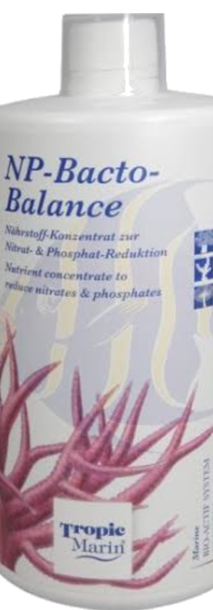</td></tr>
<tr><td>❌</td><td colspan='2'>Plus-NP</td></tr>
<tr><td>✅</td><td>Potassium</td><td></td></tr>
</table>
</details>

# ReefLed

Zaplanowano.

Chcesz, żeby było obsługiwane szybciej? Zagłosuj [tutaj](https://github.com/Elwinmage/ha-reef-card/discussions/22).

# ReefMat

ReefMat z ha-reef-card w akcji:

[](https://www.youtube.com/watch?v=yyNyUSitb1E)

Karta ReefMat jest podzielona na 7 stref:

1. Konfiguracja / Informacje Wifi
2. Stany
3. Informacje o rolce (całkowita zużyta długość, pozostała długość, koniec rolki, tryb...)
4. Ręczne/automatyczne posuwanie
5. Czujnik
6. Zaplanowane posuwanie
7. Tygodniowy / miesięczny wykres zużycia


Obraz tła zmienia się w zależności od stanu zużycia rolki, dostępne 5 różnych obrazów:

<table>
  <tr>
    <td align="center"><br/><b>0%</b></td>
    <td align="center"><br/><b>25%</b></td>
    <td align="center"><br/><b>50%</b></td>
  </tr>
  <tr>
    <td align="center"><br/><b>75%</b></td>
    <td align="center"><br/><b>100%</b></td>
    <td></td>
  </tr>
</table>

## Konfiguracja / Informacje Wifi


---

<span>Kliknij ikonę  aby zarządzać ogólną konfiguracją ReefMat.</span>


<span>Kliknij ikonę  aby zarządzać ustawieniami sieciowymi.</span>


## Stany


---

<span>Przełącznik konserwacji  przełącza w tryb konserwacji.</span>

 

<span>Przełącznik włącz/wyłącz  przełącza ReefMat między stanami włączonym i wyłączonym.</span>

 

## Informacje o rolce


---

Ta strefa wyświetla stan rolki filtrującej w czasie rzeczywistym, od góry do dołu:

- **Całkowita zużyta długość** od początku rolki (na górze, czerwony)
- **Pozostała długość** na środku w kolorze czerwonym. Gdy rolka jest pusta, pojawia się  migająca ikona, a okno dialogowe proponuje wymianę rolki.


- **Liczba pozostałych dni** do końca rolki, szacowana na podstawie średniego dziennego zużycia (czarny)
- **Średnie dzienne zużycie** w cm (lewy dolny)
- Bieżący **tryb pracy**: Auto, Konserwacja, Wyłączony… (pod logo RedSea)
- **Procent zużytej rolki** (łuk kołowy w prawym dolnym rogu)

W przypadku wykrycia anomalii logo RedSea zamieni się w  migającą ikonę.
Kliknięcie tego alertu otwiera okno dialogowe anomalii:


## Ręczne/Automatyczne posuwanie


---

Ta strefa steruje posuwaniem rolki.

Od lewej do prawej:

- Przycisk  uruchamia **ręczne posuwanie** rolki o długość wskazaną w środku.
- Wyświetlana **wartość posuwu** (w cm) to wartość wysyłana po naciśnięciu przycisku. Kliknięcie tej liczby otwiera okno edycji.


- **Przycisk automatycznego posuwania**   włącza lub wyłącza automatyczne posuwanie rolki.

## Czujnik


---

Ta strefa pokazuje stan czujnika poziomu.

Możliwe są trzy stany:

| Stan               | Obraz                                                           |
| ------------------ | --------------------------------------------------------------- |
| Czujnik podłączony |    |
| Czujnik odłączony  |  |
| Brudny czujnik     |           |

## Zaplanowane posuwanie


---

Ten przycisk  pokazuje stan zaplanowanego posuwania i umożliwia jego edycję po kliknięciu.


## Wykres zużycia

 


---

Ta strefa wyświetla wykres zużycia rolki w czasie.
Kliknięcie przycisku przełącza między dwoma dostępnymi trybami:

- Tryb **Weekly** pokazuje zużycie z ostatnich 7 dni.
- Tryb **Monthly** pokazuje zużycie z ostatnich 30 dni.

Naciśnięcie lewego górnego rogu wykresu otwiera widok szczegółowy w Home Assistant.

## Messages


---

Ta strefa wyświetla ostatnie komunikaty systemowe ReefMat. Ma dwie linie:

- Szara linia pokazuje **ostatnią wiadomość**.
- Różowa linia pokazuje **ostatni alert**, poprzedzony symbolem ⚠.

Kliknięcie  usuwa odpowiednią wiadomość.

Linie te można ukryć za pomocą interfejsu edytora karty.


# ReefRun

ReefRun z ha-reef-card w akcji:

[](https://www.youtube.com/watch?v=Xxv38OPqiGI)

Karta ReefRun pokazuje sterownik i jego dwie pompy tak, jak są fizycznie
podłączone, każda z własnym kablem i orurowaniem. Pompa 1 jest po lewej
stronie, pompa 2 po prawej — zwykle pompa powrotna i DC Skimmer, ale każde
gniazdo przyjmuje dowolny z tych modeli.


Karta jest podzielona na 6 stref:

1. Stan zasilania i tryb konserwacji
2. Informacje o baterii i Wifi
3. Sterownik: tryb pracy, przyciski pomp i kalibracje
4. Pompa 1: harmonogram dobowy, korpus z przepływem wody na żywo, temperatura
5. Pompa 2: harmonogram dobowy, korpus z przepływem wody na żywo, temperatura
6. Ostatni komunikat i ostatni alert

## Stan zasilania i tryb konserwacji


<span>Przełącznik konserwacji  włącza tryb konserwacji.</span>


<span>Przełącznik wł./wył.  włącza i wyłącza Reef Dual Controller.</span>


## Informacje o baterii i Wifi


---

<span>Ta ikona  pokazuje poziom baterii Dual Controllera.</span>

<span>Kliknij ikonę , aby zarządzać ustawieniami sieci.</span>


## Sterownik: tryb pracy, przyciski pomp i kalibracje


### Ustawienia pomp

Kliknięcie  lub  otwiera okno konfiguracji pompy 1 lub 2.


> [!CAUTION]
> **Usunięcie pompy** przywraca jej ustawienia fabryczne: harmonogram i
> sterowanie czujnikiem zostają utracone. Zawsze wymagane jest potwierdzenie.

### Ustawienia czujnika

Kliknięcie  otwiera okno konfiguracji czujnika.


### Play/pauza pompy  / 

Kliknięcie włącza lub wyłącza daną pompę.

Czerwony pierścień pokazuje bieżącą prędkość.


Aby zmienić bieżącą prędkość, przytrzymaj  /  albo kliknij harmonogram:


## Stany pompy

Korpus pompy odzwierciedla to, co urządzenie naprawdę robi — wystarczy rzut oka.
Oba typy pomp nie mają tych samych stanów, dlatego opisano je osobno.

## Pompy 1 i 2

### Pompa powrotna


Jedna ilustracja obejmuje wszystkie stany, karta zmienia tylko sposób jej
rysowania:

- **Pracuje** — pełne kolory, woda animowana z bieżącą prędkością.
- **Zatrzymana** — ta sama ilustracja wyszarzona, brak przepływu.
- **Odłączona** — to samo wyszarzenie oraz migający kabel zasilania.

### Odpieniacz

Trzy odrębne ilustracje, po jednej na stan kubka:

<table>
  <tr>
    <td align="center"><br/><b>Pracuje</b><br/>Piana w kubku, unoszące się pęcherzyki, animowana woda</td>
    <td align="center"><br/><b>Pełny kubek</b><br/>Piana ograniczona do pasma pod pokrywą</td>
    <td align="center"><br/><b>Zatrzymany</b><br/>Pusty kubek, wyszarzony, bez pęcherzyków</td>
  </tr>
</table>

Odłączony odpieniacz wygląda dokładnie tak samo jak zatrzymany: rozróżnia je
tylko migający kabel. To miganie oznacza, że ReefRun zgłasza `missing_pump`,
czyli pompa jest skonfigurowana, ale sterownik już jej nie widzi. Sprawdź
wtyczkę, zanim poszukasz dalej.

Stan pełnego kubka zgłasza czujnik piany w komorze zbiorczej. Korpus przełącza
się na własną ilustrację, a animacja piany zmniejsza się do wąskiego pasma pod
pokrywą — niezależnie od tego, czy samopoziomowanie jest włączone. Migająca
ikona ostrzeżenia obok przełącznika pełnego kubka pojawia się tylko wtedy, gdy
`sensor_controlled` jest włączony, ponieważ przy wyłączonym czujniku sterownik
nie reaguje na pełny kubek.

### Dodawanie pompy

Gniazdo bez skonfigurowanej pompy pokazuje symbol **dodawania** zamiast korpusu
pompy:


Kliknięcie otwiera okno konfiguracji, w którym **Wykryj i dodaj** pyta sterownik,
co jest podłączone, i rejestruje to w jednym kroku. Wykryty model to tylko
sugestia i czasem bywa błędny, więc lista modeli pozostaje później edytowalna:
dla DC Skimmera wybierz rsk-300, rsk-600 lub rsk-900. Nazwę pompy edytuje się w
tym samym oknie.

Symbol znajduje się na każdym nieskonfigurowanym gnieździe, pojawia się więc też
tam, gdzie nigdy nie zamierzasz nic podłączać. Kto ma tylko jedną pompę, może go
całkowicie ukryć w edytorze karty.


### Harmonogram


Niebieska krzywa to zaprogramowana prędkość w ciągu 24 godzin. Pionowa czerwona
linia oznacza bieżącą godzinę, a punkt na niej prędkość wymaganą przez
harmonogram.

Gdy pompa nie realizuje harmonogramu — tryb karmienia, wykrycie pełnego kubka,
ochrona przed nadmiernym odpienianiem — punkt przesuwa się na **rzeczywistą**
prędkość, a czerwony odcinek obrazuje różnicę wraz z jej wartością:


Kliknięcie wykresu otwiera edytor harmonogramu: dodawanie i usuwanie punktów, zmiana godzin i prędkości, podgląd punktu na urządzeniu oraz zapis.


## Komunikaty


---

Ta strefa pokazuje najnowsze komunikaty systemowe ReefRun. Ma dwie linie:

- Szara linia pokazuje **ostatni otrzymany komunikat**.
- Różowa linia pokazuje **ostatni alert**, poprzedzony symbolem ⚠.

Kliknięcie ikony  czyści odpowiedni komunikat.

Te linie można ukryć w edytorze karty.


# ReefWave

Zaplanowano.

Chcesz, żeby było obsługiwane szybciej? Zagłosuj [tutaj](https://github.com/Elwinmage/ha-reef-card/discussions/22).

# Konserwacja

Widok konserwacji w ha-reef-card w akcji:

[](https://www.youtube.com/watch?v=Ko46fHonOP4)


Poza widokami poszczególnych urządzeń karta oferuje widok **Konserwacja**, który
zbiera wszystkie zadania konserwacyjne udostępniane przez
`ha-reefbeat-component`, `ha-reef-maintenance-component` i
`ha-aquamedic-component`, tak jakby cały podsystem konserwacji był jednym
urządzeniem. Widok szuka znacznika, który każda z nich umieszcza na swoich
encjach, a nie konkretnej integracji.

Każde zadanie jest pokazane jako pasek postępu wskazujący, jaka część jego
interwału już minęła, w kolorze zależnym od pozostałego czasu:

| Kolor        | Znaczenie                                                   |
| ------------ | ----------------------------------------------------------- |
| Zielony      | Aktualne                                                    |
| Pomarańczowy | Wkrótce termin (ostatnie 20 % interwału, co najmniej dzień) |
| Czerwony     | Po terminie, etykieta zmienia się na `+X d`                 |
| Szary        | Nigdy nie wykonane (brak zapisanego zerowania)              |

Zadania można sortować **według sprzętu** (pogrupowane, z nagłówkiem dla każdego
urządzenia) lub **według terminu** (płaska lista, najpilniejsze na górze).
Zadania nigdy niewykonane zawsze trafiają na koniec. Na pasku narzędzi są dwa
filtry: pole wyboru ukrywające zadania wciąż aktualne oraz przycisk **Ukryj
wyciszone / Pokaż wyciszone**, który ukrywa zadania z wyłączonym przełącznikiem
powiadomień. Przycisk startuje w położeniu „pokaż”, więc wyciszenie alertu nigdy
samo z siebie nie sprawia, że termin znika. Tę wartość domyślną ustawia się w
edytorze karty (lub kluczem `hide_muted` poniżej), a przycisk i tak ma
pierwszeństwo w każdej chwili.

Kliknięcie wiersza otwiera okno more-info Home Assistant dla danego zadania, a
okrągły przycisk po prawej oznacza je jako wykonane (naciska leżącą u podstaw
encję przycisku, dokładnie tak jak zrobiłoby okno more-info).

Widok pojawia się w selektorze urządzeń tylko wtedy, gdy w instalacji istnieje
co najmniej jedno zadanie konserwacyjne. Nowe zadania dodane do katalogu
integracji pojawiają się automatycznie, bez aktualizacji karty.

### Powiadomienia

Każde zadanie ma też **przełącznik powiadomień** w integracji
(`switch.*_notify`, wyświetlany jako „<nazwa zadania> (powiadomienia)”).
Wyłączenie go wycisza alert o przekroczeniu terminu tego jednego zadania, nie
zmieniając jego harmonogramu: pasek postępu nadal biegnie, wiersz po prostu
przygasa, a dzwonek gaśnie.

Dzwonek po prawej stronie wiersza przełącza ten przełącznik bezpośrednio.
Pojawia się tylko wtedy, gdy integracja udostępnia przełącznik. Ustaw
`show_notify: false`, aby ukryć dzwonki.

Blueprint alertów czyta dokładnie to samo ustawienie, więc wyciszenie zadania w
karcie wycisza także automatyzację.

### Zmiana interwału

Przycisk kalendarza w każdym wierszu rozwija suwak zapisujący do encji liczbowej
interwału zadania. Suwak działa w jednostce ogłaszanej przez integrację dla tego
zadania (dni, tygodnie lub miesiące, odczytanej z roli encji), a integracja
przelicza z powrotem na dni przed zapisem. Granice pochodzą z samej encji, więc
karta nigdy nie zapisze wartości spoza zakresu. Naraz otwarty pozostaje tylko
jeden edytor. Ustaw `show_interval: false`, aby ukryć przyciski.

### Filtrowanie według urządzenia

Domyślnie widok wyświetla zadania wszystkich urządzeń. Blok **Filtruj według
urządzenia** w edytorze karty go zawęża: zaznacz jedno lub kilka urządzeń, a
pozostaną tylko ich zadania, wraz z licznikami.

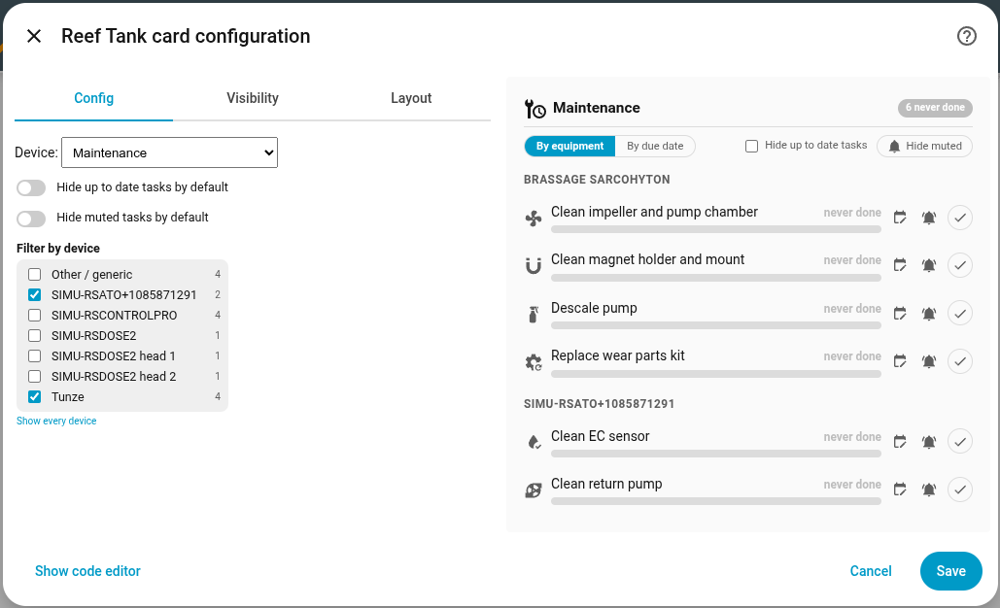

Lista zawiera jedną pozycję na sterownik, wraz z liczbą przypisanych do niego
zadań. Podurządzenia (głowice ReefDose, pompy ReefRun) są grupowane pod swoim
sterownikiem dzięki powiązaniu `via_device` z rejestru Home Assistant:
zaznaczenie **RSDose4** zachowuje więc zadania wszystkich czterech głowic. Brak
zaznaczeń oznacza „brak filtra": wyświetlane są wszystkie urządzenia, co
przywraca też skrót **Pokaż wszystkie urządzenia**.

Wybór jest zapisywany jako nazwy urządzeń (patrz `devices` poniżej), aby YAML
pozostał czytelny. Nazwa wpisana ręcznie pasuje również do jej podurządzeń przez
przedrostek, co obejmuje instalacje bez zadeklarowanego `via_device`. Urządzenia
bez nazwy są identyfikowane przez swój identyfikator urządzenia Home Assistant.

### Pompy ReefRun

Podurządzenia ReefRun noszą nazwy „… pompa 1” / „… pompa 2”, co nic nie mówi o
tym, czym każda pompa naprawdę jest. Gdy urządzenie udostępnia zarówno sensor
`type`, jak i `model`, karta dopisuje je w nawiasie: **ReefRun pompa 1 (powrotna 12000)**, **ReefRun pompa 2 (odpieniacz 900)**.

Typ jest tłumaczony, a z modelu zachowywana jest tylko końcowa liczba
(`return-12000` -> `12000`, `rsk-900` -> `900`), ponieważ przedrostek jest albo
powtórzeniem typu, albo nieczytelny. Urządzenia niebędące pompami zachowują
zwykłą nazwę.

## Ikony

| Ikona                                                                                                    | Rola                                                                              |
| -------------------------------------------------------------------------------------------------------- | --------------------------------------------------------------------------------- |
|                                                          | **Zadanie wykonane.** Oznacza zadanie jako wykonane i restartuje jego odliczanie. |
|   | **Wycisz / włącz.** Przełącza przełącznik powiadomień tego jednego zadania.       |
|                                                  | **Zmień interwał.** Rozwija suwak powiązany z interwałem zadania.                 |

## Edytor

Domyślny stan filtrów, filtr według urządzenia oraz widoczność trzech przycisków
ustawia się w edytorze karty.


## Konfiguracja

```yaml
type: custom:reef-card
device: __maintenance__
maintenance:
  sort: due # "device" (domyślnie) lub "due"
  devices: # pokaż tylko zadania tych urządzeń (pusto: wszystkie)
    - SIMU-RSDOSE4
    - SIMU-RSATO
  hide_ok: false # ukryj zadania ani po terminie, ani zbliżające się
  hide_muted: false # ukryj zadania z wyłączonymi powiadomieniami
  warning_ratio: 0.2 # część interwału pokazywana na pomarańczowo
  show_reset: true # pokaż przycisk „oznacz jako wykonane” w każdym wierszu
  show_notify: true # pokaż dzwonek wyciszenia/włączenia w każdym wierszu
  show_interval: true # pokaż przycisk edycji interwału w każdym wierszu
```

Wszystkie klucze `maintenance` są opcjonalne. `sort` i `hide_ok` ustalają tylko
stan początkowy: użytkownik może je zmienić z poziomu samego widoku. `devices`
przyjmuje zarówno nazwy urządzeń, jak i identyfikatory urządzeń Home Assistant;
pusta lista (wartość domyślna) wyłącza filtr.

# FAQ

---

[buymecoffee]: https://paypal.me/Elwinmage
[buymecoffeebadge]: https://img.shields.io/badge/buy%20me%20a%20coffee-donate-yellow.svg?style=flat-square
