[← Powrót do strony głównej](README.pl.md)

# ReefMat

ReefMat z ha-reef-card w akcji:

Karta ReefMat jest podzielona na 7 stref:

1. Konfiguracja / Informacje Wifi
2. Stany
3. Informacje o rolce (całkowita zużyta długość, pozostała długość, koniec rolki, tryb...)
4. Ręczne/automatyczne posuwanie
5. Czujnik
6. Zaplanowane posuwanie
7. Tygodniowy / miesięczny wykres zużycia

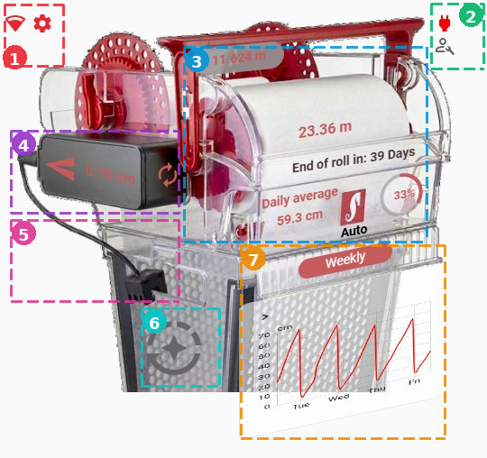

Obraz tła zmienia się w zależności od stanu zużycia rolki, dostępne 5 różnych obrazów:

<table>
  <tr>
    <td align="center">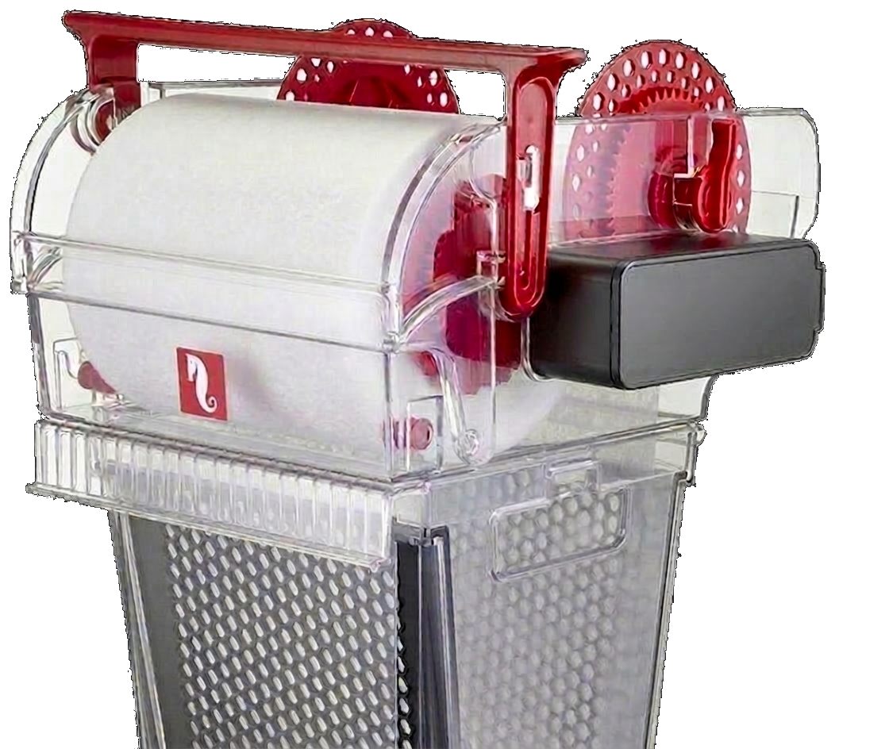 <b>0%</b></td>
    <td align="center">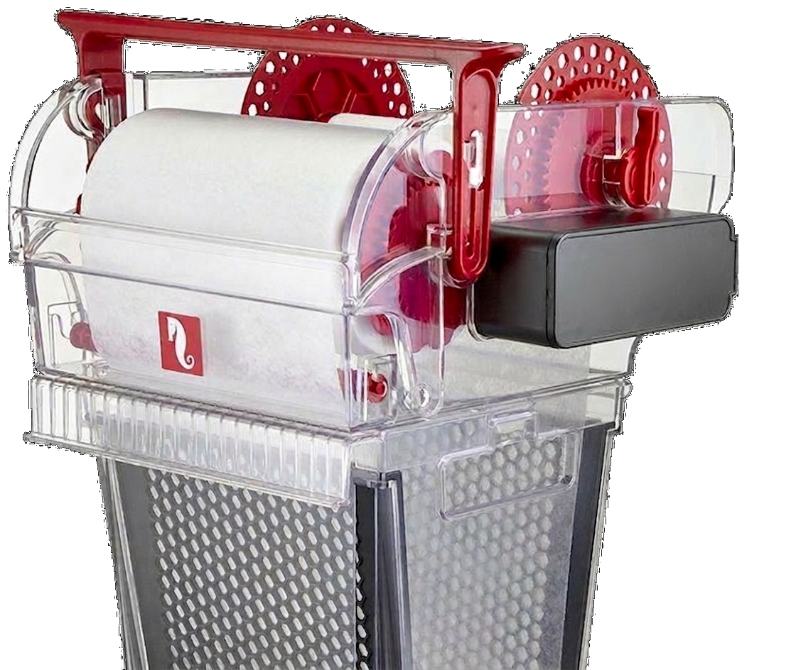 <b>25%</b></td>
    <td align="center">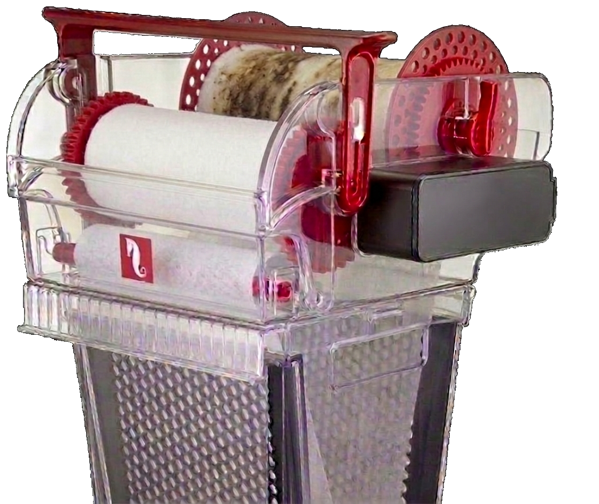 <b>50%</b></td>
  </tr>
  <tr>
    <td align="center">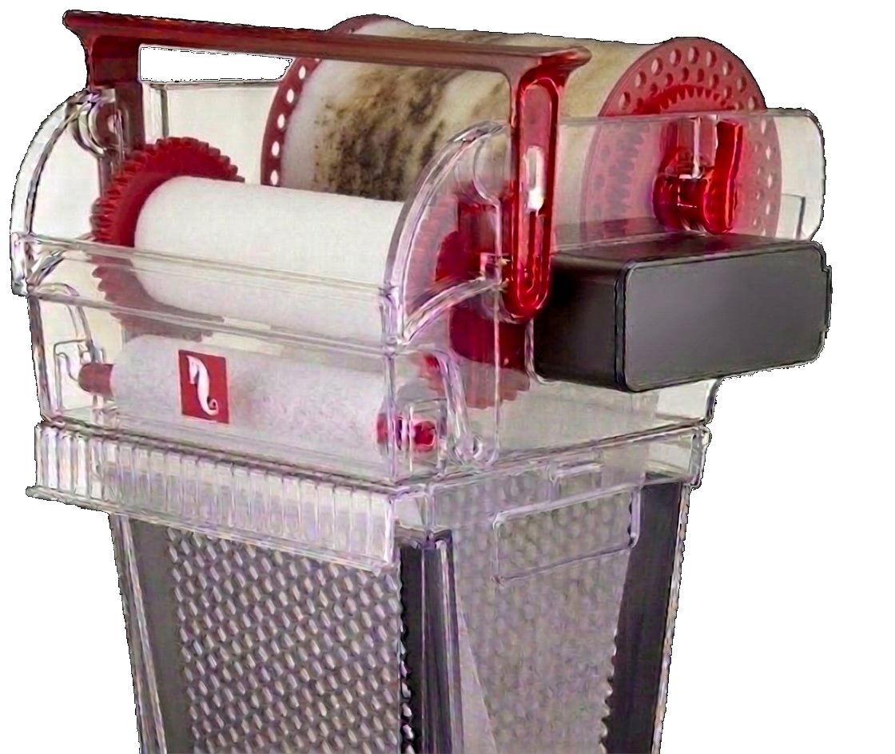 <b>75%</b></td>
    <td align="center">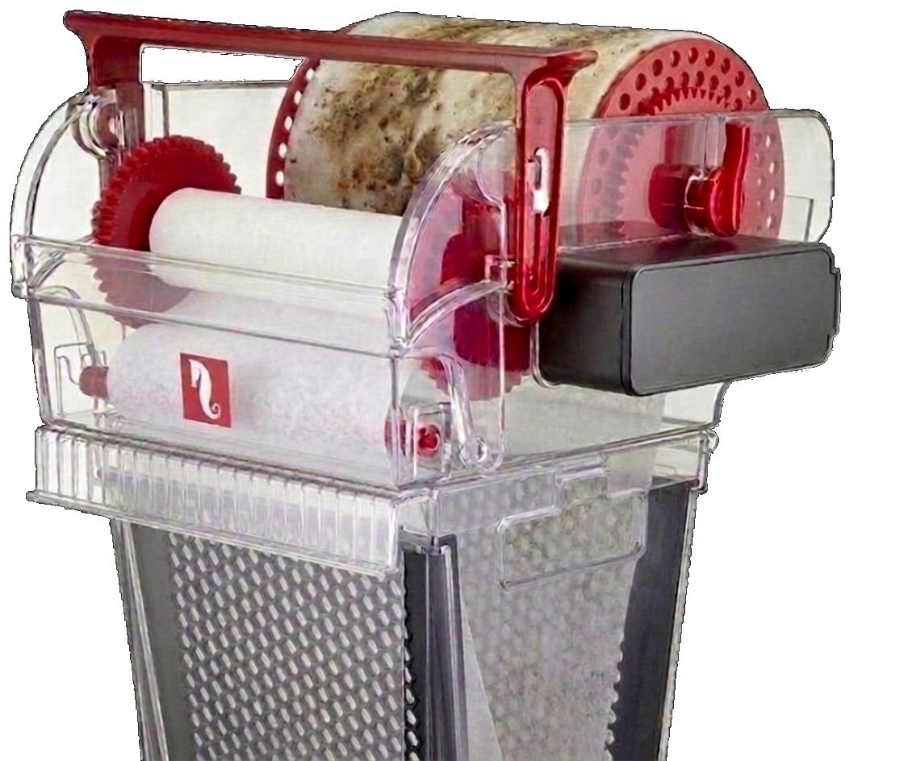 <b>100%</b></td>
    <td></td>
  </tr>
</table>

## Konfiguracja / Informacje Wifi

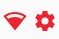

---

Kliknij ikonę  aby zarządzać ogólną konfiguracją ReefMat.

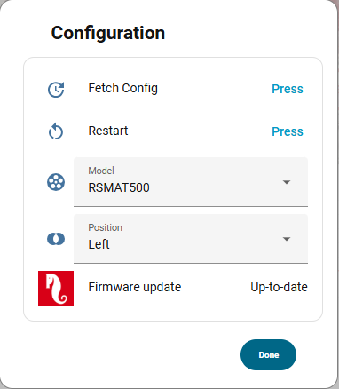

Kliknij ikonę  aby zarządzać ustawieniami sieciowymi.

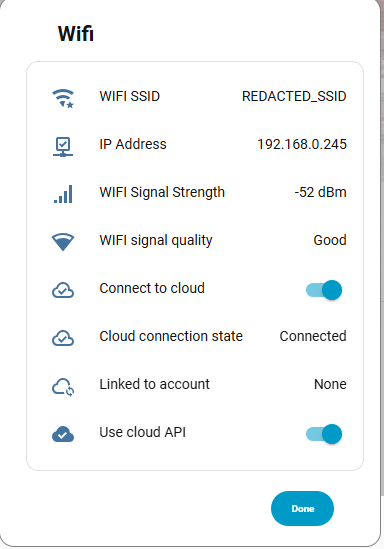

## Stany

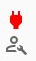

---

Przełącznik konserwacji  przełącza w tryb konserwacji.

 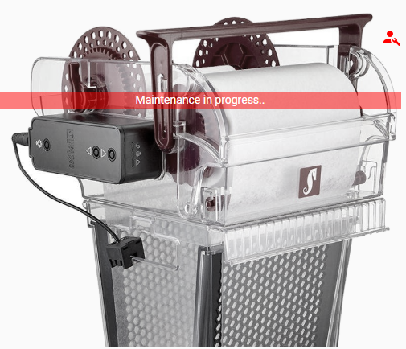

Przełącznik włącz/wyłącz  przełącza ReefMat między stanami włączonym i wyłączonym.

 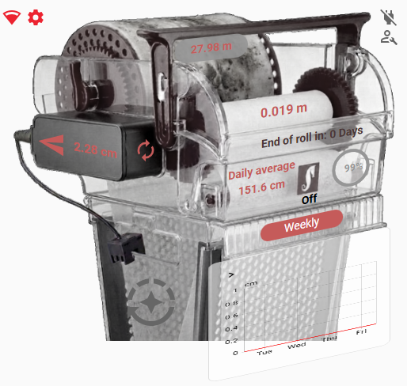

## Informacje o rolce

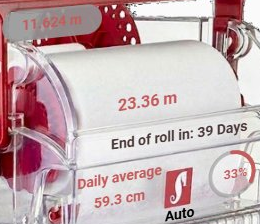

---

Ta strefa wyświetla stan rolki filtrującej w czasie rzeczywistym, od góry do dołu:

- **Całkowita zużyta długość** od początku rolki (na górze, czerwony)
- **Pozostała długość** na środku w kolorze czerwonym. Gdy rolka jest pusta, pojawia się  migająca ikona, a okno dialogowe proponuje wymianę rolki.

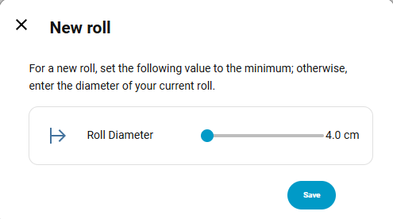

- **Liczba pozostałych dni** do końca rolki, szacowana na podstawie średniego dziennego zużycia (czarny)
- **Średnie dzienne zużycie** w cm (lewy dolny)
- Bieżący **tryb pracy**: Auto, Konserwacja, Wyłączony… (pod logo RedSea)
- **Procent zużytej rolki** (łuk kołowy w prawym dolnym rogu)

W przypadku wykrycia anomalii logo RedSea zamieni się w  migającą ikonę.
Kliknięcie tego alertu otwiera okno dialogowe anomalii:

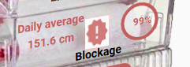
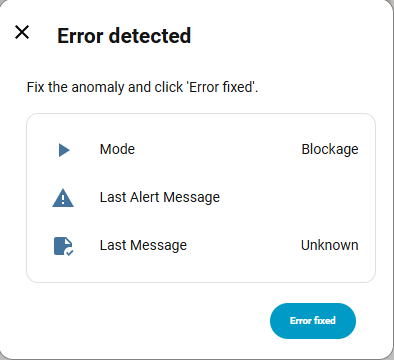

## Ręczne/Automatyczne posuwanie

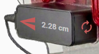
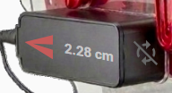
---

Ta strefa steruje posuwaniem rolki.

Od lewej do prawej:

- Przycisk  uruchamia **ręczne posuwanie** rolki o długość wskazaną w środku.
- Wyświetlana **wartość posuwu** (w cm) to wartość wysyłana po naciśnięciu przycisku. Kliknięcie tej liczby otwiera okno edycji.

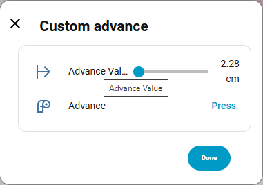

- **Przycisk automatycznego posuwania**   włącza lub wyłącza automatyczne posuwanie rolki.

## Czujnik

---

Ta strefa pokazuje stan czujnika poziomu.

Możliwe są trzy stany:

| Stan               | Obraz                                                           |
| ------------------ | --------------------------------------------------------------- |
| Czujnik podłączony | 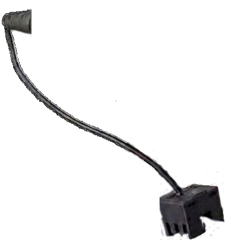   |
| Czujnik odłączony  | 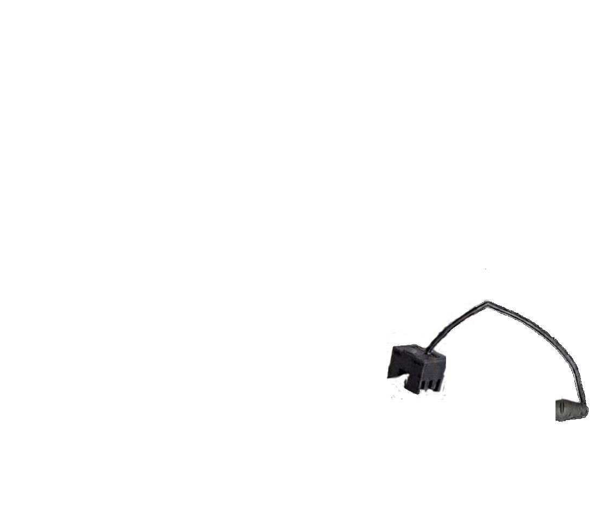 |
| Brudny czujnik     |           |

## Zaplanowane posuwanie

---

Ten przycisk  pokazuje stan zaplanowanego posuwania i umożliwia jego edycję po kliknięciu.

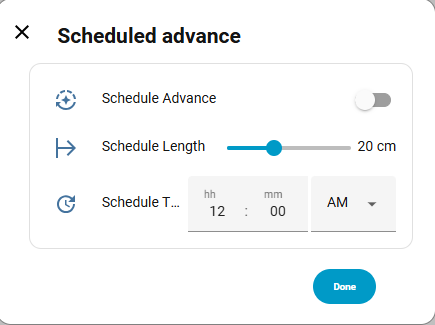

## Wykres zużycia

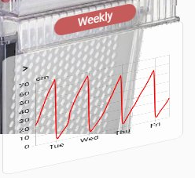 
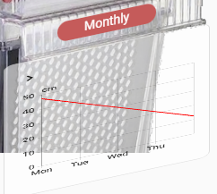

---

Ta strefa wyświetla wykres zużycia rolki w czasie.
Kliknięcie przycisku przełącza między dwoma dostępnymi trybami:

- Tryb **Weekly** pokazuje zużycie z ostatnich 7 dni.
- Tryb **Monthly** pokazuje zużycie z ostatnich 30 dni.

Naciśnięcie lewego górnego rogu wykresu otwiera widok szczegółowy w Home Assistant.

## Messages

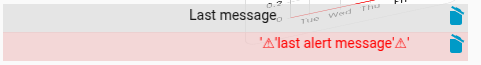

---

Ta strefa wyświetla ostatnie komunikaty systemowe ReefMat. Ma dwie linie:

- Szara linia pokazuje **ostatnią wiadomość**.
- Różowa linia pokazuje **ostatni alert**, poprzedzony symbolem ⚠.

Kliknięcie  usuwa odpowiednią wiadomość.

Linie te można ukryć za pomocą interfejsu edytora karty.

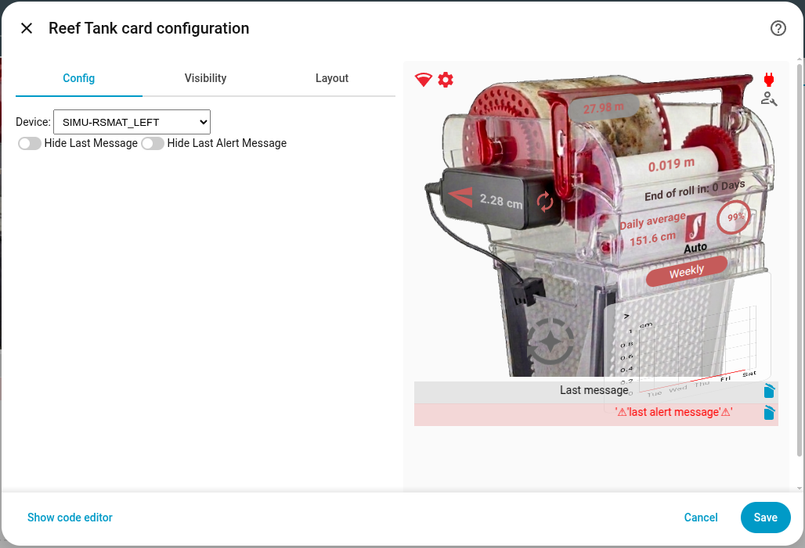

---

[← Powrót do strony głównej](README.pl.md)
