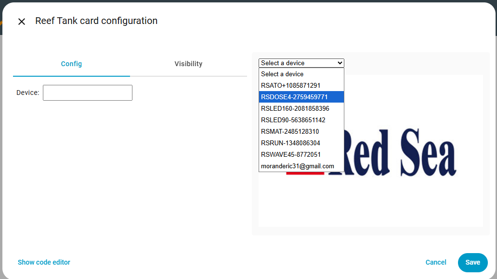

<!--  -->

[![BuyMeCoffee][buymecoffeebadge]][buymecoffee]

> [!NOTE]
> Toda ajuda é bem-vinda, não hesite em [contactar-me](https://github.com/Elwinmage/ha-reef-card/discussions/1).

# Idiomas suportados :       

<!-- Vous souhaitez aider à la traduction, suivez ce [guide](https://github.com/Elwinmage/ha-reef-card/blob/main/doc/TRANSLATION.md). -->

O seu idioma ainda não está disponível e deseja ajudar com a tradução? Siga este [guia](https://github.com/Elwinmage/ha-reef-card/blob/main/doc/TRANSLATION.md).

# Apresentação

O **Reef card** para Home Assistant ajuda-o a gerir o seu aquário de recife.

Combinado com [ha-reefbeat-component](https://github.com/Elwinmage/ha-reefbeat-component), suporta automaticamente os seus dispositivos Redsea (ReefBeat).

> [!NOTE]
> Se tiver dispositivos que não sejam da Redsea e desejar que sejam suportados, pode solicitá-lo [aqui](https://github.com/Elwinmage/ha-reef-card/discussions/2).

> [!TIP]
> A lista de funcionalidades futuras está disponível [aqui](https://github.com/Elwinmage/ha-reef-card/issues?q=is%3Aissue%20state%3Aopen%20label%3Aenhancement) 
> A lista de erros está disponível [aqui](https://github.com/Elwinmage/ha-reef-card/issues?q=is%3Aissue%20state%3Aopen%20label%3Abug)

# Compatibilidade

✅ Implementado ☑️ Em curso ❌ Planeado

<table>
  <th>
    <td ><b>Modelo</b></td>
    <td colspan="2"><b>Estado</b></td>
    <td><b>Issues</b>   📆(Planeado)   🐛(Bugs)</td>
  </th>
  <tr>
    <td><a href="#reefato">ReefATO+</a></td>
    <td>RSATO+</td><td>❌</td>
    <td width="200px"></td>
    <td>
      <a href="https://github.com/Elwinmage/ha-reef-card/issues?q=is:issue state:open label:rsato,all label:enhancement" style="text-decoration:none">📆</a>
      <a href="https://github.com/Elwinmage/ha-reef-card/issues?q=is:issue state:open label:rsato,all label:bug" style="text-decoration:none">🐛</a>
    </td>
  </tr>

  </tr>
    <tr>
    <td><a href="#reefcontrol">ReefControl</a></td>
    <td>RSSENSE  Se tiver um, pode contactar-me <a href="https://github.com/Elwinmage/ha-reefbeat-component/discussions/8">aqui</a> e adicionarei o seu suporte.</td><td>❌</td>
    <td width="200px"></td>
    <td>
      <a href="https://github.com/Elwinmage/ha-reefbeat-component/issues?q=is:issue state:open label:rscontrol,all label:enhancement" style="text-decoration:none">📆</a>
      <a href="https://github.com/Elwinmage/ha-reefbeat-component/issues?q=is:issue state:open label:rscontrol,all label:bug" style="text-decoration:none">🐛</a>
    </td>
      </tr>  
  <tr>
    <td rowspan="2"><a href="#reefdose">ReefDose</a></td>
    <td>RSDOSE2</td>
    <td>✅</td>
    <td width="200px"></td>
      <td rowspan="2">
      <a href="https://github.com/Elwinmage/ha-reef-card/issues?q=is:issue state:open label:rsdose,all label:enhancement" style="text-decoration:none">📆</a>
      <a href="https://github.com/Elwinmage/ha-reef-card/issues?q=is:issue state:open label:rsdose,all label:bug" style="text-decoration:none">🐛</a>
    </td>
  </tr>
  <tr>
    <td>RSDOSE4</td><td>✅</td>
    <td width="200px"></td>
    </tr>
  <tr>
    <td rowspan="2"> <a href="#reefled">ReefLed</a></td>
    <td>G1</td>
    <td>❌</td>
    <td width="200px"></td>
<td rowspan="2">   
    <a href="https://github.com/Elwinmage/ha-reef-card/issues?q=is:issue state:open label:rsled,all label:enhancement" style="text-decoration:none">📆</a>
      <a href="https://github.com/Elwinmage/ha-reef-card/issues?q=is:issue state:open label:rsled,all label:bug" style="text-decoration:none">🐛</a>
</td>
  </tr>
   <td >G2</td>
    <td>❌</td>
    <td width="200px"></td>
  </tr>
  <tr>
    <td rowspan="3"><a href="#reefmat">ReefMat</a></td>
    <td>RSMAT250</td>
    <td>☑️</td>
    <td rowspan="3" width="200px"></td>
    <td rowspan="3">
      <a href="https://github.com/Elwinmage/ha-reef-card/issues?q=is:issue state:open label:rsmat,all label:enhancement" style="text-decoration:none">📆</a>
      <a href="https://github.com/Elwinmage/ha-reef-card/issues?q=is:issue state:open label:rsmat,all label:bug" style="text-decoration:none">🐛</a>
    </td>
  </tr>
  <tr>
    <td>RSMAT500</td>
    <td>☑️</td>
  </tr>
  <tr>
    <td>RSMAT1200</td>
    <td>☑️</td>
  </tr>
  <tr>
    <td><a href="#reefrun">ReefRun</a></td>
    <td>RSRUN</td><td>❌</td>
    <td width="200px"></td>
    <td>
      <a href="https://github.com/Elwinmage/ha-reef-card/issues?q=is:issue state:open label:rsrun,all label:enhancement" style="text-decoration:none">📆</a>
      <a href="https://github.com/Elwinmage/ha-reef-card/issues?q=is:issue state:open label:rsrun,all label:bug" style="text-decoration:none">🐛</a>
    </td>
  </tr>
  <tr>
    <td><a href="#reefwave">ReefWave</a></td>
    <td>RSWAVE</td><td>❌</td>
    <td width="200px"></td>
    <td>
      <a href="https://github.com/Elwinmage/ha-reef-card/issues?q=is:issue state:open label:rswave,all label:enhancement" style="text-decoration:none">📆</a>
      <a href="https://github.com/Elwinmage/ha-reef-card/issues?q=is:issue state:open label:rswave,all label:bug" style="text-decoration:none">🐛</a>
    </td>
  </tr>
</table>

# Índice

- [Instalação](https://github.com/Elwinmage/ha-reef-card/#installation)
- [Configuração](https://github.com/Elwinmage/ha-reef-card/#configuration)
- [ReefATO+](https://github.com/Elwinmage/ha-reef-card/#reefato)
- [ReefControl](https://github.com/Elwinmage/ha-reef-card/#reefcontrol)
- [ReefDose](https://github.com/Elwinmage/ha-reef-card/#reefdose)
- [ReefLED](https://github.com/Elwinmage/ha-reef-card/#reefled)
- [ReefMat](https://github.com/Elwinmage/ha-reef-card/#reefmat)
- [ReefRun](https://github.com/Elwinmage/ha-reef-card/#reefrun)
- [ReefWave](https://github.com/Elwinmage/ha-reef-card/#reefwave)
- [FAQ](https://github.com/Elwinmage/ha-reef-card/#faq)

# Instalação

## Instalação direta

Clique aqui para aceder diretamente ao repositório no HACS e clique em "Descarregar":  

## Pesquisar no HACS
Ou pesquise «reef-card» no HACS.

# Configuração

Sem o parâmetro `device`, o cartão deteta automaticamente todos os dispositivos ReefBeat e permite-lhe escolher o que deseja.

Para remover a seleção de dispositivo e forçar um específico, defina o parâmetro `device` com o nome do seu dispositivo.

<table>
  <tr>
<td></td>
<td></td>
    </tr>
</table>

# ReefATO

Planeado.
  
Deseja que seja suportado mais rapidamente? Vote [aqui](https://github.com/Elwinmage/ha-reef-card/discussions/22).

# ReefControl

Planeado.

Deseja que seja suportado mais rapidamente? Vote [aqui](https://github.com/Elwinmage/ha-reef-card/discussions/22).

# ReefDose

ReefDose com ha-reef-card em ação:

O cartão ReefDose está dividido em 6 zonas:

 1. Configuração/Informação Wifi
 2. Estados
 3. Dosagem Manual
 4. Configuração e programação das cabeças
 5. Gestão de suplementos
 6. Fila de doses futuras

## Configuração/Informação Wifi

***

Clique no ícone  para gerir a configuração geral do ReefDose.

 

Clique no ícone   para gerir os parâmetros de rede.

 

## Estados

 

***
O interruptor de manutenção   permite mudar para o modo de manutenção.

 

O interruptor on/off   permite alternar entre os estados ligado e desligado do ReefDose.

 

## Dosagem Manual

***
O botão   mostra a dose manual predefinida para esta cabeça. Um clique abre a caixa de configuração desta dosagem.

Pode adicionar atalhos usando o editor do cartão:

Por exemplo, a cabeça 1 propõe como atalhos os valores 2, 5 e 10 mL.

Estes valores aparecerão na parte superior da caixa de diálogo. Um clique nestes atalhos enviará um comando para dosar o valor definido.

Premir o botão de dose manual:  enviará um comando de dose com o valor predefinido visível mesmo acima: , ou seja 10 mL neste exemplo.

## Configuração e programação das cabeças

 

***
Esta zona permite visualizar a programação atual das cabeças e alterá-la.
- O anel circular colorido indica a percentagem de dose diária já distribuída.
- O número amarelo na parte superior indica o acumulado de dose manual diária.
- A parte central indica o volume distribuído em relação ao volume diário programado total.
- A parte azul inferior indica o número de doses distribuídas em relação ao total de doses do dia (exemplo: 14/24 para o azul porque é uma programação horária feita às 14h15). Os valores para o violeta e o verde indicam 0/0 porque essas doses devem ser distribuídas às 8h mas a integração foi iniciada depois das 8h, pelo que não haverá nenhuma dose hoje.
- Um clique longo numa das 4 cabeças ativará ou desativará a cabeça.
- Um clique numa cabeça abrirá a caixa de programação.
  A partir desta caixa pode iniciar um cebamento, recalibrar a cabeça, alterar a dose diária e a sua programação. Não se esqueça de guardar a programação antes de sair.
  
  
   

## Gestão de suplementos

 

***
Esta zona permite gerir os suplementos.
Se já houver um suplemento declarado, um clique sobre ele abrirá a caixa de configuração onde poderá:
- Eliminar o suplemento (ícone lixo no canto superior direito)
- Indicar o volume total do contentor
- Indicar o volume real do suplemento
- Decidir se pretende acompanhar o volume restante. Um clique nos atalhos da parte superior ativará o controlo e definirá os valores predefinidos com um contentor cheio.
- Modificar o nome de exibição do suplemento.

 

Se não houver nenhum suplemento ligado a uma cabeça, pode adicionar um clicando no contentor com um '+' (cabeça 4 no nosso exemplo).

De seguida, siga as instruções:

### Suplementos

Eis a lista de imagens de suplementos suportados, agrupados por marca. Se o seu mostrar um ❌, pode solicitar a sua adição [aqui](https://github.com/Elwinmage/ha-reef-card/discussions/25).

<b>ATI &nbsp; 0/2 🖼️</b>

<table>
<tr><td>❌</td><td colspan='2'>Essential Pro 1</td></tr>
<tr><td>❌</td><td colspan='2'>Essential Pro 2</td></tr>
</table>

<b>Aqua Forest &nbsp; 0/9 🖼️</b>

<table>
<tr><td>❌</td><td colspan='2'>Ca Plus</td></tr>
<tr><td>❌</td><td colspan='2'>Calcium </td></tr>
<tr><td>❌</td><td colspan='2'>Component 1+</td></tr>
<tr><td>❌</td><td colspan='2'>Component 2+</td></tr>
<tr><td>❌</td><td colspan='2'>Component 3+</td></tr>
<tr><td>❌</td><td colspan='2'>KH Buffer</td></tr>
<tr><td>❌</td><td colspan='2'>KH Plus</td></tr>
<tr><td>❌</td><td colspan='2'>Magnesium</td></tr>
<tr><td>❌</td><td colspan='2'>Mg Plus</td></tr>
</table>

<b>BRS &nbsp; 0/4 🖼️</b>

<table>
<tr><td>❌</td><td colspan='2'>Liquid Calcium</td></tr>
<tr><td>❌</td><td colspan='2'>Liquid alkalinity</td></tr>
<tr><td>❌</td><td colspan='2'>Magnesium Mix</td></tr>
<tr><td>❌</td><td colspan='2'>Part C</td></tr>
</table>

<b>Brightwell &nbsp; 0/12 🖼️</b>

<table>
<tr><td>❌</td><td colspan='2'>Calcion</td></tr>
<tr><td>❌</td><td colspan='2'>Ferrion</td></tr>
<tr><td>❌</td><td colspan='2'>Hydrate - MG</td></tr>
<tr><td>❌</td><td colspan='2'>KoralAmino</td></tr>
<tr><td>❌</td><td colspan='2'>Koralcolor</td></tr>
<tr><td>❌</td><td colspan='2'>Liquid Reef</td></tr>
<tr><td>❌</td><td colspan='2'>Potassion</td></tr>
<tr><td>❌</td><td colspan='2'>Reef Code A</td></tr>
<tr><td>❌</td><td colspan='2'>Reef Code B</td></tr>
<tr><td>❌</td><td colspan='2'>Replenish</td></tr>
<tr><td>❌</td><td colspan='2'>Restore</td></tr>
<tr><td>❌</td><td colspan='2'>Strontion</td></tr>
</table>

<b>ESV &nbsp; 0/5 🖼️</b>

<table>
<tr><td>❌</td><td colspan='2'>B-Ionic Component 1</td></tr>
<tr><td>❌</td><td colspan='2'>B-Ionic Component 2</td></tr>
<tr><td>❌</td><td colspan='2'>B-Ionic Magnesium</td></tr>
<tr><td>❌</td><td colspan='2'>Transition elements </td></tr>
<tr><td>❌</td><td colspan='2'>Transition elements plus</td></tr>
</table>

<b>Fauna Marine &nbsp; 0/11 🖼️</b>

<table>
<tr><td>❌</td><td colspan='2'>Amin</td></tr>
<tr><td>❌</td><td colspan='2'>Balling light  trace 1</td></tr>
<tr><td>❌</td><td colspan='2'>Balling light  trace 2</td></tr>
<tr><td>❌</td><td colspan='2'>Balling light  trace 3</td></tr>
<tr><td>❌</td><td colspan='2'>Balling light Ca</td></tr>
<tr><td>❌</td><td colspan='2'>Balling light KH</td></tr>
<tr><td>❌</td><td colspan='2'>Balling light Mg</td></tr>
<tr><td>❌</td><td colspan='2'>Blue trace elements</td></tr>
<tr><td>❌</td><td colspan='2'>Green trace elements</td></tr>
<tr><td>❌</td><td colspan='2'>Min S</td></tr>
<tr><td>❌</td><td colspan='2'>Red trace elements</td></tr>
</table>

<b>Quantum &nbsp; 0/7 🖼️</b>

<table>
<tr><td>❌</td><td colspan='2'>Aragonite A</td></tr>
<tr><td>❌</td><td colspan='2'>Aragonite B</td></tr>
<tr><td>❌</td><td colspan='2'>Aragonite C</td></tr>
<tr><td>❌</td><td colspan='2'>Bio Kalium</td></tr>
<tr><td>❌</td><td colspan='2'>Bio Metals</td></tr>
<tr><td>❌</td><td colspan='2'>Bio enhance</td></tr>
<tr><td>❌</td><td colspan='2'>Gbio Gen</td></tr>
</table>

<b>Red Sea &nbsp; 0/13 🖼️</b>

<table>
<tr><td>❌</td><td colspan='2'>Bio Active (Colors D)</td></tr>
<tr><td>❌</td><td colspan='2'>Calcium (Foundation A)</td></tr>
<tr><td>❌</td><td colspan='2'>Calcium (Powder)</td></tr>
<tr><td>❌</td><td colspan='2'>Iodine (Colors A)</td></tr>
<tr><td>❌</td><td colspan='2'>Iron (Colors C)</td></tr>
<tr><td>❌</td><td colspan='2'>KH/Alkalinity (Foundation B)</td></tr>
<tr><td>❌</td><td colspan='2'>KH/Alkalinity (Powder)</td></tr>
<tr><td>❌</td><td colspan='2'>Magnesium (Foundation C)</td></tr>
<tr><td>❌</td><td colspan='2'>Magnesium (Powder)</td></tr>
<tr><td>❌</td><td colspan='2'>NO3PO4-X</td></tr>
<tr><td>❌</td><td colspan='2'>Potassium (Colors B)</td></tr>
<tr><td>❌</td><td colspan='2'>Reef Energy Plus</td></tr>
<tr><td>❌</td><td colspan='2'>ReefCare Program</td></tr>
</table>

<b>Seachem &nbsp; 0/9 🖼️</b>

<table>
<tr><td>❌</td><td colspan='2'>Reef Calcium</td></tr>
<tr><td>❌</td><td colspan='2'>Reef Carbonate</td></tr>
<tr><td>❌</td><td colspan='2'>Reef Complete</td></tr>
<tr><td>❌</td><td colspan='2'>Reef Fusion 1</td></tr>
<tr><td>❌</td><td colspan='2'>Reef Fusion 2</td></tr>
<tr><td>❌</td><td colspan='2'>Reef Iodine</td></tr>
<tr><td>❌</td><td colspan='2'>Reef Plus</td></tr>
<tr><td>❌</td><td colspan='2'>Reef Strontium</td></tr>
<tr><td>❌</td><td colspan='2'>Reef Trace</td></tr>
</table>

<b>Triton &nbsp; 0/4 🖼️</b>

<table>
<tr><td>❌</td><td colspan='2'>Core7 elements 1</td></tr>
<tr><td>❌</td><td colspan='2'>Core7 elements 2</td></tr>
<tr><td>❌</td><td colspan='2'>Core7 elements 3A</td></tr>
<tr><td>❌</td><td colspan='2'>Core7 elements 3B</td></tr>
</table>

<b>Tropic Marin &nbsp; 0/14 🖼️</b>

<table>
<tr><td>❌</td><td colspan='2'>A Element</td></tr>
<tr><td>❌</td><td colspan='2'>All-For-Reef</td></tr>
<tr><td>❌</td><td colspan='2'>Amino Organic</td></tr>
<tr><td>❌</td><td colspan='2'>Balling A</td></tr>
<tr><td>❌</td><td colspan='2'>Balling B</td></tr>
<tr><td>❌</td><td colspan='2'>Balling C</td></tr>
<tr><td>❌</td><td colspan='2'>Bio-Magnesium</td></tr>
<tr><td>❌</td><td colspan='2'>Carbo Calcium</td></tr>
<tr><td>❌</td><td colspan='2'>Elimi-NP</td></tr>
<tr><td>❌</td><td colspan='2'>K Element</td></tr>
<tr><td>❌</td><td colspan='2'>Liquid Buffer</td></tr>
<tr><td>❌</td><td colspan='2'>NP-Bacto-Balance</td></tr>
<tr><td>❌</td><td colspan='2'>Plus-NP</td></tr>
<tr><td>❌</td><td colspan='2'>Potassium</td></tr>
</table>

## Fila de doses futuras

***
Esta zona mostra simplesmente a lista de doses futuras do seu equipamento, sejam automáticas ou manuais (horário deslocado pela espera definida entre dois suplementos diferentes).

# ReefLed

Planeado.

Deseja que seja suportado mais rapidamente? Vote [aqui](https://github.com/Elwinmage/ha-reef-card/discussions/22).

# ReefMat

Planeado.

Deseja que seja suportado mais rapidamente? Vote [aqui](https://github.com/Elwinmage/ha-reef-card/discussions/22).

# ReefRun

Planeado.

Deseja que seja suportado mais rapidamente? Vote [aqui](https://github.com/Elwinmage/ha-reef-card/discussions/22).

# ReefWave

Planeado.

Deseja que seja suportado mais rapidamente? Vote [aqui](https://github.com/Elwinmage/ha-reef-card/discussions/22).

# FAQ

---

[buymecoffee]: https://paypal.me/Elwinmage
[buymecoffeebadge]: https://img.shields.io/badge/buy%20me%20a%20coffee-donate-yellow.svg?style=flat-square
