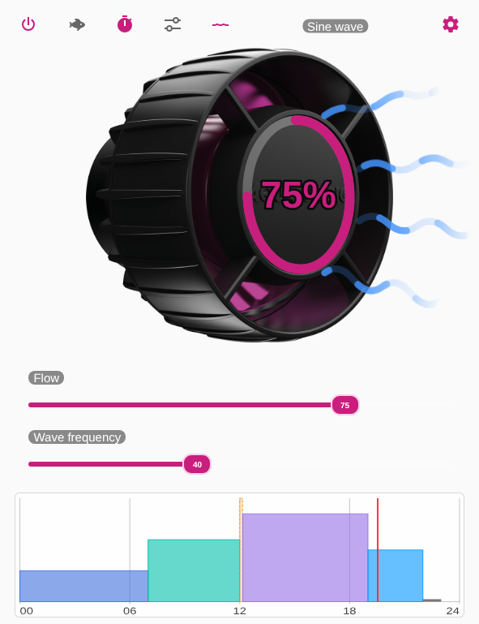
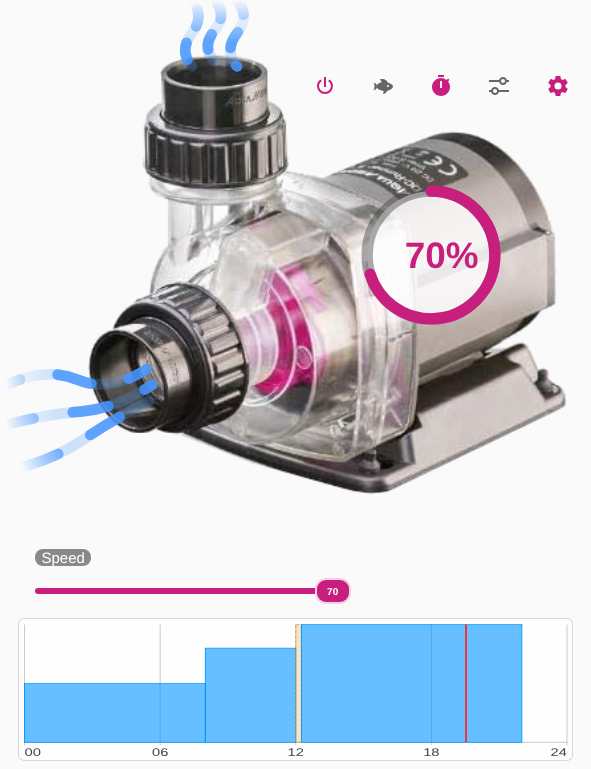
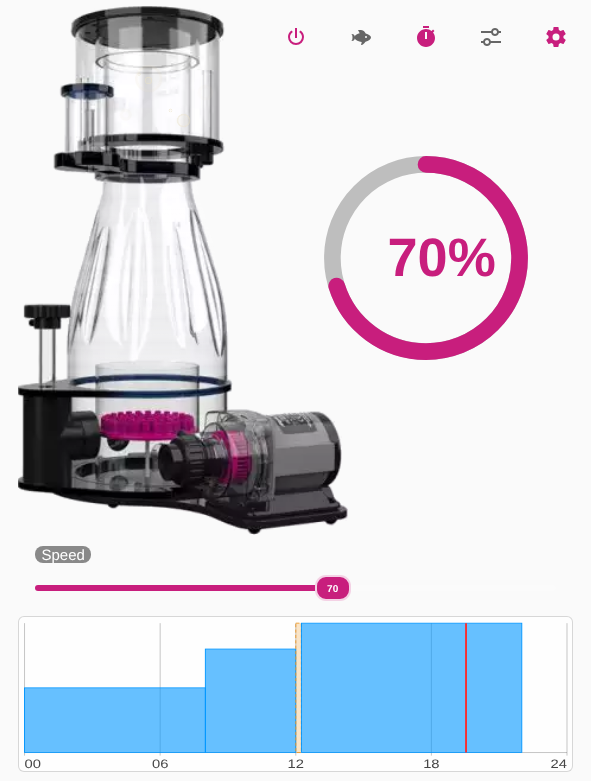
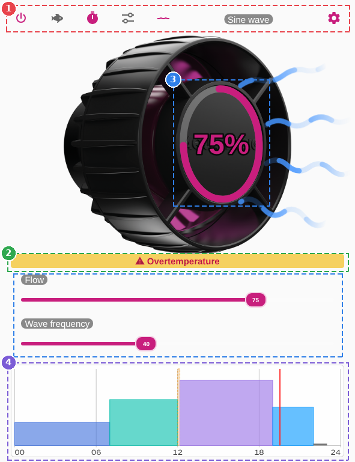
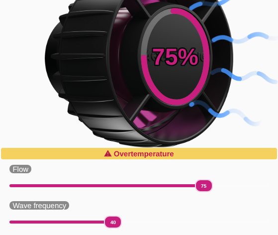
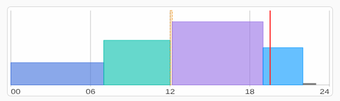
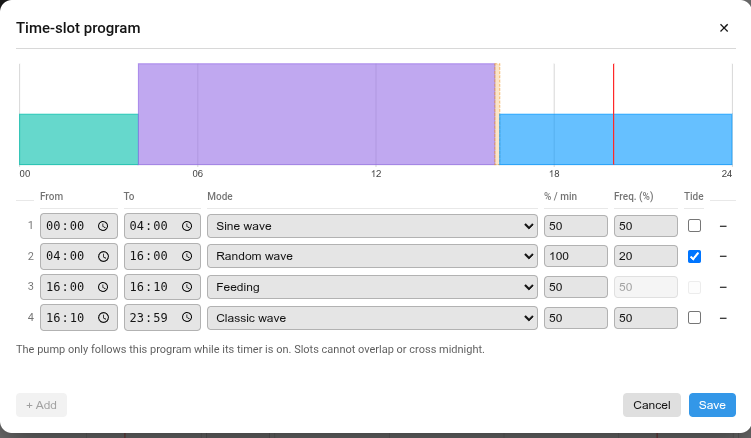

[← Voltar à página principal](README.pt.md)

# Aqua Medic

Aqua Medic com ha-reef-card em ação:

Vistas das bombas do [ha-aquamedic-component](https://github.com/Elwinmage/ha-aquamedic-component):

| Dispositivo                                 | Vista do cartão        |
| ------------------------------------------- | ---------------------- |
| EcoDrift / SmartDrift (bomba de circulação) | `aquamedic-smartdrift` |
| DC Runner (bomba de retorno)                | `aquamedic-dcrunner`   |
| DC Runner (bomba do escumador)              | `aquamedic-dcskimmer`  |

A bomba de retorno e a bomba do escumador são o mesmo hardware: o cartão
mostra um seletor de função até a seleção **Função da bomba** da integração
estar definida, e depois muda sozinho para a vista correspondente.

## O que a vista mostra

O cartão está dividido em 4 zonas:

1. Faixa superior
2. Falhas
3. Velocidade
4. Programa por intervalos

## Faixa superior

Ligar, pausa de alimentação, temporizador e controlo
0-10V, cada um alternável com um clique; a roda dentada abre as definições
(todas as entidades da bomba, a sua função e os seus sensores de falha).
Uma SmartDrift acrescenta o interruptor impulso / maré e o seu modo de
onda (clique: mais informações).

## Falhas

Uma linha a piscar indica as falhas que a bomba assinala
(funcionamento a seco, rotor bloqueado, sobreaquecimento…). Nada é
desenhado enquanto a bomba está saudável.

## Velocidade

Um anel sobre a imagem e um cursor por baixo (velocidade
do motor numa DC Runner, caudal numa SmartDrift, que recebe também um
cursor de frequência de onda). Numa SmartDrift o anel está ajustado à
tampa frontal da bomba, com o valor no centro. Ambos desaparecem enquanto
a bomba é controlada pela sua entrada 0-10V, pois a integração bloqueia
então a velocidade. Ao largar, o cursor mantém o novo valor até a bomba o
confirmar.

## Programa por intervalos

O dia das 00:00 às 24:00, um bloco por
intervalo — a sua altura é a velocidade programada, uma pausa de
alimentação é tracejada em toda a altura, uma paragem é uma barra fina
sobre a linha de base. Um cursor vermelho marca a hora atual. O gráfico
fica esbatido enquanto o temporizador está desligado, porque a bomba
ignora então o programa.

## Animações

A imagem mostra o que a bomba está a fazer:

- **SmartDrift / EcoDrift**: quatro jatos ondulados abrem-se em leque a
  partir da frente da bomba. Incham ao ritmo da frequência de onda, e
  mantêm-se estáveis no modo de caudal constante.
- **DC Runner**: a água é aspirada pela entrada e empurrada para cima pela
  saída.
- **DC Skimmer**: a imagem com espuma enquanto a bomba funciona, a de
  repouso quando está desligada ou retida pela pausa de alimentação; faixas
  sobem na câmara de reação, mais depressa com a velocidade do motor, e
  bolhas rebentam no copo de recolha. Não há estado de «copo cheio»: o
  firmware Aqua Medic não o deteta.

A água desloca-se mais depressa quanto maior é a velocidade. Nada é
desenhado enquanto a bomba está desligada, retida pela pausa de alimentação,
ou a 0 %.

## Editar o programa

Clique no gráfico (ou mantenha premido o ícone do temporizador) para abrir o
editor: uma linha por intervalo com o seu início, fim, modo e valor
(velocidade em %, ou minutos para uma pausa de alimentação), mais frequência
e maré numa SmartDrift. Os intervalos podem ser adicionados e removidos.
**Guardar** reescreve todo o programa da bomba através do serviço
`aquamedic.set_schedule`; **Cancelar** não altera nada.

O editor aplica o que a bomba aceita: os intervalos não se podem sobrepor
nem atravessar a meia-noite (escreva uma janela noturna como dois
intervalos), um intervalo de uma DC Runner funciona a 30 % ou mais, uma
pausa de alimentação dura de 1 a 60 minutos, e uma bomba contém 48
intervalos.

> [!NOTE]
> O programa precisa do ha-aquamedic-component com o sensor `schedule`. Com
> uma versão mais antiga, o gráfico simplesmente não é desenhado.

> [!NOTE]
> Uma DC Runner com o firmware antigo (velocidade chamada `flow`, sem
> temporizador) usa as mesmas vistas: os elementos que lhe faltam são
> ocultados.

## Disposição

Cada vista tem a sua própria caixa e a sua própria colocação, nas constantes
`PICTURE` e `LAYOUT` do seu mapping (`dcrunner.mapping.ts`,
`dcskimmer.mapping.ts`, `smartdrift.mapping.ts`): onde fica a imagem, o
centro de cada ícone, o centro e o tamanho do anel de velocidade. Os pontos
desenhados sobre a imagem são dados em percentagens da imagem, pelo que
movê-la ou redimensioná-la os move com ela. Como qualquer elemento, também
podem ser substituídos a partir da configuração do cartão.

---

[← Voltar à página principal](README.pt.md)
