[← Voltar à página principal](README.pt.md)

# ReefATO

ReefATO+ com o ha-reef-card em ação:

[](https://www.youtube.com/watch?v=2R0DHp2eqT4)

O cartão ReefATO+ permite gerir visualmente o controlador RSATO+, o reservatório
de água osmotizada com a sua bomba, a sonda de nível presa ao vidro e a sonda de
fugas pousada no chão.

A sonda de nível do ReefATO+ é sempre desenhada. A **bomba** e a **sonda de
fugas** são opcionais. Aquela que o dispositivo não reporta não é desenhada de
todo, e os controlos que dependem dela desaparecem com ela: um ReefATO+ sem sonda
de fugas mostra um cartão sem sonda de fugas, não uma sonda esbatida.

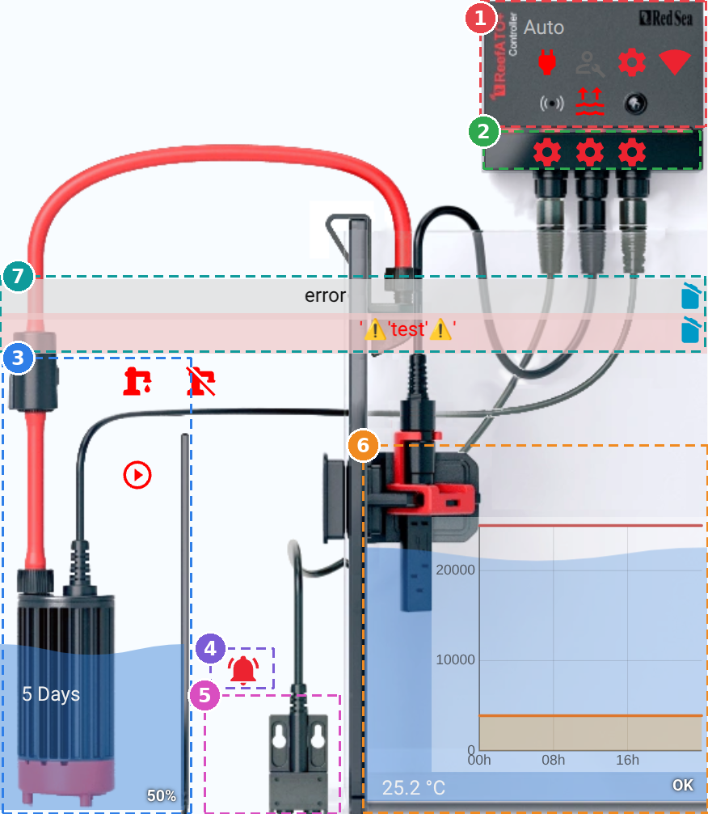

O cartão está dividido em 7 zonas:

1. Controlador: modo de funcionamento, ligação, modo de manutenção, configuração, Wifi e reposição automática
2. Definições dos acessórios: bomba de reposição, sonda de fugas, sonda de nível
3. Reservatório de água osmotizada: comandos de enchimento, volume restante e autonomia
4. Besouro
5. Sonda de fugas
6. Aquário: nível de água, temperatura e consumo diário
7. Última mensagem e último alerta

## Controlador

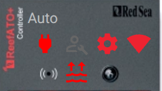

---

O texto na face do controlador é o **modo de funcionamento** reportado pelo
dispositivo (Auto, Manual, Fuga…), traduzido para o idioma do Home Assistant.

<span>O interruptor  liga ou desliga o ReefATO+.</span>

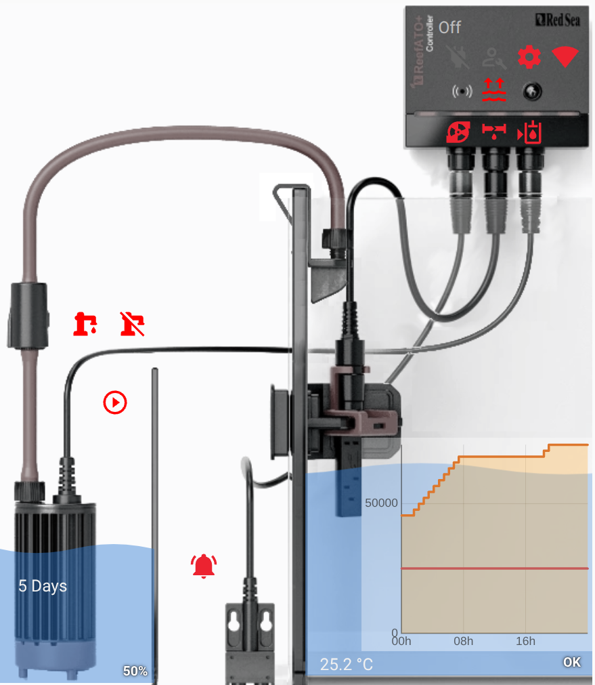

<span>O interruptor  passa para o modo de manutenção.</span>

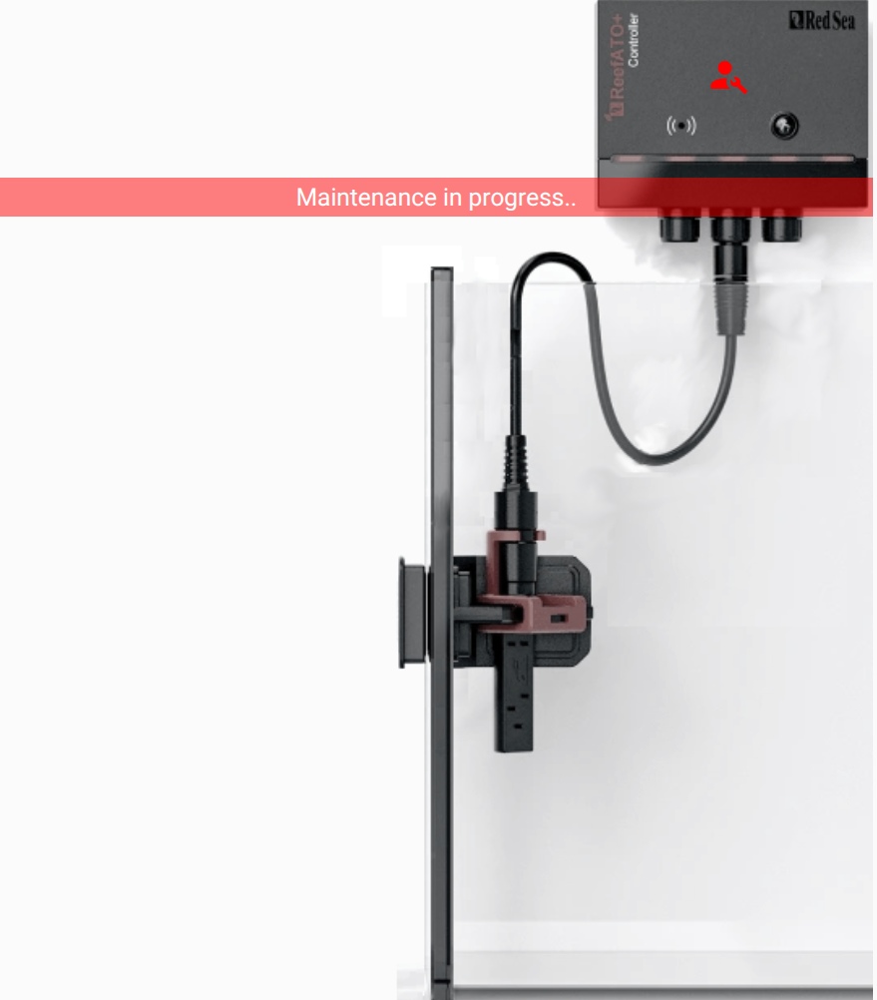

<span>Clique no ícone  para gerir a configuração geral do ReefATO+: atualizar as definições ou os dados consultados, reiniciar o dispositivo, atualizar o seu firmware.</span>

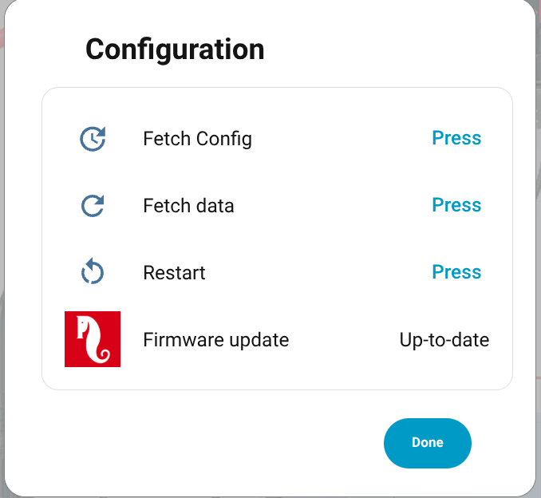

<span>Clique no ícone  para gerir as definições de rede.</span>

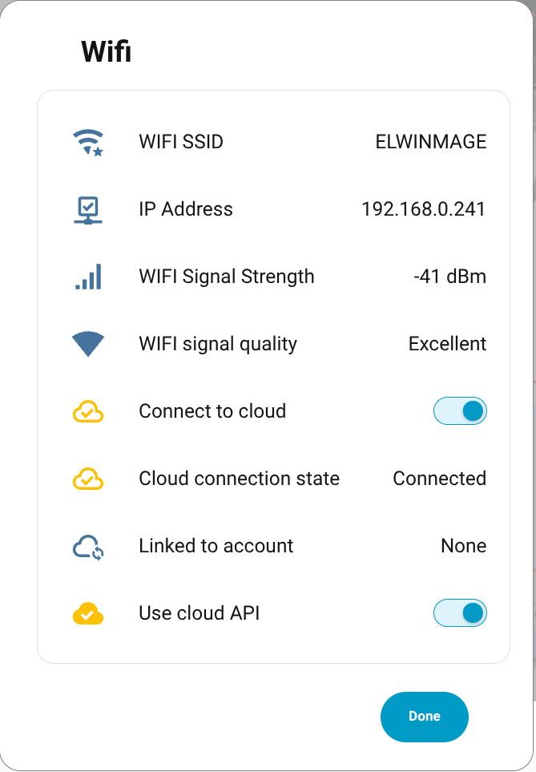

<span>O interruptor  da segunda linha ativa ou desativa a **reposição automática**. Desativado, o dispositivo nunca enche por si próprio e só os botões da zona 3 continuam a agir sobre a bomba. Fica oculto quando não há nenhuma bomba emparelhada.</span>

## Definições dos acessórios


---

Os três ícones seguem as três tomadas do painel frontal, pela mesma ordem: da
esquerda para a direita a **bomba de reposição**, a **sonda de fugas** e a **sonda
de nível**. Cada um abre uma caixa de diálogo dedicada a esse acessório. Os
ícones da bomba e da sonda de fugas desaparecem com o acessório quando a sua
tomada não é usada.

<span>O ícone da bomba  mostra o estado de funcionamento, o consumo e o caudal medidos, os três limiares de corrente com que o firmware decide se há funcionamento em seco ou bloqueio, e o que despoletou o último enchimento.</span>

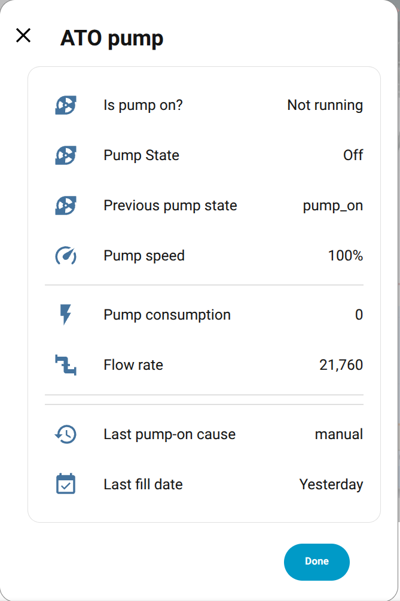

<span>O ícone da sonda de fugas  mostra se a sonda está ligada, se está armada, o veredicto seco/molhado e a leitura em bruto que está por trás, além do besouro que esta sonda comanda.</span>

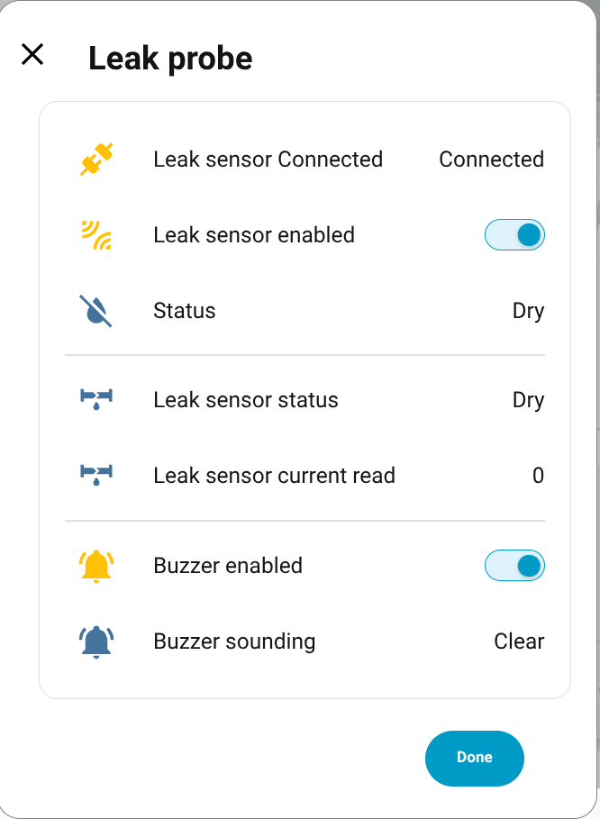

<span>O ícone da sonda de nível  mostra primeiro o estado da sonda — ligada, calibrada, a verificar, em erro — porque uma sonda descalibrada ou suja torna sem valor todas as leituras seguintes. Depois o nível em si, os dois elétrodos por trás dele, o sensor de temperatura que partilha o mesmo corpo, e a identidade e as datas de serviço do cartucho.</span>

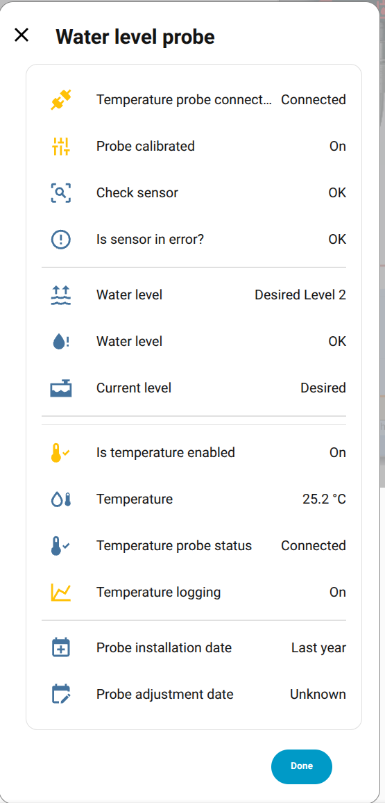

## Reservatório de água osmotizada

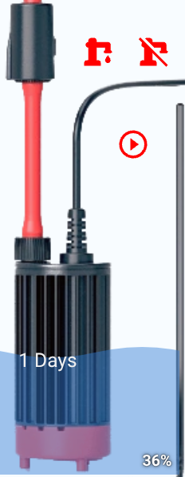

---

Esta zona é o reservatório de onde a reposição tira água, e os três botões que
comandam a sua bomba à mão:

<table>
  <tr>
    <td align="center"><br/><b>Encher</b><br/>Inicia um enchimento manual</td>
    <td align="center"><br/><b>Parar</b><br/>Para o enchimento em curso</td>
    <td align="center"><br/><b>Retomar</b><br/>Reativa a bomba</td>
  </tr>
</table>

Esta parte mostra o nível da reserva de água, calculado a partir da capacidade
declarada do reservatório e do valor real. Um reservatório vazio mostra na mesma
uma linha de água: aquela que a bomba não consegue aspirar. Abaixo de 10 % a água
pisca, para dizer que o reservatório vai ficar vazio em breve.

Clicar na água abre a caixa de diálogo do reservatório, onde a capacidade pode
ser editada:

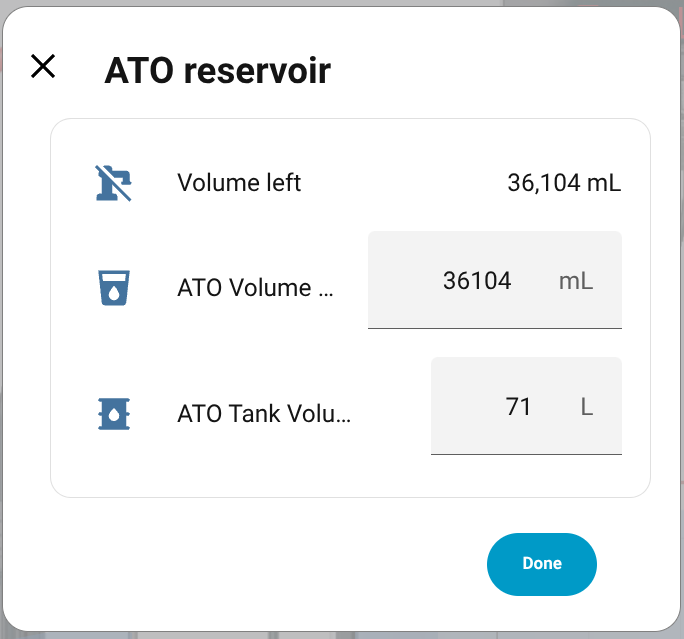

O número em baixo à esquerda do reservatório é a **autonomia**: os dias que faltam
até ficar seco, calculados pela integração a partir do consumo diário médio.
Clicar nele abre a sua ficha de informação.

Durante um enchimento, a água corre da saída por cima da sump.

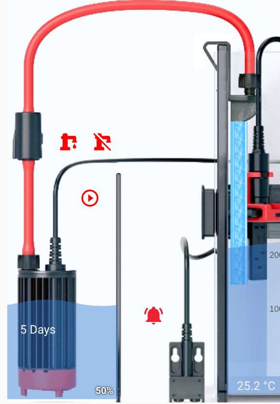

## Besouro


---

<span>A campainha   segue a definição do besouro do dispositivo, e fica esbatida quando está desligado.</span>

Um clique abre a caixa de diálogo do besouro: a definição em si, se está a tocar
neste momento, e o estado da sonda de fugas como contexto.

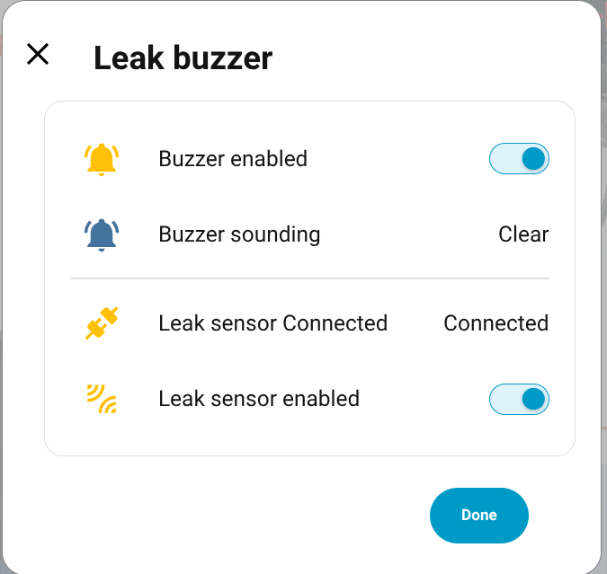

Uma **pressão longa** comuta diretamente o besouro. Os dois gestos estão
separados de propósito: silenciar o alarme é uma definição de segurança, não algo
para fazer por engano enquanto se procura o detalhe.

> [!NOTE]
> O besouro não é apenas o alarme de fugas: o dispositivo também o faz tocar em
> falhas da bomba, pelo que continua disponível num ReefATO+ sem sonda de fugas.
> O ícone só fica oculto nas versões da integração que ainda não expõem a
> definição.

## Sonda de fugas

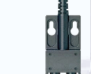

---

A sonda só é desenhada quando está fisicamente ligada. Ligada mas desativada na
aplicação, aparece esbatida: está lá, não deteta nada.

Quando é detetada água, a sonda pisca e uma poça alastra ao pé da imagem.

<table>
  <tr>
    <th align="center">Fuga no aquário</th>
    <th align="center">Fuga no reservatório osmotizado</th>
    <th align="center">Fuga de origem desconhecida</th>
  </tr>
  <tr>
    <td align="center">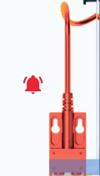</td>
    <td align="center">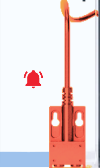</td>
    <td align="center">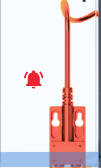</td>
  </tr>
</table>

## Aquário

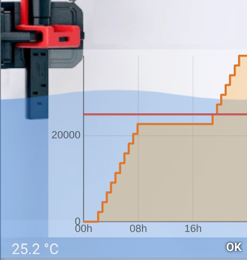

---

O nível de água nesta parte indica o estado de deteção da sonda ATO.

| Estado           | Significado                                                   |
| ---------------- | ------------------------------------------------------------- |
| Abaixo           | A superfície está abaixo da sonda: a reposição não dá conta   |
| Nível desejado 1 | Primeira marca de reposição                                   |
| Nível desejado 2 | Segunda marca de reposição                                    |
| Acima            | A superfície está acima da sonda: o aquário está cheio a mais |

Ambos os extremos são anómalos, por isso **Abaixo** e **Acima** fazem a água
piscar. Uma sonda em erro, ou uma entidade que ainda não reportou nada, não tem
altura nenhuma: o cartão desenha a sua marca de leitura ausente em vez de um
aquário vazio.

<table>
  <tr>
    <th align="center">Abaixo</th>
    <th align="center">Nível desejado 1</th>
    <th align="center">Nível desejado 2</th>
    <th align="center">Acima</th>
    <th align="center">Sem leitura</th>
  </tr>
  <tr>
    <td align="center">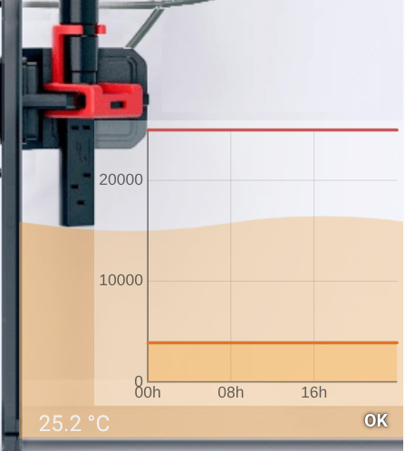</td>
    <td align="center">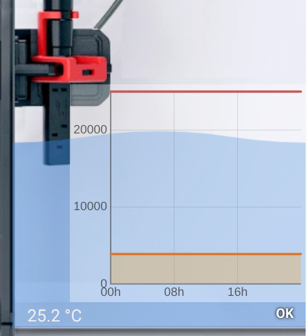</td>
    <td align="center">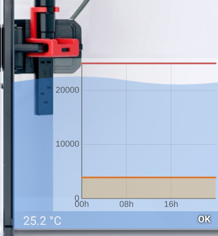</td>
    <td align="center">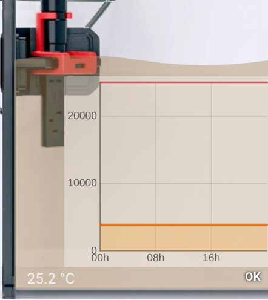</td>
    <td align="center">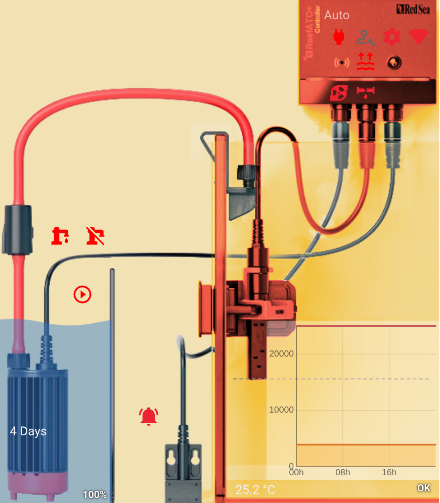</td>
  </tr>
</table>

A temperatura no fundo do aquário vem do sensor integrado na sonda de nível, e só
é reportada quando está ativado no dispositivo.

O gráfico ao canto é o **consumo do dia**: o volume reposto desde a meia-noite,
preenchido a laranja, contra a média diária móvel a vermelho. A janela está
fixada ao dia de calendário e não a 24 horas móveis, já que o contador é reposto
a zero à meia-noite.

Clicar no gráfico abre a caixa de diálogo de consumo, a mesma história com os
números por extenso: enchimentos e volume, medidos hoje, como média diária e como
total acumulado, mais o que resta ao reservatório para os alimentar.

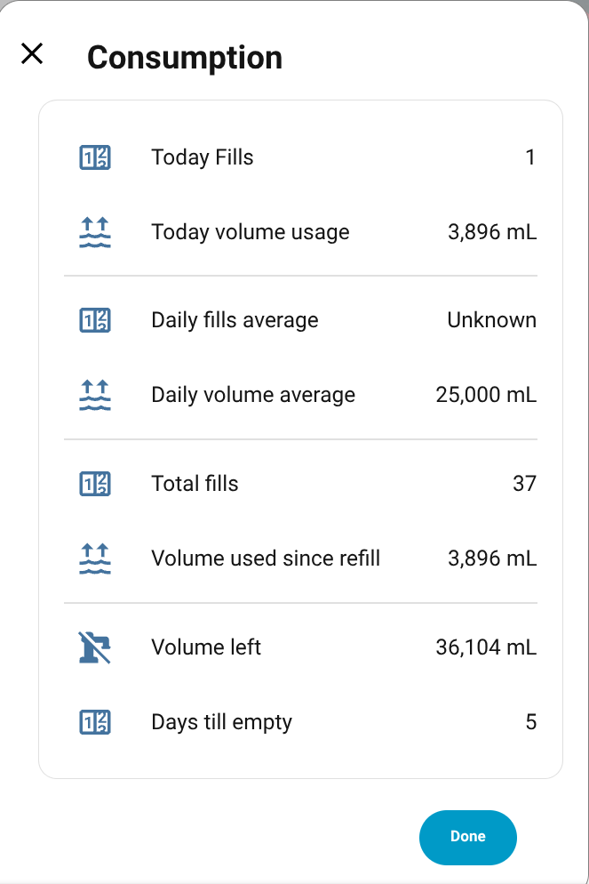

## Falhas

O cartão não tem um sinalizador de aviso à parte: o que está em falha é o que
pisca, sob um tom vermelho claro.

| Elemento que pisca | O que o dispositivo reporta                                                                                           |
| ------------------ | --------------------------------------------------------------------------------------------------------------------- |
| A bomba            | Avaria, bomba bloqueada, enchimento demasiado longo, reservatório vazio, ou sonda de nível em falta                   |
| A sonda de fugas   | Água detetada, do lado da osmose ou do lado do aquário                                                                |
| O nível de água    | A superfície está abaixo ou acima da sonda                                                                            |
| Toda a imagem      | A sonda de nível pede para ser verificada, ou já não consegue medir — todos os níveis mostrados deixam de ser fiáveis |

Uma bomba reportada como ausente não é uma falha: a bomba, os botões de
enchimento, o reservatório e o gráfico de consumo simplesmente não são
desenhados.

## Mensagens

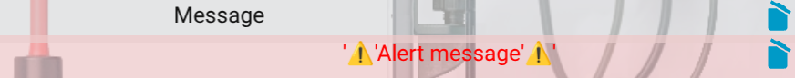

---

Esta zona mostra as últimas mensagens de sistema do ReefATO+. Tem duas linhas:

- A linha cinzenta mostra a **última mensagem** recebida.
- A linha rosa mostra o **último alerta**, precedido do símbolo ⚠.

Clicar no ícone  apaga a mensagem correspondente.

Estas linhas podem ser ocultadas a partir da interface do editor do cartão.

## Editor do cartão

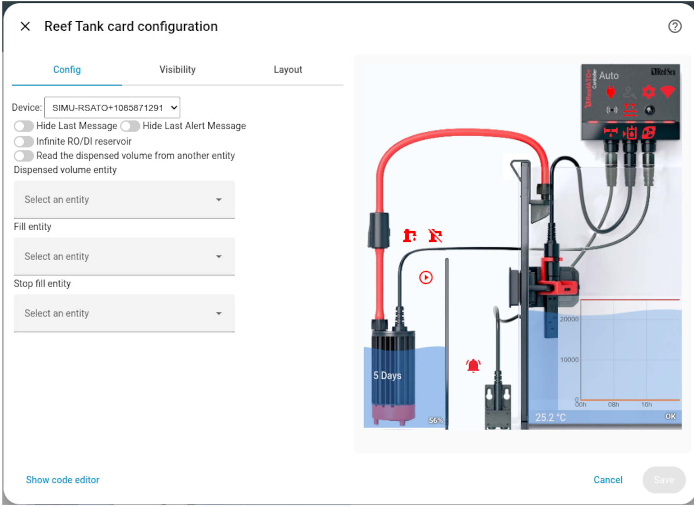

---

Além das duas linhas de mensagens, o ReefATO+ tem três opções. Existem para um
circuito de reposição para o qual o dispositivo não foi concebido: um osmosador
ligado diretamente à sump, com uma válvula comandada pelo Home Assistant em vez
da bomba Red Sea.

### Reservatório osmotizado infinito

Desativada por omissão. Um osmosador que repõe água continuamente não tem
recipiente, por isso nada se pode esgotar — e tudo o que o cartão diz sobre o
reservatório fala de um bidão que não existe.

Ativada, a percentagem sobre o reservatório e a caixa de diálogo que está por trás
são retiradas, a autonomia passa a ∞, e o ícone das definições da bomba e o botão
de retomar ficam ocultos: uma alimentação contínua não tem ciclo de enchimento
para devolver ao dispositivo. A água, os botões de enchimento e o gráfico de
consumo mantêm-se.

### Entidade do volume doseado

Um interruptor e um seletor de entidade. Ativada, a curva laranja do gráfico
diário é lida a partir de uma entidade sua — um caudalímetro na linha osmotizada
— em vez do contador do dispositivo. A média móvel vermelha continua a ser a do
dispositivo: só muda a origem do volume, não a comparação contra a qual é
desenhado.

É o interruptor que a ativa, de modo que uma entidade que tenha sobrado de uma
configuração anterior é ignorada em vez de voltar a assumir o comando em
silêncio.

### Entidades de enchimento e de paragem

Qualquer um dos dois botões pode ser ligado a uma entidade de outra integração,
para comandar a sua própria válvula. O serviço é deduzido do domínio da entidade,
já que escolher uma diz logo de qual se trata:

| Domínio da entidade       | Encher       | Parar         |
| ------------------------- | ------------ | ------------- |
| `button`, `input_button`  | `press`      | `press`       |
| `switch`, `input_boolean` | `turn_on`    | `turn_off`    |
| `valve`                   | `open_valve` | `close_valve` |
| `script`                  | `turn_on`    | `turn_on`     |

Um único interruptor é um comando completo: ligado enche, desligado para. Deixe o
outro seletor vazio e o segundo botão reutiliza a mesma entidade com o serviço
oposto — o mesmo vale para um `input_boolean` ou uma `valve`. Dois botões de
impulso têm de ser escolhidos separadamente, porque uma pressão não traz direção.

Um comando ligado também deixa de seguir a bomba Red Sea: continua visível num
ReefATO+ que não reporta bomba nenhuma, que é justamente a razão para o ligar.

As opções são guardadas sob o modelo tal como o Home Assistant o reporta:

```yaml
type: custom:reef-card
device: "123456789012" # identificador estável do dispositivo (o nome também funciona)
conf:
  RSATO+:
    devices:
      "123456789012":
        name: MY-RSATO # apenas etiqueta
        infinite_tank: true
        external_usage: true
        external_usage_entity: sensor.rodi_flow_meter
        fill_entity: switch.rodi_valve
        stop_fill_entity: "" # deixado vazio: o interruptor acima também o para
```

---

[← Voltar à página principal](README.pt.md)
