[← Voltar à página principal](README.pt.md)

# ReefControl-Power

ReefControl e ReefControl-Power com o ha-reef-card em ação:

[](https://www.youtube.com/watch?v=VIDEO_ID)

O cartão ReefControl-Power desenha o Power Center com as suas tomadas, o que está
ligado a cada uma, e à sua esquerda a sua própria sonda de temperatura ou o
[ReefControl](reefcontrol.pt.md#reefcontrol) com que está emparelhado.

Os dois modelos são suportados: só diferem no número de tomadas.

<table>
  <tr>
    <th align="center">RSPOWER6</th>
    <th align="center">RSPOWER8</th>
  </tr>
  <tr>
    <td align="center">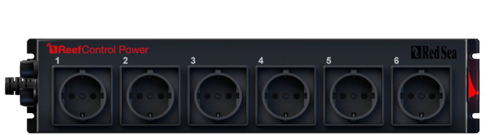</td>
    <td align="center">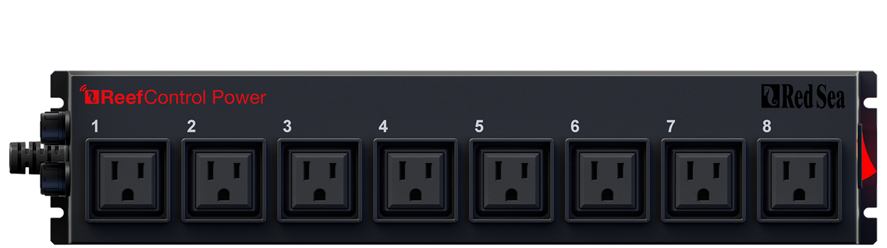</td>
  </tr>
</table>

O resto desta secção é ilustrado com o RSPOWER6: tudo funciona da mesma forma no
RSPOWER8.

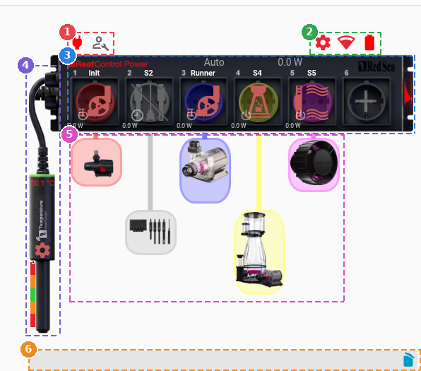

O cartão está dividido em 6 zonas:

1. Estado de alimentação e modo de manutenção
2. Configuração, Wifi e bateria
3. Tomadas
4. Sonda de temperatura ou ligação ao ReefControl
5. Dispositivos associados
6. Última mensagem e último alerta

## Estado de alimentação e modo de manutenção

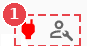

---

<span>O interruptor  liga ou desliga o ReefControl-Power.</span>

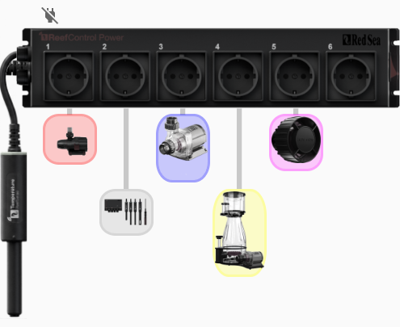

Desligado, o cartão só conserva o interruptor, a imagem da sonda de temperatura
ou do ReefControl emparelhado, e as ligações para outros dispositivos: o nome do
hub e os dispositivos ligados às tomadas continuam a abrir o seu próprio cartão.
As tomadas perdem os botões, os nomes e o consumo, e a sonda a sua leitura e as
suas definições.

<span>O interruptor  passa para o modo de manutenção.</span>

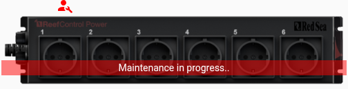

## Configuração / Informação Wifi

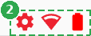

---

<span>Clique no ícone  para gerir a configuração geral do ReefControl-Power: atualizar as definições ou os dados lidos, reiniciar o dispositivo, atualizar o seu firmware, e ver a sua região e o seu número de tomadas.</span>

A mesma janela adiciona ou remove a sonda de temperatura local, e desemparelha o
ReefControl. A sonda e o hub excluem-se: um botão que não se aplica aparece a
cinzento em vez de ficar oculto, para que veja que ações existem.

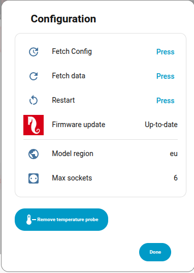

<span>Clique no ícone  para gerir as definições de rede.</span>

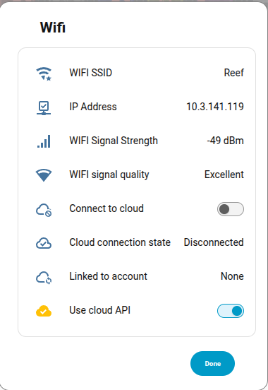

<span>O ícone 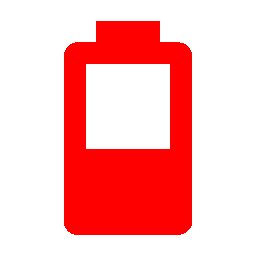 indica o nível da bateria do ReefControl-Power.</span>

## Tomadas

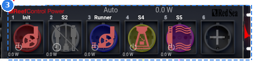

---

O texto na face do Power Center é o seu **modo de funcionamento** (Auto,
Setup…), ao lado do **consumo total** das suas tomadas. Um clique no consumo
abre a sua janela de informação.

Cada tomada mostra, de cima para baixo:

- O seu **nome**.
- O seu **botão**, emoldurado na cor da tomada, com o ícone vermelho quando a
  tomada está alimentada e cinzento quando está desligada. Mostra uma ficha, ou o
  ícone do dispositivo ligado (ver [Dispositivos associados](#dispositivos-associados)).
- O seu **consumo**, que abre a sua janela de informação.

Pequenos ícones na parte de baixo do botão indicam como a tomada é comandada:

| Ícone                                                                                                                                                                                                                                                                                                                               | Significado                                                                  |
| ----------------------------------------------------------------------------------------------------------------------------------------------------------------------------------------------------------------------------------------------------------------------------------------------------------------------------------- | ---------------------------------------------------------------------------- |
|                                                                                                                                                                                                                                                                                     | Ligada ou desligada à mão                                                    |
|                                                                                                                                                                                                                                                                   | Segue um agendamento — um clique abre o seu editor                           |
|    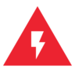   | Segue uma sonda: temperatura, pH, salinidade, ORP, fuga ou nível de água ATO |
|                                                                                                                                                                                                                                                                    | O seu agendamento ou a sua sonda está suspenso: a tomada foi desligada à mão |

Uma tomada nunca configurada mostra um **+** em vez do botão: um clique abre as
suas definições para lhe dar um modo.

Um **clique** no botão abre as definições da tomada. Uma **pressão longa** liga
ou desliga diretamente a tomada.

### Tomada

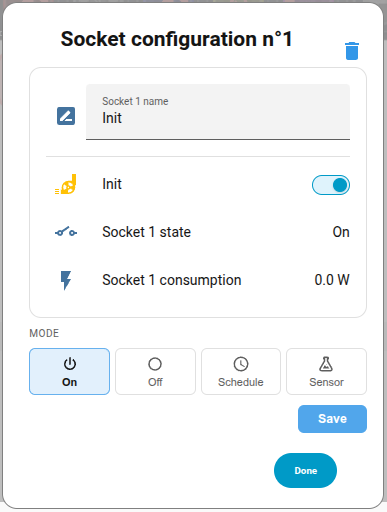

A janela começa com o nome, o interruptor, o estado e o consumo da tomada, e
depois oferece os seus quatro modos:

- **Ligado** / **Desligado**: a tomada fica alimentada, ou não.
- **Agendamento**: uma linha temporal de 24 horas e a lista dos seus intervalos
  **ligados**. Adicione, edite ou apague intervalos; um intervalo que termina
  antes de começar, ou que se sobrepõe ao anterior, é explicado por baixo da
  lista e bloqueia a gravação.

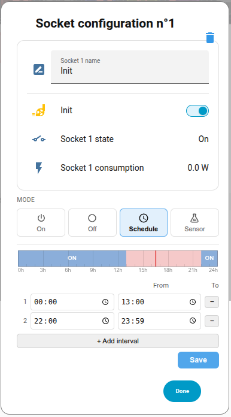

- **Sensor**: a tomada segue uma sonda — a sonda de temperatura local do Power
  Center, ou qualquer sonda do ReefControl emparelhado, temperaturas integradas
  incluídas. Escolha se a tomada **liga** ou **desliga**, quando a leitura passa
  **acima** ou **abaixo** de um **limiar**, com uma **histerese** (uma banda
  morta à volta do limiar, para que a tomada não oscile), e o que fazer se a
  sonda se perder. Uma tomada que segue uma sonda ATO não precisa de limiar.

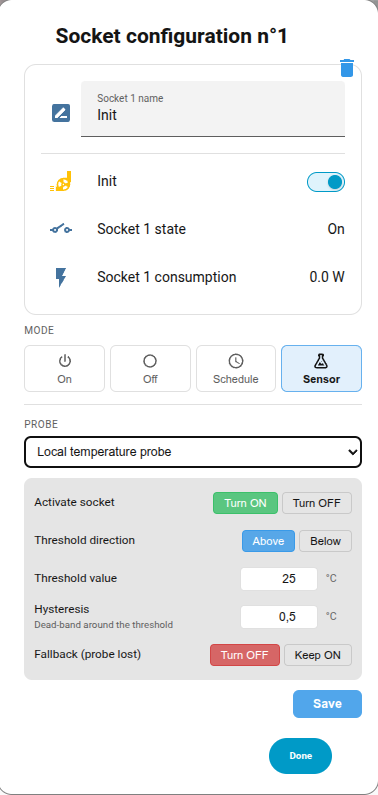

Nada é enviado ao dispositivo até premir **Guardar**.

Quando uma tomada que segue um agendamento ou uma sonda foi desligada à mão, a
janela abre nesse modo automático, indica que está suspenso e propõe
**retomá-lo** sem reescrever o seu agendamento nem a sua regra.

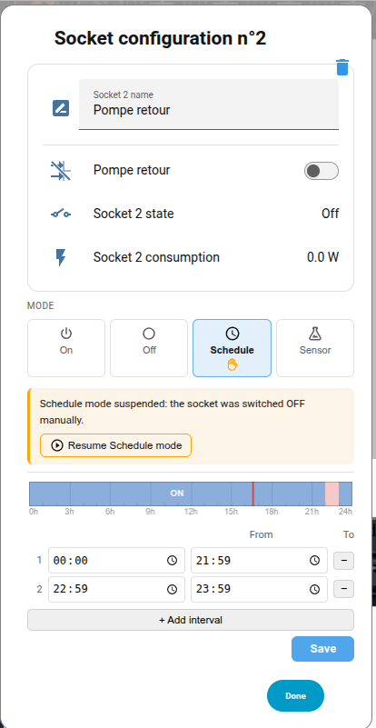

<span>O ícone do caixote do lixo  no canto superior direito apaga a configuração da tomada, após confirmação: a tomada recupera o seu nome de fábrica e deixa de ter modo.</span>

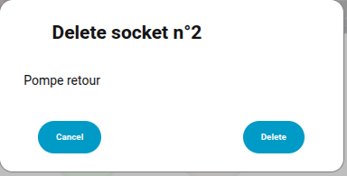

## Sonda de temperatura ou ligação ao ReefControl

A esquerda do cartão mostra de onde o Power Center lê a sua temperatura: da sua
própria sonda ou do ReefControl com que está emparelhado. Os dois excluem-se.

### Sonda de temperatura

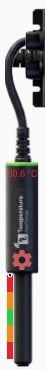

---

A sonda de temperatura local é desenhada ligada ao Power Center, com a sua
leitura na cor do seu nível e uma barra de situação ao longo da sonda (um ponto
no modo compacto do editor do cartão). Um clique na barra abre as últimas 24
horas da temperatura sobre as suas faixas.

Uma sonda desligada pisca sob um ligeiro tom vermelho.

<span>Um clique na roda dentada  abre as definições da sonda: o nome, um botão para a ler já, os intervalos desejado e aceitável, a calibração com a temperatura real, e os interruptores de registo e de notificações.</span>

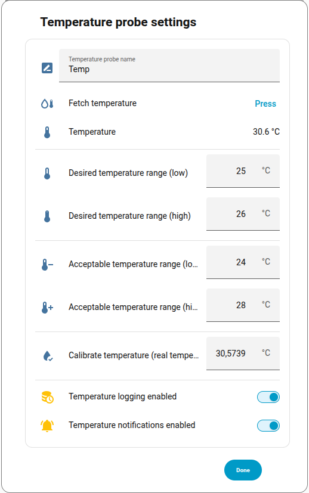

### Ligação ao ReefControl

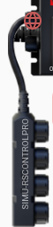

---

Um ReefControl emparelhado ocupa o lugar da sonda: o seu cabo é desenhado com o
nome do hub ao longo dele. Um clique no nome abre o cartão do hub.

<span>O ícone  abre a janela da ligação: o hub emparelhado, o seu tipo e o seu estado, e se está ligado ao Power Center e à internet.</span>

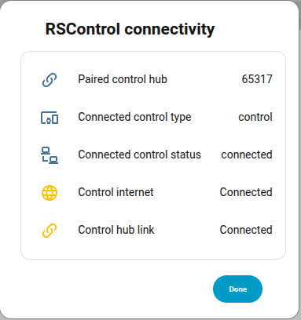

Quando o hub está emparelhado mas não responde, a ligação pisca sob um ligeiro
tom vermelho.

## Dispositivos associados

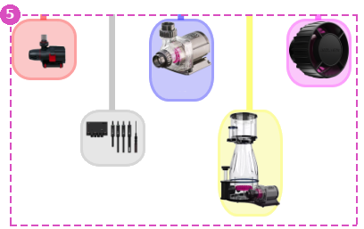

---

O Power Center não sabe o que está ligado às suas tomadas: o cartão permite
indicá-lo a partir do editor do cartão. Uma tomada associada a um dispositivo Red
Sea ou a uma bomba Aqua Medic mostra:

- uma imagem do dispositivo por baixo da tomada, em duas filas desfasadas para
  que as vizinhas não se sobreponham, ligada a ela por um tubo da cor da tomada
  (cinzento enquanto a tomada está desligada);
- o ícone do dispositivo no botão da tomada, em vez da ficha.

Uma bomba ReefRun é representada pela sua função, bomba de retorno ou
escumador, em vez do seu controlador. Qualquer outro dispositivo conhecido pelo
Home Assistant também pode ser associado, mas ainda não tem imagem.

A imagem segue o estado do dispositivo:

| Aspeto       | Estado do dispositivo Red Sea                                            |
| ------------ | ------------------------------------------------------------------------ |
| Normal       | Funciona normalmente                                                     |
| A cinzento   | Desligado                                                                |
| Intermitente | Tudo o resto: modo manual, manutenção, indisponível, uma bomba avariada… |

Os dispositivos de outras integrações são sempre desenhados normais.

Um clique na imagem abre o cartão do dispositivo.

## Mensagens


---

Esta zona mostra as últimas mensagens de sistema do ReefControl-Power. Tem duas linhas:

- A linha cinzenta mostra a **última mensagem** recebida.
- A linha rosa mostra o **último alerta**, precedido do símbolo ⚠.

Clicar no ícone  apaga a mensagem correspondente.

Estas linhas podem ser ocultadas a partir da interface do editor do cartão.

## Editor do cartão

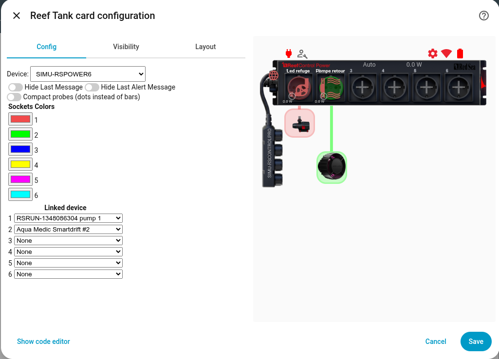

---

Além das duas linhas de mensagens, o ReefControl-Power tem três opções:

- **Sondas compactas**: a temperatura é mostrada como um ponto da cor do seu
  nível em vez de uma barra de situação.
- **Cores das tomadas**: a cor de cada tomada, usada pelo seu botão e pelo tubo
  até ao seu dispositivo associado.
- **Dispositivo associado**: por tomada, o dispositivo ligado a ela, ou
  **Nenhum**.

As opções são guardadas sob o modelo tal como o Home Assistant o reporta:

```yaml
type: custom:reef-card
device: MY-RSPOWER
conf:
  RSPOWER6:
    devices:
      MY-RSPOWER:
        compact_probes: false
        sockets:
          socket_1:
            color: "255,0,0"
            linked_device: 0123456789abcdef0123456789abcdef
          socket_3:
            linked_device: fedcba9876543210fedcba9876543210
```

---

[← Voltar à página principal](README.pt.md)
